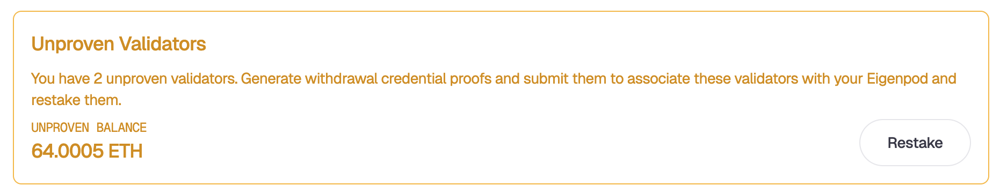
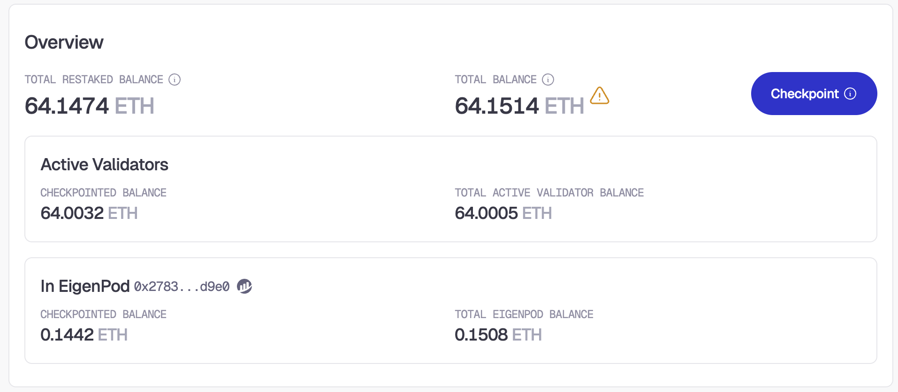

# Native Restaking

:::warning
Please read this entire guide before launching your new validator or integrating your existing validator. Before you deploy a new validator you must plan to either:

- Initially provision the withdrawal credentials to your EigenPod address (created on the next page).
- Initially provision the withdrawal credentials to an 0x00 address. You can then later modify your withdrawal credentials to your EigenPod address.
  :::

Native Restaking via the EigenLayer Web App consists of the following actions:

1. [Restaking New Validators](#restaking-new-validators-native-beacon-chain-eth)
2. [Checkpointing](#checkpointing)
3. [Withdraw Native ETH or Validator Yield](#withdraw-native-eth-or-validator-yield)

The diagram below outlines the operational flow of native restaking including:

- Delegation
- Redelegation (switching to a new Operator without exiting the validator)
- Yield handling options
- Exiting restaking.

## Gas Cost Planning

We recommend users connect many validators to a single EigenPod in order to reduce cost and complexity where practical. For each of the actions below that require a checkpoint proof, the web app will batch up to 80 validators per proof transaction batch. Users with more validators will require additional transactions to complete each checkpoint proof. Please plan your gas costs accordingly.

## Restaking New Validators (Native Beacon Chain ETH)

:::important
Running your own EigenPod for native restaking is an advanced task that requires operating and maintaining Ethereum validator infrastructure.
It involves managing validator keys and associated risks including slashing, downtime penalties, or loss of access to
restaked funds if keys are lost or compromised. For more information, refer to [Ethereum Launchpad](https://launchpad.ethereum.org/en/).
:::

#### Create EigenPod:

1. Visit https://app.eigenlayer.xyz/token/ETH
1. Click **Create EigenPod**.
1. **Sign** the transaction via your Web3 wallet when prompted.
1. Observe the new EigenPod contract address is displayed.

:::info
This address is responsible for all subsequent restaking and withdrawal activities associated with that EigenPod.
:::

#### Set Validator Withdrawal Credentials to EigenPod:

1. Configure the validator(s) credentials to point to the EigenPod address when the validator is created. Please see [Ethereum Launchpad](https://launchpad.ethereum.org/en/withdrawals#enabling-withdrawals) for more information.
   - Confirming Withdrawal Address: you can confirm your withdrawal credentials (which should match your EigenPod), via the following URL: https://beaconcha.in/validator/[validator_index_or_public_key]#deposits
   - Optional: as of the PEPE release you may choose to set the FEE_RECIPIENT to your EigenPod address if you wish to Restake those fees.
1. Deposit your ETH into the validator via the deposit contract and wait for the validator(s) to become active on-chain. Please see https://beaconcha.in/[validator_index_or_public_key] to follow your validator status. Please note: this process can take up to 10 days depending on the length of the Beacon Chain deposit queue.

#### Restake Unproven Validators:

1. Once the Validator is active on-chain and the withdrawal address has been configured to point to the EigenPod address, you will see it as an **Unproven** validator.
1. Click **Restake** to initiate restaking the validator.
1. This process will first fetch proofs that associate your validator to your EigenPod. You will then need to submit the proofs on chain via the `verifyWithdrawalCredentials` transaction.
1. Your validator is now **Restaked**.
1. You now have the option to delegate your restaked assets to your selected Operator. If you are already delegated to an Operator, your assets will automatically delegate to your currently selected Operator.

## Important Values

- **Total Restaked Balance**: This is your current restaked amount. This is a sum of the Checkpointed balance in all of your Active Validators and the Checkpointed balance in your EigenPod minus any withdrawals that have been queued.
- **Total Balance**: This is the total ETH balance in your EigenPod and all validators (proven and unproven) minus withdrawals.
- **Active Validators Checkpointed Balance**: This is the currently restaked (checkpointed) balance of any validators that have been proven to your EigenPod.
- **Total Active Validator Balance**: This is the total ETH balance of all proven validators. This number can change compared to your checkpointed amount due to fee/reward accrual or slashings.
- **EigenPod Checkpointed Balance**: This is the currently restaked (checkpointed) balance in your EigenPod. This balance represents the maximum amount that you can withdraw from the Eigenlayer system.
- **Total EigenPod Balance**: This is the current balance of ETH on your EigenPod. This number can change compared to the checkpointed amount due to fee/reward accrual or by direct ETH deposits to your EigenPod.

## Checkpointing

Users can convert consensus rewards, validator execution fees and ETH sent to the EigenPod (referred in this document as "Validator Yield") to restaked shares via the checkpointing process. Initiating and completing a checkpoint proof will automatically account for any balance changes to your EigenPod and Active Validators and restake them. This is also useful to update the Checkpointed Balance in your EigenPod to Complete a withdrawal ([see below](#withdraw-native-eth-or-validator-yield)).

1. Observe the difference between your **Total Restaked Balance** and your **Total Balance**. If your **Total Balance** (minus your unproven validator balance if any) is greater than your **Total Restaked Balance** then you will be able to initiate a checkpoint.
1. Click **Checkpoint** to initiate a checkpoint proof.
1. This process will first submit a `startCheckpoint` transaction. After it has been successfully been submitted, the app will fetch proofs for the checkpoint. Once the proofs are fetched, you will be prompted to sign the `verifyCheckpointProof` transaction to submit the fetched proofs.
1. Observe the Total Restaked Balance has increased by the amount of validator yield proven in the previous step.

:::info

1. The time lag associated with Ethereum beacon chain validator sweeps, which can be up to 65812 slots or 9 days. Please see the Ethereum docs [here](https://ethereum.org/en/staking/withdrawals/#validator-sweeping) for more information.
   :::

#### Checkpoint Frequency

Users should not initiate a checkpoint more frequently than once every two weeks (approximately).
The longer you wait before performing a checkpoint, the more gas users will save. The gas cost of a checkpoint is the same, regardless of how many consensus rewards will be proven. Each user should determine the best interval to fit their gas cost and restaking benefit needs.

Consensus rewards are moved from the beacon chain to your EigenPod once every approximately 8 days per the Ethereum protocol. Checkpoint intervals more frequently than 8 days would result in no benefit for the user.

## Withdraw Native ETH or Validator Yield

Overview: Withdrawing from EigenLayer involves first **Queueing a withdrawal**, waiting the 14 day escrow period, then finally **Completing the withdrawal**. You will be able to queue a withdrawal for any amount up to your restaked balance, but the maximum you are able to withdraw from the system is the Checkpointed Balance in your EigenPod. If your withdrawal is greater than the amount that is available in your EigenPod, you will first need to exit enough validators to ensure that the balance in your EigenPod is greater than the withdrawal amount and then complete a checkpoint to update your checkpointed EigenPod Balance.

If you wish to withdraw native ETH from an active validator, complete the following steps before proceeding:

1. Ensure you have repointed your validator's withdrawal credentials to your EigenPod prior to continuing. Please see [Ethereum Launchpad](https://launchpad.ethereum.org/en/withdrawals#enabling-withdrawals) for more information.
1. Fully exit your validator from the beacon chain. You may monitor its activity via https://beaconcha.in/validator/[validator_index_or_public_key].
1. Wait for the final beacon chain withdrawal to be deposited to your EigenPod. There can be a lag of up to 24 hours to 7 days between the validator appearing as "exited" and the withdrawal amount deposited to EigenPod. Please see the "Withdrawals" tab and "Time" column for your validator via https://beaconcha.in/validator/[validator_index_or_public_key]#withdrawals .

#### Queue the Withdrawal:

1. Click **Queue Withdrawal** in the web app.
1. Choose the amount you wish to queue for withdrawal and continue
1. Wait for the [Escrow Period](../../testnet/README.md#testnet-vs-mainnet-differences) to complete.

#### Redeposit or Complete Withdrawal:

Once the escrow period is completed, you have the options to **Withdraw** or **Redeposit**. Redepositing is available for users who have undelegated and wish to redeposit the funds to restake with a different operator and is always possible regardless of EigenPod balance.

1. Choose to either **Redeposit** or **Withdraw**. Withdraw will be disabled if the current balance of your EigenPod is less than the withdrawal amount.
1. Sign the withdrawal or redeposit transaction. Note: if the withdrawal is greater than your checkpointed EigenPod balance and less than your total EigenPod balance, it will trigger the checkpointing process ([see above](#checkpointing)) before triggering the withdrawal transaction.
