This file is a merged representation of the entire codebase, combined into a single document by Repomix.
The content has been processed where content has been compressed (code blocks are separated by ⋮---- delimiter).

# File Summary

## Purpose
This file contains a packed representation of the entire repository's contents.
It is designed to be easily consumable by AI systems for analysis, code review,
or other automated processes.

## File Format
The content is organized as follows:
1. This summary section
2. Repository information
3. Directory structure
4. Repository files (if enabled)
5. Multiple file entries, each consisting of:
  a. A header with the file path (## File: path/to/file)
  b. The full contents of the file in a code block

## Usage Guidelines
- This file should be treated as read-only. Any changes should be made to the
  original repository files, not this packed version.
- When processing this file, use the file path to distinguish
  between different files in the repository.
- Be aware that this file may contain sensitive information. Handle it with
  the same level of security as you would the original repository.

## Notes
- Some files may have been excluded based on .gitignore rules and Repomix's configuration
- Binary files are not included in this packed representation. Please refer to the Repository Structure section for a complete list of file paths, including binary files
- Files matching patterns in .gitignore are excluded
- Files matching default ignore patterns are excluded
- Content has been compressed - code blocks are separated by ⋮---- delimiter
- Files are sorted by Git change count (files with more changes are at the bottom)

# Directory Structure
```
.cursor/
  rules/
    golang.mdc
    project.mdc
.github/
  configs/
    typos-cli.toml
  workflows/
    automation.yml
    build.yml
    checks.yml
    claude-code-review.yml
    claude.yml
    create.yml
    golangci-lint.yml
    release-dev.yml
    release-prod.yml
    tests.yml
  CODEOWNERS
  pull_request_template.md
cmd/
  eigenx/
    main.go
config/
  tls/
    .env.example.tls
    Caddyfile.tmpl
  .env.example
  .gitignore
  config_embeds.go
  README.md
docs/
  EIGENX_ARCHITECTURE.md
  EIGENX_CONCEPTS.md
internal/
  binaries/
    tls-keygen/
      cert/
        lego_manager_test.go
        lego_manager.go
        utils_test.go
        utils.go
      cmd/
        tls-keygen/
          main.go
      config/
        config.go
      keys/
        derive_test.go
        derive.go
      storage/
        interfaces.go
        local.go
        remote_test.go
        remote.go
      go.mod
      Makefile
      README.md
  bindings/
    EIP7702StatelessDeleGator/
      binding.go
  templates/
    docker/
      Dockerfile.layered.tmpl
    scripts/
      compute-source-env.sh.tmpl
  version/
    version.go
keys/
  mainnet-alpha/
    prod/
      kms-encryption-public-key.pem
      kms-signing-public-key.pem
  sepolia/
    dev/
      kms-encryption-public-key.pem
      kms-signing-public-key.pem
    prod/
      kms-encryption-public-key.pem
      kms-signing-public-key.pem
pkg/
  commands/
    app/
      configure_tls.go
      create.go
      deploy.go
      info.go
      lifecycle.go
      name.go
      upgrade.go
    auth/
      generate_test.go
      generate.go
      keyring_test.go
      keyring.go
      list_test.go
      list.go
      login_test.go
      login.go
      logout_test.go
      logout.go
      utils_test.go
      utils.go
      whoami_test.go
      whoami.go
    billing/
      cancel.go
      status.go
      subscribe.go
    environment/
      list.go
      set.go
      show.go
    utils/
      auth_utils.go
      build_utils.go
      contract_utils.go
      environment_utils.go
      interactive.go
      preflight.go
      release_utils.go
      types.go
      userapi_client.go
    version/
      version.go
    app.go
    auth.go
    billing.go
    environment.go
    telemetry.go
    undelegate.go
    upgrade_test.go
    upgrade.go
  common/
    iface/
      logger.go
      progress.go
    logger/
      basic_logger.go
      noop_logger_test.go
      noop_logger.go
      progress_logger.go
      zap_logger.go
    output/
      prompt.go
      terminal.go
    progress/
      detect_tty.go
      log_progress.go
      tty_progress.go
    app_registry.go
    config_base.go
    config_dev.go
    config_prod.go
    constants.go
    context.go
    contract_caller.go
    dockerutils.go
    flags.go
    global_config_test.go
    global_config.go
    keyring.go
    telemetry_prompt.go
    user_config_test.go
    user_config.go
    utils_test.go
    utils.go
    version_test.go
    version.go
  hooks/
    hooks_test.go
    hooks.go
  telemetry/
    metric.go
    noop.go
    posthog.go
    telemetry_test.go
    telemetry.go
  template/
    catalog.go
    git_client_test.go
    git_client.go
    git_fetcher_test.go
    git_fetcher.go
    git_reporter_test.go
    git_reporter.go
  testutils/
    keyring_mock.go
    utils.go
scripts/
  bundleReleases.sh
.gitignore
.pre-commit-config.yaml
AGENTS.md
CLAUDE.md
embeds_dev.go
embeds_prod.go
embeds.go
go.mod
install-eigenx.ps1
install-eigenx.sh
LICENSE
Makefile
README.md
```

# Files

## File: .cursor/rules/golang.mdc
````
---
description: 
globs: 
alwaysApply: true
---
# Go Development Guidelines for eigenx-cli

This document outlines coding standards, patterns, and best practices to be followed when developing Go applications and libraries for the `eigenx-cli` project. These rules are based on general Go best practices and observed patterns within this 
codebase.

## 0. Always..

- Run `make tests` when completing a task to make sure the entire test suite passes
- Run `make lint` to lint the code

## 1. Code Formatting

- **`gofmt`/`goimports`**: All Go code **MUST** be formatted using `gofmt` or `goimports` before committing. This ensures consistent code style across the project. `goimports` is preferred as it also manages import statements.
    - Configure your IDE to format on save.
    - This is likely enforced by pre-commit hooks.

## 2. Naming Conventions

- **Packages**:
    - Package names **SHOULD** be short, concise, and all lowercase.
    - Avoid overly generic names like `util` or `common` unless the package truly contains cross-cutting concerns. If so, sub-packages within `common` (e.g., `common/httputil`) are preferred.
    - The project uses `pkg/common` for shared utilities (e.g., `logger`, context management), which is acceptable.
- **Variables**:
    - Local variables and function parameters **SHOULD** use `camelCase` (e.g., `myVariable`).
    - Exported variables **MUST** use `PascalCase` (e.g., `ExportedVariable`).
- **Functions and Methods**:
    - Function and method names **SHOULD** use `camelCase` for unexported identifiers (e.g., `calculateValue`).
    - Exported functions and methods **MUST** use `PascalCase` (e.g., `CalculateValue`).
- **Interfaces**:
    - Interfaces **SHOULD** be named with the `-er` suffix if they have only one method (e.g., `Reader`, `Writer`).
    - For more complex interfaces, choose a name that describes its purpose (e.g., `DataStore`).
- **Avoid Stutter**: Do not repeat package names in identifiers. For example, in package `logger`, prefer `logger.New()` over `logger.NewLogger()`.
- **Acronyms**: Acronyms like HTTP, ID, URL **SHOULD** be consistently cased (e.g., `serveHTTP`, `userID`, `parseURL`). `PascalCase` for exported acronyms (e.g., `ServeHTTP`, `UserID`, `ParseURL`).

## 3. Packages and Project Structure

- **`cmd/`**: Main application(s). Each subdirectory in `cmd/` is a separate executable.
- **`pkg/`**: Library code that can be used by other applications or projects. Code here should be designed to be reusable.
    - CLI command logic is well-organized under `pkg/commands`.
- **`internal/`**: Private application and library code. This is the ideal place for code that is specific to this project and should not be imported by other projects.
    - The `internal/version` pattern for build-time variable injection is good.
- **Clarity**: Package structure should clearly communicate the purpose and separation of concerns.
- **Circular Dependencies**: Avoid circular dependencies between packages.

## 4. Error Handling

- **Explicit Handling**: Errors **MUST** be handled explicitly. Do not ignore errors using the blank identifier (`_`) unless there is a very specific and documented reason.
- **Return Errors**: Functions that can fail **MUST** return an `error` as their last return value.
- **Error Wrapping**: When an error is propagated up the call stack, it **SHOULD** be wrapped with additional context using `fmt.Errorf("operation X failed: %w", err)`. This preserves the original error and adds a stack of contextual information.
    - Use `errors.Is()` and `errors.As()` from the standard `errors` package to inspect wrapped errors.
- **Error Messages**: Error messages should be lowercase and not end with punctuation, as they are often combined with other context.
- **Top-Level Handling**: In `main()` or top-level HTTP handlers, errors should be logged appropriately, and the program/request should terminate gracefully (e.g., `log.Fatal(err)` in `main.go` is acceptable for CLI startup).

## 5. Comments and Documentation

- **Godoc**: All exported identifiers (variables, constants, functions, types) **MUST** have Godoc comments.
    - Comments should start with the name of the identifier they describe.
    - Provide clear, concise explanations of what the identifier does, its parameters, and return values.
- **Non-Obvious Code**: Add comments to explain complex, non-obvious, or surprising logic.
- **TODOs**: Use `// TODO:` comments to mark areas that need future attention. Include context or a reference if possible.

## 6. Logging

- **Structured Logging**: Use a structured logging library like `zap` (as currently used in `pkg/common/logger/zap_logger.go`).
- **Log Levels**: Use appropriate log levels (e.g., DEBUG, INFO, WARN, ERROR, FATAL).
- **Contextual Information**: Include relevant contextual information in log messages (e.g., request IDs, user IDs) to aid debugging.
- **Avoid Logging and Returning Errors**: Generally, a function should either log an error and handle it, or return the error to the caller to handle. Avoid doing both unless there's a specific reason. The caller is usually better positioned to decide if logging is appropriate.

## 7. Concurrency

- **Goroutines**: Use goroutines for concurrent operations. Ensure they are managed correctly (e.g., using `sync.WaitGroup` to wait for completion).
- **Channels**: Prefer channels for communication between goroutines and for synchronization.
- **`context.Context`**:
    - Pass `context.Context` as the first argument to functions that perform I/O, long-running computations, or need to support cancellation or deadlines.
    - The project correctly uses `context.Context` (e.g., `common.WithShutdown(context.Background())`).
- **Race Conditions**: Be mindful of race conditions. Use the Go race detector (`go test -race`) during testing. Protect shared mutable state using mutexes (`sync.Mutex`, `sync.RWMutex`) or channels.

## 8. Testing

- **File Naming**: Test files **MUST** be named `*_test.go`.
- **Function Naming**: Test functions **MUST** be named `TestXxx` (where `Xxx` starts with an uppercase letter) and take `*testing.T` as a parameter.
- **Coverage**: Strive for high test coverage. Use `go test -coverprofile=coverage.out && go tool cover -html=coverage.out` to inspect coverage.
- **Table-Driven Tests**: Use table-driven tests for testing multiple scenarios of the same function with different inputs and expected outputs.
- **Subtests**: Use `t.Run` to create subtests for better organization and output.
- **Assertions**: Use standard library features or well-known assertion libraries if necessary. Avoid overly complex custom assertion logic.
- **Mocks/Fakes**: Use fakes or mocks for dependencies, especially for external services or components that are hard to set up in a test environment.

## 9. API Design

- **Interfaces**: Define interfaces on the consumer side where appropriate. This promotes loose coupling and makes code easier to test and mock.
- **Simplicity**: Strive for simple and clear API designs. Avoid overly complex or numerous parameters.
- **Return Values**: Be consistent with return value patterns (e.g., `(value, error)` or `(value, bool)`).

## 10. Dependency Management

- **Go Modules**: Use Go Modules (`go.mod`, `go.sum`) for dependency management.
- **Tidy Modules**: Keep `go.mod` and `go.sum` tidy by running `go mod tidy` regularly.
- **Dependency Updates**: Regularly review and update dependencies to incorporate security patches and bug fixes.

## 11. Linters and Static Analysis

- **`golangci-lint`**: Use `golangci-lint` or a similar comprehensive linter tool.
    - A `.golangci.yml` configuration file should be present in the repository to define enabled linters and settings.
    - Integrate linters into pre-commit hooks (as suggested by `.pre-commit-config.yaml`).

## 12. CLI Specific (using `urfave/cli/v2`)

- **Command Structure**: Define commands and subcommands clearly, following the patterns in `pkg/commands/devnet.go`.
- **Flags**: Use descriptive names and usage messages for flags. Provide sensible default values.
- **Actions**: Command actions should encapsulate the logic for that command. Delegate complex logic to other packages/functions.
- **Context Usage**: Utilize the `cli.Context` for accessing flags, arguments, and application-level values.
- **Hooks**: Leverage hooks (e.g., `Before`, `After`) for common setup/teardown tasks, as seen with `hooks.LoadEnvFile` and `hooks.WithCommandMetricsContext`.

## 13. General Best Practices

- **Keep it Simple (KISS)**: Prefer simple, readable code over overly clever or complex solutions.
- **Don't Repeat Yourself (DRY)**: Avoid code duplication by abstracting common logic into functions or methods.
- **Single Responsibility Principle (SRP)**: Functions and types should have a single, well-defined responsibility.
- **Avoid `init()`**: Use `init()` functions sparingly. Explicit initialization in `main()` or via factory functions is often clearer.
- **Avoid Global Variables**: Minimize the use of global variables. If used, ensure they are concurrency-safe. The version variables in `internal/version` are a common exception, typically set at build time.
- **Resource Management**: Ensure resources like file handles, network connections, etc., are properly closed (e.g., using `defer`).
````

## File: .cursor/rules/project.mdc
````
---
description: 
globs: 
alwaysApply: true
---
## Rules to apply always

* When running the cli to test creating projects, always create them in the ./test-projects directory
* Always run `make build` to build the binary to test
````

## File: .github/configs/typos-cli.toml
````toml
[files]
extend-exclude = [
    "go.mod",
    "go.sum",
    "**/lib/**",
    "**/docs/images/**",
    # Not present locally, but is in remote (github).
    "**/doc/**",
    "internal/bindings/**"
]
ignore-hidden = true
ignore-files = true
ignore-dot = true
ignore-vcs = true
ignore-global = true
ignore-parent = true

[default]
binary = false
check-filename = true
check-file = true
unicode = true
ignore-hex = true
identifier-leading-digits = false
locale = "en"
extend-ignore-identifiers-re = []
extend-ignore-words-re = []
extend-ignore-re = []

[default.extend-identifiers]

# Weird syntax, but this how you ignore corrections for certain words.
[default.extend-words]
strat = "strat"
froms = "froms"

[type.go]
extend-glob = []
extend-ignore-identifiers-re = []
extend-ignore-words-re = []
extend-ignore-re = []

[type.go.extend-identifiers]
flate = "flate"

[type.go.extend-words]

[type.sh]
extend-glob = []
extend-ignore-identifiers-re = []
extend-ignore-words-re = []
extend-ignore-re = []

[type.sh.extend-identifiers]
ot = "ot"
stap = "stap"

[type.sh.extend-words]

[type.py]
extend-glob = []
extend-ignore-identifiers-re = []
extend-ignore-words-re = []
extend-ignore-re = []

[type.py.extend-identifiers]
NDArray = "NDArray"
arange = "arange"
EOFError = "EOFError"

[type.py.extend-words]
````

## File: .github/workflows/automation.yml
````yaml
name: PR

on:
  pull_request:
    types: [opened, edited, synchronize]

permissions:
  contents: read
  pull-requests: read

jobs:
  lint-pr-title:
    runs-on: ubuntu-latest
    name: Title
    steps:
      - name: Fetch PR Title
        run: |
          PR_TITLE=$(jq -r '.pull_request.title' "$GITHUB_EVENT_PATH")
          echo "PR title: $PR_TITLE"

          # Define the valid pattern (supports conventional commit format)
          if [[ ! "$PR_TITLE" =~ ^(release|feat|fix|chore|docs|refactor|test|style|ci|perf)(\(.*?\))?:\ .* ]]; then
            echo "❌ Invalid PR title: '$PR_TITLE'"
            echo "Expected format: 'type: description' or 'type(scope): description'"
            echo "Allowed types: release, feat, fix, chore, docs, refactor, test, style, ci, perf."
            exit 1
          fi

          echo "✅ PR title is valid"
````

## File: .github/workflows/build.yml
````yaml
name: build

on:
  push:
    branches:
      - main
  pull_request:
    branches: ["**"]

permissions:
  id-token: write
  contents: read

env:
  GOPRIVATE: github.com/Layr-Labs/*

jobs:
  Test:
    name: Build
    runs-on: ubuntu-latest
    env:
      AWS_ROLE_ARN: ${{ secrets.AWS_ROLE_ARN }}
      AWS_REGION: ${{ secrets.AWS_REGION }}
    steps:
      - name: Checkout eigenx-cli
        uses: actions/checkout@11bd71901bbe5b1630ceea73d27597364c9af683 # v4.2.2

      - uses: actions/setup-go@d35c59abb061a4a6fb18e82ac0862c26744d6ab5 # v5.5.0
        with:
          go-version: '1.24.x'
          
      - name: Configure git for private repos
        run: |
          git config --global url."https://${{ secrets.GH_TOKEN }}@github.com/".insteadOf "https://github.com/"

      - name: Configure AWS credentials (OIDC)
        if: ${{ env.AWS_ROLE_ARN != '' && env.AWS_REGION != '' }}
        uses: aws-actions/configure-aws-credentials@v4
        with:
          role-to-assume: ${{ env.AWS_ROLE_ARN }}
          aws-region: ${{ env.AWS_REGION }}
          
      - name: Build
        run: |
          go mod tidy
          make build
````

## File: .github/workflows/checks.yml
````yaml
name: Checks

on:
  push:
    branches:
      - main
  pull_request:
    branches: ["**"]
  workflow_dispatch:

permissions:
  contents: read
  pull-requests: read

concurrency:
  group: checks-${{ github.workflow }}-${{ github.ref }}
  cancel-in-progress: true

env:
  GOPRIVATE: github.com/Layr-Labs/*
  CLICOLOR: 1

jobs:
  typos:
    name: Typo Linting
    runs-on: ubuntu-latest
    steps:
      - uses: actions/checkout@11bd71901bbe5b1630ceea73d27597364c9af683 # v4.2.2
      - uses: crate-ci/typos@51f257b946f503b768e522781f56e9b7b5570d48 # v1.29.7
        with:
          config: .github/configs/typos-cli.toml

  check-make-fmt:
    name: Check make fmt
    runs-on: ubuntu-latest
    steps:
      - uses: actions/checkout@11bd71901bbe5b1630ceea73d27597364c9af683 # v4.2.2            

      - name: Setup Go
        uses: actions/setup-go@d35c59abb061a4a6fb18e82ac0862c26744d6ab5 # v5.5.0
        with:
          go-version: "1.24.x"
          cache: true
          
      - name: Configure git for private repos
        run: |
          git config --global url."https://${{ secrets.GH_TOKEN }}@github.com/".insteadOf "https://github.com/"

      - name: Run make fmt
        run: make fmt

      - name: Check for formatting diffs
        run: |
          if [ -n "$(git status --porcelain)" ]; then
            echo "::error::make fmt generated changes; please run 'make fmt' and commit the results."
            git diff
            exit 1
          fi
````

## File: .github/workflows/claude-code-review.yml
````yaml
name: Claude Code Review

on:
  pull_request:
    types: [opened, synchronize]
    # Optional: Only run on specific file changes
    # paths:
    #   - "src/**/*.ts"
    #   - "src/**/*.tsx"
    #   - "src/**/*.js"
    #   - "src/**/*.jsx"

jobs:
  claude-review:
    # Optional: Filter by PR author
    # if: |
    #   github.event.pull_request.user.login == 'external-contributor' ||
    #   github.event.pull_request.user.login == 'new-developer' ||
    #   github.event.pull_request.author_association == 'FIRST_TIME_CONTRIBUTOR'
    
    runs-on: ubuntu-latest
    permissions:
      contents: read
      pull-requests: read
      issues: read
      id-token: write

    steps:
      - name: Checkout repository
        uses: actions/checkout@v4
        with:
          fetch-depth: 1

      - name: Run Claude Code Review
        id: claude-review
        uses: anthropics/claude-code-action@beta
        with:
          anthropic_api_key: ${{ secrets.ANTHROPIC_API_KEY }}
          direct_prompt: |
            Please review this pull request and provide feedback on:
            - Code quality and best practices
            - Potential bugs or issues
            - Performance considerations
            - Security concerns
            - Test coverage
            
            Use the repository's CLAUDE.md for guidance on style and conventions. Be constructive and helpful in your feedback.
          
          # See https://github.com/anthropics/claude-code-action/blob/main/docs/usage.md
          # or https://docs.anthropic.com/en/docs/claude-code/sdk#command-line for available options
          use_sticky_comment: true
          # claude_args: '--allowed-tools "Bash(gh issue view:*),Bash(gh search:*),Bash(gh issue list:*),Bash(gh pr comment:*),Bash(gh pr diff:*),Bash(gh pr view:*),Bash(gh pr list:*)"'
````

## File: .github/workflows/claude.yml
````yaml
name: Claude Code

on:
  issue_comment:
    types: [created]
  pull_request_review_comment:
    types: [created]
  issues:
    types: [opened, assigned]
  pull_request_review:
    types: [submitted]

jobs:
  claude:
    if: |
      (github.event_name == 'issue_comment' && contains(github.event.comment.body, '@claude')) ||
      (github.event_name == 'pull_request_review_comment' && contains(github.event.comment.body, '@claude')) ||
      (github.event_name == 'pull_request_review' && contains(github.event.review.body, '@claude')) ||
      (github.event_name == 'issues' && (contains(github.event.issue.body, '@claude') || contains(github.event.issue.title, '@claude')))
    runs-on: ubuntu-latest
    permissions:
      contents: read
      pull-requests: read
      issues: read
      id-token: write
      actions: read # Required for Claude to read CI results on PRs
    steps:
      - name: Checkout repository
        uses: actions/checkout@v4
        with:
          fetch-depth: 1

      - name: Run Claude Code
        id: claude
        uses: anthropics/claude-code-action@v1
        with:
          anthropic_api_key: ${{ secrets.ANTHROPIC_API_KEY }}
          
          # This is an optional setting that allows Claude to read CI results on PRs
          additional_permissions: |
            actions: read

          # Optional: Give a custom prompt to Claude. If this is not specified, Claude will perform the instructions specified in the comment that tagged it.
          # prompt: 'Update the pull request description to include a summary of changes.'

          # Optional: Add claude_args to customize behavior and configuration
          # See https://github.com/anthropics/claude-code-action/blob/main/docs/usage.md
          # or https://docs.anthropic.com/en/docs/claude-code/sdk#command-line for available options
          # claude_args: '--model claude-opus-4-1-20250805 --allowed-tools Bash(gh pr:*)'
````

## File: .github/workflows/create.yml
````yaml
name: EigenX App Create Test

on:
  push:
    branches: [main]
  pull_request:
    branches: ["**"]
  workflow_call:
    inputs:
      eigenx_install_method:
        description: 'How to install eigenx: "build" (make install) or "download" (from release)'
        required: false
        type: string
        default: "build"
      eigenx_version:
        description: 'Version to download (only used when install_method is "download")'
        required: false
        type: string
    secrets:
      GH_TOKEN:
        required: true

permissions:
  contents: read

env:
  GOPRIVATE: github.com/Layr-Labs/*
  FOUNDRY_PROFILE: ci

jobs:
  create-app:
    runs-on: ubuntu-latest
    steps:
      - name: Checkout repository
        uses: actions/checkout@11bd71901bbe5b1630ceea73d27597364c9af683 # v4.2.2
        with:
          submodules: recursive

      - name: Set up Go
        uses: actions/setup-go@d35c59abb061a4a6fb18e82ac0862c26744d6ab5 # v5.5.0
        with:
          go-version: "1.24.x"
          
      - name: Configure git for private repos
        run: |
          git config --global url."https://${{ secrets.GH_TOKEN }}@github.com/".insteadOf "https://github.com/"
          echo "HOME=$HOME" >> $GITHUB_ENV
        
      - name: Install Foundry
        uses: foundry-rs/foundry-toolchain@82dee4ba654bd2146511f85f0d013af94670c4de # v1.4.0
        with:
          version: stable

      - name: Install eigenx CLI (build)
        if: inputs.eigenx_install_method == 'build' || github.event_name != 'workflow_call'
        run: make install

      - name: Install eigenx CLI (download)
        if: inputs.eigenx_install_method == 'download' && github.event_name == 'workflow_call'
        run: |
          mkdir -p "$HOME/bin"
          curl -fsSL "https://s3.amazonaws.com/eigenlayer-eigenx-releases/${{ inputs.eigenx_version }}/eigenx-cli-linux-amd64-${{ inputs.eigenx_version }}.tar.gz" | tar xv -C "$HOME/bin"

      - name: Add ~/bin to PATH
        run: echo "$HOME/bin" >> $GITHUB_PATH

      - name: Run eigenx app create
        run: |
          cd /tmp
          eigenx app create --disable-telemetry my-awesome-app ts minimal

      - name: Verify app project created
        run: |
          if [ ! -f "/tmp/my-awesome-app/Dockerfile" ]; then
            echo "❌ App project Dockerfile not found!"
            exit 1
          fi
          echo "✅ App project created successfully at /tmp/my-awesome-app/"
````

## File: .github/workflows/golangci-lint.yml
````yaml
name: lint

on:
  push:
    branches:
      - main
  pull_request:
    branches: ["**"]
  workflow_call:
    secrets:
      GH_TOKEN:
        required: true

permissions:
  contents: read

env:
  GOPRIVATE: github.com/Layr-Labs/*

jobs:
  Lint:
    name: Lint
    runs-on: ubuntu-latest
    steps:
      - name: Checkout repo
        uses: actions/checkout@11bd71901bbe5b1630ceea73d27597364c9af683 # v4.2.2

      - name: Set up Go
        uses: actions/setup-go@d35c59abb061a4a6fb18e82ac0862c26744d6ab5 # v5.5.0
        with:
          go-version: '1.24.x'
          
      - name: Configure git for private repos
        run: |
          git config --global url."https://${{ secrets.GH_TOKEN }}@github.com/".insteadOf "https://github.com/"

      - name: Sync go modules
        run: |
          go mod tidy

      - name: Run golangci-lint
        uses: golangci/golangci-lint-action@55c2c1448f86e01eaae002a5a3a9624417608d84
        with:
          version: latest
          args: --timeout 3m
````

## File: .github/workflows/release-dev.yml
````yaml
name: Release Dev

on:
  push:
    tags:
      - "v*-dev*"

permissions:
  contents: read

env:
  GOPRIVATE: github.com/Layr-Labs/*
  FOUNDRY_PROFILE: ci

jobs:
  lint:
    uses: ./.github/workflows/golangci-lint.yml
    secrets:
      GH_TOKEN: ${{ secrets.GH_TOKEN }}

  test:
    uses: ./.github/workflows/tests.yml
    secrets:
      GH_TOKEN: ${{ secrets.GH_TOKEN }}
  
  build-and-deploy:
    runs-on: ubuntu-latest
    needs: [lint, test]
    permissions:
      contents: write
      actions: read
      id-token: write
    steps:
      - name: Checkout
        uses: actions/checkout@11bd71901bbe5b1630ceea73d27597364c9af683 # v4.2.2

      - name: Set version from tag
        run: |
          VERSION="${{ github.ref_name }}"
          echo "VERSION=$VERSION" >> $GITHUB_ENV
          echo "Building dev version: $VERSION"
          
      - name: Configure AWS credentials via OIDC
        uses: aws-actions/configure-aws-credentials@v4
        with:
          role-to-assume: arn:aws:iam::${{ secrets.AWS_ACCOUNT_ID }}:role/eigenx-cli-protocol-preprod
          aws-region: ${{ secrets.AWS_REGION }}
          
      - name: Configure git for private repos
        run: |
          git config --global url."https://${{ secrets.GH_TOKEN }}@github.com/".insteadOf "https://github.com/"

      - name: Build binary
        env:
          TELEMETRY_TOKEN: ${{ secrets.TELEMETRY_TOKEN }}
        run: |
          go mod tidy
          echo "Building binary for dev version $VERSION"
          make release
          sudo chown -R $USER:$USER .
          ./scripts/bundleReleases.sh $VERSION

      - name: Upload to dev S3
        run: |
          echo "Uploading to dev bucket..."

          get_content_type() {
            case "$1" in
              *.tar.gz) echo "application/gzip" ;;
              *.zip) echo "application/zip" ;;
              *) echo "" ;;
            esac
          }

          # Upload all release artifacts
          for asset_name in $(ls ./release | grep -E '\.(tar\.gz|zip)$');
          do
            asset="./release/${asset_name}"
            echo "Uploading ${asset_name} to dev S3..."
            content_type=$(get_content_type "$asset_name")
            if [ -n "$content_type" ]; then
              aws s3 cp "$asset" "s3://eigenlayer-eigenx-releases-dev/$VERSION/" --content-type "$content_type"
            else
              aws s3 cp "$asset" "s3://eigenlayer-eigenx-releases-dev/$VERSION/"
            fi
          done

          # Update VERSION file to point to this dev release
          echo "Updating dev VERSION file to $VERSION"
          echo "$VERSION" > VERSION_DEV
          aws s3 cp VERSION_DEV "s3://eigenlayer-eigenx-releases-dev/VERSION" --content-type "text/plain"

      - name: Summary
        run: |
          echo "✅ Dev release $VERSION deployed successfully!"
          echo "📦 Artifacts uploaded to: s3://eigenlayer-eigenx-releases-dev/$VERSION/"
          echo "🔗 Install with: curl -sSL install-script | bash -s -- --dev"
````

## File: .github/workflows/release-prod.yml
````yaml
name: Release Production

on:
  push:
    tags:
      - "v*"
      - "!v*-dev*"  # Exclude all dev tags

permissions:
  contents: read

env:
  GOPRIVATE: github.com/Layr-Labs/*
  FOUNDRY_PROFILE: ci

jobs:
  lint:
    uses: ./.github/workflows/golangci-lint.yml
    secrets:
      GH_TOKEN: ${{ secrets.GH_TOKEN }}

  test:
    uses: ./.github/workflows/tests.yml
    secrets:
      GH_TOKEN: ${{ secrets.GH_TOKEN }}

  build-and-deploy:
    runs-on: ubuntu-latest
    needs: [lint, test]
    permissions:
      contents: write
      actions: read
      id-token: write
    steps:
      - name: Checkout
        uses: actions/checkout@11bd71901bbe5b1630ceea73d27597364c9af683 # v4.2.2
        with:
          fetch-depth: 0  # Fetch all history and tags

      - name: Set version from tag
        run: |
          VERSION="${{ github.ref_name }}"
          DEV_VERSION_PREFIX="$VERSION-dev"
          echo "VERSION=$VERSION" >> $GITHUB_ENV
          echo "DEV_VERSION_PREFIX=$DEV_VERSION_PREFIX" >> $GITHUB_ENV
          echo "Building production version: $VERSION"
          echo "Will verify dev tag exists: $DEV_VERSION_PREFIX"
          
      - name: Verify dev testing occurred
        run: |
          echo "Looking for dev tag with prefix: $DEV_VERSION_PREFIX"
          
          # Check if dev tag exists (with or without suffix)
          DEV_TAGS=$(git tag -l "${DEV_VERSION_PREFIX}*" | head -10)
          if [ -z "$DEV_TAGS" ]; then
            echo "ERROR: No dev tag found with prefix ${DEV_VERSION_PREFIX}"
            echo ""
            echo "Available dev tags:"
            git tag -l "*-dev*" | head -10 || echo "No dev tags found"
            echo ""
            echo "Must test in dev first: git tag ${DEV_VERSION_PREFIX} or ${DEV_VERSION_PREFIX}.1"
            exit 1
          fi
          
          echo "✅ Found dev tags:"
          echo "$DEV_TAGS"
          
          # Verify dev and prod tags point to same commit
          PROD_COMMIT=$(git rev-list -n 1 "$VERSION")
          echo "Production tag $VERSION points to commit: $PROD_COMMIT"
          
          for DEV_TAG in $DEV_TAGS; do
            DEV_COMMIT=$(git rev-list -n 1 "$DEV_TAG")
            echo "Dev tag $DEV_TAG points to commit: $DEV_COMMIT"
            
            if [ "$DEV_COMMIT" = "$PROD_COMMIT" ]; then
              echo "✅ Dev tag $DEV_TAG verified - same commit as production tag"
              echo "VERIFIED_DEV_TAG=$DEV_TAG" >> $GITHUB_ENV
              exit 0
            fi
          done
          
          echo "ERROR: No dev tag points to the same commit as production tag $VERSION"
          echo "Production commit: $PROD_COMMIT"
          echo "Dev tags and their commits:"
          for DEV_TAG in $DEV_TAGS; do
            DEV_COMMIT=$(git rev-list -n 1 "$DEV_TAG")
            echo "  $DEV_TAG: $DEV_COMMIT"
          done
          echo ""
          echo "Create a dev tag on the same commit: git tag ${DEV_VERSION_PREFIX} $PROD_COMMIT"
          exit 1

      - name: Configure AWS credentials via OIDC
        uses: aws-actions/configure-aws-credentials@v4
        with:
          role-to-assume: arn:aws:iam::${{ secrets.AWS_ACCOUNT_ID }}:role/eigenx-cli-protocol-preprod
          aws-region: ${{ secrets.AWS_REGION }}
          
      - name: Configure git for private repos
        run: |
          git config --global url."https://${{ secrets.GH_TOKEN }}@github.com/".insteadOf "https://github.com/"

      - name: Build production binary
        env:
          GO_TAGS: prod
          TELEMETRY_TOKEN: ${{ secrets.TELEMETRY_TOKEN }}
        run: |
          go mod tidy
          echo "Building production binary with version $VERSION"
          make release
          sudo chown -R $USER:$USER .
          ./scripts/bundleReleases.sh $VERSION

      - name: Upload to production S3
        run: |
          echo "Uploading production release to S3..."

          get_content_type() {
            case "$1" in
              *.tar.gz) echo "application/gzip" ;;
              *.zip) echo "application/zip" ;;
              *) echo "" ;;
            esac
          }

          # Upload all release artifacts
          for asset_name in $(ls ./release | grep -E '\.(tar\.gz|zip)$');
          do
            asset="./release/${asset_name}"
            echo "Uploading ${asset_name} to production S3..."
            content_type=$(get_content_type "$asset_name")
            if [ -n "$content_type" ]; then
              aws s3 cp "$asset" "s3://eigenlayer-eigenx-releases/$VERSION/" --content-type "$content_type"
            else
              aws s3 cp "$asset" "s3://eigenlayer-eigenx-releases/$VERSION/"
            fi
          done

          # Update production VERSION file
          echo "Updating production VERSION file to $VERSION"
          echo "$VERSION" > VERSION_PROD
          aws s3 cp VERSION_PROD "s3://eigenlayer-eigenx-releases/VERSION" --content-type "text/plain"

      - name: Create GitHub Release
        id: create_release
        uses: actions/create-release@0cb9c9b65d5d1901c1f53e5e66eaf4afd303e70e # v1.1.4
        env:
          GITHUB_TOKEN: ${{ secrets.GITHUB_TOKEN }}
        with:
          tag_name: ${{ github.ref }}
          release_name: Release ${{ github.ref }}
          draft: false
          prerelease: false
          body: |
            ## Downloads
            - [eigenx-cli-darwin-amd64-${{ env.VERSION }}.tar.gz](https://s3.amazonaws.com/eigenlayer-eigenx-releases/${{ env.VERSION }}/eigenx-cli-darwin-amd64-${{ env.VERSION }}.tar.gz)
            - [eigenx-cli-darwin-arm64-${{ env.VERSION }}.tar.gz](https://s3.amazonaws.com/eigenlayer-eigenx-releases/${{ env.VERSION }}/eigenx-cli-darwin-arm64-${{ env.VERSION }}.tar.gz)
            - [eigenx-cli-linux-amd64-${{ env.VERSION }}.tar.gz](https://s3.amazonaws.com/eigenlayer-eigenx-releases/${{ env.VERSION }}/eigenx-cli-linux-amd64-${{ env.VERSION }}.tar.gz)
            - [eigenx-cli-linux-arm64-${{ env.VERSION }}.tar.gz](https://s3.amazonaws.com/eigenlayer-eigenx-releases/${{ env.VERSION }}/eigenx-cli-linux-arm64-${{ env.VERSION }}.tar.gz)
            - [eigenx-cli-windows-amd64-${{ env.VERSION }}.zip](https://s3.amazonaws.com/eigenlayer-eigenx-releases/${{ env.VERSION }}/eigenx-cli-windows-amd64-${{ env.VERSION }}.zip)
            - [eigenx-cli-windows-arm64-${{ env.VERSION }}.zip](https://s3.amazonaws.com/eigenlayer-eigenx-releases/${{ env.VERSION }}/eigenx-cli-windows-arm64-${{ env.VERSION }}.zip)
            
            **Production release** - Verified dev testing completed with matching commit from ${{ env.VERIFIED_DEV_TAG }}.

      - name: Upload GitHub Release Assets
        env:
          GITHUB_TOKEN: ${{ secrets.GITHUB_TOKEN }}
        run: |
          echo "Uploading built artifacts to GitHub release..."
          
          echo "Upload URL: ${{ steps.create_release.outputs.upload_url }}"
          export upload_url=$(echo "${{ steps.create_release.outputs.upload_url }}" | sed -e "s/{?name,label}//")
      
          for asset_name in $(ls ./release | grep -E '\.(tar\.gz|zip)$');
          do
            asset="./release/${asset_name}"
            echo "Uploading ${asset_name} to GitHub release..."
            curl --fail \
              -H "Authorization: token $GITHUB_TOKEN" \
              -H "Content-Type: $(file -b --mime-type "$asset")" \
              --data-binary @"$asset" \
              "${upload_url}?name=$asset_name"
          done

      - name: Summary
        run: |
          echo "🚀 Production release $VERSION deployed successfully!"
          echo "📦 Built fresh production binary with clean version"
          echo "🔒 Verified dev testing completed with matching commit"
          echo "🔗 Users can install with: curl -sSL install-script | bash"
          echo "📋 GitHub release: https://github.com/${{ github.repository }}/releases/tag/$VERSION"

  smoke-test-binaries:
    needs: build-and-deploy 
    strategy:
      matrix:
        include:
          - os: macos-latest
            arch: x64
          - os: macos-latest
            arch: arm64
          - os: ubuntu-latest
            arch: x64
    runs-on: ${{ matrix.os }}
    steps:
      - name: Set version from tag
        run: |
          VERSION="${GITHUB_REF#refs/tags/}"
          echo "VERSION=$VERSION" >> $GITHUB_ENV
          echo "Testing release version: $VERSION"

      - name: Install eigenx binary
        run: |
          set -euxo pipefail
          ver="${{ env.VERSION }}"
          case "${{ matrix.os }}-${{ matrix.arch }}" in
            "macos-latest-x64")   url="https://s3.amazonaws.com/eigenlayer-eigenx-releases/${ver}/eigenx-cli-darwin-amd64-${ver}.tar.gz" ;;
            "macos-latest-arm64") url="https://s3.amazonaws.com/eigenlayer-eigenx-releases/${ver}/eigenx-cli-darwin-arm64-${ver}.tar.gz" ;;
            "ubuntu-latest-x64")  url="https://s3.amazonaws.com/eigenlayer-eigenx-releases/${ver}/eigenx-cli-linux-amd64-${ver}.tar.gz" ;;
            "ubuntu-latest-arm64")url="https://s3.amazonaws.com/eigenlayer-eigenx-releases/${ver}/eigenx-cli-linux-arm64-${ver}.tar.gz" ;;
            *) echo "Unsupported combination"; exit 1 ;;
          esac
          mkdir -p "$HOME/bin"
          curl -fsSL "$url" | tar xzv -C "$HOME/bin"
          echo "$HOME/bin" >> $GITHUB_PATH

      - name: Verify binary version
        run: |
          ver="${{ env.VERSION }}"
          installed=$(eigenx version | awk '/^Version:/ { print $2 }')
          if [[ "$installed" != "$ver" ]]; then
            echo "✖ Version mismatch: expected $ver, got $installed"
            exit 1
          fi
          echo "✅ Binary version $installed verified"

  smoke-test-app-creation:
    needs: build-and-deploy
    uses: ./.github/workflows/create.yml
    with:
      eigenx_install_method: "download"
      eigenx_version: ${{ github.ref_name }}
    secrets:
      GH_TOKEN: ${{ secrets.GH_TOKEN }}
````

## File: .github/workflows/tests.yml
````yaml
name: tests

on:
  push:
    branches:
      - main
  pull_request:
    branches: ["**"]
  workflow_call:
    secrets:
      GH_TOKEN:
        required: true

permissions:
  contents: read

env:
  GOPRIVATE: github.com/Layr-Labs/*

jobs:
  Test:
    name: Unit Test
    runs-on: ubuntu-latest
    steps:
      - name: Checkout repo
        uses: actions/checkout@11bd71901bbe5b1630ceea73d27597364c9af683 # v4.2.2

      - name: Set up Go
        uses: actions/setup-go@d35c59abb061a4a6fb18e82ac0862c26744d6ab5 # v5.5.0
        with:
          go-version: '1.24.x'
          
      - name: Configure git for private repos
        run: |
          git config --global url."https://${{ secrets.GH_TOKEN }}@github.com/".insteadOf "https://github.com/"

      - name: Run Tests
        run: |
          go mod tidy
          make tests
````

## File: .github/CODEOWNERS
````
# Give the devex-cli team ownership over everything
* @Layr-Labs/devex-cli
````

## File: .github/pull_request_template.md
````markdown
<!-- 
    🚨 ATTENTION! 🚨 
    
    This PR template is REQUIRED. PRs not following this format will be closed without review.
    
    Requirements:
    - PR title must follow commit conventions: https://www.conventionalcommits.org/en/v1.0.0/
    - Label your PR with the correct type (e.g., 🐛 Bug, ✨ Enhancement, 🧪 Test, etc.)
    - Provide clear and specific details in each section
-->

**Motivation:**
<!--
Explain here the context, and why you're making that change. What is the problem you're trying to solve.
-->
**Modifications:**
<!--
Describe the modifications you've done from a high level. What are the key technical decisions and why were they made?
-->
**Result:**
<!--
*After your change, what will change.
-->
**Testing:**
<!--
*List testing procedures taken and useful artifacts.
-->
**Open questions:**
<!--
(optional) Any open questions or feedback on design desired?
-->
````

## File: cmd/eigenx/main.go
````go
package main
⋮----
import (
	"context"
	"fmt"
	"log"
	"os"

	"github.com/Layr-Labs/eigenx-cli/pkg/commands"
	"github.com/Layr-Labs/eigenx-cli/pkg/commands/version"
	"github.com/Layr-Labs/eigenx-cli/pkg/common"
	"github.com/Layr-Labs/eigenx-cli/pkg/hooks"
	"github.com/urfave/cli/v2"
)
⋮----
"context"
"fmt"
"log"
"os"
⋮----
"github.com/Layr-Labs/eigenx-cli/pkg/commands"
"github.com/Layr-Labs/eigenx-cli/pkg/commands/version"
"github.com/Layr-Labs/eigenx-cli/pkg/common"
"github.com/Layr-Labs/eigenx-cli/pkg/hooks"
"github.com/urfave/cli/v2"
⋮----
func validateBuildEnvironment()
⋮----
func main()
⋮----
// Parse verbose flags from raw argv to capture from subcommand flags
⋮----
// Set verbose directly if it appears in subcommand flags
⋮----
// Get logger based on CLI context (handles verbosity internally)
⋮----
// Store logger and tracker in the context
⋮----
// Handle first-run setup (environment + telemetry)
⋮----
// Log error but don't fail the command
⋮----
// Check for updates
````

## File: config/tls/.env.example.tls
````
# TLS Configuration
# Set these variables to enable TLS for your application

# Your domain name (required for TLS)
DOMAIN=yourdomain.com

# Port your application listens on
APP_PORT=3000

# Enable Caddy debug logs
ENABLE_CADDY_LOGS=false

# Use Let's Encrypt staging environment (for testing)
# Set to true to avoid rate limits during development
ACME_STAGING=false

# Force certificate reissue even if a valid one exists
# Useful when you need to update SANs or force a renewal
ACME_FORCE_ISSUE=false
````

## File: config/tls/Caddyfile.tmpl
````
# Caddy configuration for automatic HTTPS
# The DOMAIN environment variable will be injected at runtime

{$DOMAIN:localhost} {
    # TLS configuration - always use provided certificates generated by tls-keygen
    tls /run/tls/fullchain.pem /run/tls/privkey.pem

    # Reverse proxy to your Node.js application
    # Modify the port to match your application (default: 3000)
    reverse_proxy localhost:{$APP_PORT:3000} {
        # Health check configuration
        health_uri /health
        health_interval 30s
        health_timeout 5s
        health_status 200
    }

    # Custom headers
    header {
        # Security headers
        X-Content-Type-Options "nosniff"
        X-Frame-Options "DENY"
        X-XSS-Protection "1; mode=block"
        Referrer-Policy "strict-origin-when-cross-origin"

        # Remove server header
        -Server
    }

    # Logging
    log {
        output stdout
        format console
        level INFO
    }

    # Request size limits
    request_body {
        max_size 10MB
    }
}

# HTTP endpoint (optional, for health checks or redirects)
:80 {
    # Redirect to HTTPS only when host isn't localhost
    @for_domain expression {host} != "localhost"
    redir @for_domain https://{host}{uri} permanent

    # Health check endpoint (always available via HTTP)
    handle /health {
        respond "OK" 200
    }
}
````

## File: config/.env.example
````
# Wallet Configuration
MNEMONIC="abandon abandon abandon abandon abandon abandon abandon abandon abandon abandon abandon about"
````

## File: config/.gitignore
````
# Binaries for programs and plugins
*.exe
*.exe~
*.dll
*.so
*.dylib
eigenx

# Build outputs
/bin/
/out/

# Dependency directories (if you're not committing vendor)
vendor/

# Go module caches (optional, as these are local)
# /go/pkg/

# OS-specific files
.DS_Store
Thumbs.db

# Editor and IDE files
.vscode/
.idea/
*.swp

# Release outputs
temp_external/

# Environment
.env
.env.*
!.env.example

# Language-specific build outputs
# Node.js
node_modules/
npm-debug.log*
yarn-debug.log*
yarn-error.log*
*.tgz
dist/
build/
coverage/

# Python
__pycache__/
*.py[cod]
*$py.class
*.so
.Python
build/
develop-eggs/
dist/
downloads/
eggs/
.eggs/
lib/
lib64/
parts/
sdist/
var/
wheels/
*.egg-info/
.installed.cfg
*.egg
.tox/
.coverage
.pytest_cache/
.mypy_cache/
.ruff_cache/
.venv/
env/
venv/

# Rust
target/
Cargo.lock

# Go
*.test
*.prof

# Misc
*.log
````

## File: config/config_embeds.go
````go
package config
⋮----
import _ "embed"
⋮----
//go:embed .gitignore
var GitIgnore string
⋮----
//go:embed .env.example
var EnvExample string
⋮----
//go:embed README.md
var ReadMe string
//go:embed tls/Caddyfile.tmpl
var CaddyfileTLS string
⋮----
//go:embed tls/.env.example.tls
var EnvExampleTLS string
````

## File: config/README.md
````markdown
## Prerequisites

Before deploying, you'll need:

- **Docker** - To package and publish your application image
  - [Download Docker](https://www.docker.com/get-started/)
  - You'll also need to `docker login` to push images to your registry
- **ETH** - To pay for deployment transactions
  - For Sepolia testnet: [Google Cloud Faucet](https://cloud.google.com/application/web3/faucet/ethereum/sepolia) or [Alchemy Faucet](https://sepoliafaucet.com/)

## Deployment

```bash
# Store your private key (generate new or use existing)
eigenx auth generate --store
# OR: eigenx auth login (if you have an existing key)

eigenx app deploy username/image-name
```

The CLI will automatically detect the `Dockerfile` and build your app before deploying.

## Management & Monitoring

### App Lifecycle
```bash
eigenx app list                    # List all apps
eigenx app info [app-name]         # Get app details
eigenx app logs [app-name]         # View logs
eigenx app start [app-name]        # Start stopped app
eigenx app stop [app-name]         # Stop running app
eigenx app terminate [app-name]    # Terminate app
eigenx app upgrade [app-name] [image] # Update deployment
eigenx app configure tls            # Configure TLS
```

### App Naming
```bash
eigenx app name [app-id] [new-name]  # Update friendly name
```

## TLS Configuration (Optional)

This project includes **optional** automatic TLS certificate management using Caddy. The Caddyfile is not required - if you don't need TLS termination or prefer to handle it differently, you can simply delete the Caddyfile.

### How It Works

When a `Caddyfile` is present in your project root:
- Caddy will automatically start as a reverse proxy
- It handles TLS certificate acquisition and renewal via Let's Encrypt
- Your app runs on `APP_PORT` and Caddy forwards HTTPS traffic to it
- Certificates are stored persistently in the TEE's encrypted storage

Without a `Caddyfile`:
- Your application runs directly on the configured ports
- You can handle TLS in your application code or use an external load balancer

### Deployment Checklist

Before deploying with TLS:
1. **Configure TLS**: Run `eigenx app configure tls` to add the necessary configuration files for domain setup with private traffic termination in the TEE.
2. **DNS**: Ensure A/AAAA record points to your instance (or reserved static IP). Note: If this is your first deployment, you will need to get your IP after deployment from the `eigenx app info` command.
3. **Required configuration** in `.env`:
   ```bash
   DOMAIN=mydomain.com          # Your domain name
   APP_PORT=8000               # Your app's port
   ACME_STAGING=true           # Test with staging first to avoid rate limits
   ENABLE_CADDY_LOGS=true      # Enable logs for debugging
   ```

4. **Optional ACME configuration** (all optional, with sensible defaults):
   ```bash
   # ACME email for Let's Encrypt notifications
   ACME_EMAIL=admin@example.com

   # Certificate Authority directory URL
   # Default: https://acme-v02.api.letsencrypt.org/directory
   ACME_CA=https://acme-v02.api.letsencrypt.org/directory

   # ACME Challenge Type
   # How to prove domain ownership to Let's Encrypt
   # Both result in the same TLS certificate, just different validation methods:
   # - http-01: Uses port 80 (default)
   # - tls-alpn-01: Uses port 443
   ACME_CHALLENGE=http-01

   # Use Let's Encrypt Staging (for testing)
   # Set to true to use staging environment (certificates won't be trusted by browsers)
   # Great for testing without hitting rate limits
   ACME_STAGING=true

   # Force certificate reissue
   # Set to true to force a new certificate even if one exists
   # This will delete the existing certificate from storage and get a new one
   ACME_FORCE_ISSUE=true
   ```

5. **Customize Caddyfile** (optional):
   - Edit `Caddyfile` to match your application port
   - Modify security headers as needed
   - Configure rate limiting or other middleware

### TLS Testing & Debugging

- **Enable Caddy logs** to see TLS-related output:
  ```bash
  ENABLE_CADDY_LOGS=true
  ```

- **Use Let's Encrypt staging** for testing (avoids rate limits, but certificates won't be trusted by browsers):
  ```bash
  ACME_STAGING=true
  ```

### Local Development

For local development without TLS, leave `DOMAIN` empty or set to `localhost` in your `.env` file.

### Custom Certificates

To use custom certificates instead of Let's Encrypt, modify the `Caddyfile`:
```caddyfile
tls /path/to/cert.pem /path/to/key.pem
```

## Documentation

[EigenX CLI Documentation](https://github.com/Layr-Labs/eigenx-cli/blob/main/README.md)
````

## File: docs/EIGENX_ARCHITECTURE.md
````markdown
# EigenX Architecture Guide

## Summary

EigenX enables developers to deploy **verifiable applications** in Trusted Execution Environments (TEEs). Each app receives its own deterministic wallet that serves as its cryptographic identity, allowing it to sign transactions, hold funds, and operate autonomously.

---

## Core Concept: Deterministic Application Identities

### How EigenX Enables Autonomous Applications

When you deploy an app through EigenX, the system provides:

1. **A unique private key** derived deterministically from your app's ID
2. **Hardware-isolated execution** via Intel TDX trusted execution environments
3. **Cryptographic attestation** proving which exact Docker image (by digest) has access to the key
4. **Autonomous capabilities** - your app can hold funds, sign transactions, and operate independently

This architecture enables applications to act as self-sovereign entities with their own wallets, where users can verify the exact code running rather than trusting the developer.


---

## System Architecture Layers

The system is organized into four distinct layers, each with clear responsibilities:

### 1. Trust Layer
**Purpose**: Establish what should run and who gets keys

| Component | What It Is | Role in System | Technology |
|-----------|------------|----------------|------------|
| **Blockchain** | Ethereum smart contracts | Source of truth for app configurations and authorized code | Solidity on Ethereum |
| **KMS** | Key Management Service | Gatekeeper that verifies TEE attestations and provides deterministic keys and app secrets | Rust service with HSM |

### 2. Execution Layer  
**Purpose**: Run your code in hardware isolation

| Component | What It Is | Role in System | Technology |
|-----------|------------|----------------|------------|
| **TEE Instance** | Hardware-isolated VM | Secure runtime for your Docker container | Intel TDX on Google Cloud |

### 3. Automation Layer
**Purpose**: Bridge blockchain events to infrastructure (no access to secrets)

| Component | What It Is | Role in System | Technology |
|-----------|------------|----------------|------------|
| **Coordinator** | Event processor service | Watches blockchain, provisions/manages VMs | Rust with PostgreSQL |

### 4. Developer Layer
**Purpose**: Tools for building and deploying

| Component | What It Is | Role in System | Technology |
|-----------|------------|----------------|------------|
| **CLI** | Command-line tool | Build, deploy, and manage apps | Go |
| **Registry** | Docker registry | Store and distribute container images | Any OCI registry |

---

## How The System Works

### Deployment Flow: Phase by Phase

#### Phase 1: Developer Deployment


**What happens:**
1. Developer runs `eigenx app deploy` with their application
2. CLI builds a Docker image and pushes to registry
3. CLI encrypts developer's secrets using KMS's public key (RSA-OAEP + AES-256-GCM)
4. CLI submits transaction with image digest, encrypted secrets, and public environment variables
5. Smart contract stores this data and emits events

#### Phase 2: Infrastructure Provisioning


**What happens:**
1. Coordinator service detects blockchain events
2. Coordinator provisions a new Google Confidential Space VM
3. VM boots with Intel TDX hardware isolation
4. TEE generates launch attestation JWT proving its configuration

#### Phase 3: Secret Retrieval & App Startup


**What happens:**
1. TEE sends attestation to KMS requesting secrets
2. KMS verifies the TEE is genuine and running correct code
3. KMS generates deterministic mnemonic for this app
4. KMS returns encrypted mnemonic + developer secrets
5. App starts with `MNEMONIC` environment variable

### Complete Deployment Flow


### App Lifecycle State Machine

Your app moves through these states during its lifetime:


---

## System Guarantees

### What This Architecture Guarantees ✅

| Guarantee | How It's Achieved | What It Means |
|-----------|-------------------|---------------|
| **Code Integrity** | Only exact Docker images (by digest) stored onchain can run | Users know precisely what code is executing |
| **Key Exclusivity** | TEE attestation required for key access | Only TEE instances running verified code receive keys |
| **Deterministic Identity** | HMAC(appID) generates same key every time | App keeps same addresses even after redeployment |
| **Hardware Isolation** | Intel TDX memory encryption | Keys are isolated from host operating system |
| **Attestation Chain** | Hardware → Google → KMS → Blockchain | Cryptographic proof of what's running |

### Current Trust Requirements ⚠️

| Component | What You Trust | Why It's Needed | Future Solution |
|-----------|---------------|-----------------|-----------------|
| **KMS Operator** | Single entity controls key release | Centralized attestation verification | Threshold KMS (M-of-N) |
| **RPC Provider** | Accuracy of blockchain data | KMS needs to verify image digests | Light client in TEE |
| **No Replica Protection** | Apps can run multiple instances | No hardware-enforced singleton | Consensus mechanism |

---

## Why This Architecture Matters

### Autonomous Application Capabilities

With deterministic identities, applications can:
- **Manage their own wallets** - receive and control funds directly
- **Sign transactions independently** - no external key management infrastructure  
- **Provide cryptographic proofs** - users verify code, not developer promises
- **Operate trustlessly** - behavior determined by published code

### Example Use Cases

| Use Case | How EigenX Enables It |
|----------|----------------------|
| **Trading Bot** | Holds user funds in its own wallet, executes trades based on strategy, can't steal money (code is verified) |
| **Data Oracle** | Signs data feeds with its identity, proves it's running unmodified aggregation code |
| **Game Server** | Manages in-game assets fairly, players can verify game logic isn't cheating |
| **Escrow Service** | Holds funds autonomously, releases based on code logic, no trusted third party |
| **DAO Executor** | Executes DAO decisions autonomously, members verify execution logic |

---

## Developer Integration

### Architecture Comparison

**Traditional Architecture:**
```
Application Server → Private Keys (Developer Controlled) → Signing Operations → Users Trust Developer
```

**EigenX Architecture:**
```
TEE Instance → Deterministic Key (via KMS) → Signing Operations → Users Verify Code
```

The key distinction: applications receive keys deterministically based on their identity, with the TEE hardware guaranteeing that only the exact Docker image stored onchain can access those keys. This removes the need for developers to manage private keys and enables users to cryptographically verify what code has access to funds.

### Development Workflow


1. **Create**: `eigenx app create my-app typescript`
2. **Develop**: Write your application logic
3. **Test**: Run locally with test mnemonics
4. **Deploy**: `eigenx app deploy` (automatic encryption)
5. **Verify**: Check app addresses with `eigenx app info`

### Integration Example

```typescript
// The application receives its identity via environment variable
const mnemonic = process.env.MNEMONIC  // Provided by KMS after attestation

// Derive wallets for any supported chain
import { mnemonicToAccount } from 'viem/accounts'
const ethAccount = mnemonicToAccount(mnemonic)

// Application capabilities:
// 1. Receive funds at deterministic address
const address = ethAccount.address

// 2. Create cryptographic proofs of identity
const signature = await ethAccount.signMessage({
  message: 'Attestation from verified trading bot'
})

// 3. Execute transactions autonomously
const tx = await walletClient.sendTransaction({
  account: ethAccount,
  to: userAddress,
  value: profitShare
})
```

### Key Properties for Developers

1. **Deterministic Derivation**: Consistent key generation via HMAC(appID)
2. **Environment Injection**: Keys provided via `MNEMONIC` environment variable
3. **Chain Agnostic**: Support for BIP-44 derivation across multiple blockchains
4. **No Key Management**: Infrastructure handles key distribution post-attestation

---

## Verification Flow

Developers can cryptographically verify application authenticity:

```mermaid
graph LR
    A[User] -->|1\. Check onchain| B[Image Digest]
    A -->|2\. Query| C[User API /info endpoint]
    C -->|3\. Returns| D[Expected Addresses<br/>+ ECDSA Signature]
    A -->|4\. Query| E[Your App]
    E -->|5\. Returns| F[Signed Message]
    A -->|6\. Verify| G{Signature Matches<br/>Expected Address?}
    G -->|Yes| H[✅ Verified]
    G -->|No| I[❌ Impostor]
```



The KMS provides a signed message that includes what addresses your app should have, and users can verify your app controls those addresses.

---

## Roadmap

### Current State
- ✅ Basic TEE deployment with deterministic keys
- ✅ Google Confidential Spaces integration
- ✅ Single KMS operator model

### Coming Soon
- ⏳ Intel Trust Authority attestations (publicly verifiable, bypass Google CS attestations)
- ⏳ Public runtime attestations from apps
- ⏳ Threshold KMS (M-of-N distributed key management)
- ⏳ Replica prevention via onchain checks and heartbeats
- ⏳ Light client or full node in TEE (remove RPC dependency)
- ⏳ Verifiably built images
- ⏳ Persistent storage

---

## Recap

EigenX provides a foundational primitive for blockchain applications: **deterministic, hardware-attested application identities**. This enables autonomous applications that can manage funds, sign transactions, and operate independently while remaining cryptographically verifiable.

The architecture combines blockchain for configuration truth, TEEs for isolated execution, and deterministic key derivation to create a new class of verifiable applications. While the current implementation requires trust in the KMS operator, the progressive decentralization roadmap addresses this through threshold cryptography and enhanced verification mechanisms.

This approach enables previously impossible use cases: trustless trading bots, verifiable oracles, autonomous escrow services, and other applications where users need cryptographic guarantees about code behavior rather than trusting developers.
````

## File: docs/EIGENX_CONCEPTS.md
````markdown
# EigenX Concepts Guide

A comprehensive guide to understanding keys, environment variables, app lifecycle, and privacy in EigenX CLI.

---

# Overview of Keys

EigenX CLI uses two distinct key types. Each has a specific role, lifecycle, and security boundary.

## 1. EigenX Auth Keys (`eigenx auth`)

| Category      | Details                                                                                                                     |
| ------------- | --------------------------------------------------------------------------------------------------------------------------- |
| **Purpose**   | Developer authentication for deployments and protocol interactions                                                          |
| **Type**      | secp256k1 private key (Ethereum-compatible)                                                                                 |
| **Location**  | Local OS or organization keyring (macOS Keychain, 1Password, Windows Credential Manager, Linux Secret Service, etc.)       |
| **Lifecycle** | - Generate: `eigenx auth generate` <br> - Import: `eigenx auth login` <br> - View: `eigenx auth whoami`, `eigenx auth list` |
| **Security**  | Developer must secure and store this secret securely to sign deployment transactions                                        |

## 2. TEE Mnemonic

| Category        | Details                                                                       |
| --------------- | ----------------------------------------------------------------------------- |
| **Purpose**     | Persistent wallet for applications running inside a TEE                       |
| **Type**        | BIP-39 mnemonic phrase (12/24 words)                                          |
| **Origin**      | Generated by [KMS](https://github.com/Layr-Labs/eigenx-kms/blob/master/kms.md), released only to your application via enclave [attestation](https://docs.trustauthority.intel.com/main/articles/articles/ita/concept-attestation-overview.html)  |
| **Location**    | Encrypted at rest in [KMS](https://github.com/Layr-Labs/eigenx-kms/blob/master/kms.md); only decryptable inside your specific TEE application|
| **Access**      | Provided at runtime via `process.env.MNEMONIC`                                |
| **Persistence** | Stable across restarts and deployments                                        |
| **Security**    | The mnemonic is cryptographically bound to your specific TEE instance. No other TEE, application, or party can decrypt it. Once inside the TEE, it's a plain secret and should be handled with care. Do not log or exfiltrate it. |

## Key Storage Locations

| Location                                | Keys             | Notes                                                               |
| --------------------------------------- | ---------------- | ------------------------------------------------------------------- |
| **Local Machine (OS Keyring)**          | EigenX Auth Keys | Stored under `eigenx-<environment>` (e.g., `eigenx-mainnet`)        |
| **TEE (Trusted Execution Environment)** | TEE Mnemonic     | [KMS](https://github.com/Layr-Labs/eigenx-kms/blob/master/kms.md)-generated, persistent wallet, bound to your app via [attestation](https://docs.trustauthority.intel.com/main/articles/articles/ita/concept-attestation-overview.html) |

## Security Model

* **Auth Keys** Developer owned. Must be backed up and secured.
* **TEE Mnemonic** [KMS](https://github.com/Layr-Labs/eigenx-kms/blob/master/kms.md) managed. Only your specific TEE application can decrypt it, but app developers must handle it like any sensitive secret once inside.

## Key Distinctions

* **Auth Keys** are for developers and used for protocol operations, deployments.
* **TEE Mnemonic** is for applications and used for persistent wallet functionality inside the TEE. It also gives the ability to verify that you are communicating with the correct TEE application.

The TEE mnemonic is generated by the [KMS](https://github.com/Layr-Labs/eigenx-kms/blob/master/kms.md) and bound to your app's enclave, ensuring consistency across deployments. But once injected, its safety depends on the app not leaking it.

---

# Overview of Environment Variables

EigenX CLI encrypts your sensitive configuration during deployment using [KMS](https://github.com/Layr-Labs/eigenx-kms/blob/master/kms.md) encryption keys. This ensures your secrets remain accessible exclusively to your TEE application, never to third parties, operators, or other applications. You can optionally make certain values public for user transparency.

## Environment Variable Security

| Category        | Details                                                                           |
| --------------- | ----------------------------------------------------------------------------- |
| **Encryption**  | During deployment, all `.env` variables are encrypted with a [KMS](https://github.com/Layr-Labs/eigenx-kms/blob/master/kms.md) key unique to your TEE |
| **Storage**     | Encrypted environment variables are posted on-chain                           |
| **Decryption**  | Decryption happens only inside your TEE at runtime - inaccessible to anyone else |
| **Access**      | Available to your application via standard `process.env` variables           |
| **Security**    | Your responsibility to handle securely and not exfiltrate from the TEE       |

## Public Variables

| Category        | Details                                                                       |
| --------------- | ----------------------------------------------------------------------------- |
| **Suffix**      | Add `_PUBLIC` suffix to variable names for transparency                       |
| **Visibility**  | `_PUBLIC` variables are visible to users and not encrypted                   |
| **Use Case**    | Configuration values that should be transparent (e.g., `API_URL_PUBLIC`)     |
| **Security**    | No sensitive data should use the `_PUBLIC` suffix                            |

## Security Model

* **Encrypted Variables** [KMS](https://github.com/Layr-Labs/eigenx-kms/blob/master/kms.md) managed, on-chain storage, cryptographically bound to your TEE
* **Public Variables** Transparent to users, not encrypted, visible on-chain
* **Application Responsibility** Handle all environment variables securely once inside TEE

## Environment Variable Distinctions

* **Standard `.env` variables** are encrypted and decryptable exclusively within your TEE
* **`_PUBLIC` suffixed variables** are transparent and visible to users for configuration transparency

**Current Security Model (Mainnet Alpha):** EigenLabs has access to [KMS](https://github.com/Layr-Labs/eigenx-kms/blob/master/kms.md) signing and decryption keys, meaning they can theoretically access encrypted environment variables. This access is necessary for current operations but will be migrated to a hardened external system.

**Future Security Model:** A new set of keys will be generated and moved to an external hardened system. This will enable encryption/decryption and key derivation without EigenLabs access. Additionally, KMS upgrades will require onchain authorization.

Decryption is cryptographically restricted to your specific TEE instance and authorized parties. Your application must handle these values responsibly and never log or exfiltrate sensitive data.

---

# Overview of App Lifecycle

EigenX applications progress through distinct states with specific transitions. Understanding these states helps manage deployments effectively.

## App States

| State          | Details                                                                       |
| -------------- | ----------------------------------------------------------------------------- |
| **Created**    | App registered in AppController contract but no infrastructure deployed yet          |
| **Running**    | App is actively running and serving traffic                                  |
| **Stopped**    | App temporarily stopped, can be resumed without losing configuration         |
| **Exited**     | App process finished executing and exited normally (exit code 0). Your application enters this state when your code finishes execution. If you want your app to run continuously, ensure you have a long running process like a web server. |
| **Failed**     | App process crashed or terminated with non-zero exit code                   |
| **Terminated** | App permanently destroyed, all resources deallocated                         |

## State Transitions

| Transition     | Details                                                                       |
| -------------- | ----------------------------------------------------------------------------- |
| **Deploying**  | Infrastructure deployment process, moving from Created to Running            |
| **Upgrading**  | Updating existing app with new image, maintains configuration and data       |
| **Resuming**   | Restarting a Stopped/Exited app, moving to Running                          |
| **Stopping**   | Gracefully stopping a Running app, moving to Stopped state                  |
| **Terminating**| Permanently destroying app and resources, moving to Terminated state        |

## Lifecycle Flow

### Initial Deployment
App is registered in AppController contract (Created state), then infrastructure deployment begins (Deploying), and finally reaches Running state when application code is running.


### From Running State
Once running, apps can be stopped, can exit normally, fail, be terminated, or upgraded.


### Resuming Apps
Stopped, Exited, and Failed apps can all be restarted back to Running state.


### Terminal State
Only Terminated apps reach a true final state with all resources destroyed.


## Lifecycle Distinctions

* **Created vs Running** Created means app is registered but no infrastructure exists; Running means infrastructure is deployed and serving
* **Deploy vs Start** Deploy only registers the app in smart contract; Start actually provisions infrastructure
* **Stopped vs Terminated** Stopped apps can be resumed with all configuration intact; Terminated apps are permanently destroyed
* **Exited vs Failed** Both indicate the app process ended, but Failed indicates an error occurred.
* **Continuous vs Batch** Web servers and long running services stay in Running state; batch jobs and scripts naturally transition to Exited when complete

---

# Overview of Privacy

EigenX CLI provides strong privacy guarantees through TEE isolation and encryption. Understanding what's private and what's visible helps developers build secure applications.

## Private to your TEE application

| Category              | Details                                                                       | Example Use Case |
| --------------------- | ----------------------------------------------------------------------------- | ---------------- |
| **TEE Mnemonic**      | [KMS](https://github.com/Layr-Labs/eigenx-kms/blob/master/kms.md)-generated mnemonic only accessible inside your specific TEE instance     | Build an autonomous trading bot that manages real funds without exposing private keys to operators |
| **Encrypted Env Vars**| Environment variables encrypted by [KMS](https://github.com/Layr-Labs/eigenx-kms/blob/master/kms.md), only decryptable within your TEE     | Store API keys for payment processors or AI services that your app uses - even EigenLabs can't see them |
| **Application Code**  | Your containerized application runs in isolation within the TEE              | Run proprietary trading algorithms or ML models where the logic itself is valuable IP |
| **Runtime Data**      | Memory contents, temporary files, and process state isolated in TEE          | Process user PII or financial data in memory without it being accessible to cloud providers |
| **Private Keys**      | Any keys derived from or stored within the TEE environment                   | Generate signing keys for multi-party computation or [attestations](https://docs.trustauthority.intel.com/main/articles/articles/ita/concept-attestation-overview.html) that prove computation happened correctly |

## Publicly Visible Information

| Category              | Details                                                                       |
| --------------------- | ----------------------------------------------------------------------------- |
| **App Metadata**      | App ID, name, deployment status, and basic configuration                     |
| **Container Image**   | Docker image reference and tags used for deployment                          |
| **Container Registry**| Your container hosted on DockerHub/OCI registries is publicly viewable      |
| **Public Env Vars**  | Environment variables with `_PUBLIC` suffix                                  |
| **Network Endpoints** | Public IP addresses and exposed ports for your application                   |
| **Logs (If Public)** | Application logs only if configured to be public (private by default)        |

## Customer Privacy Guarantees

| Guarantee             | Details                                                                       |
| --------------------- | ----------------------------------------------------------------------------- |
| **Code Isolation**    | Your application code executes in hardware-enforced isolation                |
| **Data Encryption**   | All sensitive data encrypted at rest and decryptable within TEE. In the Mainnet Alpha, EigenLabs has KMS key access. Future releases will use a hardened external system with onchain-authorized upgrades.         |
| **Attestation-Based**| [KMS](https://github.com/Layr-Labs/eigenx-kms/blob/master/kms.md) releases secrets to verified TEE instances via cryptographic [attestation](https://docs.trustauthority.intel.com/main/articles/articles/ita/concept-attestation-overview.html) proof  |
| **Limited Admin Access**  | EigenLabs cannot access your TEE's internal state or memory. However, in the Mainnet Alpha they have access to KMS keys for encryption/decryption operations.         |

## Privacy Distinctions

* **Private by default** All application data and environment variables are private unless explicitly marked public
* **TEE boundary** Privacy protection exists at the TEE hardware level, not just software isolation
* **Customer control** You decide what information to make transparent through public environment variables
* **Container transparency** Your container image on DockerHub/OCI registries is publicly accessible, allowing users to audit and understand trust assumptions
* **Log privacy control** Application logs can be configured as private (default) or public based on your transparency requirements

---

# Security Best Practices

## Do's

* **Secure Auth Keys** Store your EigenX auth keys in organization password managers (1Password, etc.) and back them up securely
* **Validate Inputs** Always validate and sanitize inputs in your TEE application - TEE isolation doesn't eliminate traditional security vulnerabilities
* **Use Public Variables Intentionally** Mark configuration as `_PUBLIC` only when transparency benefits users (e.g., API endpoints, version numbers)
* **Handle Secrets Carefully** Once secrets are decrypted inside the TEE, treat them as plaintext - avoid logging or exfiltrating them
* **Keep Dependencies Updated** Regularly update your container dependencies to patch known vulnerabilities
* **Test Locally First** Develop and test your application logic thoroughly before deploying to TEE infrastructure

## Don'ts

* **Don't Log Secrets** Never log the TEE mnemonic, private keys, or decrypted environment variables
* **Don't Expose Secrets via APIs** Ensure your application doesn't inadvertently expose secrets through API responses or error messages
* **Don't Trust All Container Images** Only use trusted base images from official sources - remember your container is publicly auditable
* **Don't Rely Solely on TEE** TEE protects against infrastructure attacks but doesn't eliminate application-level vulnerabilities like SQL injection

---

# Threat Model

## What TEE/KMS Architecture Protects Against

| Attack Vector | Protection |
| ------------- | ---------- |
| **Malicious Cloud Providers** | EigenLabs cannot access your TEE memory or runtime data. However, in the current Mainnet Alpha, EigenLabs has access to KMS keys and can theoretically decrypt environment variables. This will be addressed in future releases with a hardened external KMS system. |
| **Infrastructure Compromise** | Even if host machines are compromised, TEE hardware isolation prevents secret extraction |
| **Man-in-the-Middle Attacks** | Encrypted secrets can only be decrypted inside verified TEE instances via [attestation](https://docs.trustauthority.intel.com/main/articles/articles/ita/concept-attestation-overview.html) |
| **Secret Exfiltration by Operators** | [KMS](https://github.com/Layr-Labs/eigenx-kms/blob/master/kms.md) cryptographically binds secrets to your specific TEE. In the Mainnet Alpha, EigenLabs has KMS key access. Future releases will eliminate this access through an external hardened system. |
| **Credential Theft from Storage** | Secrets stored encrypted on-chain and in KMS, never in plaintext outside your TEE |
| **Supply Chain Attacks on Infrastructure** | [Attestation](https://docs.trustauthority.intel.com/main/articles/articles/ita/concept-attestation-overview.html) ensures only genuine TEE hardware with verified measurements can decrypt secrets |

## What TEE/KMS Does NOT Protect Against

| Attack Vector | Mitigation |
| ------------- | ---------- |
| **Vulnerable Application Code** | Review and test your code for traditional vulnerabilities (injection attacks, XSS, etc.) |
| **Secrets Logged by Your App** | Implement proper logging hygiene - never log sensitive values |
| **Compromised Dependencies** | Audit your dependencies and use trusted sources for packages |
| **Side-Channel Attacks** | While TEEs mitigate many side-channels, be cautious with timing-sensitive operations |
| **Physical Access Attacks** | TEE protects against remote attacks but sophisticated physical access could theoretically compromise hardware |
| **Malicious Container Images** | You control your container - ensure you build from trusted base images and scan for vulnerabilities |

## Security Boundaries

* **Trust Boundary** You trust the TEE hardware manufacturer ([Intel TDX](https://github.com/intel/tdx-module)) and the [KMS](https://github.com/Layr-Labs/eigenx-kms/blob/master/kms.md) [attestation](https://docs.trustauthority.intel.com/main/articles/articles/ita/concept-attestation-overview.html) process
* **Your Responsibility** Application logic, dependency security, and secret handling within your code
* **Platform Responsibility** Infrastructure security, TEE provisioning, and [KMS](https://github.com/Layr-Labs/eigenx-kms/blob/master/kms.md) operation
````

## File: internal/binaries/tls-keygen/cert/lego_manager_test.go
````go
package cert
⋮----
import (
	"context"
	"crypto/ecdsa"
	"crypto/elliptic"
	"crypto/rand"
	"crypto/x509"
	"crypto/x509/pkix"
	"encoding/pem"
	"log/slog"
	"math/big"
	"testing"
	"time"

	"github.com/Layr-Labs/eigenx-cli/internal/binaries/tls-keygen/config"
	"github.com/Layr-Labs/eigenx-cli/internal/binaries/tls-keygen/keys"
	"github.com/Layr-Labs/eigenx-cli/internal/binaries/tls-keygen/storage"
)
⋮----
"context"
"crypto/ecdsa"
"crypto/elliptic"
"crypto/rand"
"crypto/x509"
"crypto/x509/pkix"
"encoding/pem"
"log/slog"
"math/big"
"testing"
"time"
⋮----
"github.com/Layr-Labs/eigenx-cli/internal/binaries/tls-keygen/config"
"github.com/Layr-Labs/eigenx-cli/internal/binaries/tls-keygen/keys"
"github.com/Layr-Labs/eigenx-cli/internal/binaries/tls-keygen/storage"
⋮----
// Mock storage for testing
type mockLegoStorage struct {
	chain    storage.ChainPEM
	meta     storage.Metadata
	loadErr  error
	storeErr error
}
⋮----
func (m *mockLegoStorage) Load(domain string) (storage.ChainPEM, storage.Metadata, error)
⋮----
func (m *mockLegoStorage) Store(domain string, chain storage.ChainPEM) error
⋮----
// Mock local writer
type mockLegoLocalWriter struct {
	chainPath string
	keyPath   string
	err       error
}
⋮----
func (m *mockLegoLocalWriter) WriteChain(dir string, chain storage.ChainPEM) (string, error)
⋮----
func (m *mockLegoLocalWriter) WriteKey(dir string, key *ecdsa.PrivateKey) (string, error)
⋮----
// TestNewLegoManager tests manager creation
func TestNewLegoManager(t *testing.T)
⋮----
// TestLegoManager_SetClock tests clock injection
func TestLegoManager_SetClock(t *testing.T)
⋮----
// TestLegoManager_RemoteValid tests when a valid cert exists in remote storage
func TestLegoManager_RemoteValid(t *testing.T)
⋮----
// Derive the same key that the manager will derive
⋮----
// Create test certificate with the correct key
⋮----
// Should install from remote without issuing new cert
⋮----
// TestLegoManager_RemoteLoadError tests when remote storage returns an error
func TestLegoManager_RemoteLoadError(t *testing.T)
⋮----
loadErr: context.DeadlineExceeded, // Simulate timeout error
⋮----
// Should try to issue new cert when Load returns error
// This will fail because we don't have a real ACME server
⋮----
// TestLegoManager_RemoteNoCert tests when remote storage has no certificate
func TestLegoManager_RemoteNoCert(t *testing.T)
⋮----
chain: nil, // No certificate found
⋮----
// Should try to issue new cert
⋮----
// TestLegoManager_RemoteExpired tests when remote certificate is expired
func TestLegoManager_RemoteExpired(t *testing.T)
⋮----
// Create expired test certificate
expiry := time.Now().Add(-24 * time.Hour) // Expired yesterday
⋮----
// Should try to issue new cert because existing is expired
⋮----
// TestLegoManager_RenewalWindow tests when certificate is in renewal window
func TestLegoManager_RenewalWindow(t *testing.T)
⋮----
// Create certificate expiring in 20 days (within 30 day renewal window)
⋮----
// Should try to renew cert because it's in renewal window
⋮----
// TestLegoManager_ForceIssue tests force issue flag
func TestLegoManager_ForceIssue(t *testing.T)
⋮----
ForceIssue:    true, // Force new certificate
⋮----
// Create valid test certificate
⋮----
// Should issue new cert despite having a valid one
⋮----
// TestLegoManager_NoExpiryInMeta tests when metadata doesn't have expiry
func TestLegoManager_NoExpiryInMeta(t *testing.T)
⋮----
// Create test certificate
⋮----
// ExpiresAt is zero - should parse from cert
⋮----
// TestLegoManager_InvalidCertData tests when certificate data can't be parsed
func TestLegoManager_InvalidCertData(t *testing.T)
⋮----
// No expiry, and cert data is invalid
⋮----
// Should issue new cert because can't determine expiry
⋮----
// TestLegoManager_WrongKey tests when remote cert doesn't match derived key
func TestLegoManager_WrongKey(t *testing.T)
⋮----
// Create test certificate with WRONG key
⋮----
// TestLegoManager_ClockOverride tests clock injection for time-based testing
func TestLegoManager_ClockOverride(t *testing.T)
⋮----
// Create certificate that expires in 60 days from real time
⋮----
// Set clock to 45 days in future (cert will be in renewal window)
⋮----
// Should try to renew because from clock's perspective, cert is in renewal window
````

## File: internal/binaries/tls-keygen/cert/lego_manager.go
````go
package cert
⋮----
import (
	"context"
	"crypto"
	"crypto/ecdsa"
	"errors"
	"fmt"
	"log/slog"
	"time"

	"github.com/Layr-Labs/eigenx-cli/internal/binaries/tls-keygen/config"
	"github.com/Layr-Labs/eigenx-cli/internal/binaries/tls-keygen/keys"
	"github.com/Layr-Labs/eigenx-cli/internal/binaries/tls-keygen/storage"
	"github.com/go-acme/lego/v4/certificate"
	"github.com/go-acme/lego/v4/challenge/http01"
	"github.com/go-acme/lego/v4/challenge/tlsalpn01"
	"github.com/go-acme/lego/v4/lego"
	"github.com/go-acme/lego/v4/registration"
)
⋮----
"context"
"crypto"
"crypto/ecdsa"
"errors"
"fmt"
"log/slog"
"time"
⋮----
"github.com/Layr-Labs/eigenx-cli/internal/binaries/tls-keygen/config"
"github.com/Layr-Labs/eigenx-cli/internal/binaries/tls-keygen/keys"
"github.com/Layr-Labs/eigenx-cli/internal/binaries/tls-keygen/storage"
"github.com/go-acme/lego/v4/certificate"
"github.com/go-acme/lego/v4/challenge/http01"
"github.com/go-acme/lego/v4/challenge/tlsalpn01"
"github.com/go-acme/lego/v4/lego"
"github.com/go-acme/lego/v4/registration"
⋮----
// LegoUser implements the lego.User interface
type LegoUser struct {
	Email        string
	Registration *registration.Resource
	key          crypto.PrivateKey
}
⋮----
func (u *LegoUser) GetEmail() string
func (u *LegoUser) GetRegistration() *registration.Resource
func (u *LegoUser) GetPrivateKey() crypto.PrivateKey
⋮----
// LegoManager handles certificate management using Lego library
type LegoManager struct {
	storage storage.Storage     // Remote storage
	local   storage.LocalWriter // Local file writer
	clock   func() time.Time    // Time provider (defaults to time.Now)
	log     *slog.Logger
}
⋮----
storage storage.Storage     // Remote storage
local   storage.LocalWriter // Local file writer
clock   func() time.Time    // Time provider (defaults to time.Now)
⋮----
// NewLegoManager creates a new certificate manager using Lego
func NewLegoManager(remoteStorage storage.Storage, localWriter storage.LocalWriter, logger *slog.Logger) *LegoManager
⋮----
// SetClock sets the time provider (mainly for testing)
func (m *LegoManager) SetClock(clock func() time.Time)
⋮----
// EnsureCertificate ensures a valid certificate exists locally
func (m *LegoManager) EnsureCertificate(ctx context.Context, opts config.Config) (storage.Bundle, error)
⋮----
// Use injected clock
⋮----
// Normalize and deduplicate SANs
⋮----
// Derive deterministic keys
⋮----
// Fast path: forced re-issue
⋮----
// Check remote store
⋮----
// Issue new cert on error
⋮----
// No certificate found - issue new one
⋮----
// Certificate found - check validity and renewal window
⋮----
// Parse expiry from certificate if not in metadata
⋮----
// Can't determine expiry - issue new cert to be safe
⋮----
// Check if expired or in renewal window
⋮----
// Valid and not in renewal window - install locally
⋮----
// issueAndPersist obtains a new certificate and persists it
func (m *LegoManager) issueAndPersist(ctx context.Context, opts config.Config, primary string, sans []string, tlsKey *ecdsa.PrivateKey, acctKey crypto.Signer) (storage.Bundle, error)
⋮----
// Create Lego user
⋮----
// Create Lego config
⋮----
// Create Lego client
⋮----
// Setup challenge solver based on type
⋮----
// Register account
⋮----
// Try to retrieve existing registration
⋮----
// Create certificate request with our derived TLS key
⋮----
PrivateKey: tlsKey, // Use our deterministically derived key!
⋮----
// Obtain certificate (Lego v4 doesn't have ObtainWithContext)
⋮----
// Write certificate and key locally
⋮----
// Store remotely (API will extract expiry from certificate)
⋮----
// Don't fail the operation - local files are written
⋮----
// writeCertificateFiles writes certificate chain and private key to local filesystem
func (m *LegoManager) writeCertificateFiles(outDir string, chain storage.ChainPEM, tlsKey *ecdsa.PrivateKey) (fullChainPath, privKeyPath string, err error)
⋮----
// Write certificate chain
⋮----
// Write private key
⋮----
// installFromRemote installs a certificate from remote storage
func (m *LegoManager) installFromRemote(outDir string, chain storage.ChainPEM, tlsKey *ecdsa.PrivateKey, expiry time.Time) (storage.Bundle, error)
⋮----
// Verify the certificate matches our key
⋮----
// Write certificate and key files
````

## File: internal/binaries/tls-keygen/cert/utils_test.go
````go
package cert
⋮----
import (
	"crypto/ecdsa"
	"crypto/elliptic"
	"crypto/rand"
	"crypto/x509"
	"crypto/x509/pkix"
	"encoding/pem"
	"math/big"
	"testing"
	"time"
)
⋮----
"crypto/ecdsa"
"crypto/elliptic"
"crypto/rand"
"crypto/x509"
"crypto/x509/pkix"
"encoding/pem"
"math/big"
"testing"
"time"
⋮----
// genLeafCertForKey creates a minimal self-signed leaf for the provided key.
func genLeafCertForKey(t *testing.T, key *ecdsa.PrivateKey, cn string, notAfter time.Time) []byte
⋮----
// TestLeafCertificateExpiry ensures expiration time can be extracted from the leaf cert in the PEM chain.
func TestLeafCertificateExpiry(t *testing.T)
⋮----
// TestLeafPubMatches ensures the leaf's pubkey matches/non-matches expectations.
func TestLeafPubMatches(t *testing.T)
⋮----
// TestNormalizeSANs_UnicodeAndDedup validates IDNA conversion and deduplication.
func TestNormalizeSANs_UnicodeAndDedup(t *testing.T)
⋮----
"xn--bcher-kva.example", // duplicate of the primary in punycode
⋮----
// Expect 2 unique SANs: primary + example.com
⋮----
// TestNormalizeSANs_CaseFolding ensures case is normalized
func TestNormalizeSANs_CaseFolding(t *testing.T)
⋮----
// Should have deduplicated to just one domain
````

## File: internal/binaries/tls-keygen/cert/utils.go
````go
package cert
⋮----
import (
	"crypto/ecdsa"
	"crypto/x509"
	"encoding/pem"
	"fmt"
	"strings"
	"time"

	"golang.org/x/net/idna"
)
⋮----
"crypto/ecdsa"
"crypto/x509"
"encoding/pem"
"fmt"
"strings"
"time"
⋮----
"golang.org/x/net/idna"
⋮----
// LeafCertificateExpiry extracts the expiration time from the leaf certificate in a PEM chain
//
// The leaf certificate is the first certificate in the chain, which is the server's
// own certificate (as opposed to intermediate or root CA certificates).
⋮----
// Returns the expiration time (NotAfter field) of the leaf certificate,
// or zero time if the PEM data is invalid or contains no certificates.
func LeafCertificateExpiry(pemData []byte) time.Time
⋮----
// LeafPubMatches checks if the first cert in chain matches the given public key
⋮----
// Returns true if the leaf certificate's public key matches the provided ECDSA key.
func LeafPubMatches(chainPEM []byte, pub *ecdsa.PublicKey) bool
⋮----
// NormalizeSANs normalizes and deduplicates domain names for certificate SANs
⋮----
// Params:
//   - domain: primary domain (will be CN)
//   - extras: additional domain names
⋮----
// Returns:
//   - sans: normalized list with primary domain first
//   - primary: the normalized primary domain
//   - error: if normalization fails
func NormalizeSANs(domain string, extras []string) (sans []string, primary string, err error)
⋮----
// Convert to ASCII using IDNA encoding for international domains
⋮----
// Use map to track unique domains
````

## File: internal/binaries/tls-keygen/cmd/tls-keygen/main.go
````go
package main
⋮----
import (
	"context"
	"fmt"
	"log"
	"log/slog"
	"os"
	"strings"
	"time"

	"github.com/Layr-Labs/eigenx-cli/internal/binaries/tls-keygen/cert"
	"github.com/Layr-Labs/eigenx-cli/internal/binaries/tls-keygen/config"
	"github.com/Layr-Labs/eigenx-cli/internal/binaries/tls-keygen/storage"
	"github.com/urfave/cli/v2"
)
⋮----
"context"
"fmt"
"log"
"log/slog"
"os"
"strings"
"time"
⋮----
"github.com/Layr-Labs/eigenx-cli/internal/binaries/tls-keygen/cert"
"github.com/Layr-Labs/eigenx-cli/internal/binaries/tls-keygen/config"
"github.com/Layr-Labs/eigenx-cli/internal/binaries/tls-keygen/storage"
"github.com/urfave/cli/v2"
⋮----
func main()
⋮----
Required: false, // We'll validate this manually for better error messages
⋮----
Required: false, // We'll validate this manually
⋮----
func run(c *cli.Context) error
⋮----
// Build options from CLI context
⋮----
// Validate configuration
⋮----
// Setup logger
⋮----
// Create remote storage (required)
⋮----
// Create local writer
⋮----
// Create certificate manager using Lego
⋮----
// Run with timeout
⋮----
// Ensure certificate
⋮----
// Log result
⋮----
// buildOptions constructs Options from CLI context
func buildOptions(c *cli.Context) config.Config
⋮----
// Get mnemonic
⋮----
// Get domain
⋮----
// Check for force issue
⋮----
// Parse alt names
var altNamesList []string
⋮----
// Determine CA URL
⋮----
// Get token audience with default
⋮----
OutDir:        "/run/tls", // Hardcoded
````

## File: internal/binaries/tls-keygen/config/config.go
````go
package config
⋮----
import (
	"errors"
	"fmt"
	"time"
)
⋮----
"errors"
"fmt"
"time"
⋮----
// Challenge represents the ACME challenge type
type Challenge string
⋮----
const (
	HTTP01    Challenge = "http-01"
	TLSALPN01 Challenge = "tls-alpn-01"

	// Let's Encrypt CA URLs
	LEProd    = "https://acme-v02.api.letsencrypt.org/directory"
	LEStaging = "https://acme-staging-v02.api.letsencrypt.org/directory"
)
⋮----
// Let's Encrypt CA URLs
⋮----
// Config holds all configuration for the TLS keygen tool
type Config struct {
	// Core parameters
	Mnemonic string
	Domain   string
	AltNames []string
	OutDir   string
	Email    string
	CADir    string

	// Force reissue even if cert exists
	ForceIssue bool
	// Renewal window
	RenewalWindow time.Duration
	// Certificate expiry override
	NotAfter time.Time

	// Challenge type for ACME
	Challenge Challenge

	// Operation timeout
	Timeout time.Duration

	// Remote persistence API
	APIURL string

	// Token audience for GCE identity tokens
	TokenAudience string

	// Environment toggles
	Staging bool

	// Deterministic key rotation version
	Version uint32

	// User agent for ACME requests
	UserAgent string
}
⋮----
// Core parameters
⋮----
// Force reissue even if cert exists
⋮----
// Renewal window
⋮----
// Certificate expiry override
⋮----
// Challenge type for ACME
⋮----
// Operation timeout
⋮----
// Remote persistence API
⋮----
// Token audience for GCE identity tokens
⋮----
// Environment toggles
⋮----
// Deterministic key rotation version
⋮----
// User agent for ACME requests
⋮----
// Validate checks structural constraints
//
// Returns error if mnemonic or domain is missing, or if challenge type is invalid.
func (o *Config) Validate() error
````

## File: internal/binaries/tls-keygen/keys/derive_test.go
````go
package keys
⋮----
import (
	"crypto/ecdsa"
	"testing"
)
⋮----
"crypto/ecdsa"
"testing"
⋮----
const testMnemonic = "abandon abandon abandon abandon abandon abandon abandon abandon abandon abandon abandon about"
⋮----
// TestDeriveTLSKeyDeterministic verifies that the same inputs yield identical keys.
func TestDeriveTLSKeyDeterministic(t *testing.T)
⋮----
// TestDeriveAccountKeyDeterministic verifies that the account key is deterministic.
func TestDeriveAccountKeyDeterministic(t *testing.T)
⋮----
// TestDeriveTLSKeyDomainAndVersionAffectKey verifies domain and version rotate the keyspace.
func TestDeriveTLSKeyDomainAndVersionAffectKey(t *testing.T)
````

## File: internal/binaries/tls-keygen/keys/derive.go
````go
package keys
⋮----
import (
	"crypto"
	"crypto/ecdsa"
	"crypto/elliptic"
	"crypto/sha256"
	"encoding/binary"

	"github.com/tyler-smith/go-bip39"
	"golang.org/x/crypto/hkdf"
)
⋮----
"crypto"
"crypto/ecdsa"
"crypto/elliptic"
"crypto/sha256"
"encoding/binary"
⋮----
"github.com/tyler-smith/go-bip39"
"golang.org/x/crypto/hkdf"
⋮----
// Key derivation constants
const (
	keyInfoAccount   = "eigenx/acme-account/v1"
	keyInfoTLSPrefix = "eigenx/tls-key/v1"
)
⋮----
// SeedFromMnemonic converts a BIP-39 mnemonic into a seed
//
// Uses the mnemonic with no passphrase to generate a deterministic seed.
func SeedFromMnemonic(mnemonic string) []byte
⋮----
// DeriveAccountKey deterministically derives an ACME account key from seed
⋮----
// Returns a P-256 ECDSA key suitable for ACME account operations.
func DeriveAccountKey(seed []byte) crypto.Signer
⋮----
// DeriveTLSKey deterministically derives a P-256 ECDSA key for domain/version
⋮----
// Params:
//   - seed: base seed from mnemonic
//   - domain: domain name for key derivation
//   - version: rotation version number
⋮----
// Returns P-256 ECDSA private key for TLS certificate.
func DeriveTLSKey(seed []byte, domain string, version uint32) *ecdsa.PrivateKey
⋮----
var v [4]byte
⋮----
// deriveP256 derives a P-256 ECDSA key using HKDF
func deriveP256(seed, info []byte) crypto.Signer
⋮----
// hkdfExpand performs HKDF expansion with SHA-256
func hkdfExpand(seed, info []byte) [32]byte
⋮----
rd := hkdf.New(sha256.New, seed, nil, info) // salt=nil; domain separation via info
var out [32]byte
````

## File: internal/binaries/tls-keygen/storage/interfaces.go
````go
package storage
⋮----
import (
	"crypto/ecdsa"
	"time"
)
⋮----
"crypto/ecdsa"
"time"
⋮----
// Bundle represents the local certificate file set
type Bundle struct {
	FullChainPath string
	PrivKeyPath   string
	NotAfter      time.Time
	Issued        bool        // True if newly issued
	Reconstructed bool        // True if key was reconstructed from seed
}
⋮----
Issued        bool        // True if newly issued
Reconstructed bool        // True if key was reconstructed from seed
⋮----
// ChainPEM represents a certificate chain in PEM format
type ChainPEM []byte
⋮----
// Metadata describes certificate timing information
type Metadata struct {
	IssuedAt  time.Time
	ExpiresAt time.Time
}
⋮----
// Storage provides certificate persistence operations
type Storage interface {
	// Load retrieves a certificate for the given domain
	//
	// Returns:
	//   - chainPEM and metadata when found (nil chain if not found)
	//   - error only for operational failures (not for missing certs)
	Load(domain string) (ChainPEM, Metadata, error)

	// Store persists a certificate for the given domain
	//
	// The API will extract expiry and issuance dates from the certificate.
	//
	// Params:
	//   - domain: primary domain name
	//   - chain: certificate chain in PEM format
	Store(domain string, chain ChainPEM) error
}
⋮----
// Load retrieves a certificate for the given domain
//
// Returns:
//   - chainPEM and metadata when found (nil chain if not found)
//   - error only for operational failures (not for missing certs)
⋮----
// Store persists a certificate for the given domain
⋮----
// The API will extract expiry and issuance dates from the certificate.
⋮----
// Params:
//   - domain: primary domain name
//   - chain: certificate chain in PEM format
⋮----
// LocalWriter handles local file system operations for certificates
type LocalWriter interface {
	// WriteChain writes certificate chain to disk
	//
	// Returns the full path to the written file.
	WriteChain(outDir string, chain ChainPEM) (string, error)

	// WriteKey writes private key to disk
	//
	// Returns the full path to the written file.
	WriteKey(outDir string, key *ecdsa.PrivateKey) (string, error)
}
⋮----
// WriteChain writes certificate chain to disk
⋮----
// Returns the full path to the written file.
⋮----
// WriteKey writes private key to disk
````

## File: internal/binaries/tls-keygen/storage/local.go
````go
package storage
⋮----
import (
	"crypto/ecdsa"
	"crypto/x509"
	"encoding/pem"
	"fmt"
	"os"
	"path/filepath"
)
⋮----
"crypto/ecdsa"
"crypto/x509"
"encoding/pem"
"fmt"
"os"
"path/filepath"
⋮----
const (
	CertFullChainFileName = "fullchain.pem"
	CertPrivKeyFileName   = "privkey.pem"
)
⋮----
// LocalFileWriter implements LocalWriter for file system operations
type LocalFileWriter struct{}
⋮----
// WriteChain writes certificate chain to disk
func (LocalFileWriter) WriteChain(outDir string, chain ChainPEM) (string, error)
⋮----
// Ensure directory exists
⋮----
// WriteKey writes private key to disk
func (LocalFileWriter) WriteKey(outDir string, key *ecdsa.PrivateKey) (string, error)
⋮----
// CertPaths returns the standard paths for certificate and key files
func CertPaths(outDir string) (fullChainPath, privKeyPath string)
````

## File: internal/binaries/tls-keygen/storage/remote_test.go
````go
package storage
⋮----
import (
	"bytes"
	"encoding/json"
	"io"
	"log/slog"
	"net/http"
	"os"
	"strings"
	"testing"
	"time"
)
⋮----
"bytes"
"encoding/json"
"io"
"log/slog"
"net/http"
"os"
"strings"
"testing"
"time"
⋮----
// mockHTTPClient records requests and returns configured responses
type mockHTTPTransport struct {
	requests  []*http.Request
	responses []mockResponse
	callCount int
}
⋮----
type mockResponse struct {
	status int
	body   string
	err    error
}
⋮----
func (m *mockHTTPTransport) RoundTrip(req *http.Request) (*http.Response, error)
⋮----
// Clone request to avoid mutation issues
⋮----
// TestRemoteStorageLoad tests loading certificates from remote storage
func TestRemoteStorageLoad(t *testing.T)
⋮----
wantChain: "", // Returns nil chain for not found
⋮----
// Mock both the GCE metadata server and the API server
⋮----
// First response is always for the GCE token fetch
⋮----
// Verify requests
⋮----
// Verify GCE token request
⋮----
// Verify API request
⋮----
// TestRemoteStorageStore tests storing certificates to remote storage
func TestRemoteStorageStore(t *testing.T)
⋮----
// Verify URL contains domain
⋮----
// Verify request body
⋮----
var payload map[string]interface{}
⋮----
// TestRemoteStorageLoadBodyRead tests reading response body
func TestRemoteStorageLoadBodyRead(t *testing.T)
⋮----
// Test with empty body
⋮----
{status: 200, body: "test-gce-jwt-token"}, // GCE token
{status: 200, body: ""}, // Empty API response
⋮----
// Test with malformed JSON
⋮----
{status: 200, body: "not json"}, // Malformed API response
⋮----
// TestGCETokenAudience tests GCE token fetching with custom audience
func TestGCETokenAudience(t *testing.T)
⋮----
// Test with custom audience
⋮----
{status: 200, body: "custom-gce-jwt-token"}, // GCE token response
⋮----
// Verify GCE token request used correct audience
⋮----
// TestLocalFileWriter tests the local file writing implementation
func TestLocalFileWriter(t *testing.T)
⋮----
// Test WriteChain
⋮----
// Verify file contents
````

## File: internal/binaries/tls-keygen/storage/remote.go
````go
package storage
⋮----
import (
	"bytes"
	"context"
	"encoding/json"
	"fmt"
	"io"
	"log/slog"
	"net/http"
	"strings"
	"time"
)
⋮----
"bytes"
"context"
"encoding/json"
"fmt"
"io"
"log/slog"
"net/http"
"strings"
"time"
⋮----
const (
	// GCE metadata server for instance identity tokens
	metadataServerURL = "http://metadata.google.internal/computeMetadata/v1"
	identityEndpoint  = "/instance/service-accounts/default/identity"
	instanceHeader    = "X-Instance-Token"
)
⋮----
// GCE metadata server for instance identity tokens
⋮----
// RemoteCertificateStorage represents the certificate data sent to the API
type RemoteCertificateStorage struct {
	Certificate string `json:"certificate"`
}
⋮----
// CertificateMetadata represents the metadata structure from the API
type CertificateMetadata struct {
	IssuedAt    time.Time `json:"issued_at"`
	ExpiresAt   time.Time `json:"expires_at"`
	Fingerprint string    `json:"fingerprint"`
	CreatedAt   time.Time `json:"created_at"`
	UpdatedAt   time.Time `json:"updated_at"`
}
⋮----
// RemoteCertificateResponse represents the API response for GET operations
type RemoteCertificateResponse struct {
	Certificate string              `json:"certificate"`
	Metadata    CertificateMetadata `json:"metadata"`
}
⋮----
// RemoteStorage implements Storage interface for remote API persistence
type RemoteStorage struct {
	BaseURL       string
	TokenAudience string // Audience for GCE identity token
	Client        *http.Client
	Log           *slog.Logger
}
⋮----
TokenAudience string // Audience for GCE identity token
⋮----
// NewRemoteStorage creates a new remote storage client
func NewRemoteStorage(baseURL string, audience string, log *slog.Logger) *RemoteStorage
⋮----
// Load retrieves a certificate from remote storage
//
// Returns nil chain if certificate doesn't exist.
func (r *RemoteStorage) Load(domain string) (ChainPEM, Metadata, error)
⋮----
var apiResp RemoteCertificateResponse
⋮----
// Check if certificate is present
⋮----
// Store persists a certificate to remote storage
⋮----
// No-op if BaseURL is empty.
⋮----
// TODO: Future consideration for multi-instance deployments:
// Currently, this implementation assumes a single instance is issuing certificates
// at any given time. If multiple instances need to issue certificates concurrently,
// a distributed locking mechanism should be implemented to prevent duplicate
// certificate requests and potential rate limiting issues. This could be achieved
// through compare-and-swap operations or a distributed lock service.
// For now, single-instance operation is sufficient for our use case.
func (r *RemoteStorage) Store(domain string, chain ChainPEM) error
⋮----
// fetchGCEToken retrieves a GCE instance identity token from the metadata server
func (r *RemoteStorage) fetchGCEToken() (string, error)
⋮----
// Build the request URL with query parameters
⋮----
// Create request with timeout
⋮----
// Add required metadata header
⋮----
// Execute request
⋮----
// Check response status
⋮----
// Read token from response body
⋮----
// httpClient returns the HTTP client to use, creating one if necessary
func (r *RemoteStorage) httpClient() *http.Client
````

## File: internal/binaries/tls-keygen/go.mod
````
module github.com/Layr-Labs/eigenx-cli/internal/binaries/tls-keygen

go 1.25.0

require (
	github.com/go-acme/lego/v4 v4.26.0
	github.com/tyler-smith/go-bip39 v1.1.0
	github.com/urfave/cli/v2 v2.27.7
	golang.org/x/crypto v0.42.0
	golang.org/x/net v0.44.0
)

require (
	github.com/cenkalti/backoff/v4 v4.3.0 // indirect
	github.com/cpuguy83/go-md2man/v2 v2.0.7 // indirect
	github.com/go-jose/go-jose/v4 v4.1.2 // indirect
	github.com/miekg/dns v1.1.68 // indirect
	github.com/russross/blackfriday/v2 v2.1.0 // indirect
	github.com/xrash/smetrics v0.0.0-20240521201337-686a1a2994c1 // indirect
	golang.org/x/mod v0.27.0 // indirect
	golang.org/x/sync v0.17.0 // indirect
	golang.org/x/sys v0.36.0 // indirect
	golang.org/x/text v0.29.0 // indirect
	golang.org/x/tools v0.36.0 // indirect
)
````

## File: internal/binaries/tls-keygen/Makefile
````
.PHONY: build clean

build:
	@echo "Checking for UPX..."
	@command -v upx >/dev/null 2>&1 || { \
		echo "Error: UPX is required but not installed."; \
		echo "Install with: brew install upx"; \
		exit 1; \
	}
	@echo "Building tls-keygen..."
	@CGO_ENABLED=0 GOOS=linux GOARCH=amd64 go build \
		-ldflags="-s -w -extldflags '-static'" \
		-trimpath \
		-o ../../../tools/tls-keygen-linux-amd64 \
		./cmd/tls-keygen
	@echo "Built tls-keygen-linux-amd64"
	@echo "Compressing with UPX..."
	@upx --best --lzma ../../../tools/tls-keygen-linux-amd64 >/dev/null 2>&1
	@echo "Compressed successfully"

clean:
	@rm -f ../../../tools/tls-keygen-linux-amd64
````

## File: internal/binaries/tls-keygen/README.md
````markdown
# tls-keygen — deterministic TLS for TEE

Deterministically derive **ACME account** + **TLS** keys from a BIP-39 mnemonic, obtain a public cert via ACME, and persist the cert via a **certificate storage service**. Designed for stateless TEE instances.

## What it gives us

* **Deterministic keys**: same mnemonic (+ domain \[+ version]) → same ACME account key + TLS key.
* **Stateless TEE**: no local persistence; TLS key is derived in-enclave each boot.
* **Persistent storage**: cert chain (`fullchain.pem`) stored via API that validates GCE instance identity.
* **Survives upgrades**: certificates persist when instances are replaced during upgrades.
* **Caddy-ready**: writes `/run/tls/fullchain.pem` + `/run/tls/privkey.pem`.

## How it works

1. **Derive**

   * ACME account key: HKDF(seed, `"eigenx/acme-account/v1"`).
   * TLS key: HKDF(seed, `"eigenx/tls-key/v1"+domain[+version]`).
2. **Fetch or issue**

   * Call storage API: `GET /certs/<domain>`.
     API validates GCE instance identity token.
   * If valid → write `/run/tls/*`.
   * If missing/expiring → issue via ACME (HTTP-01 or TLS-ALPN-01), then `POST` new cert to storage API.
3. **Serve**

   * Caddy consumes `/run/tls/*` (no ACME in Caddy).

## Storage API contract

* **Auth**: requires GCE instance identity token (header: `X-Instance-Token`).
* **API endpoints**:

  * `GET /certs/<domain>` → fetch stored cert
  * `POST /certs/<domain>` → store new cert
* **Back-end storage**: certificates stored indexed by instance name and domain.

## Storage structure

```
certs/<instance_name>/<domain>/
  ├── cert.pem
  └── metadata.json
```

* `<instance_name>` = stable GCE instance name (e.g., `tee-0x123...`)
* Certificates persist across instance upgrades

## Boot sequence (per instance)

1. Derive TLS key from mnemonic.
2. Fetch GCE identity token from metadata server.
3. **GET** cert via storage API; if valid → write `/run/tls` → start app → start Caddy.
4. If missing/expiring: issue via ACME, `POST` cert to storage API → write `/run/tls`.
5. Optional renew loop: if cert < N days to expiry, re-issue and update via storage API.

## Caddy (external cert mode)

```caddy
{$DOMAIN} {
  tls /run/tls/fullchain.pem /run/tls/privkey.pem
  reverse_proxy 127.0.0.1:{$APP_PORT:3000}
}
:80 {
  redir https://{host}{uri} permanent
  handle /health { respond "OK" 200 }
}
```

## ACME notes

* Prefer **TLS-ALPN-01** (requires 443 free before Caddy starts).
  Use **HTTP-01** only if 80 is externally reachable / DNAT’d correctly.
* Using the **same derived account key** enables \~30-day **authorization reuse** (fewer challenges).
* Keep the ACME `certificate` URL if you want easy re-download (doesn’t count against issuance).

## Troubleshooting

* **Connection refused during ACME** → wrong port binding (e.g., external 80 → container 8080); bind solver to the effective container port or use TLS-ALPN-01.
* **Caddy "failed to start" but logs show server running** → your wrapper is grepping warnings; use `caddy validate` then `caddy run` (foreground) and check exit code.
* **Certificate not found after upgrade** → check storage API is accessible and GCE identity token is being fetched correctly.

## Security

* **Mnemonic** never leaves TEE; do not log/persist it.
* **TLS private key** never stored; only derived in TEE.
* Storage contains **public** certificates only (certificates are public by design).
* Storage API authenticates via GCE instance identity tokens.
* GCE tokens are separate from CC attestation tokens (used for KMS).
````

## File: internal/bindings/EIP7702StatelessDeleGator/binding.go
````go
// Code generated via abigen V2 - DO NOT EDIT.
// This file is a generated binding and any manual changes will be lost.
⋮----
package EIP7702StatelessDeleGator
⋮----
import (
	"bytes"
	"errors"
	"math/big"

	"github.com/ethereum/go-ethereum/accounts/abi"
	"github.com/ethereum/go-ethereum/accounts/abi/bind/v2"
	"github.com/ethereum/go-ethereum/common"
	"github.com/ethereum/go-ethereum/core/types"
)
⋮----
"bytes"
"errors"
"math/big"
⋮----
"github.com/ethereum/go-ethereum/accounts/abi"
"github.com/ethereum/go-ethereum/accounts/abi/bind/v2"
"github.com/ethereum/go-ethereum/common"
"github.com/ethereum/go-ethereum/core/types"
⋮----
// Reference imports to suppress errors if they are not otherwise used.
var (
	_ = bytes.Equal
	_ = errors.New
	_ = big.NewInt
	_ = common.Big1
	_ = types.BloomLookup
	_ = abi.ConvertType
)
⋮----
// Caveat is an auto generated low-level Go binding around an user-defined struct.
type Caveat struct {
	Enforcer common.Address
	Terms    []byte
	Args     []byte
}
⋮----
// Delegation is an auto generated low-level Go binding around an user-defined struct.
type Delegation struct {
	Delegate  common.Address
	Delegator common.Address
	Authority [32]byte
	Caveats   []Caveat
	Salt      *big.Int
	Signature []byte
}
⋮----
// Execution is an auto generated low-level Go binding around an user-defined struct.
type Execution struct {
	Target   common.Address
	Value    *big.Int
	CallData []byte
}
⋮----
// PackedUserOperation is an auto generated low-level Go binding around an user-defined struct.
type PackedUserOperation struct {
	Sender             common.Address
	Nonce              *big.Int
	InitCode           []byte
	CallData           []byte
	AccountGasLimits   [32]byte
	PreVerificationGas *big.Int
	GasFees            [32]byte
	PaymasterAndData   []byte
	Signature          []byte
}
⋮----
// EIP7702StatelessDeleGatorMetaData contains all meta data concerning the EIP7702StatelessDeleGator contract.
var EIP7702StatelessDeleGatorMetaData = bind.MetaData{
	ABI: "[{\"type\":\"constructor\",\"inputs\":[{\"name\":\"_delegationManager\",\"type\":\"address\",\"internalType\":\"contractIDelegationManager\"},{\"name\":\"_entryPoint\",\"type\":\"address\",\"internalType\":\"contractIEntryPoint\"}],\"stateMutability\":\"nonpayable\"},{\"type\":\"receive\",\"stateMutability\":\"payable\"},{\"type\":\"function\",\"name\":\"DOMAIN_VERSION\",\"inputs\":[],\"outputs\":[{\"name\":\"\",\"type\":\"string\",\"internalType\":\"string\"}],\"stateMutability\":\"view\"},{\"type\":\"function\",\"name\":\"NAME\",\"inputs\":[],\"outputs\":[{\"name\":\"\",\"type\":\"string\",\"internalType\":\"string\"}],\"stateMutability\":\"view\"},{\"type\":\"function\",\"name\":\"PACKED_USER_OP_TYPEHASH\",\"inputs\":[],\"outputs\":[{\"name\":\"\",\"type\":\"bytes32\",\"internalType\":\"bytes32\"}],\"stateMutability\":\"view\"},{\"type\":\"function\",\"name\":\"VERSION\",\"inputs\":[],\"outputs\":[{\"name\":\"\",\"type\":\"string\",\"internalType\":\"string\"}],\"stateMutability\":\"view\"},{\"type\":\"function\",\"name\":\"addDeposit\",\"inputs\":[],\"outputs\":[],\"stateMutability\":\"payable\"},{\"type\":\"function\",\"name\":\"delegationManager\",\"inputs\":[],\"outputs\":[{\"name\":\"\",\"type\":\"address\",\"internalType\":\"contractIDelegationManager\"}],\"stateMutability\":\"view\"},{\"type\":\"function\",\"name\":\"disableDelegation\",\"inputs\":[{\"name\":\"_delegation\",\"type\":\"tuple\",\"internalType\":\"structDelegation\",\"components\":[{\"name\":\"delegate\",\"type\":\"address\",\"internalType\":\"address\"},{\"name\":\"delegator\",\"type\":\"address\",\"internalType\":\"address\"},{\"name\":\"authority\",\"type\":\"bytes32\",\"internalType\":\"bytes32\"},{\"name\":\"caveats\",\"type\":\"tuple[]\",\"internalType\":\"structCaveat[]\",\"components\":[{\"name\":\"enforcer\",\"type\":\"address\",\"internalType\":\"address\"},{\"name\":\"terms\",\"type\":\"bytes\",\"internalType\":\"bytes\"},{\"name\":\"args\",\"type\":\"bytes\",\"internalType\":\"bytes\"}]},{\"name\":\"salt\",\"type\":\"uint256\",\"internalType\":\"uint256\"},{\"name\":\"signature\",\"type\":\"bytes\",\"internalType\":\"bytes\"}]}],\"outputs\":[],\"stateMutability\":\"nonpayable\"},{\"type\":\"function\",\"name\":\"eip712Domain\",\"inputs\":[],\"outputs\":[{\"name\":\"fields\",\"type\":\"bytes1\",\"internalType\":\"bytes1\"},{\"name\":\"name\",\"type\":\"string\",\"internalType\":\"string\"},{\"name\":\"version\",\"type\":\"string\",\"internalType\":\"string\"},{\"name\":\"chainId\",\"type\":\"uint256\",\"internalType\":\"uint256\"},{\"name\":\"verifyingContract\",\"type\":\"address\",\"internalType\":\"address\"},{\"name\":\"salt\",\"type\":\"bytes32\",\"internalType\":\"bytes32\"},{\"name\":\"extensions\",\"type\":\"uint256[]\",\"internalType\":\"uint256[]\"}],\"stateMutability\":\"view\"},{\"type\":\"function\",\"name\":\"enableDelegation\",\"inputs\":[{\"name\":\"_delegation\",\"type\":\"tuple\",\"internalType\":\"structDelegation\",\"components\":[{\"name\":\"delegate\",\"type\":\"address\",\"internalType\":\"address\"},{\"name\":\"delegator\",\"type\":\"address\",\"internalType\":\"address\"},{\"name\":\"authority\",\"type\":\"bytes32\",\"internalType\":\"bytes32\"},{\"name\":\"caveats\",\"type\":\"tuple[]\",\"internalType\":\"structCaveat[]\",\"components\":[{\"name\":\"enforcer\",\"type\":\"address\",\"internalType\":\"address\"},{\"name\":\"terms\",\"type\":\"bytes\",\"internalType\":\"bytes\"},{\"name\":\"args\",\"type\":\"bytes\",\"internalType\":\"bytes\"}]},{\"name\":\"salt\",\"type\":\"uint256\",\"internalType\":\"uint256\"},{\"name\":\"signature\",\"type\":\"bytes\",\"internalType\":\"bytes\"}]}],\"outputs\":[],\"stateMutability\":\"nonpayable\"},{\"type\":\"function\",\"name\":\"entryPoint\",\"inputs\":[],\"outputs\":[{\"name\":\"\",\"type\":\"address\",\"internalType\":\"contractIEntryPoint\"}],\"stateMutability\":\"view\"},{\"type\":\"function\",\"name\":\"execute\",\"inputs\":[{\"name\":\"_execution\",\"type\":\"tuple\",\"internalType\":\"structExecution\",\"components\":[{\"name\":\"target\",\"type\":\"address\",\"internalType\":\"address\"},{\"name\":\"value\",\"type\":\"uint256\",\"internalType\":\"uint256\"},{\"name\":\"callData\",\"type\":\"bytes\",\"internalType\":\"bytes\"}]}],\"outputs\":[],\"stateMutability\":\"payable\"},{\"type\":\"function\",\"name\":\"execute\",\"inputs\":[{\"name\":\"_mode\",\"type\":\"bytes32\",\"internalType\":\"ModeCode\"},{\"name\":\"_executionCalldata\",\"type\":\"bytes\",\"internalType\":\"bytes\"}],\"outputs\":[],\"stateMutability\":\"payable\"},{\"type\":\"function\",\"name\":\"executeFromExecutor\",\"inputs\":[{\"name\":\"_mode\",\"type\":\"bytes32\",\"internalType\":\"ModeCode\"},{\"name\":\"_executionCalldata\",\"type\":\"bytes\",\"internalType\":\"bytes\"}],\"outputs\":[{\"name\":\"returnData_\",\"type\":\"bytes[]\",\"internalType\":\"bytes[]\"}],\"stateMutability\":\"payable\"},{\"type\":\"function\",\"name\":\"getDeposit\",\"inputs\":[],\"outputs\":[{\"name\":\"\",\"type\":\"uint256\",\"internalType\":\"uint256\"}],\"stateMutability\":\"view\"},{\"type\":\"function\",\"name\":\"getDomainHash\",\"inputs\":[],\"outputs\":[{\"name\":\"\",\"type\":\"bytes32\",\"internalType\":\"bytes32\"}],\"stateMutability\":\"view\"},{\"type\":\"function\",\"name\":\"getNonce\",\"inputs\":[{\"name\":\"_key\",\"type\":\"uint192\",\"internalType\":\"uint192\"}],\"outputs\":[{\"name\":\"\",\"type\":\"uint256\",\"internalType\":\"uint256\"}],\"stateMutability\":\"view\"},{\"type\":\"function\",\"name\":\"getNonce\",\"inputs\":[],\"outputs\":[{\"name\":\"\",\"type\":\"uint256\",\"internalType\":\"uint256\"}],\"stateMutability\":\"view\"},{\"type\":\"function\",\"name\":\"getPackedUserOperationHash\",\"inputs\":[{\"name\":\"_userOp\",\"type\":\"tuple\",\"internalType\":\"structPackedUserOperation\",\"components\":[{\"name\":\"sender\",\"type\":\"address\",\"internalType\":\"address\"},{\"name\":\"nonce\",\"type\":\"uint256\",\"internalType\":\"uint256\"},{\"name\":\"initCode\",\"type\":\"bytes\",\"internalType\":\"bytes\"},{\"name\":\"callData\",\"type\":\"bytes\",\"internalType\":\"bytes\"},{\"name\":\"accountGasLimits\",\"type\":\"bytes32\",\"internalType\":\"bytes32\"},{\"name\":\"preVerificationGas\",\"type\":\"uint256\",\"internalType\":\"uint256\"},{\"name\":\"gasFees\",\"type\":\"bytes32\",\"internalType\":\"bytes32\"},{\"name\":\"paymasterAndData\",\"type\":\"bytes\",\"internalType\":\"bytes\"},{\"name\":\"signature\",\"type\":\"bytes\",\"internalType\":\"bytes\"}]}],\"outputs\":[{\"name\":\"\",\"type\":\"bytes32\",\"internalType\":\"bytes32\"}],\"stateMutability\":\"view\"},{\"type\":\"function\",\"name\":\"getPackedUserOperationTypedDataHash\",\"inputs\":[{\"name\":\"_userOp\",\"type\":\"tuple\",\"internalType\":\"structPackedUserOperation\",\"components\":[{\"name\":\"sender\",\"type\":\"address\",\"internalType\":\"address\"},{\"name\":\"nonce\",\"type\":\"uint256\",\"internalType\":\"uint256\"},{\"name\":\"initCode\",\"type\":\"bytes\",\"internalType\":\"bytes\"},{\"name\":\"callData\",\"type\":\"bytes\",\"internalType\":\"bytes\"},{\"name\":\"accountGasLimits\",\"type\":\"bytes32\",\"internalType\":\"bytes32\"},{\"name\":\"preVerificationGas\",\"type\":\"uint256\",\"internalType\":\"uint256\"},{\"name\":\"gasFees\",\"type\":\"bytes32\",\"internalType\":\"bytes32\"},{\"name\":\"paymasterAndData\",\"type\":\"bytes\",\"internalType\":\"bytes\"},{\"name\":\"signature\",\"type\":\"bytes\",\"internalType\":\"bytes\"}]}],\"outputs\":[{\"name\":\"\",\"type\":\"bytes32\",\"internalType\":\"bytes32\"}],\"stateMutability\":\"view\"},{\"type\":\"function\",\"name\":\"isDelegationDisabled\",\"inputs\":[{\"name\":\"_delegationHash\",\"type\":\"bytes32\",\"internalType\":\"bytes32\"}],\"outputs\":[{\"name\":\"\",\"type\":\"bool\",\"internalType\":\"bool\"}],\"stateMutability\":\"view\"},{\"type\":\"function\",\"name\":\"isValidSignature\",\"inputs\":[{\"name\":\"_hash\",\"type\":\"bytes32\",\"internalType\":\"bytes32\"},{\"name\":\"_signature\",\"type\":\"bytes\",\"internalType\":\"bytes\"}],\"outputs\":[{\"name\":\"magicValue_\",\"type\":\"bytes4\",\"internalType\":\"bytes4\"}],\"stateMutability\":\"view\"},{\"type\":\"function\",\"name\":\"onERC1155BatchReceived\",\"inputs\":[{\"name\":\"\",\"type\":\"address\",\"internalType\":\"address\"},{\"name\":\"\",\"type\":\"address\",\"internalType\":\"address\"},{\"name\":\"\",\"type\":\"uint256[]\",\"internalType\":\"uint256[]\"},{\"name\":\"\",\"type\":\"uint256[]\",\"internalType\":\"uint256[]\"},{\"name\":\"\",\"type\":\"bytes\",\"internalType\":\"bytes\"}],\"outputs\":[{\"name\":\"\",\"type\":\"bytes4\",\"internalType\":\"bytes4\"}],\"stateMutability\":\"view\"},{\"type\":\"function\",\"name\":\"onERC1155Received\",\"inputs\":[{\"name\":\"\",\"type\":\"address\",\"internalType\":\"address\"},{\"name\":\"\",\"type\":\"address\",\"internalType\":\"address\"},{\"name\":\"\",\"type\":\"uint256\",\"internalType\":\"uint256\"},{\"name\":\"\",\"type\":\"uint256\",\"internalType\":\"uint256\"},{\"name\":\"\",\"type\":\"bytes\",\"internalType\":\"bytes\"}],\"outputs\":[{\"name\":\"\",\"type\":\"bytes4\",\"internalType\":\"bytes4\"}],\"stateMutability\":\"view\"},{\"type\":\"function\",\"name\":\"onERC721Received\",\"inputs\":[{\"name\":\"\",\"type\":\"address\",\"internalType\":\"address\"},{\"name\":\"\",\"type\":\"address\",\"internalType\":\"address\"},{\"name\":\"\",\"type\":\"uint256\",\"internalType\":\"uint256\"},{\"name\":\"\",\"type\":\"bytes\",\"internalType\":\"bytes\"}],\"outputs\":[{\"name\":\"\",\"type\":\"bytes4\",\"internalType\":\"bytes4\"}],\"stateMutability\":\"view\"},{\"type\":\"function\",\"name\":\"redeemDelegations\",\"inputs\":[{\"name\":\"_permissionContexts\",\"type\":\"bytes[]\",\"internalType\":\"bytes[]\"},{\"name\":\"_modes\",\"type\":\"bytes32[]\",\"internalType\":\"ModeCode[]\"},{\"name\":\"_executionCallDatas\",\"type\":\"bytes[]\",\"internalType\":\"bytes[]\"}],\"outputs\":[],\"stateMutability\":\"nonpayable\"},{\"type\":\"function\",\"name\":\"supportsExecutionMode\",\"inputs\":[{\"name\":\"_mode\",\"type\":\"bytes32\",\"internalType\":\"ModeCode\"}],\"outputs\":[{\"name\":\"\",\"type\":\"bool\",\"internalType\":\"bool\"}],\"stateMutability\":\"view\"},{\"type\":\"function\",\"name\":\"supportsInterface\",\"inputs\":[{\"name\":\"_interfaceId\",\"type\":\"bytes4\",\"internalType\":\"bytes4\"}],\"outputs\":[{\"name\":\"\",\"type\":\"bool\",\"internalType\":\"bool\"}],\"stateMutability\":\"view\"},{\"type\":\"function\",\"name\":\"validateUserOp\",\"inputs\":[{\"name\":\"_userOp\",\"type\":\"tuple\",\"internalType\":\"structPackedUserOperation\",\"components\":[{\"name\":\"sender\",\"type\":\"address\",\"internalType\":\"address\"},{\"name\":\"nonce\",\"type\":\"uint256\",\"internalType\":\"uint256\"},{\"name\":\"initCode\",\"type\":\"bytes\",\"internalType\":\"bytes\"},{\"name\":\"callData\",\"type\":\"bytes\",\"internalType\":\"bytes\"},{\"name\":\"accountGasLimits\",\"type\":\"bytes32\",\"internalType\":\"bytes32\"},{\"name\":\"preVerificationGas\",\"type\":\"uint256\",\"internalType\":\"uint256\"},{\"name\":\"gasFees\",\"type\":\"bytes32\",\"internalType\":\"bytes32\"},{\"name\":\"paymasterAndData\",\"type\":\"bytes\",\"internalType\":\"bytes\"},{\"name\":\"signature\",\"type\":\"bytes\",\"internalType\":\"bytes\"}]},{\"name\":\"\",\"type\":\"bytes32\",\"internalType\":\"bytes32\"},{\"name\":\"_missingAccountFunds\",\"type\":\"uint256\",\"internalType\":\"uint256\"}],\"outputs\":[{\"name\":\"validationData_\",\"type\":\"uint256\",\"internalType\":\"uint256\"}],\"stateMutability\":\"nonpayable\"},{\"type\":\"function\",\"name\":\"withdrawDeposit\",\"inputs\":[{\"name\":\"_withdrawAddress\",\"type\":\"address\",\"internalType\":\"addresspayable\"},{\"name\":\"_withdrawAmount\",\"type\":\"uint256\",\"internalType\":\"uint256\"}],\"outputs\":[],\"stateMutability\":\"nonpayable\"},{\"type\":\"event\",\"name\":\"EIP712DomainChanged\",\"inputs\":[],\"anonymous\":false},{\"type\":\"event\",\"name\":\"SentPrefund\",\"inputs\":[{\"name\":\"sender\",\"type\":\"address\",\"indexed\":true,\"internalType\":\"address\"},{\"name\":\"amount\",\"type\":\"uint256\",\"indexed\":false,\"internalType\":\"uint256\"},{\"name\":\"success\",\"type\":\"bool\",\"indexed\":false,\"internalType\":\"bool\"}],\"anonymous\":false},{\"type\":\"event\",\"name\":\"SetDelegationManager\",\"inputs\":[{\"name\":\"newDelegationManager\",\"type\":\"address\",\"indexed\":true,\"internalType\":\"contractIDelegationManager\"}],\"anonymous\":false},{\"type\":\"event\",\"name\":\"SetEntryPoint\",\"inputs\":[{\"name\":\"entryPoint\",\"type\":\"address\",\"indexed\":true,\"internalType\":\"contractIEntryPoint\"}],\"anonymous\":false},{\"type\":\"event\",\"name\":\"TryExecuteUnsuccessful\",\"inputs\":[{\"name\":\"batchExecutionindex\",\"type\":\"uint256\",\"indexed\":false,\"internalType\":\"uint256\"},{\"name\":\"result\",\"type\":\"bytes\",\"indexed\":false,\"internalType\":\"bytes\"}],\"anonymous\":false},{\"type\":\"error\",\"name\":\"ECDSAInvalidSignature\",\"inputs\":[]},{\"type\":\"error\",\"name\":\"ECDSAInvalidSignatureLength\",\"inputs\":[{\"name\":\"length\",\"type\":\"uint256\",\"internalType\":\"uint256\"}]},{\"type\":\"error\",\"name\":\"ECDSAInvalidSignatureS\",\"inputs\":[{\"name\":\"s\",\"type\":\"bytes32\",\"internalType\":\"bytes32\"}]},{\"type\":\"error\",\"name\":\"ExecutionFailed\",\"inputs\":[]},{\"type\":\"error\",\"name\":\"InvalidEIP712NameLength\",\"inputs\":[]},{\"type\":\"error\",\"name\":\"InvalidEIP712VersionLength\",\"inputs\":[]},{\"type\":\"error\",\"name\":\"InvalidShortString\",\"inputs\":[]},{\"type\":\"error\",\"name\":\"NotDelegationManager\",\"inputs\":[]},{\"type\":\"error\",\"name\":\"NotEntryPoint\",\"inputs\":[]},{\"type\":\"error\",\"name\":\"NotEntryPointOrSelf\",\"inputs\":[]},{\"type\":\"error\",\"name\":\"NotSelf\",\"inputs\":[]},{\"type\":\"error\",\"name\":\"StringTooLong\",\"inputs\":[{\"name\":\"str\",\"type\":\"string\",\"internalType\":\"string\"}]},{\"type\":\"error\",\"name\":\"UnauthorizedCallContext\",\"inputs\":[]},{\"type\":\"error\",\"name\":\"UnsupportedCallType\",\"inputs\":[{\"name\":\"callType\",\"type\":\"bytes1\",\"internalType\":\"CallType\"}]},{\"type\":\"error\",\"name\":\"UnsupportedExecType\",\"inputs\":[{\"name\":\"execType\",\"type\":\"bytes1\",\"internalType\":\"ExecType\"}]}]",
	ID:  "EIP7702StatelessDeleGator",
	Bin: "0x6101c06040523073ffffffffffffffffffffffffffffffffffffffff166101609073ffffffffffffffffffffffffffffffffffffffff1681525034801562000045575f80fd5b50604051620055eb380380620055eb83398181016040528101906200006b9190620004de565b81816040518060400160405280601981526020017f4549503737303253746174656c65737344656c654761746f72000000000000008152506040518060400160405280600181526020017f31000000000000000000000000000000000000000000000000000000000000008152508181620000f05f836200030060201b90919060201c565b61012081815250506200010e6001826200030060201b90919060201c565b6101408181525050818051906020012060e08181525050808051906020012061010081815250504660a081815250506200014d6200035560201b60201c565b608081815250503073ffffffffffffffffffffffffffffffffffffffff1660c08173ffffffffffffffffffffffffffffffffffffffff16815250505050601f82511115620001c7576040517f6b66bce400000000000000000000000000000000000000000000000000000000815260040160405180910390fd5b601f8151111562000204576040517f9203c9d000000000000000000000000000000000000000000000000000000000815260040160405180910390fd5b8373ffffffffffffffffffffffffffffffffffffffff166101808173ffffffffffffffffffffffffffffffffffffffff16815250508273ffffffffffffffffffffffffffffffffffffffff166101a08173ffffffffffffffffffffffffffffffffffffffff16815250508373ffffffffffffffffffffffffffffffffffffffff167fb2e8eb88b584ae71ef4e854c10847f4d39bd93e52599f147bfb4dcc8de52014d60405160405180910390a28273ffffffffffffffffffffffffffffffffffffffff167fee8699dc0e27105da2653bdba54be0edcaadc3e33890a3ad705517ffe9bf0a9960405160405180910390a250505050505062000a4c565b5f60208351101562000325576200031d83620003b160201b60201c565b90506200034f565b8262000337836200041b60201b60201c565b5f01908162000347919062000787565b5060ff5f1b90505b92915050565b5f7f8b73c3c69bb8fe3d512ecc4cf759cc79239f7b179b0ffacaa9a75d522b39400f60e05161010051463060405160200162000396959493929190620008a7565b60405160208183030381529060405280519060200120905090565b5f80829050601f815111156200040057826040517f305a27a9000000000000000000000000000000000000000000000000000000008152600401620003f791906200098c565b60405180910390fd5b8051816200040e90620009dd565b5f1c175f1b915050919050565b5f819050919050565b5f80fd5b5f73ffffffffffffffffffffffffffffffffffffffff82169050919050565b5f620004538262000428565b9050919050565b5f620004668262000447565b9050919050565b62000478816200045a565b811462000483575f80fd5b50565b5f8151905062000496816200046d565b92915050565b5f620004a88262000447565b9050919050565b620004ba816200049c565b8114620004c5575f80fd5b50565b5f81519050620004d881620004af565b92915050565b5f8060408385031215620004f757620004f662000424565b5b5f620005068582860162000486565b92505060206200051985828601620004c8565b9150509250929050565b5f81519050919050565b7f4e487b71000000000000000000000000000000000000000000000000000000005f52604160045260245ffd5b7f4e487b71000000000000000000000000000000000000000000000000000000005f52602260045260245ffd5b5f60028204905060018216806200059f57607f821691505b602082108103620005b557620005b46200055a565b5b50919050565b5f819050815f5260205f209050919050565b5f6020601f8301049050919050565b5f82821b905092915050565b5f60088302620006197fffffffffffffffffffffffffffffffffffffffffffffffffffffffffffffffff82620005dc565b620006258683620005dc565b95508019841693508086168417925050509392505050565b5f819050919050565b5f819050919050565b5f6200066f6200066962000663846200063d565b62000646565b6200063d565b9050919050565b5f819050919050565b6200068a836200064f565b620006a2620006998262000676565b848454620005e8565b825550505050565b5f90565b620006b8620006aa565b620006c58184846200067f565b505050565b5b81811015620006ec57620006e05f82620006ae565b600181019050620006cb565b5050565b601f8211156200073b576200070581620005bb565b6200071084620005cd565b8101602085101562000720578190505b620007386200072f85620005cd565b830182620006ca565b50505b505050565b5f82821c905092915050565b5f6200075d5f198460080262000740565b1980831691505092915050565b5f6200077783836200074c565b9150826002028217905092915050565b620007928262000523565b67ffffffffffffffff811115620007ae57620007ad6200052d565b5b620007ba825462000587565b620007c7828285620006f0565b5f60209050601f831160018114620007fd575f8415620007e8578287015190505b620007f485826200076a565b86555062000863565b601f1984166200080d86620005bb565b5f5b8281101562000836578489015182556001820191506020850194506020810190506200080f565b8683101562000856578489015162000852601f8916826200074c565b8355505b6001600288020188555050505b505050505050565b5f819050919050565b6200087f816200086b565b82525050565b62000890816200063d565b82525050565b620008a18162000447565b82525050565b5f60a082019050620008bc5f83018862000874565b620008cb602083018762000874565b620008da604083018662000874565b620008e9606083018562000885565b620008f8608083018462000896565b9695505050505050565b5f82825260208201905092915050565b5f5b838110156200093157808201518184015260208101905062000914565b5f8484015250505050565b5f601f19601f8301169050919050565b5f620009588262000523565b62000964818562000902565b93506200097681856020860162000912565b62000981816200093c565b840191505092915050565b5f6020820190508181035f830152620009a681846200094c565b905092915050565b5f81519050919050565b5f819050602082019050919050565b5f620009d482516200086b565b80915050919050565b5f620009e982620009ae565b82620009f584620009b8565b905062000a0281620009c7565b9250602082101562000a455762000a407fffffffffffffffffffffffffffffffffffffffffffffffffffffffffffffffff83602003600802620005dc565b831692505b5050919050565b60805160a05160c05160e05161010051610120516101405161016051610180516101a051614a8762000b645f395f8181610b6c01528181610cbf01528181610d6001528181610f48015281816111150152818161119f015281816112910152818161135001528181611501015281816115bf0152818161165c0152818161185e01528181611c2d015261205401525f8181610e1f01528181610ea9015281816110070152818161171b015281816118ff0152611f7601525f818161072301528181610a3a01528181610ad201528181610bf1015281816110900152818161152601526120ac01525f6124f401525f6124b901525f6129f401525f6129d301525f61217e01525f6121d401525f6121fd0152614a875ff3fe6080604052600436106101c5575f3560e01c806384b0196e116100f6578063d03c791411610094578063ea4d3c9b11610063578063ea4d3c9b14610654578063ed8101b51461067e578063f23a6e61146106ba578063ffa1ad74146106f6576101cc565b8063d03c7914146105a2578063d087d288146105de578063d691c96414610608578063e9ae5c5314610638576101cc565b8063b0d691fe116100d0578063b0d691fe146104ea578063bc197c8114610514578063c399ec8814610550578063cef6d2091461057a576101cc565b806384b0196e14610466578063a3f4df7e14610496578063acb8cc49146104c0576101cc565b80633ed01015116101635780634a58db191161013d5780634a58db19146103ee5780635c1c6dcd146103f85780637f07bfdc1461041457806383ebb7711461043c576101cc565b80633ed0101514610362578063445140b81461038a57806349934047146103c6576101cc565b80631626ba7e1161019f5780631626ba7e1461028457806319822f7c146102c05780632b3afd99146102fc5780633e1b081214610326576101cc565b806301ffc9a7146101d057806306394d671461020c578063150b7a0214610248576101cc565b366101cc57005b5f80fd5b3480156101db575f80fd5b506101f660048036038101906101f19190612edf565b610720565b6040516102039190612f24565b60405180910390f35b348015610217575f80fd5b50610232600480360381019061022d9190612f60565b610a16565b60405161023f9190612fbf565b60405180910390f35b348015610253575f80fd5b5061026e600480360381019061026991906131a1565b610a37565b60405161027b9190613230565b60405180910390f35b34801561028f575f80fd5b506102aa60048036038101906102a591906132d0565b610acf565b6040516102b79190613230565b60405180910390f35b3480156102cb575f80fd5b506102e660048036038101906102e1919061332d565b610b69565b6040516102f391906133a8565b60405180910390f35b348015610307575f80fd5b50610310610c98565b60405161031d9190612fbf565b60405180910390f35b348015610331575f80fd5b5061034c6004803603810190610347919061340e565b610cbc565b60405161035991906133a8565b60405180910390f35b34801561036d575f80fd5b5061038860048036038101906103839190613457565b610d5e565b005b348015610395575f80fd5b506103b060048036038101906103ab919061349e565b610ea6565b6040516103bd9190612f24565b60405180910390f35b3480156103d1575f80fd5b506103ec60048036038101906103e79190613457565b610f46565b005b6103f661108e565b005b610412600480360381019061040d91906134e7565b61119d565b005b34801561041f575f80fd5b5061043a60048036038101906104359190613569565b61128f565b005b348015610447575f80fd5b506104506113da565b60405161045d9190612fbf565b60405180910390f35b348015610471575f80fd5b5061047a6113e8565b60405161048d9796959493929190613721565b60405180910390f35b3480156104a1575f80fd5b506104aa61148d565b6040516104b791906137a3565b60405180910390f35b3480156104cb575f80fd5b506104d46114c6565b6040516104e191906137a3565b60405180910390f35b3480156104f5575f80fd5b506104fe6114ff565b60405161050b919061381e565b60405180910390f35b34801561051f575f80fd5b5061053a600480360381019061053591906138f7565b611523565b6040516105479190613230565b60405180910390f35b34801561055b575f80fd5b506105646115bc565b60405161057191906133a8565b60405180910390f35b348015610585575f80fd5b506105a0600480360381019061059b9190613a6c565b61165a565b005b3480156105ad575f80fd5b506105c860048036038101906105c39190613b46565b6117b1565b6040516105d59190612f24565b60405180910390f35b3480156105e9575f80fd5b506105f261185b565b6040516105ff91906133a8565b60405180910390f35b610622600480360381019061061d9190613b71565b6118fb565b60405161062f9190613cdb565b60405180910390f35b610652600480360381019061064d9190613b71565b611c2b565b005b34801561065f575f80fd5b50610668611f74565b6040516106759190613d1b565b60405180910390f35b348015610689575f80fd5b506106a4600480360381019061069f9190612f60565b611f98565b6040516106b19190612fbf565b60405180910390f35b3480156106c5575f80fd5b506106e060048036038101906106db9190613d34565b6120a9565b6040516106ed9190613230565b60405180910390f35b348015610701575f80fd5b5061070a612142565b60405161071791906137a3565b60405180910390f35b5f7f000000000000000000000000000000000000000000000000000000000000000073ffffffffffffffffffffffffffffffffffffffff163073ffffffffffffffffffffffffffffffffffffffff16036107a6576040517f9f03a02600000000000000000000000000000000000000000000000000000000815260040160405180910390fd5b7fd691c964000000000000000000000000000000000000000000000000000000007bffffffffffffffffffffffffffffffffffffffffffffffffffffffff1916827bffffffffffffffffffffffffffffffffffffffffffffffffffffffff1916148061086f57507f150b7a02000000000000000000000000000000000000000000000000000000007bffffffffffffffffffffffffffffffffffffffffffffffffffffffff1916827bffffffffffffffffffffffffffffffffffffffffffffffffffffffff1916145b806108d757507f4e2312e0000000000000000000000000000000000000000000000000000000007bffffffffffffffffffffffffffffffffffffffffffffffffffffffff1916827bffffffffffffffffffffffffffffffffffffffffffffffffffffffff1916145b8061093f57507f01ffc9a7000000000000000000000000000000000000000000000000000000007bffffffffffffffffffffffffffffffffffffffffffffffffffffffff1916827bffffffffffffffffffffffffffffffffffffffffffffffffffffffff1916145b806109a757507f1626ba7e000000000000000000000000000000000000000000000000000000007bffffffffffffffffffffffffffffffffffffffffffffffffffffffff1916827bffffffffffffffffffffffffffffffffffffffffffffffffffffffff1916145b80610a0f57507f39922547000000000000000000000000000000000000000000000000000000007bffffffffffffffffffffffffffffffffffffffffffffffffffffffff1916827bffffffffffffffffffffffffffffffffffffffffffffffffffffffff1916145b9050919050565b5f610a30610a2261217b565b610a2b84611f98565b612231565b9050919050565b5f7f000000000000000000000000000000000000000000000000000000000000000073ffffffffffffffffffffffffffffffffffffffff163073ffffffffffffffffffffffffffffffffffffffff1603610abd576040517f9f03a02600000000000000000000000000000000000000000000000000000000815260040160405180910390fd5b63150b7a0260e01b9050949350505050565b5f7f000000000000000000000000000000000000000000000000000000000000000073ffffffffffffffffffffffffffffffffffffffff163073ffffffffffffffffffffffffffffffffffffffff1603610b55576040517f9f03a02600000000000000000000000000000000000000000000000000000000815260040160405180910390fd5b610b60848484612271565b90509392505050565b5f7f000000000000000000000000000000000000000000000000000000000000000073ffffffffffffffffffffffffffffffffffffffff163373ffffffffffffffffffffffffffffffffffffffff1614610bef576040517fd663742a00000000000000000000000000000000000000000000000000000000815260040160405180910390fd5b7f000000000000000000000000000000000000000000000000000000000000000073ffffffffffffffffffffffffffffffffffffffff163073ffffffffffffffffffffffffffffffffffffffff1603610c74576040517f9f03a02600000000000000000000000000000000000000000000000000000000815260040160405180910390fd5b610c8684610c8186610a16565b612312565b9050610c9182612391565b9392505050565b7fbc37962d8bd1d319c95199bdfda6d3f92baa8903a61b32d5f4ec1f4b36a3bc1881565b5f7f000000000000000000000000000000000000000000000000000000000000000073ffffffffffffffffffffffffffffffffffffffff166335567e1a30846040518363ffffffff1660e01b8152600401610d18929190613dd6565b602060405180830381865afa158015610d33573d5f803e3d5ffd5b505050506040513d601f19601f82011682018060405250810190610d579190613e11565b9050919050565b7f000000000000000000000000000000000000000000000000000000000000000073ffffffffffffffffffffffffffffffffffffffff163373ffffffffffffffffffffffffffffffffffffffff1614158015610de657503073ffffffffffffffffffffffffffffffffffffffff163373ffffffffffffffffffffffffffffffffffffffff1614155b15610e1d576040517f0796d94500000000000000000000000000000000000000000000000000000000815260040160405180910390fd5b7f000000000000000000000000000000000000000000000000000000000000000073ffffffffffffffffffffffffffffffffffffffff16633ed01015826040518263ffffffff1660e01b8152600401610e76919061419a565b5f604051808303815f87803b158015610e8d575f80fd5b505af1158015610e9f573d5f803e3d5ffd5b5050505050565b5f7f000000000000000000000000000000000000000000000000000000000000000073ffffffffffffffffffffffffffffffffffffffff16632d40d052836040518263ffffffff1660e01b8152600401610f009190612fbf565b602060405180830381865afa158015610f1b573d5f803e3d5ffd5b505050506040513d601f19601f82011682018060405250810190610f3f91906141e4565b9050919050565b7f000000000000000000000000000000000000000000000000000000000000000073ffffffffffffffffffffffffffffffffffffffff163373ffffffffffffffffffffffffffffffffffffffff1614158015610fce57503073ffffffffffffffffffffffffffffffffffffffff163373ffffffffffffffffffffffffffffffffffffffff1614155b15611005576040517f0796d94500000000000000000000000000000000000000000000000000000000815260040160405180910390fd5b7f000000000000000000000000000000000000000000000000000000000000000073ffffffffffffffffffffffffffffffffffffffff166349934047826040518263ffffffff1660e01b815260040161105e919061419a565b5f604051808303815f87803b158015611075575f80fd5b505af1158015611087573d5f803e3d5ffd5b5050505050565b7f000000000000000000000000000000000000000000000000000000000000000073ffffffffffffffffffffffffffffffffffffffff163073ffffffffffffffffffffffffffffffffffffffff1603611113576040517f9f03a02600000000000000000000000000000000000000000000000000000000815260040160405180910390fd5b7f000000000000000000000000000000000000000000000000000000000000000073ffffffffffffffffffffffffffffffffffffffff1663b760faf934306040518363ffffffff1660e01b815260040161116d919061420f565b5f604051808303818588803b158015611184575f80fd5b505af1158015611196573d5f803e3d5ffd5b5050505050565b7f000000000000000000000000000000000000000000000000000000000000000073ffffffffffffffffffffffffffffffffffffffff163373ffffffffffffffffffffffffffffffffffffffff161415801561122557503073ffffffffffffffffffffffffffffffffffffffff163373ffffffffffffffffffffffffffffffffffffffff1614155b1561125c576040517f0796d94500000000000000000000000000000000000000000000000000000000815260040160405180910390fd5b61128b815f0160208101906112719190614228565b8260200135838060400190611286919061425f565b612478565b5050565b7f000000000000000000000000000000000000000000000000000000000000000073ffffffffffffffffffffffffffffffffffffffff163373ffffffffffffffffffffffffffffffffffffffff161415801561131757503073ffffffffffffffffffffffffffffffffffffffff163373ffffffffffffffffffffffffffffffffffffffff1614155b1561134e576040517f0796d94500000000000000000000000000000000000000000000000000000000815260040160405180910390fd5b7f000000000000000000000000000000000000000000000000000000000000000073ffffffffffffffffffffffffffffffffffffffff1663205c287883836040518363ffffffff1660e01b81526004016113a99291906142d0565b5f604051808303815f87803b1580156113c0575f80fd5b505af11580156113d2573d5f803e3d5ffd5b505050505050565b5f6113e361217b565b905090565b5f6060805f805f60606113f96124b1565b6114016124eb565b46305f801b5f67ffffffffffffffff8111156114205761141f61307d565b5b60405190808252806020026020018201604052801561144e5781602001602082028036833780820191505090505b507f0f00000000000000000000000000000000000000000000000000000000000000959493929190965096509650965096509650965090919293949596565b6040518060400160405280601981526020017f4549503737303253746174656c65737344656c654761746f720000000000000081525081565b6040518060400160405280600181526020017f310000000000000000000000000000000000000000000000000000000000000081525081565b7f000000000000000000000000000000000000000000000000000000000000000081565b5f7f000000000000000000000000000000000000000000000000000000000000000073ffffffffffffffffffffffffffffffffffffffff163073ffffffffffffffffffffffffffffffffffffffff16036115a9576040517f9f03a02600000000000000000000000000000000000000000000000000000000815260040160405180910390fd5b63bc197c8160e01b905095945050505050565b5f7f000000000000000000000000000000000000000000000000000000000000000073ffffffffffffffffffffffffffffffffffffffff166370a08231306040518263ffffffff1660e01b8152600401611616919061420f565b602060405180830381865afa158015611631573d5f803e3d5ffd5b505050506040513d601f19601f820116820180604052508101906116559190613e11565b905090565b7f000000000000000000000000000000000000000000000000000000000000000073ffffffffffffffffffffffffffffffffffffffff163373ffffffffffffffffffffffffffffffffffffffff16141580156116e257503073ffffffffffffffffffffffffffffffffffffffff163373ffffffffffffffffffffffffffffffffffffffff1614155b15611719576040517f0796d94500000000000000000000000000000000000000000000000000000000815260040160405180910390fd5b7f000000000000000000000000000000000000000000000000000000000000000073ffffffffffffffffffffffffffffffffffffffff1663cef6d2098787878787876040518763ffffffff1660e01b815260040161177c96959493929190614462565b5f604051808303815f87803b158015611793575f80fd5b505af11580156117a5573d5f803e3d5ffd5b50505050505050505050565b5f805f805f6117bf86612526565b93509350935093506117d4845f60f81b612546565b806117e957506117e884600160f81b612546565b5b801561181357506117fd835f60f81b612596565b80611812575061181183600160f81b612596565b5b5b80156118285750611827825f60e01b6125e6565b5b801561185057505f60501b69ffffffffffffffffffff19168169ffffffffffffffffffff1916145b945050505050919050565b5f7f000000000000000000000000000000000000000000000000000000000000000073ffffffffffffffffffffffffffffffffffffffff166335567e1a305f6040518363ffffffff1660e01b81526004016118b79291906144eb565b602060405180830381865afa1580156118d2573d5f803e3d5ffd5b505050506040513d601f19601f820116820180604052508101906118f69190613e11565b905090565b60607f000000000000000000000000000000000000000000000000000000000000000073ffffffffffffffffffffffffffffffffffffffff163373ffffffffffffffffffffffffffffffffffffffff1614611982576040517f1a4b3a0400000000000000000000000000000000000000000000000000000000815260040160405180910390fd5b5f8061198d86612526565b5050915091506119a182600160f81b612546565b15611a4257365f6119b28787612630565b915091506119c3835f60f81b612596565b156119d9576119d282826126d9565b9450611a3b565b6119e783600160f81b612596565b156119fd576119f682826127c7565b9450611a3a565b826040517f1187dc06000000000000000000000000000000000000000000000000000000008152600401611a319190614532565b60405180910390fd5b5b5050611c22565b611a4f825f60f81b612546565b15611be4575f80365f611a628989612914565b9350935093509350600167ffffffffffffffff811115611a8557611a8461307d565b5b604051908082528060200260200182016040528015611ab857816020015b6060815260200190600190039081611aa35790505b5096505f611ac9865f60f81b612596565b15611afd57611ada85858585612478565b885f81518110611aed57611aec61454b565b5b6020026020010181905250611bda565b611b0b86600160f81b612596565b15611b9c57611b1c8585858561297e565b895f81518110611b2f57611b2e61454b565b5b60200260200101819052819250505080611b97577fe723f28f104e46b47fd3531f3608374ac226bcf3ddda334a23a266453e0efdb75f895f81518110611b7857611b7761454b565b5b6020026020010151604051611b8e9291906145f0565b60405180910390a15b611bd9565b856040517f1187dc06000000000000000000000000000000000000000000000000000000008152600401611bd09190614532565b60405180910390fd5b5b5050505050611c21565b816040517fb96fcfe4000000000000000000000000000000000000000000000000000000008152600401611c18919061462d565b60405180910390fd5b5b50509392505050565b7f000000000000000000000000000000000000000000000000000000000000000073ffffffffffffffffffffffffffffffffffffffff163373ffffffffffffffffffffffffffffffffffffffff1614158015611cb357503073ffffffffffffffffffffffffffffffffffffffff163373ffffffffffffffffffffffffffffffffffffffff1614155b15611cea576040517f0796d94500000000000000000000000000000000000000000000000000000000815260040160405180910390fd5b5f80611cf585612526565b505091509150611d0982600160f81b612546565b15611da857365f611d1a8686612630565b91509150611d2b835f60f81b612596565b15611d4057611d3a82826126d9565b50611da1565b611d4e83600160f81b612596565b15611d6357611d5d82826127c7565b50611da0565b826040517f1187dc06000000000000000000000000000000000000000000000000000000008152600401611d979190614532565b60405180910390fd5b5b5050611f6d565b611db5825f60f81b612546565b15611f2f575f80365f611dc88888612914565b9350935093509350611ddd855f60f81b612596565b15611df457611dee84848484612478565b50611f26565b611e0285600160f81b612596565b15611ee8575f600167ffffffffffffffff811115611e2357611e2261307d565b5b604051908082528060200260200182016040528015611e5657816020015b6060815260200190600190039081611e415790505b5090505f611e668686868661297e565b835f81518110611e7957611e7861454b565b5b60200260200101819052819250505080611ee1577fe723f28f104e46b47fd3531f3608374ac226bcf3ddda334a23a266453e0efdb75f835f81518110611ec257611ec161454b565b5b6020026020010151604051611ed89291906145f0565b60405180910390a15b5050611f25565b846040517f1187dc06000000000000000000000000000000000000000000000000000000008152600401611f1c9190614532565b60405180910390fd5b5b50505050611f6c565b816040517fb96fcfe4000000000000000000000000000000000000000000000000000000008152600401611f63919061462d565b60405180910390fd5b5b5050505050565b7f000000000000000000000000000000000000000000000000000000000000000081565b5f7fbc37962d8bd1d319c95199bdfda6d3f92baa8903a61b32d5f4ec1f4b36a3bc18825f016020810190611fcc9190614228565b8360200135848060400190611fe1919061425f565b604051611fef929190614674565b6040518091039020858060600190612007919061425f565b604051612015929190614674565b604051809103902086608001358760a001358860c00135898060e0019061203c919061425f565b60405161204a929190614674565b60405180910390207f000000000000000000000000000000000000000000000000000000000000000060405160200161208c9a9998979695949392919061468c565b604051602081830303815290604052805190602001209050919050565b5f7f000000000000000000000000000000000000000000000000000000000000000073ffffffffffffffffffffffffffffffffffffffff163073ffffffffffffffffffffffffffffffffffffffff160361212f576040517f9f03a02600000000000000000000000000000000000000000000000000000000815260040160405180910390fd5b63f23a6e6160e01b905095945050505050565b6040518060400160405280600581526020017f312e332e3000000000000000000000000000000000000000000000000000000081525081565b5f7f000000000000000000000000000000000000000000000000000000000000000073ffffffffffffffffffffffffffffffffffffffff163073ffffffffffffffffffffffffffffffffffffffff161480156121f657507f000000000000000000000000000000000000000000000000000000000000000046145b15612223577f0000000000000000000000000000000000000000000000000000000000000000905061222e565b61222b6129af565b90505b90565b5f6040517f190100000000000000000000000000000000000000000000000000000000000081528360028201528260228201526042812091505092915050565b5f3073ffffffffffffffffffffffffffffffffffffffff166122d68585858080601f0160208091040260200160405190810160405280939291908181526020018383808284375f81840152601f19601f82011690508083019250505050505050612a44565b73ffffffffffffffffffffffffffffffffffffffff160361230057631626ba7e60e01b905061230b565b63ffffffff60e01b90505b9392505050565b5f8061232e8385806101000190612329919061425f565b612271565b9050631626ba7e60e01b7bffffffffffffffffffffffffffffffffffffffffffffffffffffffff1916817bffffffffffffffffffffffffffffffffffffffffffffffffffffffff191603612385575f91505061238b565b60019150505b92915050565b5f8114612475575f3373ffffffffffffffffffffffffffffffffffffffff16827fffffffffffffffffffffffffffffffffffffffffffffffffffffffffffffffff906040516123df90614749565b5f60405180830381858888f193505050503d805f811461241a576040519150601f19603f3d011682016040523d82523d5f602084013e61241f565b606091505b505090503373ffffffffffffffffffffffffffffffffffffffff167fa427c7d47f24d01b170779a7600b1d4c0d7cdbabaa0f19c4f0e6182053ffc931838360405161246b92919061475d565b60405180910390a2505b50565b60606040519050818382375f38838387895af1612497573d5f823e3d81fd5b3d8152602081013d5f823e3d810160405250949350505050565b60606124e65f7f0000000000000000000000000000000000000000000000000000000000000000612a6e90919063ffffffff16565b905090565b606061252160017f0000000000000000000000000000000000000000000000000000000000000000612a6e90919063ffffffff16565b905090565b5f805f808493508460081b92508460301b91508460501b90509193509193565b5f817effffffffffffffffffffffffffffffffffffffffffffffffffffffffffffff1916837effffffffffffffffffffffffffffffffffffffffffffffffffffffffffffff191614905092915050565b5f817effffffffffffffffffffffffffffffffffffffffffffffffffffffffffffff1916837effffffffffffffffffffffffffffffffffffffffffffffffffffffffffffff191614905092915050565b5f817bffffffffffffffffffffffffffffffffffffffffffffffffffffffff1916837bffffffffffffffffffffffffffffffffffffffffffffffffffffffff191614905092915050565b365f833580850160208587010360208201945081359350808460051b8301118360401c17156126665763ba597e7e5f526004601cfd5b83156126cf57835b6001156126cd576001810390508060051b86013580870160408101358082018581358201118660408501111782851782351760401c17156126b65763ba597e7e5f526004601cfd5b846126c457505050506126cd565b5050505061266e565b505b5050509250929050565b60605f8383905090508067ffffffffffffffff8111156126fc576126fb61307d565b5b60405190808252806020026020018201604052801561272f57816020015b606081526020019060019003908161271a5790505b5091505f5b818110156127bf57368585838181106127505761274f61454b565b5b90506020028101906127629190614784565b9050612793815f0160208101906127799190614228565b826020013583806040019061278e919061425f565b612478565b8483815181106127a6576127a561454b565b5b6020026020010181905250508080600101915050612734565b505092915050565b60605f8383905090508067ffffffffffffffff8111156127ea576127e961307d565b5b60405190808252806020026020018201604052801561281d57816020015b60608152602001906001900390816128085790505b5091505f5b8181101561290c573685858381811061283e5761283d61454b565b5b90506020028101906128509190614784565b90505f612882825f0160208101906128689190614228565b836020013584806040019061287d919061425f565b61297e565b8685815181106128955761289461454b565b5b602002602001018190528192505050806128fd577fe723f28f104e46b47fd3531f3608374ac226bcf3ddda334a23a266453e0efdb7838685815181106128de576128dd61454b565b5b60200260200101516040516128f49291906147ab565b60405180910390a15b50508080600101915050612822565b505092915050565b5f80365f85855f9060149261292b939291906147e1565b90612936919061485c565b60601c9350858560149060349261294f939291906147e1565b9061295a91906148ba565b5f1c925085856034908092612971939291906147e1565b9150915092959194509250565b5f60606040519050828482375f388483888a5af191503d8152602081013d5f823e3d81016040525094509492505050565b5f7f8b73c3c69bb8fe3d512ecc4cf759cc79239f7b179b0ffacaa9a75d522b39400f7f00000000000000000000000000000000000000000000000000000000000000007f00000000000000000000000000000000000000000000000000000000000000004630604051602001612a29959493929190614918565b60405160208183030381529060405280519060200120905090565b5f805f80612a528686612b1b565b925092509250612a628282612b70565b82935050505092915050565b606060ff5f1b8314612a8a57612a8383612cd2565b9050612b15565b818054612a9690614996565b80601f0160208091040260200160405190810160405280929190818152602001828054612ac290614996565b8015612b0d5780601f10612ae457610100808354040283529160200191612b0d565b820191905f5260205f20905b815481529060010190602001808311612af057829003601f168201915b505050505090505b92915050565b5f805f6041845103612b5b575f805f602087015192506040870151915060608701515f1a9050612b4d88828585612d44565b955095509550505050612b69565b5f600285515f1b9250925092505b9250925092565b5f6003811115612b8357612b826149c6565b5b826003811115612b9657612b956149c6565b5b0315612cce5760016003811115612bb057612baf6149c6565b5b826003811115612bc357612bc26149c6565b5b03612bfa576040517ff645eedf00000000000000000000000000000000000000000000000000000000815260040160405180910390fd5b60026003811115612c0e57612c0d6149c6565b5b826003811115612c2157612c206149c6565b5b03612c6557805f1c6040517ffce698f7000000000000000000000000000000000000000000000000000000008152600401612c5c91906133a8565b60405180910390fd5b600380811115612c7857612c776149c6565b5b826003811115612c8b57612c8a6149c6565b5b03612ccd57806040517fd78bce0c000000000000000000000000000000000000000000000000000000008152600401612cc49190612fbf565b60405180910390fd5b5b5050565b60605f612cde83612e2b565b90505f602067ffffffffffffffff811115612cfc57612cfb61307d565b5b6040519080825280601f01601f191660200182016040528015612d2e5781602001600182028036833780820191505090505b5090508181528360208201528092505050919050565b5f805f7f7fffffffffffffffffffffffffffffff5d576e7357a4501ddfe92f46681b20a0845f1c1115612d80575f600385925092509250612e21565b5f6001888888886040515f8152602001604052604051612da39493929190614a0e565b6020604051602081039080840390855afa158015612dc3573d5f803e3d5ffd5b5050506020604051035190505f73ffffffffffffffffffffffffffffffffffffffff168173ffffffffffffffffffffffffffffffffffffffff1603612e14575f60015f801b93509350935050612e21565b805f805f1b935093509350505b9450945094915050565b5f8060ff835f1c169050601f811115612e70576040517fb3512b0c00000000000000000000000000000000000000000000000000000000815260040160405180910390fd5b80915050919050565b5f604051905090565b5f80fd5b5f80fd5b5f7fffffffff0000000000000000000000000000000000000000000000000000000082169050919050565b612ebe81612e8a565b8114612ec8575f80fd5b50565b5f81359050612ed981612eb5565b92915050565b5f60208284031215612ef457612ef3612e82565b5b5f612f0184828501612ecb565b91505092915050565b5f8115159050919050565b612f1e81612f0a565b82525050565b5f602082019050612f375f830184612f15565b92915050565b5f80fd5b5f6101208284031215612f5757612f56612f3d565b5b81905092915050565b5f60208284031215612f7557612f74612e82565b5b5f82013567ffffffffffffffff811115612f9257612f91612e86565b5b612f9e84828501612f41565b91505092915050565b5f819050919050565b612fb981612fa7565b82525050565b5f602082019050612fd25f830184612fb0565b92915050565b5f73ffffffffffffffffffffffffffffffffffffffff82169050919050565b5f61300182612fd8565b9050919050565b61301181612ff7565b811461301b575f80fd5b50565b5f8135905061302c81613008565b92915050565b5f819050919050565b61304481613032565b811461304e575f80fd5b50565b5f8135905061305f8161303b565b92915050565b5f80fd5b5f80fd5b5f601f19601f8301169050919050565b7f4e487b71000000000000000000000000000000000000000000000000000000005f52604160045260245ffd5b6130b38261306d565b810181811067ffffffffffffffff821117156130d2576130d161307d565b5b80604052505050565b5f6130e4612e79565b90506130f082826130aa565b919050565b5f67ffffffffffffffff82111561310f5761310e61307d565b5b6131188261306d565b9050602081019050919050565b828183375f83830152505050565b5f613145613140846130f5565b6130db565b90508281526020810184848401111561316157613160613069565b5b61316c848285613125565b509392505050565b5f82601f83011261318857613187613065565b5b8135613198848260208601613133565b91505092915050565b5f805f80608085870312156131b9576131b8612e82565b5b5f6131c68782880161301e565b94505060206131d78782880161301e565b93505060406131e887828801613051565b925050606085013567ffffffffffffffff81111561320957613208612e86565b5b61321587828801613174565b91505092959194509250565b61322a81612e8a565b82525050565b5f6020820190506132435f830184613221565b92915050565b61325281612fa7565b811461325c575f80fd5b50565b5f8135905061326d81613249565b92915050565b5f80fd5b5f80fd5b5f8083601f8401126132905761328f613065565b5b8235905067ffffffffffffffff8111156132ad576132ac613273565b5b6020830191508360018202830111156132c9576132c8613277565b5b9250929050565b5f805f604084860312156132e7576132e6612e82565b5b5f6132f48682870161325f565b935050602084013567ffffffffffffffff81111561331557613314612e86565b5b6133218682870161327b565b92509250509250925092565b5f805f6060848603121561334457613343612e82565b5b5f84013567ffffffffffffffff81111561336157613360612e86565b5b61336d86828701612f41565b935050602061337e8682870161325f565b925050604061338f86828701613051565b9150509250925092565b6133a281613032565b82525050565b5f6020820190506133bb5f830184613399565b92915050565b5f77ffffffffffffffffffffffffffffffffffffffffffffffff82169050919050565b6133ed816133c1565b81146133f7575f80fd5b50565b5f81359050613408816133e4565b92915050565b5f6020828403121561342357613422612e82565b5b5f613430848285016133fa565b91505092915050565b5f60c0828403121561344e5761344d612f3d565b5b81905092915050565b5f6020828403121561346c5761346b612e82565b5b5f82013567ffffffffffffffff81111561348957613488612e86565b5b61349584828501613439565b91505092915050565b5f602082840312156134b3576134b2612e82565b5b5f6134c08482850161325f565b91505092915050565b5f606082840312156134de576134dd612f3d565b5b81905092915050565b5f602082840312156134fc576134fb612e82565b5b5f82013567ffffffffffffffff81111561351957613518612e86565b5b613525848285016134c9565b91505092915050565b5f61353882612fd8565b9050919050565b6135488161352e565b8114613552575f80fd5b50565b5f813590506135638161353f565b92915050565b5f806040838503121561357f5761357e612e82565b5b5f61358c85828601613555565b925050602061359d85828601613051565b9150509250929050565b5f7fff0000000000000000000000000000000000000000000000000000000000000082169050919050565b6135db816135a7565b82525050565b5f81519050919050565b5f82825260208201905092915050565b5f5b838110156136185780820151818401526020810190506135fd565b5f8484015250505050565b5f61362d826135e1565b61363781856135eb565b93506136478185602086016135fb565b6136508161306d565b840191505092915050565b61366481612ff7565b82525050565b5f81519050919050565b5f82825260208201905092915050565b5f819050602082019050919050565b61369c81613032565b82525050565b5f6136ad8383613693565b60208301905092915050565b5f602082019050919050565b5f6136cf8261366a565b6136d98185613674565b93506136e483613684565b805f5b838110156137145781516136fb88826136a2565b9750613706836136b9565b9250506001810190506136e7565b5085935050505092915050565b5f60e0820190506137345f83018a6135d2565b81810360208301526137468189613623565b9050818103604083015261375a8188613623565b90506137696060830187613399565b613776608083018661365b565b61378360a0830185612fb0565b81810360c083015261379581846136c5565b905098975050505050505050565b5f6020820190508181035f8301526137bb8184613623565b905092915050565b5f819050919050565b5f6137e66137e16137dc84612fd8565b6137c3565b612fd8565b9050919050565b5f6137f7826137cc565b9050919050565b5f613808826137ed565b9050919050565b613818816137fe565b82525050565b5f6020820190506138315f83018461380f565b92915050565b5f67ffffffffffffffff8211156138515761385061307d565b5b602082029050602081019050919050565b5f61387461386f84613837565b6130db565b9050808382526020820190506020840283018581111561389757613896613277565b5b835b818110156138c057806138ac8882613051565b845260208401935050602081019050613899565b5050509392505050565b5f82601f8301126138de576138dd613065565b5b81356138ee848260208601613862565b91505092915050565b5f805f805f60a086880312156139105761390f612e82565b5b5f61391d8882890161301e565b955050602061392e8882890161301e565b945050604086013567ffffffffffffffff81111561394f5761394e612e86565b5b61395b888289016138ca565b935050606086013567ffffffffffffffff81111561397c5761397b612e86565b5b613988888289016138ca565b925050608086013567ffffffffffffffff8111156139a9576139a8612e86565b5b6139b588828901613174565b9150509295509295909350565b5f8083601f8401126139d7576139d6613065565b5b8235905067ffffffffffffffff8111156139f4576139f3613273565b5b602083019150836020820283011115613a1057613a0f613277565b5b9250929050565b5f8083601f840112613a2c57613a2b613065565b5b8235905067ffffffffffffffff811115613a4957613a48613273565b5b602083019150836020820283011115613a6557613a64613277565b5b9250929050565b5f805f805f8060608789031215613a8657613a85612e82565b5b5f87013567ffffffffffffffff811115613aa357613aa2612e86565b5b613aaf89828a016139c2565b9650965050602087013567ffffffffffffffff811115613ad257613ad1612e86565b5b613ade89828a01613a17565b9450945050604087013567ffffffffffffffff811115613b0157613b00612e86565b5b613b0d89828a016139c2565b92509250509295509295509295565b613b2581612fa7565b8114613b2f575f80fd5b50565b5f81359050613b4081613b1c565b92915050565b5f60208284031215613b5b57613b5a612e82565b5b5f613b6884828501613b32565b91505092915050565b5f805f60408486031215613b8857613b87612e82565b5b5f613b9586828701613b32565b935050602084013567ffffffffffffffff811115613bb657613bb5612e86565b5b613bc28682870161327b565b92509250509250925092565b5f81519050919050565b5f82825260208201905092915050565b5f819050602082019050919050565b5f81519050919050565b5f82825260208201905092915050565b5f613c1b82613bf7565b613c258185613c01565b9350613c358185602086016135fb565b613c3e8161306d565b840191505092915050565b5f613c548383613c11565b905092915050565b5f602082019050919050565b5f613c7282613bce565b613c7c8185613bd8565b935083602082028501613c8e85613be8565b805f5b85811015613cc95784840389528151613caa8582613c49565b9450613cb583613c5c565b925060208a01995050600181019050613c91565b50829750879550505050505092915050565b5f6020820190508181035f830152613cf38184613c68565b905092915050565b5f613d05826137ed565b9050919050565b613d1581613cfb565b82525050565b5f602082019050613d2e5f830184613d0c565b92915050565b5f805f805f60a08688031215613d4d57613d4c612e82565b5b5f613d5a8882890161301e565b9550506020613d6b8882890161301e565b9450506040613d7c88828901613051565b9350506060613d8d88828901613051565b925050608086013567ffffffffffffffff811115613dae57613dad612e86565b5b613dba88828901613174565b9150509295509295909350565b613dd0816133c1565b82525050565b5f604082019050613de95f83018561365b565b613df66020830184613dc7565b9392505050565b5f81519050613e0b8161303b565b92915050565b5f60208284031215613e2657613e25612e82565b5b5f613e3384828501613dfd565b91505092915050565b5f613e4a602084018461301e565b905092915050565b613e5b81612ff7565b82525050565b5f613e6f602084018461325f565b905092915050565b613e8081612fa7565b82525050565b5f80fd5b5f80fd5b5f80fd5b5f8083356001602003843603038112613eae57613ead613e8e565b5b83810192508235915060208301925067ffffffffffffffff821115613ed657613ed5613e86565b5b602082023603831315613eec57613eeb613e8a565b5b509250929050565b5f82825260208201905092915050565b5f819050919050565b5f8083356001602003843603038112613f2957613f28613e8e565b5b83810192508235915060208301925067ffffffffffffffff821115613f5157613f50613e86565b5b600182023603831315613f6757613f66613e8a565b5b509250929050565b5f613f7a8385613c01565b9350613f87838584613125565b613f908361306d565b840190509392505050565b5f60608301613fac5f840184613e3c565b613fb85f860182613e52565b50613fc66020840184613f0d565b8583036020870152613fd9838284613f6f565b92505050613fea6040840184613f0d565b8583036040870152613ffd838284613f6f565b925050508091505092915050565b5f6140168383613f9b565b905092915050565b5f8235600160600383360303811261403957614038613e8e565b5b82810191505092915050565b5f602082019050919050565b5f61405c8385613ef4565b93508360208402850161406e84613f04565b805f5b878110156140b1578484038952614088828461401e565b614092858261400b565b945061409d83614045565b925060208a01995050600181019050614071565b50829750879450505050509392505050565b5f6140d16020840184613051565b905092915050565b5f60c083016140ea5f840184613e3c565b6140f65f860182613e52565b506141046020840184613e3c565b6141116020860182613e52565b5061411f6040840184613e61565b61412c6040860182613e77565b5061413a6060840184613e92565b858303606087015261414d838284614051565b9250505061415e60808401846140c3565b61416b6080860182613693565b5061417960a0840184613f0d565b85830360a087015261418c838284613f6f565b925050508091505092915050565b5f6020820190508181035f8301526141b281846140d9565b905092915050565b6141c381612f0a565b81146141cd575f80fd5b50565b5f815190506141de816141ba565b92915050565b5f602082840312156141f9576141f8612e82565b5b5f614206848285016141d0565b91505092915050565b5f6020820190506142225f83018461365b565b92915050565b5f6020828403121561423d5761423c612e82565b5b5f61424a8482850161301e565b91505092915050565b5f80fd5b5f80fd5b5f80fd5b5f808335600160200384360303811261427b5761427a614253565b5b80840192508235915067ffffffffffffffff82111561429d5761429c614257565b5b6020830192506001820236038313156142b9576142b861425b565b5b509250929050565b6142ca8161352e565b82525050565b5f6040820190506142e35f8301856142c1565b6142f06020830184613399565b9392505050565b5f819050919050565b5f61430c848484613f6f565b90509392505050565b5f602082019050919050565b5f61432c8385613bd8565b93508360208402850161433e846142f7565b805f5b878110156143835784840389526143588284613f0d565b614363868284614300565b955061436e84614315565b935060208b019a505050600181019050614341565b50829750879450505050509392505050565b5f82825260208201905092915050565b5f819050919050565b5f6143b882612fa7565b9050919050565b6143c8816143ae565b82525050565b5f6143d983836143bf565b60208301905092915050565b5f6143f36020840184613b32565b905092915050565b5f602082019050919050565b5f6144128385614395565b935061441d826143a5565b805f5b858110156144555761443282846143e5565b61443c88826143ce565b9750614447836143fb565b925050600181019050614420565b5085925050509392505050565b5f6060820190508181035f83015261447b81888a614321565b90508181036020830152614490818688614407565b905081810360408301526144a5818486614321565b9050979650505050505050565b5f819050919050565b5f6144d56144d06144cb846144b2565b6137c3565b6133c1565b9050919050565b6144e5816144bb565b82525050565b5f6040820190506144fe5f83018561365b565b61450b60208301846144dc565b9392505050565b5f61451c826135a7565b9050919050565b61452c81614512565b82525050565b5f6020820190506145455f830184614523565b92915050565b7f4e487b71000000000000000000000000000000000000000000000000000000005f52603260045260245ffd5b5f61459261458d614588846144b2565b6137c3565b613032565b9050919050565b6145a281614578565b82525050565b5f82825260208201905092915050565b5f6145c282613bf7565b6145cc81856145a8565b93506145dc8185602086016135fb565b6145e58161306d565b840191505092915050565b5f6040820190506146035f830185614599565b818103602083015261461581846145b8565b90509392505050565b61462781614512565b82525050565b5f6020820190506146405f83018461461e565b92915050565b5f81905092915050565b5f61465b8385614646565b9350614668838584613125565b82840190509392505050565b5f614680828486614650565b91508190509392505050565b5f610140820190506146a05f83018d612fb0565b6146ad602083018c61365b565b6146ba604083018b613399565b6146c7606083018a612fb0565b6146d46080830189612fb0565b6146e160a0830188612fb0565b6146ee60c0830187613399565b6146fb60e0830186612fb0565b614709610100830185612fb0565b61471761012083018461380f565b9b9a5050505050505050505050565b50565b5f6147345f83614646565b915061473f82614726565b5f82019050919050565b5f61475382614729565b9150819050919050565b5f6040820190506147705f830185613399565b61477d6020830184612f15565b9392505050565b5f8235600160600383360303811261479f5761479e614253565b5b80830191505092915050565b5f6040820190506147be5f830185613399565b81810360208301526147d081846145b8565b90509392505050565b5f80fd5b5f80fd5b5f80858511156147f4576147f36147d9565b5b83861115614805576148046147dd565b5b6001850283019150848603905094509492505050565b5f82905092915050565b5f7fffffffffffffffffffffffffffffffffffffffff00000000000000000000000082169050919050565b5f82821b905092915050565b5f614867838361481b565b826148728135614825565b925060148210156148b2576148ad7fffffffffffffffffffffffffffffffffffffffff00000000000000000000000083601403600802614850565b831692505b505092915050565b5f6148c5838361481b565b826148d08135612fa7565b925060208210156149105761490b7fffffffffffffffffffffffffffffffffffffffffffffffffffffffffffffffff83602003600802614850565b831692505b505092915050565b5f60a08201905061492b5f830188612fb0565b6149386020830187612fb0565b6149456040830186612fb0565b6149526060830185613399565b61495f608083018461365b565b9695505050505050565b7f4e487b71000000000000000000000000000000000000000000000000000000005f52602260045260245ffd5b5f60028204905060018216806149ad57607f821691505b6020821081036149c0576149bf614969565b5b50919050565b7f4e487b71000000000000000000000000000000000000000000000000000000005f52602160045260245ffd5b5f60ff82169050919050565b614a08816149f3565b82525050565b5f608082019050614a215f830187612fb0565b614a2e60208301866149ff565b614a3b6040830185612fb0565b614a486060830184612fb0565b9594505050505056fea26469706673582212208a9f48ccc9e6bc0e00a2a0f36d8eaa6f631c7421e15d21ac8a6d6145215249bc64736f6c63430008170033",
}
⋮----
// EIP7702StatelessDeleGator is an auto generated Go binding around an Ethereum contract.
type EIP7702StatelessDeleGator struct {
	abi abi.ABI
}
⋮----
// NewEIP7702StatelessDeleGator creates a new instance of EIP7702StatelessDeleGator.
func NewEIP7702StatelessDeleGator() *EIP7702StatelessDeleGator
⋮----
// Instance creates a wrapper for a deployed contract instance at the given address.
// Use this to create the instance object passed to abigen v2 library functions Call, Transact, etc.
func (c *EIP7702StatelessDeleGator) Instance(backend bind.ContractBackend, addr common.Address) *bind.BoundContract
⋮----
// PackConstructor is the Go binding used to pack the parameters required for
// contract deployment.
//
// Solidity: constructor(address _delegationManager, address _entryPoint) returns()
func (eIP7702StatelessDeleGator *EIP7702StatelessDeleGator) PackConstructor(_delegationManager common.Address, _entryPoint common.Address) []byte
⋮----
// PackDOMAINVERSION is the Go binding used to pack the parameters required for calling
// the contract method with ID 0xacb8cc49.  This method will panic if any
// invalid/nil inputs are passed.
⋮----
// Solidity: function DOMAIN_VERSION() view returns(string)
func (eIP7702StatelessDeleGator *EIP7702StatelessDeleGator) PackDOMAINVERSION() []byte
⋮----
// TryPackDOMAINVERSION is the Go binding used to pack the parameters required for calling
// the contract method with ID 0xacb8cc49.  This method will return an error
// if any inputs are invalid/nil.
⋮----
func (eIP7702StatelessDeleGator *EIP7702StatelessDeleGator) TryPackDOMAINVERSION() ([]byte, error)
⋮----
// UnpackDOMAINVERSION is the Go binding that unpacks the parameters returned
// from invoking the contract method with ID 0xacb8cc49.
⋮----
func (eIP7702StatelessDeleGator *EIP7702StatelessDeleGator) UnpackDOMAINVERSION(data []byte) (string, error)
⋮----
// PackNAME is the Go binding used to pack the parameters required for calling
// the contract method with ID 0xa3f4df7e.  This method will panic if any
⋮----
// Solidity: function NAME() view returns(string)
func (eIP7702StatelessDeleGator *EIP7702StatelessDeleGator) PackNAME() []byte
⋮----
// TryPackNAME is the Go binding used to pack the parameters required for calling
// the contract method with ID 0xa3f4df7e.  This method will return an error
⋮----
func (eIP7702StatelessDeleGator *EIP7702StatelessDeleGator) TryPackNAME() ([]byte, error)
⋮----
// UnpackNAME is the Go binding that unpacks the parameters returned
// from invoking the contract method with ID 0xa3f4df7e.
⋮----
func (eIP7702StatelessDeleGator *EIP7702StatelessDeleGator) UnpackNAME(data []byte) (string, error)
⋮----
// PackPACKEDUSEROPTYPEHASH is the Go binding used to pack the parameters required for calling
// the contract method with ID 0x2b3afd99.  This method will panic if any
⋮----
// Solidity: function PACKED_USER_OP_TYPEHASH() view returns(bytes32)
func (eIP7702StatelessDeleGator *EIP7702StatelessDeleGator) PackPACKEDUSEROPTYPEHASH() []byte
⋮----
// TryPackPACKEDUSEROPTYPEHASH is the Go binding used to pack the parameters required for calling
// the contract method with ID 0x2b3afd99.  This method will return an error
⋮----
func (eIP7702StatelessDeleGator *EIP7702StatelessDeleGator) TryPackPACKEDUSEROPTYPEHASH() ([]byte, error)
⋮----
// UnpackPACKEDUSEROPTYPEHASH is the Go binding that unpacks the parameters returned
// from invoking the contract method with ID 0x2b3afd99.
⋮----
func (eIP7702StatelessDeleGator *EIP7702StatelessDeleGator) UnpackPACKEDUSEROPTYPEHASH(data []byte) ([32]byte, error)
⋮----
// PackVERSION is the Go binding used to pack the parameters required for calling
// the contract method with ID 0xffa1ad74.  This method will panic if any
⋮----
// Solidity: function VERSION() view returns(string)
func (eIP7702StatelessDeleGator *EIP7702StatelessDeleGator) PackVERSION() []byte
⋮----
// TryPackVERSION is the Go binding used to pack the parameters required for calling
// the contract method with ID 0xffa1ad74.  This method will return an error
⋮----
func (eIP7702StatelessDeleGator *EIP7702StatelessDeleGator) TryPackVERSION() ([]byte, error)
⋮----
// UnpackVERSION is the Go binding that unpacks the parameters returned
// from invoking the contract method with ID 0xffa1ad74.
⋮----
func (eIP7702StatelessDeleGator *EIP7702StatelessDeleGator) UnpackVERSION(data []byte) (string, error)
⋮----
// PackAddDeposit is the Go binding used to pack the parameters required for calling
// the contract method with ID 0x4a58db19.  This method will panic if any
⋮----
// Solidity: function addDeposit() payable returns()
func (eIP7702StatelessDeleGator *EIP7702StatelessDeleGator) PackAddDeposit() []byte
⋮----
// TryPackAddDeposit is the Go binding used to pack the parameters required for calling
// the contract method with ID 0x4a58db19.  This method will return an error
⋮----
func (eIP7702StatelessDeleGator *EIP7702StatelessDeleGator) TryPackAddDeposit() ([]byte, error)
⋮----
// PackDelegationManager is the Go binding used to pack the parameters required for calling
// the contract method with ID 0xea4d3c9b.  This method will panic if any
⋮----
// Solidity: function delegationManager() view returns(address)
func (eIP7702StatelessDeleGator *EIP7702StatelessDeleGator) PackDelegationManager() []byte
⋮----
// TryPackDelegationManager is the Go binding used to pack the parameters required for calling
// the contract method with ID 0xea4d3c9b.  This method will return an error
⋮----
func (eIP7702StatelessDeleGator *EIP7702StatelessDeleGator) TryPackDelegationManager() ([]byte, error)
⋮----
// UnpackDelegationManager is the Go binding that unpacks the parameters returned
// from invoking the contract method with ID 0xea4d3c9b.
⋮----
func (eIP7702StatelessDeleGator *EIP7702StatelessDeleGator) UnpackDelegationManager(data []byte) (common.Address, error)
⋮----
// PackDisableDelegation is the Go binding used to pack the parameters required for calling
// the contract method with ID 0x49934047.  This method will panic if any
⋮----
// Solidity: function disableDelegation((address,address,bytes32,(address,bytes,bytes)[],uint256,bytes) _delegation) returns()
func (eIP7702StatelessDeleGator *EIP7702StatelessDeleGator) PackDisableDelegation(delegation Delegation) []byte
⋮----
// TryPackDisableDelegation is the Go binding used to pack the parameters required for calling
// the contract method with ID 0x49934047.  This method will return an error
⋮----
func (eIP7702StatelessDeleGator *EIP7702StatelessDeleGator) TryPackDisableDelegation(delegation Delegation) ([]byte, error)
⋮----
// PackEip712Domain is the Go binding used to pack the parameters required for calling
// the contract method with ID 0x84b0196e.  This method will panic if any
⋮----
// Solidity: function eip712Domain() view returns(bytes1 fields, string name, string version, uint256 chainId, address verifyingContract, bytes32 salt, uint256[] extensions)
func (eIP7702StatelessDeleGator *EIP7702StatelessDeleGator) PackEip712Domain() []byte
⋮----
// TryPackEip712Domain is the Go binding used to pack the parameters required for calling
// the contract method with ID 0x84b0196e.  This method will return an error
⋮----
func (eIP7702StatelessDeleGator *EIP7702StatelessDeleGator) TryPackEip712Domain() ([]byte, error)
⋮----
// Eip712DomainOutput serves as a container for the return parameters of contract
// method Eip712Domain.
type Eip712DomainOutput struct {
	Fields            [1]byte
	Name              string
	Version           string
	ChainId           *big.Int
	VerifyingContract common.Address
	Salt              [32]byte
	Extensions        []*big.Int
}
⋮----
// UnpackEip712Domain is the Go binding that unpacks the parameters returned
// from invoking the contract method with ID 0x84b0196e.
⋮----
func (eIP7702StatelessDeleGator *EIP7702StatelessDeleGator) UnpackEip712Domain(data []byte) (Eip712DomainOutput, error)
⋮----
// PackEnableDelegation is the Go binding used to pack the parameters required for calling
// the contract method with ID 0x3ed01015.  This method will panic if any
⋮----
// Solidity: function enableDelegation((address,address,bytes32,(address,bytes,bytes)[],uint256,bytes) _delegation) returns()
func (eIP7702StatelessDeleGator *EIP7702StatelessDeleGator) PackEnableDelegation(delegation Delegation) []byte
⋮----
// TryPackEnableDelegation is the Go binding used to pack the parameters required for calling
// the contract method with ID 0x3ed01015.  This method will return an error
⋮----
func (eIP7702StatelessDeleGator *EIP7702StatelessDeleGator) TryPackEnableDelegation(delegation Delegation) ([]byte, error)
⋮----
// PackEntryPoint is the Go binding used to pack the parameters required for calling
// the contract method with ID 0xb0d691fe.  This method will panic if any
⋮----
// Solidity: function entryPoint() view returns(address)
func (eIP7702StatelessDeleGator *EIP7702StatelessDeleGator) PackEntryPoint() []byte
⋮----
// TryPackEntryPoint is the Go binding used to pack the parameters required for calling
// the contract method with ID 0xb0d691fe.  This method will return an error
⋮----
func (eIP7702StatelessDeleGator *EIP7702StatelessDeleGator) TryPackEntryPoint() ([]byte, error)
⋮----
// UnpackEntryPoint is the Go binding that unpacks the parameters returned
// from invoking the contract method with ID 0xb0d691fe.
⋮----
func (eIP7702StatelessDeleGator *EIP7702StatelessDeleGator) UnpackEntryPoint(data []byte) (common.Address, error)
⋮----
// PackExecute is the Go binding used to pack the parameters required for calling
// the contract method with ID 0x5c1c6dcd.  This method will panic if any
⋮----
// Solidity: function execute((address,uint256,bytes) _execution) payable returns()
func (eIP7702StatelessDeleGator *EIP7702StatelessDeleGator) PackExecute(execution Execution) []byte
⋮----
// TryPackExecute is the Go binding used to pack the parameters required for calling
// the contract method with ID 0x5c1c6dcd.  This method will return an error
⋮----
func (eIP7702StatelessDeleGator *EIP7702StatelessDeleGator) TryPackExecute(execution Execution) ([]byte, error)
⋮----
// PackExecute0 is the Go binding used to pack the parameters required for calling
// the contract method with ID 0xe9ae5c53.  This method will panic if any
⋮----
// Solidity: function execute(bytes32 _mode, bytes _executionCalldata) payable returns()
func (eIP7702StatelessDeleGator *EIP7702StatelessDeleGator) PackExecute0(mode [32]byte, executionCalldata []byte) []byte
⋮----
// TryPackExecute0 is the Go binding used to pack the parameters required for calling
// the contract method with ID 0xe9ae5c53.  This method will return an error
⋮----
func (eIP7702StatelessDeleGator *EIP7702StatelessDeleGator) TryPackExecute0(mode [32]byte, executionCalldata []byte) ([]byte, error)
⋮----
// PackExecuteFromExecutor is the Go binding used to pack the parameters required for calling
// the contract method with ID 0xd691c964.  This method will panic if any
⋮----
// Solidity: function executeFromExecutor(bytes32 _mode, bytes _executionCalldata) payable returns(bytes[] returnData_)
func (eIP7702StatelessDeleGator *EIP7702StatelessDeleGator) PackExecuteFromExecutor(mode [32]byte, executionCalldata []byte) []byte
⋮----
// TryPackExecuteFromExecutor is the Go binding used to pack the parameters required for calling
// the contract method with ID 0xd691c964.  This method will return an error
⋮----
func (eIP7702StatelessDeleGator *EIP7702StatelessDeleGator) TryPackExecuteFromExecutor(mode [32]byte, executionCalldata []byte) ([]byte, error)
⋮----
// UnpackExecuteFromExecutor is the Go binding that unpacks the parameters returned
// from invoking the contract method with ID 0xd691c964.
⋮----
func (eIP7702StatelessDeleGator *EIP7702StatelessDeleGator) UnpackExecuteFromExecutor(data []byte) ([][]byte, error)
⋮----
// PackGetDeposit is the Go binding used to pack the parameters required for calling
// the contract method with ID 0xc399ec88.  This method will panic if any
⋮----
// Solidity: function getDeposit() view returns(uint256)
func (eIP7702StatelessDeleGator *EIP7702StatelessDeleGator) PackGetDeposit() []byte
⋮----
// TryPackGetDeposit is the Go binding used to pack the parameters required for calling
// the contract method with ID 0xc399ec88.  This method will return an error
⋮----
func (eIP7702StatelessDeleGator *EIP7702StatelessDeleGator) TryPackGetDeposit() ([]byte, error)
⋮----
// UnpackGetDeposit is the Go binding that unpacks the parameters returned
// from invoking the contract method with ID 0xc399ec88.
⋮----
func (eIP7702StatelessDeleGator *EIP7702StatelessDeleGator) UnpackGetDeposit(data []byte) (*big.Int, error)
⋮----
// PackGetDomainHash is the Go binding used to pack the parameters required for calling
// the contract method with ID 0x83ebb771.  This method will panic if any
⋮----
// Solidity: function getDomainHash() view returns(bytes32)
func (eIP7702StatelessDeleGator *EIP7702StatelessDeleGator) PackGetDomainHash() []byte
⋮----
// TryPackGetDomainHash is the Go binding used to pack the parameters required for calling
// the contract method with ID 0x83ebb771.  This method will return an error
⋮----
func (eIP7702StatelessDeleGator *EIP7702StatelessDeleGator) TryPackGetDomainHash() ([]byte, error)
⋮----
// UnpackGetDomainHash is the Go binding that unpacks the parameters returned
// from invoking the contract method with ID 0x83ebb771.
⋮----
func (eIP7702StatelessDeleGator *EIP7702StatelessDeleGator) UnpackGetDomainHash(data []byte) ([32]byte, error)
⋮----
// PackGetNonce is the Go binding used to pack the parameters required for calling
// the contract method with ID 0x3e1b0812.  This method will panic if any
⋮----
// Solidity: function getNonce(uint192 _key) view returns(uint256)
func (eIP7702StatelessDeleGator *EIP7702StatelessDeleGator) PackGetNonce(key *big.Int) []byte
⋮----
// TryPackGetNonce is the Go binding used to pack the parameters required for calling
// the contract method with ID 0x3e1b0812.  This method will return an error
⋮----
func (eIP7702StatelessDeleGator *EIP7702StatelessDeleGator) TryPackGetNonce(key *big.Int) ([]byte, error)
⋮----
// UnpackGetNonce is the Go binding that unpacks the parameters returned
// from invoking the contract method with ID 0x3e1b0812.
⋮----
func (eIP7702StatelessDeleGator *EIP7702StatelessDeleGator) UnpackGetNonce(data []byte) (*big.Int, error)
⋮----
// PackGetNonce0 is the Go binding used to pack the parameters required for calling
// the contract method with ID 0xd087d288.  This method will panic if any
⋮----
// Solidity: function getNonce() view returns(uint256)
func (eIP7702StatelessDeleGator *EIP7702StatelessDeleGator) PackGetNonce0() []byte
⋮----
// TryPackGetNonce0 is the Go binding used to pack the parameters required for calling
// the contract method with ID 0xd087d288.  This method will return an error
⋮----
func (eIP7702StatelessDeleGator *EIP7702StatelessDeleGator) TryPackGetNonce0() ([]byte, error)
⋮----
// UnpackGetNonce0 is the Go binding that unpacks the parameters returned
// from invoking the contract method with ID 0xd087d288.
⋮----
func (eIP7702StatelessDeleGator *EIP7702StatelessDeleGator) UnpackGetNonce0(data []byte) (*big.Int, error)
⋮----
// PackGetPackedUserOperationHash is the Go binding used to pack the parameters required for calling
// the contract method with ID 0xed8101b5.  This method will panic if any
⋮----
// Solidity: function getPackedUserOperationHash((address,uint256,bytes,bytes,bytes32,uint256,bytes32,bytes,bytes) _userOp) view returns(bytes32)
func (eIP7702StatelessDeleGator *EIP7702StatelessDeleGator) PackGetPackedUserOperationHash(userOp PackedUserOperation) []byte
⋮----
// TryPackGetPackedUserOperationHash is the Go binding used to pack the parameters required for calling
// the contract method with ID 0xed8101b5.  This method will return an error
⋮----
func (eIP7702StatelessDeleGator *EIP7702StatelessDeleGator) TryPackGetPackedUserOperationHash(userOp PackedUserOperation) ([]byte, error)
⋮----
// UnpackGetPackedUserOperationHash is the Go binding that unpacks the parameters returned
// from invoking the contract method with ID 0xed8101b5.
⋮----
func (eIP7702StatelessDeleGator *EIP7702StatelessDeleGator) UnpackGetPackedUserOperationHash(data []byte) ([32]byte, error)
⋮----
// PackGetPackedUserOperationTypedDataHash is the Go binding used to pack the parameters required for calling
// the contract method with ID 0x06394d67.  This method will panic if any
⋮----
// Solidity: function getPackedUserOperationTypedDataHash((address,uint256,bytes,bytes,bytes32,uint256,bytes32,bytes,bytes) _userOp) view returns(bytes32)
func (eIP7702StatelessDeleGator *EIP7702StatelessDeleGator) PackGetPackedUserOperationTypedDataHash(userOp PackedUserOperation) []byte
⋮----
// TryPackGetPackedUserOperationTypedDataHash is the Go binding used to pack the parameters required for calling
// the contract method with ID 0x06394d67.  This method will return an error
⋮----
func (eIP7702StatelessDeleGator *EIP7702StatelessDeleGator) TryPackGetPackedUserOperationTypedDataHash(userOp PackedUserOperation) ([]byte, error)
⋮----
// UnpackGetPackedUserOperationTypedDataHash is the Go binding that unpacks the parameters returned
// from invoking the contract method with ID 0x06394d67.
⋮----
func (eIP7702StatelessDeleGator *EIP7702StatelessDeleGator) UnpackGetPackedUserOperationTypedDataHash(data []byte) ([32]byte, error)
⋮----
// PackIsDelegationDisabled is the Go binding used to pack the parameters required for calling
// the contract method with ID 0x445140b8.  This method will panic if any
⋮----
// Solidity: function isDelegationDisabled(bytes32 _delegationHash) view returns(bool)
func (eIP7702StatelessDeleGator *EIP7702StatelessDeleGator) PackIsDelegationDisabled(delegationHash [32]byte) []byte
⋮----
// TryPackIsDelegationDisabled is the Go binding used to pack the parameters required for calling
// the contract method with ID 0x445140b8.  This method will return an error
⋮----
func (eIP7702StatelessDeleGator *EIP7702StatelessDeleGator) TryPackIsDelegationDisabled(delegationHash [32]byte) ([]byte, error)
⋮----
// UnpackIsDelegationDisabled is the Go binding that unpacks the parameters returned
// from invoking the contract method with ID 0x445140b8.
⋮----
func (eIP7702StatelessDeleGator *EIP7702StatelessDeleGator) UnpackIsDelegationDisabled(data []byte) (bool, error)
⋮----
// PackIsValidSignature is the Go binding used to pack the parameters required for calling
// the contract method with ID 0x1626ba7e.  This method will panic if any
⋮----
// Solidity: function isValidSignature(bytes32 _hash, bytes _signature) view returns(bytes4 magicValue_)
func (eIP7702StatelessDeleGator *EIP7702StatelessDeleGator) PackIsValidSignature(hash [32]byte, signature []byte) []byte
⋮----
// TryPackIsValidSignature is the Go binding used to pack the parameters required for calling
// the contract method with ID 0x1626ba7e.  This method will return an error
⋮----
func (eIP7702StatelessDeleGator *EIP7702StatelessDeleGator) TryPackIsValidSignature(hash [32]byte, signature []byte) ([]byte, error)
⋮----
// UnpackIsValidSignature is the Go binding that unpacks the parameters returned
// from invoking the contract method with ID 0x1626ba7e.
⋮----
func (eIP7702StatelessDeleGator *EIP7702StatelessDeleGator) UnpackIsValidSignature(data []byte) ([4]byte, error)
⋮----
// PackOnERC1155BatchReceived is the Go binding used to pack the parameters required for calling
// the contract method with ID 0xbc197c81.  This method will panic if any
⋮----
// Solidity: function onERC1155BatchReceived(address , address , uint256[] , uint256[] , bytes ) view returns(bytes4)
func (eIP7702StatelessDeleGator *EIP7702StatelessDeleGator) PackOnERC1155BatchReceived(arg0 common.Address, arg1 common.Address, arg2 []*big.Int, arg3 []*big.Int, arg4 []byte) []byte
⋮----
// TryPackOnERC1155BatchReceived is the Go binding used to pack the parameters required for calling
// the contract method with ID 0xbc197c81.  This method will return an error
⋮----
func (eIP7702StatelessDeleGator *EIP7702StatelessDeleGator) TryPackOnERC1155BatchReceived(arg0 common.Address, arg1 common.Address, arg2 []*big.Int, arg3 []*big.Int, arg4 []byte) ([]byte, error)
⋮----
// UnpackOnERC1155BatchReceived is the Go binding that unpacks the parameters returned
// from invoking the contract method with ID 0xbc197c81.
⋮----
func (eIP7702StatelessDeleGator *EIP7702StatelessDeleGator) UnpackOnERC1155BatchReceived(data []byte) ([4]byte, error)
⋮----
// PackOnERC1155Received is the Go binding used to pack the parameters required for calling
// the contract method with ID 0xf23a6e61.  This method will panic if any
⋮----
// Solidity: function onERC1155Received(address , address , uint256 , uint256 , bytes ) view returns(bytes4)
func (eIP7702StatelessDeleGator *EIP7702StatelessDeleGator) PackOnERC1155Received(arg0 common.Address, arg1 common.Address, arg2 *big.Int, arg3 *big.Int, arg4 []byte) []byte
⋮----
// TryPackOnERC1155Received is the Go binding used to pack the parameters required for calling
// the contract method with ID 0xf23a6e61.  This method will return an error
⋮----
func (eIP7702StatelessDeleGator *EIP7702StatelessDeleGator) TryPackOnERC1155Received(arg0 common.Address, arg1 common.Address, arg2 *big.Int, arg3 *big.Int, arg4 []byte) ([]byte, error)
⋮----
// UnpackOnERC1155Received is the Go binding that unpacks the parameters returned
// from invoking the contract method with ID 0xf23a6e61.
⋮----
func (eIP7702StatelessDeleGator *EIP7702StatelessDeleGator) UnpackOnERC1155Received(data []byte) ([4]byte, error)
⋮----
// PackOnERC721Received is the Go binding used to pack the parameters required for calling
// the contract method with ID 0x150b7a02.  This method will panic if any
⋮----
// Solidity: function onERC721Received(address , address , uint256 , bytes ) view returns(bytes4)
func (eIP7702StatelessDeleGator *EIP7702StatelessDeleGator) PackOnERC721Received(arg0 common.Address, arg1 common.Address, arg2 *big.Int, arg3 []byte) []byte
⋮----
// TryPackOnERC721Received is the Go binding used to pack the parameters required for calling
// the contract method with ID 0x150b7a02.  This method will return an error
⋮----
func (eIP7702StatelessDeleGator *EIP7702StatelessDeleGator) TryPackOnERC721Received(arg0 common.Address, arg1 common.Address, arg2 *big.Int, arg3 []byte) ([]byte, error)
⋮----
// UnpackOnERC721Received is the Go binding that unpacks the parameters returned
// from invoking the contract method with ID 0x150b7a02.
⋮----
func (eIP7702StatelessDeleGator *EIP7702StatelessDeleGator) UnpackOnERC721Received(data []byte) ([4]byte, error)
⋮----
// PackRedeemDelegations is the Go binding used to pack the parameters required for calling
// the contract method with ID 0xcef6d209.  This method will panic if any
⋮----
// Solidity: function redeemDelegations(bytes[] _permissionContexts, bytes32[] _modes, bytes[] _executionCallDatas) returns()
func (eIP7702StatelessDeleGator *EIP7702StatelessDeleGator) PackRedeemDelegations(permissionContexts [][]byte, modes [][32]byte, executionCallDatas [][]byte) []byte
⋮----
// TryPackRedeemDelegations is the Go binding used to pack the parameters required for calling
// the contract method with ID 0xcef6d209.  This method will return an error
⋮----
func (eIP7702StatelessDeleGator *EIP7702StatelessDeleGator) TryPackRedeemDelegations(permissionContexts [][]byte, modes [][32]byte, executionCallDatas [][]byte) ([]byte, error)
⋮----
// PackSupportsExecutionMode is the Go binding used to pack the parameters required for calling
// the contract method with ID 0xd03c7914.  This method will panic if any
⋮----
// Solidity: function supportsExecutionMode(bytes32 _mode) view returns(bool)
func (eIP7702StatelessDeleGator *EIP7702StatelessDeleGator) PackSupportsExecutionMode(mode [32]byte) []byte
⋮----
// TryPackSupportsExecutionMode is the Go binding used to pack the parameters required for calling
// the contract method with ID 0xd03c7914.  This method will return an error
⋮----
func (eIP7702StatelessDeleGator *EIP7702StatelessDeleGator) TryPackSupportsExecutionMode(mode [32]byte) ([]byte, error)
⋮----
// UnpackSupportsExecutionMode is the Go binding that unpacks the parameters returned
// from invoking the contract method with ID 0xd03c7914.
⋮----
func (eIP7702StatelessDeleGator *EIP7702StatelessDeleGator) UnpackSupportsExecutionMode(data []byte) (bool, error)
⋮----
// PackSupportsInterface is the Go binding used to pack the parameters required for calling
// the contract method with ID 0x01ffc9a7.  This method will panic if any
⋮----
// Solidity: function supportsInterface(bytes4 _interfaceId) view returns(bool)
func (eIP7702StatelessDeleGator *EIP7702StatelessDeleGator) PackSupportsInterface(interfaceId [4]byte) []byte
⋮----
// TryPackSupportsInterface is the Go binding used to pack the parameters required for calling
// the contract method with ID 0x01ffc9a7.  This method will return an error
⋮----
func (eIP7702StatelessDeleGator *EIP7702StatelessDeleGator) TryPackSupportsInterface(interfaceId [4]byte) ([]byte, error)
⋮----
// UnpackSupportsInterface is the Go binding that unpacks the parameters returned
// from invoking the contract method with ID 0x01ffc9a7.
⋮----
func (eIP7702StatelessDeleGator *EIP7702StatelessDeleGator) UnpackSupportsInterface(data []byte) (bool, error)
⋮----
// PackValidateUserOp is the Go binding used to pack the parameters required for calling
// the contract method with ID 0x19822f7c.  This method will panic if any
⋮----
// Solidity: function validateUserOp((address,uint256,bytes,bytes,bytes32,uint256,bytes32,bytes,bytes) _userOp, bytes32 , uint256 _missingAccountFunds) returns(uint256 validationData_)
func (eIP7702StatelessDeleGator *EIP7702StatelessDeleGator) PackValidateUserOp(userOp PackedUserOperation, arg1 [32]byte, missingAccountFunds *big.Int) []byte
⋮----
// TryPackValidateUserOp is the Go binding used to pack the parameters required for calling
// the contract method with ID 0x19822f7c.  This method will return an error
⋮----
func (eIP7702StatelessDeleGator *EIP7702StatelessDeleGator) TryPackValidateUserOp(userOp PackedUserOperation, arg1 [32]byte, missingAccountFunds *big.Int) ([]byte, error)
⋮----
// UnpackValidateUserOp is the Go binding that unpacks the parameters returned
// from invoking the contract method with ID 0x19822f7c.
⋮----
func (eIP7702StatelessDeleGator *EIP7702StatelessDeleGator) UnpackValidateUserOp(data []byte) (*big.Int, error)
⋮----
// PackWithdrawDeposit is the Go binding used to pack the parameters required for calling
// the contract method with ID 0x7f07bfdc.  This method will panic if any
⋮----
// Solidity: function withdrawDeposit(address _withdrawAddress, uint256 _withdrawAmount) returns()
func (eIP7702StatelessDeleGator *EIP7702StatelessDeleGator) PackWithdrawDeposit(withdrawAddress common.Address, withdrawAmount *big.Int) []byte
⋮----
// TryPackWithdrawDeposit is the Go binding used to pack the parameters required for calling
// the contract method with ID 0x7f07bfdc.  This method will return an error
⋮----
func (eIP7702StatelessDeleGator *EIP7702StatelessDeleGator) TryPackWithdrawDeposit(withdrawAddress common.Address, withdrawAmount *big.Int) ([]byte, error)
⋮----
// EIP7702StatelessDeleGatorEIP712DomainChanged represents a EIP712DomainChanged event raised by the EIP7702StatelessDeleGator contract.
type EIP7702StatelessDeleGatorEIP712DomainChanged struct {
	Raw *types.Log // Blockchain specific contextual infos
}
⋮----
Raw *types.Log // Blockchain specific contextual infos
⋮----
const EIP7702StatelessDeleGatorEIP712DomainChangedEventName = "EIP712DomainChanged"
⋮----
// ContractEventName returns the user-defined event name.
func (EIP7702StatelessDeleGatorEIP712DomainChanged) ContractEventName() string
⋮----
// UnpackEIP712DomainChangedEvent is the Go binding that unpacks the event data emitted
// by contract.
⋮----
// Solidity: event EIP712DomainChanged()
func (eIP7702StatelessDeleGator *EIP7702StatelessDeleGator) UnpackEIP712DomainChangedEvent(log *types.Log) (*EIP7702StatelessDeleGatorEIP712DomainChanged, error)
⋮----
var indexed abi.Arguments
⋮----
// EIP7702StatelessDeleGatorSentPrefund represents a SentPrefund event raised by the EIP7702StatelessDeleGator contract.
type EIP7702StatelessDeleGatorSentPrefund struct {
	Sender  common.Address
	Amount  *big.Int
	Success bool
	Raw     *types.Log // Blockchain specific contextual infos
}
⋮----
Raw     *types.Log // Blockchain specific contextual infos
⋮----
const EIP7702StatelessDeleGatorSentPrefundEventName = "SentPrefund"
⋮----
// UnpackSentPrefundEvent is the Go binding that unpacks the event data emitted
⋮----
// Solidity: event SentPrefund(address indexed sender, uint256 amount, bool success)
func (eIP7702StatelessDeleGator *EIP7702StatelessDeleGator) UnpackSentPrefundEvent(log *types.Log) (*EIP7702StatelessDeleGatorSentPrefund, error)
⋮----
// EIP7702StatelessDeleGatorSetDelegationManager represents a SetDelegationManager event raised by the EIP7702StatelessDeleGator contract.
type EIP7702StatelessDeleGatorSetDelegationManager struct {
	NewDelegationManager common.Address
	Raw                  *types.Log // Blockchain specific contextual infos
}
⋮----
Raw                  *types.Log // Blockchain specific contextual infos
⋮----
const EIP7702StatelessDeleGatorSetDelegationManagerEventName = "SetDelegationManager"
⋮----
// UnpackSetDelegationManagerEvent is the Go binding that unpacks the event data emitted
⋮----
// Solidity: event SetDelegationManager(address indexed newDelegationManager)
func (eIP7702StatelessDeleGator *EIP7702StatelessDeleGator) UnpackSetDelegationManagerEvent(log *types.Log) (*EIP7702StatelessDeleGatorSetDelegationManager, error)
⋮----
// EIP7702StatelessDeleGatorSetEntryPoint represents a SetEntryPoint event raised by the EIP7702StatelessDeleGator contract.
type EIP7702StatelessDeleGatorSetEntryPoint struct {
	EntryPoint common.Address
	Raw        *types.Log // Blockchain specific contextual infos
}
⋮----
Raw        *types.Log // Blockchain specific contextual infos
⋮----
const EIP7702StatelessDeleGatorSetEntryPointEventName = "SetEntryPoint"
⋮----
// UnpackSetEntryPointEvent is the Go binding that unpacks the event data emitted
⋮----
// Solidity: event SetEntryPoint(address indexed entryPoint)
func (eIP7702StatelessDeleGator *EIP7702StatelessDeleGator) UnpackSetEntryPointEvent(log *types.Log) (*EIP7702StatelessDeleGatorSetEntryPoint, error)
⋮----
// EIP7702StatelessDeleGatorTryExecuteUnsuccessful represents a TryExecuteUnsuccessful event raised by the EIP7702StatelessDeleGator contract.
type EIP7702StatelessDeleGatorTryExecuteUnsuccessful struct {
	BatchExecutionindex *big.Int
	Result              []byte
	Raw                 *types.Log // Blockchain specific contextual infos
}
⋮----
Raw                 *types.Log // Blockchain specific contextual infos
⋮----
const EIP7702StatelessDeleGatorTryExecuteUnsuccessfulEventName = "TryExecuteUnsuccessful"
⋮----
// UnpackTryExecuteUnsuccessfulEvent is the Go binding that unpacks the event data emitted
⋮----
// Solidity: event TryExecuteUnsuccessful(uint256 batchExecutionindex, bytes result)
func (eIP7702StatelessDeleGator *EIP7702StatelessDeleGator) UnpackTryExecuteUnsuccessfulEvent(log *types.Log) (*EIP7702StatelessDeleGatorTryExecuteUnsuccessful, error)
⋮----
// UnpackError attempts to decode the provided error data using user-defined
// error definitions.
func (eIP7702StatelessDeleGator *EIP7702StatelessDeleGator) UnpackError(raw []byte) (any, error)
⋮----
// EIP7702StatelessDeleGatorECDSAInvalidSignature represents a ECDSAInvalidSignature error raised by the EIP7702StatelessDeleGator contract.
type EIP7702StatelessDeleGatorECDSAInvalidSignature struct {
}
⋮----
// ErrorID returns the hash of canonical representation of the error's signature.
⋮----
// Solidity: error ECDSAInvalidSignature()
func EIP7702StatelessDeleGatorECDSAInvalidSignatureErrorID() common.Hash
⋮----
// UnpackECDSAInvalidSignatureError is the Go binding used to decode the provided
// error data into the corresponding Go error struct.
⋮----
func (eIP7702StatelessDeleGator *EIP7702StatelessDeleGator) UnpackECDSAInvalidSignatureError(raw []byte) (*EIP7702StatelessDeleGatorECDSAInvalidSignature, error)
⋮----
// EIP7702StatelessDeleGatorECDSAInvalidSignatureLength represents a ECDSAInvalidSignatureLength error raised by the EIP7702StatelessDeleGator contract.
type EIP7702StatelessDeleGatorECDSAInvalidSignatureLength struct {
	Length *big.Int
}
⋮----
// Solidity: error ECDSAInvalidSignatureLength(uint256 length)
func EIP7702StatelessDeleGatorECDSAInvalidSignatureLengthErrorID() common.Hash
⋮----
// UnpackECDSAInvalidSignatureLengthError is the Go binding used to decode the provided
⋮----
func (eIP7702StatelessDeleGator *EIP7702StatelessDeleGator) UnpackECDSAInvalidSignatureLengthError(raw []byte) (*EIP7702StatelessDeleGatorECDSAInvalidSignatureLength, error)
⋮----
// EIP7702StatelessDeleGatorECDSAInvalidSignatureS represents a ECDSAInvalidSignatureS error raised by the EIP7702StatelessDeleGator contract.
type EIP7702StatelessDeleGatorECDSAInvalidSignatureS struct {
	S [32]byte
}
⋮----
// Solidity: error ECDSAInvalidSignatureS(bytes32 s)
func EIP7702StatelessDeleGatorECDSAInvalidSignatureSErrorID() common.Hash
⋮----
// UnpackECDSAInvalidSignatureSError is the Go binding used to decode the provided
⋮----
func (eIP7702StatelessDeleGator *EIP7702StatelessDeleGator) UnpackECDSAInvalidSignatureSError(raw []byte) (*EIP7702StatelessDeleGatorECDSAInvalidSignatureS, error)
⋮----
// EIP7702StatelessDeleGatorExecutionFailed represents a ExecutionFailed error raised by the EIP7702StatelessDeleGator contract.
type EIP7702StatelessDeleGatorExecutionFailed struct {
}
⋮----
// Solidity: error ExecutionFailed()
func EIP7702StatelessDeleGatorExecutionFailedErrorID() common.Hash
⋮----
// UnpackExecutionFailedError is the Go binding used to decode the provided
⋮----
func (eIP7702StatelessDeleGator *EIP7702StatelessDeleGator) UnpackExecutionFailedError(raw []byte) (*EIP7702StatelessDeleGatorExecutionFailed, error)
⋮----
// EIP7702StatelessDeleGatorInvalidEIP712NameLength represents a InvalidEIP712NameLength error raised by the EIP7702StatelessDeleGator contract.
type EIP7702StatelessDeleGatorInvalidEIP712NameLength struct {
}
⋮----
// Solidity: error InvalidEIP712NameLength()
func EIP7702StatelessDeleGatorInvalidEIP712NameLengthErrorID() common.Hash
⋮----
// UnpackInvalidEIP712NameLengthError is the Go binding used to decode the provided
⋮----
func (eIP7702StatelessDeleGator *EIP7702StatelessDeleGator) UnpackInvalidEIP712NameLengthError(raw []byte) (*EIP7702StatelessDeleGatorInvalidEIP712NameLength, error)
⋮----
// EIP7702StatelessDeleGatorInvalidEIP712VersionLength represents a InvalidEIP712VersionLength error raised by the EIP7702StatelessDeleGator contract.
type EIP7702StatelessDeleGatorInvalidEIP712VersionLength struct {
}
⋮----
// Solidity: error InvalidEIP712VersionLength()
func EIP7702StatelessDeleGatorInvalidEIP712VersionLengthErrorID() common.Hash
⋮----
// UnpackInvalidEIP712VersionLengthError is the Go binding used to decode the provided
⋮----
func (eIP7702StatelessDeleGator *EIP7702StatelessDeleGator) UnpackInvalidEIP712VersionLengthError(raw []byte) (*EIP7702StatelessDeleGatorInvalidEIP712VersionLength, error)
⋮----
// EIP7702StatelessDeleGatorInvalidShortString represents a InvalidShortString error raised by the EIP7702StatelessDeleGator contract.
type EIP7702StatelessDeleGatorInvalidShortString struct {
}
⋮----
// Solidity: error InvalidShortString()
func EIP7702StatelessDeleGatorInvalidShortStringErrorID() common.Hash
⋮----
// UnpackInvalidShortStringError is the Go binding used to decode the provided
⋮----
func (eIP7702StatelessDeleGator *EIP7702StatelessDeleGator) UnpackInvalidShortStringError(raw []byte) (*EIP7702StatelessDeleGatorInvalidShortString, error)
⋮----
// EIP7702StatelessDeleGatorNotDelegationManager represents a NotDelegationManager error raised by the EIP7702StatelessDeleGator contract.
type EIP7702StatelessDeleGatorNotDelegationManager struct {
}
⋮----
// Solidity: error NotDelegationManager()
func EIP7702StatelessDeleGatorNotDelegationManagerErrorID() common.Hash
⋮----
// UnpackNotDelegationManagerError is the Go binding used to decode the provided
⋮----
func (eIP7702StatelessDeleGator *EIP7702StatelessDeleGator) UnpackNotDelegationManagerError(raw []byte) (*EIP7702StatelessDeleGatorNotDelegationManager, error)
⋮----
// EIP7702StatelessDeleGatorNotEntryPoint represents a NotEntryPoint error raised by the EIP7702StatelessDeleGator contract.
type EIP7702StatelessDeleGatorNotEntryPoint struct {
}
⋮----
// Solidity: error NotEntryPoint()
func EIP7702StatelessDeleGatorNotEntryPointErrorID() common.Hash
⋮----
// UnpackNotEntryPointError is the Go binding used to decode the provided
⋮----
func (eIP7702StatelessDeleGator *EIP7702StatelessDeleGator) UnpackNotEntryPointError(raw []byte) (*EIP7702StatelessDeleGatorNotEntryPoint, error)
⋮----
// EIP7702StatelessDeleGatorNotEntryPointOrSelf represents a NotEntryPointOrSelf error raised by the EIP7702StatelessDeleGator contract.
type EIP7702StatelessDeleGatorNotEntryPointOrSelf struct {
}
⋮----
// Solidity: error NotEntryPointOrSelf()
func EIP7702StatelessDeleGatorNotEntryPointOrSelfErrorID() common.Hash
⋮----
// UnpackNotEntryPointOrSelfError is the Go binding used to decode the provided
⋮----
func (eIP7702StatelessDeleGator *EIP7702StatelessDeleGator) UnpackNotEntryPointOrSelfError(raw []byte) (*EIP7702StatelessDeleGatorNotEntryPointOrSelf, error)
⋮----
// EIP7702StatelessDeleGatorNotSelf represents a NotSelf error raised by the EIP7702StatelessDeleGator contract.
type EIP7702StatelessDeleGatorNotSelf struct {
}
⋮----
// Solidity: error NotSelf()
func EIP7702StatelessDeleGatorNotSelfErrorID() common.Hash
⋮----
// UnpackNotSelfError is the Go binding used to decode the provided
⋮----
func (eIP7702StatelessDeleGator *EIP7702StatelessDeleGator) UnpackNotSelfError(raw []byte) (*EIP7702StatelessDeleGatorNotSelf, error)
⋮----
// EIP7702StatelessDeleGatorStringTooLong represents a StringTooLong error raised by the EIP7702StatelessDeleGator contract.
type EIP7702StatelessDeleGatorStringTooLong struct {
	Str string
}
⋮----
// Solidity: error StringTooLong(string str)
func EIP7702StatelessDeleGatorStringTooLongErrorID() common.Hash
⋮----
// UnpackStringTooLongError is the Go binding used to decode the provided
⋮----
func (eIP7702StatelessDeleGator *EIP7702StatelessDeleGator) UnpackStringTooLongError(raw []byte) (*EIP7702StatelessDeleGatorStringTooLong, error)
⋮----
// EIP7702StatelessDeleGatorUnauthorizedCallContext represents a UnauthorizedCallContext error raised by the EIP7702StatelessDeleGator contract.
type EIP7702StatelessDeleGatorUnauthorizedCallContext struct {
}
⋮----
// Solidity: error UnauthorizedCallContext()
func EIP7702StatelessDeleGatorUnauthorizedCallContextErrorID() common.Hash
⋮----
// UnpackUnauthorizedCallContextError is the Go binding used to decode the provided
⋮----
func (eIP7702StatelessDeleGator *EIP7702StatelessDeleGator) UnpackUnauthorizedCallContextError(raw []byte) (*EIP7702StatelessDeleGatorUnauthorizedCallContext, error)
⋮----
// EIP7702StatelessDeleGatorUnsupportedCallType represents a UnsupportedCallType error raised by the EIP7702StatelessDeleGator contract.
type EIP7702StatelessDeleGatorUnsupportedCallType struct {
	CallType [1]byte
}
⋮----
// Solidity: error UnsupportedCallType(bytes1 callType)
func EIP7702StatelessDeleGatorUnsupportedCallTypeErrorID() common.Hash
⋮----
// UnpackUnsupportedCallTypeError is the Go binding used to decode the provided
⋮----
func (eIP7702StatelessDeleGator *EIP7702StatelessDeleGator) UnpackUnsupportedCallTypeError(raw []byte) (*EIP7702StatelessDeleGatorUnsupportedCallType, error)
⋮----
// EIP7702StatelessDeleGatorUnsupportedExecType represents a UnsupportedExecType error raised by the EIP7702StatelessDeleGator contract.
type EIP7702StatelessDeleGatorUnsupportedExecType struct {
	ExecType [1]byte
}
⋮----
// Solidity: error UnsupportedExecType(bytes1 execType)
func EIP7702StatelessDeleGatorUnsupportedExecTypeErrorID() common.Hash
⋮----
// UnpackUnsupportedExecTypeError is the Go binding used to decode the provided
⋮----
func (eIP7702StatelessDeleGator *EIP7702StatelessDeleGator) UnpackUnsupportedExecTypeError(raw []byte) (*EIP7702StatelessDeleGatorUnsupportedExecType, error)
````

## File: internal/templates/docker/Dockerfile.layered.tmpl
````
{{- if .IncludeTLS}}
# Get Caddy from official image
FROM caddy:2.10.2-alpine AS caddy
{{- end}}

FROM {{.BaseImage}}

{{- if .OriginalUser}}
# Switch to root to perform setup (base image has non-root USER: {{.OriginalUser}})
USER root
{{- end}}

# Copy core TEE components
COPY compute-source-env.sh /usr/local/bin/
COPY kms-client /usr/local/bin/
COPY kms-signing-public-key.pem /usr/local/bin/

{{- if .IncludeTLS}}
# Copy Caddy from official image
COPY --from=caddy /usr/bin/caddy /usr/local/bin/caddy

# Copy TLS components
COPY tls-keygen /usr/local/bin/
COPY Caddyfile /etc/caddy/
{{- end}}

{{- if .OriginalUser}}
# Make binaries executable (755 for executables, 644 for keys)
RUN chmod 755 /usr/local/bin/compute-source-env.sh \
    && chmod 755 /usr/local/bin/kms-client{{- if .IncludeTLS}} \
    && chmod 755 /usr/local/bin/tls-keygen \
    && chmod 755 /usr/local/bin/caddy{{- end}} \
    && chmod 644 /usr/local/bin/kms-signing-public-key.pem

# Switch back to the original user from base image
USER {{.OriginalUser}}
{{- else}}
# Make binaries executable (preserve existing permissions, just add execute)
RUN chmod +x /usr/local/bin/compute-source-env.sh \
    && chmod +x /usr/local/bin/kms-client{{- if .IncludeTLS}} \
    && chmod +x /usr/local/bin/tls-keygen{{- end}}
{{- end}}

{{- if .LogRedirect}}

LABEL tee.launch_policy.log_redirect={{.LogRedirect}}
{{- end}}

LABEL eigenx_cli_version={{.EigenXCLIVersion}}
LABEL eigenx_use_ita=True

{{- if .IncludeTLS}}
# Expose both HTTP and HTTPS ports for Caddy
EXPOSE 80 443
{{- end}}

ENTRYPOINT ["/usr/local/bin/compute-source-env.sh"]
CMD {{.OriginalCmd}}
````

## File: internal/templates/scripts/compute-source-env.sh.tmpl
````
#!/bin/sh
echo "compute-source-env.sh: Running setup script..."

# Fetch and source environment variables from KMS
echo "Fetching secrets from KMS..."
if /usr/local/bin/kms-client \
  --kms-server-url "{{.KMSServerURL}}" \
  --kms-signing-key-file /usr/local/bin/kms-signing-public-key.pem \
  --userapi-url "{{.UserAPIURL}}" \
  --output /tmp/.env; then
    echo "compute-source-env.sh: Successfully fetched environment variables from KMS"
    set -a && . /tmp/.env && set +a
    rm -f /tmp/.env
else
    echo "compute-source-env.sh: ERROR - Failed to fetch environment variables from KMS"
    echo "compute-source-env.sh: Exiting - cannot start user workload without KMS secrets"
    exit 1
fi

# Setup TLS if tls-keygen is present (which means TLS was configured at build time)
setup_tls() {
    # If tls-keygen isn't present, TLS wasn't configured during build
    if [ ! -x /usr/local/bin/tls-keygen ]; then
        echo "compute-source-env.sh: TLS not configured (no tls-keygen binary)"
        return 0
    fi
    
    local domain="${DOMAIN:-}"
    local mnemonic="${MNEMONIC:-}"
    
    # Since tls-keygen is present, TLS is expected - validate requirements
    if [ -z "$domain" ] || [ "$domain" = "localhost" ]; then
        echo "compute-source-env.sh: ERROR - TLS binary present but DOMAIN not configured or is localhost"
        echo "compute-source-env.sh: Set DOMAIN environment variable to a valid domain"
        exit 1
    fi
    
    if [ -z "$mnemonic" ]; then
        echo "compute-source-env.sh: ERROR - TLS binary present but MNEMONIC not available"
        echo "compute-source-env.sh: Cannot obtain TLS certificate without mnemonic"
        exit 1
    fi
    
    if [ ! -x /usr/local/bin/caddy ]; then
        echo "compute-source-env.sh: ERROR - TLS binary present but Caddy not found"
        exit 1
    fi
    
    echo "compute-source-env.sh: Setting up TLS for domain: $domain"
    
    # Obtain TLS certificate using ACME
    # Default to http-01, but allow override via ACME_CHALLENGE env var
    local challenge="${ACME_CHALLENGE:-http-01}"
    
    # Check if we should use staging (for testing)
    local staging_flag=""
    if [ "${ACME_STAGING:-false}" = "true" ]; then
        staging_flag="-staging"
        echo "compute-source-env.sh: Using Let's Encrypt STAGING environment (certificates won't be trusted)"
    fi
    
    echo "compute-source-env.sh: Obtaining TLS certificate using $challenge challenge..."
    # Pass the API URL for certificate persistence
    if ! MNEMONIC="$mnemonic" DOMAIN="$domain" API_URL="{{.UserAPIURL}}" /usr/local/bin/tls-keygen \
        -challenge "$challenge" \
        $staging_flag; then
        echo "compute-source-env.sh: ERROR - Failed to obtain TLS certificate"
        echo "compute-source-env.sh: Certificate issuance failed for $domain"
        exit 1
    fi
    
    echo "compute-source-env.sh: TLS certificate obtained successfully"
    
    # Validate Caddyfile before starting
    if ! /usr/local/bin/caddy validate --config /etc/caddy/Caddyfile --adapter caddyfile 2>/dev/null; then
        echo "compute-source-env.sh: ERROR - Invalid Caddyfile"
        echo "compute-source-env.sh: TLS was requested (DOMAIN=$domain) but setup failed"
        exit 1
    fi
    
    # Start Caddy in background
    echo "compute-source-env.sh: Starting Caddy reverse proxy..."
    
    # Check if Caddy logs should be enabled
    if [ "${ENABLE_CADDY_LOGS:-false}" = "true" ]; then
        if ! /usr/local/bin/caddy start --config /etc/caddy/Caddyfile --adapter caddyfile 2>&1; then
            echo "compute-source-env.sh: ERROR - Failed to start Caddy"
            echo "compute-source-env.sh: TLS was requested (DOMAIN=$domain) but setup failed"
            exit 1
        fi
    else
        # Redirect Caddy output to /dev/null to silence logs
        if ! /usr/local/bin/caddy start --config /etc/caddy/Caddyfile --adapter caddyfile >/dev/null 2>&1; then
            echo "compute-source-env.sh: ERROR - Failed to start Caddy"
            echo "compute-source-env.sh: TLS was requested (DOMAIN=$domain) but setup failed"
            exit 1
        fi
    fi
    
    # Give Caddy a moment to fully initialize
    sleep 2
    echo "compute-source-env.sh: Caddy started successfully"
    return 0
}

# Run TLS setup
setup_tls

echo "compute-source-env.sh: Environment sourced."
exec "$@"
````

## File: internal/version/version.go
````go
package version
⋮----
var (
	Version string
	Commit  string
)
⋮----
func GetVersion() string
⋮----
func GetCommit() string
````

## File: keys/mainnet-alpha/prod/kms-encryption-public-key.pem
````
-----BEGIN PUBLIC KEY-----
MIICIjANBgkqhkiG9w0BAQEFAAOCAg8AMIICCgKCAgEA0kHU86k17ofCIGcJKDcf
AFurFhSLeWmOL0bwWLCeVnTPG0MMHtJOq+woE0XXSWw6lzm+jzavBBTwKde1dgal
Ap91vULAZFMUpiUdd2dNUVtvU89qW0Pgf1Eu5FDj7BkY/SnyECbWJM4ga0BmpiGy
nQwLNN9mMGhjVoVLn2zwEGZ7JzS9Nz11EZKO/k/9DcO6LaoIFmKuvVf3jl6lvZg8
aeA0LoZXjkycHlRUt/kfKwZnhakUaYHP1ksV7ZNmolS5GYDTSKGB2KPPNR1s4/Xu
u8zeEFC8HuGRU8XuuBeaAunitnGhbNVREUNJGff6HZOGB6CIFNXjbQETeZ3p5uro
0v+hd1QqQYBv7+DEaMCmGnJNGAyIMr2mn4vr7wGsIj0HonlSHmQ8rmdUhL2ocNTc
LhKgZiZmBuDpSbFW/r53R2G7CHcqaqGeUBnT54QCH4zsYKw0/4dOtwFxQpTyBf9/
+k+KaWEJYKkx9d9OzKGyAvzrTDVOFoajddiJ6LPvRlMdOUQr3hl4IAC0/nh9lhHq
D0R+i5WAU96TkdAe7B7iTGH2D22k0KUPR6Q9W3aF353SLxQAMPNrgG4QQufAdRJn
AF+8ntun5TkTqjTWRSwAsUJZ1z4wb96DympWJbDi0OciJRZ3Fz3j9+amC43yCHGg
aaEMjdt35ewbztUSc04F10MCAwEAAQ==
-----END PUBLIC KEY-----
````

## File: keys/mainnet-alpha/prod/kms-signing-public-key.pem
````
-----BEGIN PUBLIC KEY-----
MFkwEwYHKoZIzj0CAQYIKoZIzj0DAQcDQgAEfxbhXJjH4D0DH/iW5/rK1HzWS+f9
EyooZTrCYjCfezuOEmRuOWNaZLvwXN8SdzrvjWA7gSvOS85hLzp4grANRQ==
-----END PUBLIC KEY-----
````

## File: keys/sepolia/dev/kms-encryption-public-key.pem
````
-----BEGIN PUBLIC KEY-----
MIICIjANBgkqhkiG9w0BAQEFAAOCAg8AMIICCgKCAgEAr/vqttU6aXX35HtsXavU
5teysunDzZB3HyaFM4qcuRnqj+70KxqLOwZsERN5SwZ/56Jm8T2ds1CcXsQCMUMw
+MPlsF6KMGfzghLtYHONwvKLnn+U9y886aAay6W8a0A7O7YCZehNYD3kQnCXjOIc
Mj6v8AEvMw+w/lNabjRXnwSBMKVIGp/cSL0hGwt8fGoC3TsxQN9opzvU1Z4rAw9K
a119l6dlPnqezDva378TCaXDjqKe/jSZOI1CcYpaSK2SJ+95Wbvte5j3lXbg1oT2
0rXeJUHEJ68QxMtJplfw0Sg+Ek4CUJ2c/kbdg0u7sIIO5wcB4WHL/Lfbw2XPmcBI
t0r0EC575D3iHF/aI01Ms2IRA0GDeHnNcr5FJLWJljTjNLEt4tFITrXwBe1Ealm3
NCxamApl5bBSwQ72Gb5fiQFwB8Fl2/XG3wfGTFInFEvWE4c/H8dtu1wHTsyEFZcG
B47IkD5GBSZq90Hd9xuZva55dxGpqUVrEJO88SqHGP9Oa+HLTYdEe5AR5Hitw4Mu
dk1cCH+X5OqY9dfpdoCNbKAM0N2SJvNAnDTU2JKGYheXrnDslXR6atBmU5gDkH+W
QVryDYl9xbwWIACMQsAQjrrtKw5xqJ4V89+06FN/wyEVF7KWAcJ4AhKiVnCvLqzb
BbISc+gOkRsefhCDJVPEKDkCAwEAAQ==
-----END PUBLIC KEY-----
````

## File: keys/sepolia/dev/kms-signing-public-key.pem
````
-----BEGIN PUBLIC KEY-----
MFkwEwYHKoZIzj0CAQYIKoZIzj0DAQcDQgAEb2Q88/cxdic2xi4jS2V0dtYHjLwq
4wVFBFmaY8TTXoMXNggKEdU6PuE8EovocVKMpw3SIlaM27z9uxksNVL2xw==
-----END PUBLIC KEY-----
````

## File: keys/sepolia/prod/kms-encryption-public-key.pem
````
-----BEGIN PUBLIC KEY-----
MIICIjANBgkqhkiG9w0BAQEFAAOCAg8AMIICCgKCAgEApDvk8pAivkgtiC5li5MP
xMTJDduTeorBl18ynrooTxp2BwwgPwXfXbJaCA0qRubvc0aO2uh2VDrPM27CqMLH
o2S9YLtpLii4A1Nl7SE/MdWKWdG6v94xNGpc2YyPP7yWtHfqOkgDWp8sokl3Uq/9
MS0pjUaI7RyS5boCTy8Qw90BxGMpucjOmqm+luw4EdPWZCrgriUR2bbGRRgAmrT1
K4ou4IgPp799r120hwHbCWxnOvLdQdpiv2507b900xS/3yZahhnHCAn66146LU/f
BrRpQKSM0qSpktXrrc9MH/ru2VLR5cGLp89ZcZMQA9cRGglWM5XWVY3Ti2TPJ6Kd
An1d7qNkGJaSdVa3x3HkOf6c6HeTyqis5/L/6L+PFhUsTRbmKg1FtwD+3xxdyf7h
abFxryE9rv+WatHL6r6z5ztV0znJ/Fpfs5A45FWA6pfb28fA59RGpi/DQ8RxgdCH
nZRNvdz8dTgRaXSPgkfGXBcCFqb/QhFmad7XbWDthGzfhbPOxNPtiaGRQ1Dr/Pgq
n0ugdLbRQLmDOAFgaQcnr0U4y1TUlWJnvoZMETkVN7gmITtXA4F324ALT7Rd+Lgk
HikW5vG+NjAEwXfPsK0YzT+VbHd7o1lbru9UxiDlN03XVEkz/oRQi47CvSTo3FSr
5dB4lz8kov3UUcNJfQFZolMCAwEAAQ==
-----END PUBLIC KEY-----
````

## File: keys/sepolia/prod/kms-signing-public-key.pem
````
-----BEGIN PUBLIC KEY-----
MFkwEwYHKoZIzj0CAQYIKoZIzj0DAQcDQgAEsk6ZdmmvBqFfKHs+1cYjIemRGN7h
1NatIEitFRyx+3q8wmTJ9LknTE1FwWBLcCNTseJDti8Rh+SaVxfGOyJuuA==
-----END PUBLIC KEY-----
````

## File: pkg/commands/app/configure_tls.go
````go
package app
⋮----
import (
	"fmt"
	"os"

	"github.com/Layr-Labs/eigenx-cli/config"
	"github.com/Layr-Labs/eigenx-cli/pkg/common"
	"github.com/fatih/color"
	"github.com/urfave/cli/v2"
)
⋮----
"fmt"
"os"
⋮----
"github.com/Layr-Labs/eigenx-cli/config"
"github.com/Layr-Labs/eigenx-cli/pkg/common"
"github.com/fatih/color"
"github.com/urfave/cli/v2"
⋮----
var ConfigureTLSCommand = &cli.Command{
	Name:    "configure",
	Aliases: []string{},
	Usage:   "Configure your application",
	Subcommands: []*cli.Command{
		{
			Name:  "tls",
			Usage: "Configure TLS for your application",
			Description: `
Adds TLS configuration to your EigenX application.

This command creates:
- Caddyfile: Reverse proxy configuration for automatic HTTPS
- .env.example.tls: Example environment variables for TLS

TLS certificates are automatically obtained via Let's Encrypt using the tls-keygen tool.`,
			Action: configureTLSAction,
		},
	},
}
⋮----
func configureTLSAction(cCtx *cli.Context) error
⋮----
// Write Caddyfile
⋮----
// Caddyfile already exists
⋮----
// Write .env.example.tls
⋮----
// .env.example.tls already exists
⋮----
// Print success message and instructions
````

## File: pkg/commands/app/create.go
````go
package app
⋮----
import (
	"context"
	"fmt"
	"io"
	"os"
	"path/filepath"
	"strings"

	"github.com/Layr-Labs/eigenx-cli/config"
	"github.com/Layr-Labs/eigenx-cli/pkg/commands/utils"
	"github.com/Layr-Labs/eigenx-cli/pkg/common"
	"github.com/Layr-Labs/eigenx-cli/pkg/common/logger"
	"github.com/Layr-Labs/eigenx-cli/pkg/common/output"
	"github.com/Layr-Labs/eigenx-cli/pkg/template"
	"github.com/urfave/cli/v2"
)
⋮----
"context"
"fmt"
"io"
"os"
"path/filepath"
"strings"
⋮----
"github.com/Layr-Labs/eigenx-cli/config"
"github.com/Layr-Labs/eigenx-cli/pkg/commands/utils"
"github.com/Layr-Labs/eigenx-cli/pkg/common"
"github.com/Layr-Labs/eigenx-cli/pkg/common/logger"
"github.com/Layr-Labs/eigenx-cli/pkg/common/output"
"github.com/Layr-Labs/eigenx-cli/pkg/template"
"github.com/urfave/cli/v2"
⋮----
var CreateCommand = &cli.Command{
	Name:      "create",
	Usage:     "Create new app project from template",
	ArgsUsage: "[name] [language] [template-name]",
	Flags: append(common.GlobalFlags, []cli.Flag{
		common.TemplateRepoFlag,
		common.TemplateVersionFlag,
	}...),
	Action: createAction,
}
⋮----
var (
	primaryLanguages = []string{"typescript", "golang", "rust", "python"}

	shortNames = map[string]string{
		"ts": "typescript",
		"go": "golang",
		"rs": "rust",
		"py": "python",
	}
)
⋮----
type projectConfig struct {
	name          string
	language      string
	templateName  string
	templateEntry *template.TemplateEntry
	repoURL       string
	ref           string
	subPath       string
}
⋮----
func createAction(cCtx *cli.Context) error
⋮----
// Check if directory exists
⋮----
// Create project directory
⋮----
func gatherProjectConfig(cCtx *cli.Context) (*projectConfig, error)
⋮----
// Get project name
⋮----
var err error
⋮----
// Handle custom template repo
⋮----
// Handle built-in templates
⋮----
// Resolve short names to full names
⋮----
// Get template name
⋮----
// Resolve template details from catalog
⋮----
func populateProjectFromTemplate(cCtx *cli.Context, cfg *projectConfig) error
⋮----
// Handle local templates for development
⋮----
// Look for eigenx-templates as a sibling directory
⋮----
// Fetch from remote repository
⋮----
var err error
⋮----
func postProcessTemplate(projectDir, language string, templateEntry *template.TemplateEntry) error
⋮----
// Get files to update from template metadata, fallback to just README.md
⋮----
// Update all files specified in template metadata
⋮----
func copySharedTemplateFiles(projectDir string) error
⋮----
// Write .env.example
⋮----
// Write or append README.md
⋮----
// README.md exists, append the content
⋮----
// README.md doesn't exist, create it
⋮----
func copyGitignore(projectDir string) error
⋮----
// Skip if .gitignore already exists
⋮----
func updateProjectFile(projectDir, filename, oldString, newString string) error
⋮----
func validateProjectName(name string) error
⋮----
func copyDir(src, dst string) error
⋮----
func copyFile(src, dst string, mode os.FileMode) error
````

## File: pkg/commands/app/deploy.go
````go
package app
⋮----
import (
	"crypto/rand"
	"fmt"

	"github.com/Layr-Labs/eigenx-cli/pkg/commands/utils"
	"github.com/Layr-Labs/eigenx-cli/pkg/common"
	"github.com/ethereum/go-ethereum/accounts/abi/bind"
	"github.com/urfave/cli/v2"
)
⋮----
"crypto/rand"
"fmt"
⋮----
"github.com/Layr-Labs/eigenx-cli/pkg/commands/utils"
"github.com/Layr-Labs/eigenx-cli/pkg/common"
"github.com/ethereum/go-ethereum/accounts/abi/bind"
"github.com/urfave/cli/v2"
⋮----
var DeployCommand = &cli.Command{
	Name:      "deploy",
	Usage:     "Build, push, and deploy app to TEE",
	ArgsUsage: "[image_ref]",
	Flags: append(common.GlobalFlags, []cli.Flag{
		common.EnvironmentFlag,
		common.RpcUrlFlag,
		common.PrivateKeyFlag,
		common.EnvFlag,
		common.FileFlag,
		common.NameFlag,
		common.LogVisibilityFlag,
		common.InstanceTypeFlag,
	}...),
	Action: deployAction,
}
⋮----
func deployAction(cCtx *cli.Context) error
⋮----
// 1. Do preflight checks (auth, network, etc.) first
⋮----
// 2. Check quota availability
⋮----
// 3. Check if docker is running, else try to start it
⋮----
// 4. Check for Dockerfile before asking for image reference
⋮----
// 5. Get image reference (context-aware based on Dockerfile decision)
⋮----
// 6. Get app name upfront (before any expensive operations)
⋮----
// 7. Get environment file configuration
⋮----
// 8. Get instance type selection (uses first from backend as default for new apps)
⋮----
// 9. Get log settings from flags or interactive prompt
⋮----
// 10. Generate random salt
⋮----
// 11. Get app ID
⋮----
// 12. Prepare the release (includes build/push if needed, with automatic retry on permission errors)
⋮----
// 13. Deploy the app
⋮----
// 14. Save the app name mapping
⋮----
// 15. Watch until deployment completes
⋮----
// checkQuotaAvailable verifies that the user has deployment quota available
// by checking their allowlist status on the contract
func checkQuotaAvailable(cCtx *cli.Context, preflightCtx *utils.PreflightContext) error
⋮----
// Check user's quota limit from contract
⋮----
// If quota is 0, user needs to subscribe
⋮----
// Check current active app count from contract
⋮----
// Check if quota is reached
````

## File: pkg/commands/app/info.go
````go
package app
⋮----
import (
	"fmt"
	"math/big"
	"strings"

	"github.com/Layr-Labs/eigenx-cli/pkg/commands/utils"
	"github.com/Layr-Labs/eigenx-cli/pkg/common"
	"github.com/Layr-Labs/eigenx-contracts/pkg/bindings/v1/AppController"
	"github.com/ethereum/go-ethereum/accounts/abi/bind"
	ethcommon "github.com/ethereum/go-ethereum/common"
	"github.com/urfave/cli/v2"
)
⋮----
"fmt"
"math/big"
"strings"
⋮----
"github.com/Layr-Labs/eigenx-cli/pkg/commands/utils"
"github.com/Layr-Labs/eigenx-cli/pkg/common"
"github.com/Layr-Labs/eigenx-contracts/pkg/bindings/v1/AppController"
"github.com/ethereum/go-ethereum/accounts/abi/bind"
ethcommon "github.com/ethereum/go-ethereum/common"
"github.com/urfave/cli/v2"
⋮----
var ListCommand = &cli.Command{
	Name:  "list",
	Usage: "List all deployed apps",
	Flags: append(common.GlobalFlags, []cli.Flag{
		common.EnvironmentFlag,
		common.RpcUrlFlag,
		common.PrivateKeyFlag,
		common.AllFlag,
		common.AddressCountFlag,
	}...),
	Action: listAction,
}
⋮----
var InfoCommand = &cli.Command{
	Name:      "info",
	Usage:     "Show detailed instance info",
	ArgsUsage: "[app-id|name]",
	Flags: append(common.GlobalFlags, []cli.Flag{
		common.EnvironmentFlag,
		common.RpcUrlFlag,
		common.AddressCountFlag,
		common.WatchFlag,
	}...),
	Action: infoAction,
}
⋮----
var LogsCommand = &cli.Command{
	Name:      "logs",
	Usage:     "View app logs",
	ArgsUsage: "[app-id|name]",
	Flags: append(common.GlobalFlags, []cli.Flag{
		common.EnvironmentFlag,
		common.RpcUrlFlag,
		common.WatchFlag,
	}...),
	Action: logsAction,
}
⋮----
func listAction(cCtx *cli.Context) error
⋮----
// Get contract caller from context
⋮----
// List apps with pagination (start with first 50)
⋮----
var filteredApps []ethcommon.Address
var filteredConfigs []AppController.IAppControllerAppConfig
⋮----
// Filter out terminated apps unless --all flag is used
⋮----
// Get environment config for context
⋮----
func infoAction(cCtx *cli.Context) error
⋮----
// Get app address from args or interactive selection
⋮----
// Check if watch mode is enabled
⋮----
// Watch mode: continuously fetch and display info
⋮----
func logsAction(cCtx *cli.Context) error
⋮----
// If watch mode is enabled, enter watch loop even without initial logs
⋮----
// Not watch mode - check app status to provide helpful message and exit
⋮----
// If we can't get status either, return the original logs error
⋮----
// Watch mode: continuously fetch and display new logs
⋮----
func watchLogs(cCtx *cli.Context, appID ethcommon.Address, userApiClient *utils.UserApiClient, initialLogs string) error
⋮----
const tailSize = 65536 // 64KB
⋮----
// Track previously seen logs
⋮----
// Fetch fresh logs
⋮----
// Silently continue on error in watch mode
⋮----
// Skip if no new logs
⋮----
// Clear the countdown line and add spacing
⋮----
// Normal append - show only new content
⋮----
// Check if logs were truncated (old tail matches somewhere in new)
tail := prevLogs[max(0, len(prevLogs)-tailSize):] // Last 64KB
⋮----
// Found the tail at position idx
// Print everything after where the old logs ended
⋮----
// Reset any incomplete formatting/special chars and add blank line
````

## File: pkg/commands/app/lifecycle.go
````go
package app
⋮----
import (
	"fmt"

	"github.com/Layr-Labs/eigenx-cli/pkg/commands/utils"
	"github.com/Layr-Labs/eigenx-cli/pkg/common"
	"github.com/urfave/cli/v2"
)
⋮----
"fmt"
⋮----
"github.com/Layr-Labs/eigenx-cli/pkg/commands/utils"
"github.com/Layr-Labs/eigenx-cli/pkg/common"
"github.com/urfave/cli/v2"
⋮----
var StartCommand = &cli.Command{
	Name:      "start",
	Usage:     "Start stopped app (start GCP instance)",
	ArgsUsage: "[app-id|name]",
	Flags: append(common.GlobalFlags, []cli.Flag{
		common.EnvironmentFlag,
		common.RpcUrlFlag,
		common.PrivateKeyFlag,
	}...),
	Action: startAction,
}
⋮----
var StopCommand = &cli.Command{
	Name:      "stop",
	Usage:     "Stop running app (stop GCP instance)",
	ArgsUsage: "[app-id|name]",
	Flags: append(common.GlobalFlags, []cli.Flag{
		common.EnvironmentFlag,
		common.RpcUrlFlag,
		common.PrivateKeyFlag,
	}...),
	Action: stopAction,
}
⋮----
var TerminateCommand = &cli.Command{
	Name:      "terminate",
	Usage:     "Terminate app (terminate GCP instance) permanently",
	ArgsUsage: "[app-id|name]",
	Flags: append(common.GlobalFlags, []cli.Flag{
		common.EnvironmentFlag,
		common.RpcUrlFlag,
		common.PrivateKeyFlag,
		common.ForceFlagWithUsage("Force termination without confirmation"),
	}...),
	Action: terminateAction,
}
⋮----
func startAction(cCtx *cli.Context) error
⋮----
// Do preflight checks first
⋮----
// Get app address from args or interactive selection
⋮----
// Call AppController.StartApp
⋮----
func stopAction(cCtx *cli.Context) error
⋮----
// Call AppController.StopApp
⋮----
func terminateAction(cCtx *cli.Context) error
⋮----
// Call AppController.TerminateApp
````

## File: pkg/commands/app/name.go
````go
package app
⋮----
import (
	"fmt"

	"github.com/Layr-Labs/eigenx-cli/pkg/commands/utils"
	"github.com/Layr-Labs/eigenx-cli/pkg/common"
	"github.com/urfave/cli/v2"
)
⋮----
"fmt"
⋮----
"github.com/Layr-Labs/eigenx-cli/pkg/commands/utils"
"github.com/Layr-Labs/eigenx-cli/pkg/common"
"github.com/urfave/cli/v2"
⋮----
var NameCommand = &cli.Command{
	Name:      "name",
	Usage:     "Set, change, or remove a friendly name for an app",
	ArgsUsage: "<app-id|current-name> [new-name]",
	Flags: append(common.GlobalFlags, []cli.Flag{
		common.EnvironmentFlag,
		common.RpcUrlFlag,
		&cli.BoolFlag{
			Name:    "delete",
			Aliases: []string{"d"},
			Usage:   "Delete the app name",
		},
	}...),
	Action: nameAction,
}
⋮----
func nameAction(cCtx *cli.Context) error
⋮----
// Handle delete flag or new name
var newName string
⋮----
// Validate the friendly name
⋮----
// Get environment config for context
````

## File: pkg/commands/app/upgrade.go
````go
package app
⋮----
import (
	"fmt"

	"github.com/Layr-Labs/eigenx-cli/pkg/commands/utils"
	"github.com/Layr-Labs/eigenx-cli/pkg/common"
	ethcommon "github.com/ethereum/go-ethereum/common"
	"github.com/urfave/cli/v2"
)
⋮----
"fmt"
⋮----
"github.com/Layr-Labs/eigenx-cli/pkg/commands/utils"
"github.com/Layr-Labs/eigenx-cli/pkg/common"
ethcommon "github.com/ethereum/go-ethereum/common"
"github.com/urfave/cli/v2"
⋮----
var UpgradeCommand = &cli.Command{
	Name:      "upgrade",
	Usage:     "Upgrade existing deployment",
	ArgsUsage: "<app-id|name> <image_ref>",
	Flags: append(common.GlobalFlags, []cli.Flag{
		common.EnvironmentFlag,
		common.RpcUrlFlag,
		common.PrivateKeyFlag,
		common.EnvFlag,
		common.FileFlag,
		common.LogVisibilityFlag,
		common.InstanceTypeFlag,
	}...),
	Action: upgradeAction,
}
⋮----
func upgradeAction(cCtx *cli.Context) error
⋮----
// 1. Do preflight checks (auth, network, etc.) first
⋮----
// 2. Check if docker is running, else try to start it
⋮----
// 3. Get app ID from args or interactive selection
⋮----
// 4. Check for Dockerfile before asking for image reference
⋮----
// 5. Get image reference (context-aware based on Dockerfile decision)
⋮----
// 6. Get environment file configuration
⋮----
// 7. Get current app's instance type (best-effort, used as default for selection)
⋮----
// 8. Get instance type selection (defaults to current app's instance type)
⋮----
// 9. Get log settings from flags or interactive prompt
⋮----
// 10. Prepare the release (includes build/push if needed, with automatic retry on permission errors)
⋮----
// 11. Check current permission state and determine if change is needed
⋮----
// 12. Upgrade the app
⋮----
// 13. Watch until upgrade completes
⋮----
// getCurrentInstanceType attempts to retrieve the current instance type for an app.
// Returns empty string if unable to fetch (API unavailable, app info not ready, etc.).
// This is used as a convenience default for the upgrade flow.
func getCurrentInstanceType(cCtx *cli.Context, appID ethcommon.Address) string
⋮----
return "" // API client creation failed, skip default
⋮----
return "" // API call failed, skip default
⋮----
return "" // No app info available yet
````

## File: pkg/commands/auth/generate_test.go
````go
package auth
⋮----
import (
	"testing"

	"github.com/stretchr/testify/assert"
)
⋮----
"testing"
⋮----
"github.com/stretchr/testify/assert"
⋮----
func TestGenerateCommand(t *testing.T)
⋮----
assert.Contains(t, flagNames, "s") // store alias
````

## File: pkg/commands/auth/generate.go
````go
package auth
⋮----
import (
	"fmt"
	"strings"

	"github.com/Layr-Labs/eigenx-cli/pkg/common"
	"github.com/Layr-Labs/eigenx-cli/pkg/common/output"
	"github.com/urfave/cli/v2"
)
⋮----
"fmt"
"strings"
⋮----
"github.com/Layr-Labs/eigenx-cli/pkg/common"
"github.com/Layr-Labs/eigenx-cli/pkg/common/output"
"github.com/urfave/cli/v2"
⋮----
var GenerateCommand = &cli.Command{
	Name:    "generate",
	Aliases: []string{"gen", "new"},
	Usage:   "Generate a new private key and optionally store it in OS keyring",
	Flags: append(common.GlobalFlags, []cli.Flag{
		common.EnvironmentFlag,
		&cli.BoolFlag{
			Name:    "store",
			Aliases: []string{"s"},
			Usage:   "Automatically store the generated key in OS keyring",
		},
	}...),
	Action: generateAction,
}
⋮----
func generateAction(cCtx *cli.Context) error
⋮----
// Generate a new secp256k1 key
⋮----
// Display the key for backup
var sb strings.Builder
⋮----
// Determine if we should store the key
⋮----
// Determine the key name
⋮----
// Check if key already exists
⋮----
// Store in keyring
````

## File: pkg/commands/auth/keyring_test.go
````go
package auth
⋮----
import (
	"os"
	"testing"

	"github.com/stretchr/testify/assert"
	"github.com/stretchr/testify/require"
	"github.com/urfave/cli/v2"

	"github.com/Layr-Labs/eigenx-cli/pkg/common"
	"github.com/Layr-Labs/eigenx-cli/pkg/testutils"
)
⋮----
"os"
"testing"
⋮----
"github.com/stretchr/testify/assert"
"github.com/stretchr/testify/require"
"github.com/urfave/cli/v2"
⋮----
"github.com/Layr-Labs/eigenx-cli/pkg/common"
"github.com/Layr-Labs/eigenx-cli/pkg/testutils"
⋮----
func TestListStoredKeys(t *testing.T)
⋮----
func TestGetPrivateKeyWithSource(t *testing.T)
⋮----
var ctx *cli.Context
⋮----
func TestGetAddressFromPrivateKey(t *testing.T)
⋮----
func TestValidatePrivateKey(t *testing.T)
````

## File: pkg/commands/auth/keyring.go
````go
package auth
⋮----
import (
	"errors"
	"fmt"
	"os"

	"github.com/Layr-Labs/eigenx-cli/pkg/commands/utils"
	"github.com/Layr-Labs/eigenx-cli/pkg/common"
	"github.com/urfave/cli/v2"
)
⋮----
"errors"
"fmt"
"os"
⋮----
"github.com/Layr-Labs/eigenx-cli/pkg/commands/utils"
"github.com/Layr-Labs/eigenx-cli/pkg/common"
"github.com/urfave/cli/v2"
⋮----
// ListStoredKeys returns all stored key environments
func ListStoredKeys() (map[string]string, error)
⋮----
// go-keyring doesn't provide a list function
// Instead, we check all configured environments
⋮----
// Validate the key and get address
⋮----
// GetPrivateKeyWithSource tries to get private key from multiple sources and returns the source
func GetPrivateKeyWithSource(cCtx *cli.Context) (string, string, error)
⋮----
// 1. Check flag first
⋮----
// 2. Check environment variable
⋮----
// 3. Try current environment
var keyringErrors []error
⋮----
// If we have keyring errors (not just "key not found"), include them for debugging
````

## File: pkg/commands/auth/list_test.go
````go
package auth
⋮----
import (
	"testing"

	"github.com/stretchr/testify/assert"
	"github.com/stretchr/testify/require"
	"github.com/urfave/cli/v2"

	"github.com/Layr-Labs/eigenx-cli/pkg/common"
	"github.com/Layr-Labs/eigenx-cli/pkg/testutils"
)
⋮----
"testing"
⋮----
"github.com/stretchr/testify/assert"
"github.com/stretchr/testify/require"
"github.com/urfave/cli/v2"
⋮----
"github.com/Layr-Labs/eigenx-cli/pkg/common"
"github.com/Layr-Labs/eigenx-cli/pkg/testutils"
⋮----
func TestListAction(t *testing.T)
````

## File: pkg/commands/auth/list.go
````go
package auth
⋮----
import (
	"fmt"
	"sort"

	"github.com/Layr-Labs/eigenx-cli/pkg/common"
	"github.com/urfave/cli/v2"
)
⋮----
"fmt"
"sort"
⋮----
"github.com/Layr-Labs/eigenx-cli/pkg/common"
"github.com/urfave/cli/v2"
⋮----
var ListCommand = &cli.Command{
	Name:   "list",
	Usage:  "List all stored private keys by deployment environment",
	Flags:  common.GlobalFlags,
	Action: listAction,
}
⋮----
func listAction(cCtx *cli.Context) error
⋮----
// Get all stored keys
⋮----
// Sort keys by name for consistent output
var sortedNames []string
⋮----
// Display header
⋮----
// Display each key
⋮----
// Show help text
````

## File: pkg/commands/auth/login_test.go
````go
package auth
⋮----
import (
	"testing"

	"github.com/stretchr/testify/assert"
)
⋮----
"testing"
⋮----
"github.com/stretchr/testify/assert"
⋮----
func TestLoginCommand(t *testing.T)
````

## File: pkg/commands/auth/login.go
````go
package auth
⋮----
import (
	"fmt"

	"github.com/Layr-Labs/eigenx-cli/pkg/common"
	"github.com/Layr-Labs/eigenx-cli/pkg/common/output"
	"github.com/urfave/cli/v2"
)
⋮----
"fmt"
⋮----
"github.com/Layr-Labs/eigenx-cli/pkg/common"
"github.com/Layr-Labs/eigenx-cli/pkg/common/output"
"github.com/urfave/cli/v2"
⋮----
var LoginCommand = &cli.Command{
	Name:  "login",
	Usage: "Store an existing private key in OS keyring",
	Flags: append(common.GlobalFlags, []cli.Flag{
		common.EnvironmentFlag,
	}...),
	Action: loginAction,
}
⋮----
func loginAction(cCtx *cli.Context) error
⋮----
// Determine the key name
⋮----
// Check if key already exists
⋮----
// Key exists, ask for confirmation to overwrite with strong warning
⋮----
// Prompt for private key with hidden input
⋮----
// Get address from private key for display
⋮----
// Store in keyring
````

## File: pkg/commands/auth/logout_test.go
````go
package auth
⋮----
import (
	"testing"

	"github.com/stretchr/testify/assert"
	"github.com/stretchr/testify/require"
	"github.com/urfave/cli/v2"

	"github.com/Layr-Labs/eigenx-cli/pkg/common"
	"github.com/Layr-Labs/eigenx-cli/pkg/testutils"
)
⋮----
"testing"
⋮----
"github.com/stretchr/testify/assert"
"github.com/stretchr/testify/require"
"github.com/urfave/cli/v2"
⋮----
"github.com/Layr-Labs/eigenx-cli/pkg/common"
"github.com/Layr-Labs/eigenx-cli/pkg/testutils"
⋮----
func TestLogoutCommand(t *testing.T)
⋮----
func TestLogoutAction(t *testing.T)
````

## File: pkg/commands/auth/logout.go
````go
package auth
⋮----
import (
	"fmt"

	"github.com/Layr-Labs/eigenx-cli/pkg/common"
	"github.com/Layr-Labs/eigenx-cli/pkg/common/output"
	"github.com/urfave/cli/v2"
)
⋮----
"fmt"
⋮----
"github.com/Layr-Labs/eigenx-cli/pkg/common"
"github.com/Layr-Labs/eigenx-cli/pkg/common/output"
"github.com/urfave/cli/v2"
⋮----
var LogoutCommand = &cli.Command{
	Name:  "logout",
	Usage: "Remove private key from OS keyring",
	Flags: append(common.GlobalFlags, []cli.Flag{
		common.EnvironmentFlag,
		common.ForceFlag,
	}...),
	Action: logoutAction,
}
⋮----
func logoutAction(cCtx *cli.Context) error
⋮----
// Determine the key name
⋮----
// Check if key exists
⋮----
// Confirm unless forced
⋮----
// Remove from keyring
````

## File: pkg/commands/auth/utils_test.go
````go
package auth
⋮----
import (
	"testing"

	"github.com/stretchr/testify/assert"
	"github.com/stretchr/testify/require"
	"github.com/urfave/cli/v2"

	"github.com/Layr-Labs/eigenx-cli/pkg/common"
)
⋮----
"testing"
⋮----
"github.com/stretchr/testify/assert"
"github.com/stretchr/testify/require"
"github.com/urfave/cli/v2"
⋮----
"github.com/Layr-Labs/eigenx-cli/pkg/common"
⋮----
func TestGetAuthKeyName(t *testing.T)
⋮----
var ctx *cli.Context
⋮----
func TestGeneratePrivateKey(t *testing.T)
⋮----
// Private key should be hex encoded with 0x prefix
⋮----
// Should be 66 characters total (0x + 64 hex chars)
⋮----
// Address should be hex encoded with 0x prefix and correct length
⋮----
// Verify the address can be parsed and is valid checksum format
// The address should be checksummed (mix of upper and lower case after 0x)
````

## File: pkg/commands/auth/utils.go
````go
package auth
⋮----
import (
	"encoding/hex"
	"fmt"

	"github.com/Layr-Labs/eigenx-cli/pkg/commands/utils"
	"github.com/Layr-Labs/eigenx-cli/pkg/common"
	"github.com/Layr-Labs/eigenx-cli/pkg/common/output"
	"github.com/ethereum/go-ethereum/crypto"
	"github.com/urfave/cli/v2"
)
⋮----
"encoding/hex"
"fmt"
⋮----
"github.com/Layr-Labs/eigenx-cli/pkg/commands/utils"
"github.com/Layr-Labs/eigenx-cli/pkg/common"
"github.com/Layr-Labs/eigenx-cli/pkg/common/output"
"github.com/ethereum/go-ethereum/crypto"
"github.com/urfave/cli/v2"
⋮----
// getAuthKeyName determines the keyring storage name based on environment
func getAuthKeyName(cCtx *cli.Context) (string, error)
⋮----
// 1. Try to detect current environment
⋮----
// 2. Default to default environment
⋮----
// generatePrivateKey creates a new secp256k1 private key and derives its address.
// Returns hex-encoded private key with 0x prefix and the checksummed address.
func generatePrivateKey() (string, string, error)
⋮----
// Generate secp256k1 key
⋮----
// Encode private key to hex
⋮----
// Derive address
⋮----
// showPrivateKey attempts to display private key content via a pager (less/more).
// Returns displayed=true if content was shown; if no pager is available, prompts user to
// abort (recommended) or print-and-clear. displayed=false indicates user aborted display.
func showPrivateKey(content string) (displayed bool, err error)
⋮----
// No pager available: give guarded choices using survey for cross-platform input
⋮----
// Use survey for cross-platform Enter key handling
⋮----
// default abort
````

## File: pkg/commands/auth/whoami_test.go
````go
package auth
⋮----
import (
	"os"
	"testing"

	"github.com/stretchr/testify/assert"
	"github.com/stretchr/testify/require"
	"github.com/urfave/cli/v2"

	"github.com/Layr-Labs/eigenx-cli/pkg/common"
	"github.com/Layr-Labs/eigenx-cli/pkg/testutils"
)
⋮----
"os"
"testing"
⋮----
"github.com/stretchr/testify/assert"
"github.com/stretchr/testify/require"
"github.com/urfave/cli/v2"
⋮----
"github.com/Layr-Labs/eigenx-cli/pkg/common"
"github.com/Layr-Labs/eigenx-cli/pkg/testutils"
⋮----
func TestWhoamiCommand(t *testing.T)
⋮----
func TestWhoamiAction(t *testing.T)
````

## File: pkg/commands/auth/whoami.go
````go
package auth
⋮----
import (
	"fmt"

	"github.com/Layr-Labs/eigenx-cli/pkg/commands/utils"
	"github.com/Layr-Labs/eigenx-cli/pkg/common"
	"github.com/urfave/cli/v2"
)
⋮----
"fmt"
⋮----
"github.com/Layr-Labs/eigenx-cli/pkg/commands/utils"
"github.com/Layr-Labs/eigenx-cli/pkg/common"
"github.com/urfave/cli/v2"
⋮----
var WhoamiCommand = &cli.Command{
	Name:  "whoami",
	Usage: "Show current authentication status and address",
	Flags: append(common.GlobalFlags, []cli.Flag{
		common.EnvironmentFlag,
	}...),
	Action: whoamiAction,
}
⋮----
func whoamiAction(cCtx *cli.Context) error
⋮----
// Try to get private key from any source
⋮----
// Get address from private key
⋮----
// Display authentication info
⋮----
// Show note if there's a different key available for current environment
````

## File: pkg/commands/billing/cancel.go
````go
package billing
⋮----
import (
	"context"
	"fmt"

	"github.com/Layr-Labs/eigenx-cli/pkg/commands/utils"
	"github.com/Layr-Labs/eigenx-cli/pkg/common"
	"github.com/Layr-Labs/eigenx-cli/pkg/common/output"
	ethcommon "github.com/ethereum/go-ethereum/common"
	"github.com/urfave/cli/v2"
)
⋮----
"context"
"fmt"
⋮----
"github.com/Layr-Labs/eigenx-cli/pkg/commands/utils"
"github.com/Layr-Labs/eigenx-cli/pkg/common"
"github.com/Layr-Labs/eigenx-cli/pkg/common/output"
ethcommon "github.com/ethereum/go-ethereum/common"
"github.com/urfave/cli/v2"
⋮----
var CancelCommand = &cli.Command{
	Name:  "cancel",
	Usage: "Cancel subscription",
	Flags: append(common.GlobalFlags, []cli.Flag{
		common.EnvironmentFlag,
	}...),
	Action: func(cCtx *cli.Context) error {
		ctx := cCtx.Context
		logger := common.LoggerFromContext(cCtx)
		environmentConfig, err := utils.GetEnvironmentConfig(cCtx)
		if err != nil {
			return fmt.Errorf("failed to get environment config: %w", err)
		}
		envName := environmentConfig.Name

		// Check authentication early to provide clear error message
		if _, err := utils.GetPrivateKeyOrFail(cCtx); err != nil {
			return err
		}

		// Get API client
		apiClient, err := utils.NewUserApiClient(cCtx)
		if err != nil {
			return fmt.Errorf("failed to create API client: %w", err)
		}

		// Check current subscription status
		subscription, err := apiClient.GetUserSubscription(cCtx)
		if err != nil {
			return fmt.Errorf("failed to check subscription status: %w", err)
		}

		if !isSubscriptionActive(subscription.Status) {
			logger.Info("You don't have an active subscription on %s.", envName)
			return nil
		}

		// Get contract caller for current environment
		caller, err := utils.GetContractCaller(cCtx)
		if err != nil {
			return fmt.Errorf("failed to get contract caller: %w", err)
		}

		// Get developer address
		developerAddr, err := utils.GetDeveloperAddress(cCtx)
		if err != nil {
			return fmt.Errorf("failed to get developer address: %w", err)
		}

		// Check active apps on current environment
		activeAppCount, err := caller.GetActiveAppCount(ctx, developerAddr)
		if err != nil {
			return fmt.Errorf("failed to get active app count: %w", err)
		}

		// If apps exist, show warning and get confirmation
		if activeAppCount > 0 {
			logger.Info("You have %d active app(s) on %s that will be suspended.", activeAppCount, envName)
			logger.Info("")

			confirmed, err := output.Confirm("Continue?")
			if err != nil {
				return fmt.Errorf("failed to get confirmation: %w", err)
			}

			if !confirmed {
				logger.Info("Cancellation aborted.")
				return nil
			}

			// Get only active apps for this developer
			activeApps, err := getActiveAppsByCreator(ctx, caller, developerAddr)
			if err != nil {
				return fmt.Errorf("failed to get active apps: %w", err)
			}

			if len(activeApps) > 0 {
				logger.Info("Suspending apps...")

				// Suspend only active apps
				err = caller.Suspend(ctx, developerAddr, activeApps)
				if err != nil {
					return fmt.Errorf("failed to suspend apps: %w", err)
				}

				logger.Info("✓ Apps suspended")
			}
		} else {
			// No active apps, just confirm cancellation
			logger.Warn("Canceling your subscription on %s will prevent you from deploying new apps.", envName)
			confirmed, err := output.Confirm("Are you sure you want to cancel your subscription?")
			if err != nil {
				return fmt.Errorf("failed to get confirmation: %w", err)
			}

			if !confirmed {
				logger.Info("Cancellation aborted.")
				return nil
			}
		}

		// Cancel subscription via API
		logger.Info("Canceling subscription...")
		if err := apiClient.CancelSubscription(cCtx); err != nil {
			return fmt.Errorf("failed to cancel subscription: %w", err)
		}

		logger.Info("\n✓ Subscription canceled successfully for %s.", envName)
		return nil
	},
}
⋮----
// Check authentication early to provide clear error message
⋮----
// Get API client
⋮----
// Check current subscription status
⋮----
// Get contract caller for current environment
⋮----
// Get developer address
⋮----
// Check active apps on current environment
⋮----
// If apps exist, show warning and get confirmation
⋮----
// Get only active apps for this developer
⋮----
// Suspend only active apps
⋮----
// No active apps, just confirm cancellation
⋮----
// Cancel subscription via API
⋮----
// getActiveAppsByCreator retrieves only the active apps (STARTED/STOPPED) for a creator
func getActiveAppsByCreator(ctx context.Context, caller *common.ContractCaller, creator ethcommon.Address) ([]ethcommon.Address, error)
⋮----
// Get all apps for this creator on this network
⋮----
// Filter to only active apps (STARTED/STOPPED)
var activeApps []ethcommon.Address
````

## File: pkg/commands/billing/status.go
````go
package billing
⋮----
import (
	"fmt"
	"time"

	"github.com/Layr-Labs/eigenx-cli/pkg/commands/utils"
	"github.com/Layr-Labs/eigenx-cli/pkg/common"
	"github.com/urfave/cli/v2"
)
⋮----
"fmt"
"time"
⋮----
"github.com/Layr-Labs/eigenx-cli/pkg/commands/utils"
"github.com/Layr-Labs/eigenx-cli/pkg/common"
"github.com/urfave/cli/v2"
⋮----
var StatusCommand = &cli.Command{
	Name:  "status",
	Usage: "Show subscription status and usage",
	Flags: append(common.GlobalFlags, []cli.Flag{
		common.EnvironmentFlag,
	}...),
	Action: func(cCtx *cli.Context) error {
		logger := common.LoggerFromContext(cCtx)
		environmentConfig, err := utils.GetEnvironmentConfig(cCtx)
		if err != nil {
			return fmt.Errorf("failed to get environment config: %w", err)
		}
		envName := environmentConfig.Name

		// Check authentication early to provide clear error message
		if _, err := utils.GetPrivateKeyOrFail(cCtx); err != nil {
			return err
		}

		// Get API client
		apiClient, err := utils.NewUserApiClient(cCtx)
		if err != nil {
			return fmt.Errorf("failed to create API client: %w", err)
		}

		// Get subscription details
		subscription, err := apiClient.GetUserSubscription(cCtx)
		if err != nil {
			return fmt.Errorf("failed to get subscription details: %w", err)
		}

		hasCurrentPeriodEnd := subscription.CurrentPeriodEnd != nil && *subscription.CurrentPeriodEnd > 0
		dateFormat := "January 2, 2006"

		// Display subscription information
		fmt.Println()

		// Subscription status
		statusDisplay := formatStatus(subscription.Status)
		logger.Info("Status: %s", statusDisplay)

		// Show historical details if canceled
		if subscription.Status == utils.StatusCanceled {
			logger.Info("\nYour subscription has been canceled.")
			if hasCurrentPeriodEnd {
				endDate := time.Unix(*subscription.CurrentPeriodEnd, 0)
				logger.Info("Access ended on %s.", endDate.Format(dateFormat))
			}
			logger.Info("Run 'eigenx billing subscribe' to resubscribe.")

			// Show portal link for viewing invoices
			if subscription.PortalURL != nil && *subscription.PortalURL != "" {
				logger.Info("\nView invoices and billing history:")
				logger.Info("  %s", *subscription.PortalURL)
			}

			return nil
		}

		// Handle payment issues (past_due, unpaid) - show portal to fix
		if subscription.Status == utils.StatusPastDue || subscription.Status == utils.StatusUnpaid {
			logger.Warn("\nYour subscription has a payment issue.")
			logger.Info("Please update your payment method to restore access.")

			if subscription.PortalURL != nil && *subscription.PortalURL != "" {
				logger.Info("\nUpdate payment method:")
				logger.Info("  %s", *subscription.PortalURL)
			}

			return nil
		}

		// Handle all other inactive statuses (incomplete, expired, paused, inactive)
		if !isSubscriptionActive(subscription.Status) {
			logger.Info("\nYou don't have an active subscription on %s.", envName)
			logger.Info("Run 'eigenx billing subscribe' to get started.")
			return nil
		}

		// Plan details
		if subscription.PlanPrice != nil && subscription.Currency != nil && *subscription.PlanPrice > 0 {
			logger.Info("Plan: $%.2f/month", *subscription.PlanPrice)
		} else {
			logger.Info("Plan: Standard")
		}
		logger.Info("")

		// Current environment usage
		logger.Info("Usage:")

		// Get contract caller for current environment
		caller, err := utils.GetContractCaller(cCtx)
		if err != nil {
			logger.Warn("  Unable to fetch usage: %v", err)
			logger.Info("")
		} else if developerAddr, err := utils.GetDeveloperAddress(cCtx); err != nil {
			logger.Warn("  Unable to fetch usage: failed to get developer address")
			logger.Info("")
		} else if count, err := caller.GetActiveAppCount(cCtx.Context, developerAddr); err != nil {
			logger.Warn("  Unable to fetch usage: %v", err)
			logger.Info("")
		} else {
			logger.Info("  %d / 1 apps deployed on %s", count, envName)
			logger.Info("")
		}

		// Billing information
		logger.Info("Billing:")

		// Next billing date and amount
		if subscription.UpcomingInvoice != nil && subscription.UpcomingInvoice.Date > 0 {
			nextBilling := time.Unix(subscription.UpcomingInvoice.Date, 0)
			logger.Info("  Next charge: $%.2f on %s", subscription.UpcomingInvoice.Amount, nextBilling.Format(dateFormat))
		} else if hasCurrentPeriodEnd {
			nextBilling := time.Unix(*subscription.CurrentPeriodEnd, 0)
			logger.Info("  Next billing: %s", nextBilling.Format(dateFormat))
		}

		// Cancellation status
		if subscription.CancelAtPeriodEnd != nil && *subscription.CancelAtPeriodEnd {
			if hasCurrentPeriodEnd {
				endDate := time.Unix(*subscription.CurrentPeriodEnd, 0)
				logger.Info("  ⚠ Scheduled for cancellation on %s", endDate.Format(dateFormat))
			}
		}

		logger.Info("")

		// Billing portal link
		if subscription.PortalURL != nil && *subscription.PortalURL != "" {
			logger.Info("Manage billing online:")
			logger.Info("  %s", *subscription.PortalURL)
			logger.Info("")
		}
		return nil
	},
}
⋮----
// Check authentication early to provide clear error message
⋮----
// Get API client
⋮----
// Get subscription details
⋮----
// Display subscription information
⋮----
// Subscription status
⋮----
// Show historical details if canceled
⋮----
// Show portal link for viewing invoices
⋮----
// Handle payment issues (past_due, unpaid) - show portal to fix
⋮----
// Handle all other inactive statuses (incomplete, expired, paused, inactive)
⋮----
// Plan details
⋮----
// Current environment usage
⋮----
// Get contract caller for current environment
⋮----
// Billing information
⋮----
// Next billing date and amount
⋮----
// Cancellation status
⋮----
// Billing portal link
⋮----
// isSubscriptionActive returns true if the subscription status allows deploying apps
func isSubscriptionActive(status utils.SubscriptionStatus) bool
⋮----
func formatStatus(status utils.SubscriptionStatus) string
````

## File: pkg/commands/billing/subscribe.go
````go
package billing
⋮----
import (
	"fmt"
	"time"

	"github.com/Layr-Labs/eigenx-cli/pkg/commands/utils"
	"github.com/Layr-Labs/eigenx-cli/pkg/common"
	"github.com/pkg/browser"
	"github.com/urfave/cli/v2"
)
⋮----
"fmt"
"time"
⋮----
"github.com/Layr-Labs/eigenx-cli/pkg/commands/utils"
"github.com/Layr-Labs/eigenx-cli/pkg/common"
"github.com/pkg/browser"
"github.com/urfave/cli/v2"
⋮----
var SubscribeCommand = &cli.Command{
	Name:  "subscribe",
	Usage: "Subscribe to start deploying apps",
	Flags: append(common.GlobalFlags, []cli.Flag{
		common.EnvironmentFlag,
	}...),
	Action: func(cCtx *cli.Context) error {
		logger := common.LoggerFromContext(cCtx)
		environmentConfig, err := utils.GetEnvironmentConfig(cCtx)
		if err != nil {
			return fmt.Errorf("failed to get environment config: %w", err)
		}
		envName := environmentConfig.Name

		// Check authentication early to provide clear error message
		if _, err := utils.GetPrivateKeyOrFail(cCtx); err != nil {
			return err
		}

		// Check if already subscribed
		client, err := utils.NewUserApiClient(cCtx)
		if err != nil {
			return fmt.Errorf("failed to create API client: %w", err)
		}

		subscription, err := client.GetUserSubscription(cCtx)
		if err != nil {
			return fmt.Errorf("failed to check subscription status: %w", err)
		}

		if isSubscriptionActive(subscription.Status) {
			logger.Info("You're already subscribed to %s. Run 'eigenx billing status' for details.", envName)
			return nil
		}

		// Handle payment issues - direct to portal instead of creating new subscription
		if subscription.Status == utils.StatusPastDue || subscription.Status == utils.StatusUnpaid {
			logger.Info("You already have a subscription on %s, but it has a payment issue.", envName)
			logger.Info("Please update your payment method to restore access.")

			if subscription.PortalURL != nil && *subscription.PortalURL != "" {
				logger.Info("\nUpdate payment method:")
				logger.Info("  %s", *subscription.PortalURL)
			}

			return nil
		}

		// Create checkout session
		logger.Info("Creating checkout session for %s...", envName)
		session, err := client.CreateCheckoutSession(cCtx)
		if err != nil {
			return fmt.Errorf("failed to create checkout session: %w", err)
		}

		// Open checkout URL in browser
		logger.Info("Opening payment page in your browser...")
		if err := browser.OpenURL(session.CheckoutURL); err != nil {
			logger.Warn("Failed to open browser automatically: %v", err)
			logger.Info("\nPlease open this URL in your browser:")
			logger.Info(session.CheckoutURL)
		}

		// Poll for subscription activation
		logger.Info("\nWaiting for payment completion...")
		timeout := time.After(5 * time.Minute)
		ticker := time.NewTicker(3 * time.Second)
		defer ticker.Stop()

		for {
			select {
			case <-timeout:
				return fmt.Errorf("payment confirmation timed out after 5 minutes. If you completed payment, run 'eigenx billing status' to check status")
			case <-ticker.C:
				subscription, err := client.GetUserSubscription(cCtx)
				if err != nil {
					logger.Debug("Failed to check subscription status: %v", err)
					continue
				}

				if isSubscriptionActive(subscription.Status) {
					logger.Info("\n✓ Subscription activated successfully for %s!", envName)
					logger.Info("\nYou now have access to deploy 1 app on %s", envName)
					logger.Info("\nStart deploying with: eigenx app deploy")
					return nil
				}
			}
		}
	},
}
⋮----
// Check authentication early to provide clear error message
⋮----
// Check if already subscribed
⋮----
// Handle payment issues - direct to portal instead of creating new subscription
⋮----
// Create checkout session
⋮----
// Open checkout URL in browser
⋮----
// Poll for subscription activation
````

## File: pkg/commands/environment/list.go
````go
package environment
⋮----
import (
	"fmt"

	"github.com/Layr-Labs/eigenx-cli/pkg/commands/utils"
	"github.com/Layr-Labs/eigenx-cli/pkg/common"
	"github.com/urfave/cli/v2"
)
⋮----
"fmt"
⋮----
"github.com/Layr-Labs/eigenx-cli/pkg/commands/utils"
"github.com/Layr-Labs/eigenx-cli/pkg/common"
"github.com/urfave/cli/v2"
⋮----
var ListCommand = &cli.Command{
	Name:  "list",
	Usage: "List available deployment environments",
	Action: func(cCtx *cli.Context) error {
		logger := common.LoggerFromContext(cCtx)

		// Get active deployment environment to mark it
		currentEnvConfig, err := utils.GetEnvironmentConfig(cCtx)
		if err != nil {
			return fmt.Errorf("failed to get active deployment environment: %w", err)
		}

		logger.Info("Available deployment environments:")

		// List all available deployment environments from EnvironmentConfigs
		for name, config := range common.EnvironmentConfigs {
			marker := ""
			if name == currentEnvConfig.Name {
				marker = " (active)"
			}

			// Add description based on environment
			description := utils.GetEnvironmentDescription(name, config.Name, true)

			logger.Info("  • %s %s%s", name, description, marker)
		}

		return nil
	},
}
⋮----
// Get active deployment environment to mark it
⋮----
// List all available deployment environments from EnvironmentConfigs
⋮----
// Add description based on environment
````

## File: pkg/commands/environment/set.go
````go
package environment
⋮----
import (
	"fmt"

	"github.com/Layr-Labs/eigenx-cli/pkg/commands/utils"
	"github.com/Layr-Labs/eigenx-cli/pkg/common"
	"github.com/urfave/cli/v2"
)
⋮----
"fmt"
⋮----
"github.com/Layr-Labs/eigenx-cli/pkg/commands/utils"
"github.com/Layr-Labs/eigenx-cli/pkg/common"
"github.com/urfave/cli/v2"
⋮----
var SetCommand = &cli.Command{
	Name:      "set",
	Usage:     "Set deployment environment",
	ArgsUsage: "<environment>",
	Flags: []cli.Flag{
		&cli.BoolFlag{
			Name:  "yes",
			Usage: "Skip confirmation prompts (for automation)",
		},
	},
	Action: func(cCtx *cli.Context) error {
		logger := common.LoggerFromContext(cCtx)

		if cCtx.NArg() > 1 {
			return fmt.Errorf("too many arguments - expected at most one environment name")
		}

		newEnv, err := utils.GetEnvironmentInteractive(cCtx, 0)
		if err != nil {
			return fmt.Errorf("failed to get environment: %w", err)
		}

		// Validate that the environment exists
		if _, exists := common.EnvironmentConfigs[newEnv]; !exists {
			return fmt.Errorf("unknown environment: %s\nRun 'eigenx environment list' to see available environments", newEnv)
		}

		// Check if this is mainnet and requires confirmation
		if common.IsMainnetEnvironment(newEnv) && !cCtx.Bool("yes") {
			if err := utils.ConfirmMainnetEnvironment(newEnv); err != nil {
				return err
			}
		}

		// Set the deployment environment
		if err := common.SetDefaultEnvironment(newEnv); err != nil {
			return fmt.Errorf("failed to set deployment environment: %w", err)
		}

		logger.Info("✅ Deployment environment set to %s", newEnv)
		return nil
	},
}
⋮----
// Validate that the environment exists
⋮----
// Check if this is mainnet and requires confirmation
⋮----
// Set the deployment environment
````

## File: pkg/commands/environment/show.go
````go
package environment
⋮----
import (
	"fmt"

	"github.com/Layr-Labs/eigenx-cli/pkg/commands/utils"
	"github.com/Layr-Labs/eigenx-cli/pkg/common"
	"github.com/urfave/cli/v2"
)
⋮----
"fmt"
⋮----
"github.com/Layr-Labs/eigenx-cli/pkg/commands/utils"
"github.com/Layr-Labs/eigenx-cli/pkg/common"
"github.com/urfave/cli/v2"
⋮----
var ShowCommand = &cli.Command{
	Name:  "show",
	Usage: "Show active deployment environment",
	Action: func(cCtx *cli.Context) error {
		logger := common.LoggerFromContext(cCtx)

		// Get the active deployment environment configuration
		envConfig, err := utils.GetEnvironmentConfig(cCtx)
		if err != nil {
			return fmt.Errorf("failed to get environment config: %w", err)
		}

		// Check if this came from GlobalConfig or is the fallback default
		defaultEnv, err := common.GetDefaultEnvironment()
		if err != nil {
			logger.Debug("Failed to get default environment from global config: %v", err)
		}

		if defaultEnv != "" {
			logger.Info("Active deployment environment: %s", envConfig.Name)
		} else {
			logger.Info("Active deployment environment: %s (fallback default)", envConfig.Name)
			logger.Info("Run 'eigenx environment set <env>' to set your preferred deployment environment")
		}

		logger.Info("Run 'eigenx environment list' to see available deployment environments")

		return nil
	},
}
⋮----
// Get the active deployment environment configuration
⋮----
// Check if this came from GlobalConfig or is the fallback default
````

## File: pkg/commands/utils/auth_utils.go
````go
package utils
⋮----
import (
	"fmt"
	"math/big"

	"github.com/urfave/cli/v2"
)
⋮----
"fmt"
"math/big"
⋮----
"github.com/urfave/cli/v2"
⋮----
// GenerateAuthHeaders generates Authorization and X-eigenx-expiry headers for API authentication
// by using the contract to calculate and sign the permission digest
func GenerateAuthHeaders(
	cCtx *cli.Context,
	permission [4]byte,
	expiry *big.Int,
) (map[string]string, error)
⋮----
// Calculate and sign the API permission digest using the contract
⋮----
// Create headers
````

## File: pkg/commands/utils/build_utils.go
````go
package utils
⋮----
import (
	"bufio"
	"bytes"
	"context"
	"encoding/json"
	"errors"
	"fmt"
	"io"
	"os"
	"os/exec"
	"path/filepath"
	"strings"
	"text/template"

	project "github.com/Layr-Labs/eigenx-cli"
	"github.com/Layr-Labs/eigenx-cli/internal/version"
	"github.com/Layr-Labs/eigenx-cli/pkg/common"
	dockercommand "github.com/docker/cli/cli/command"
	"github.com/docker/docker/api/types/image"
	"github.com/docker/docker/client"
	"github.com/joho/godotenv"
	"github.com/urfave/cli/v2"
)
⋮----
"bufio"
"bytes"
"context"
"encoding/json"
"errors"
"fmt"
"io"
"os"
"os/exec"
"path/filepath"
"strings"
"text/template"
⋮----
project "github.com/Layr-Labs/eigenx-cli"
"github.com/Layr-Labs/eigenx-cli/internal/version"
"github.com/Layr-Labs/eigenx-cli/pkg/common"
dockercommand "github.com/docker/cli/cli/command"
"github.com/docker/docker/api/types/image"
"github.com/docker/docker/client"
"github.com/joho/godotenv"
"github.com/urfave/cli/v2"
⋮----
// ============================================================================
// Error Types
⋮----
// PushPermissionError indicates a push failed due to authentication/permission issues
type PushPermissionError struct {
	ImageRef string
	Err      error
}
⋮----
func (e *PushPermissionError) Error() string
⋮----
func (e *PushPermissionError) Unwrap() error
⋮----
// IsPushPermissionError checks if an error is a push permission error
func IsPushPermissionError(err error) bool
⋮----
var pushErr *PushPermissionError
⋮----
// Template Processing Utilities
⋮----
func processTemplate(templatePath string, data any) ([]byte, error)
⋮----
var buf bytes.Buffer
⋮----
func setupLayeredBuildDirectory(environmentConfig common.EnvironmentConfig, layeredDockerfileContent []byte, scriptContent []byte, includeTLS bool) (string, error)
⋮----
// Write layered Dockerfile
⋮----
// Write wrapper script
⋮----
// Copy KMS keys
⋮----
// Copy kms-client binary
⋮----
// Only include TLS components if requested
⋮----
// Copy tls-keygen binary
⋮----
// Handle Caddyfile - check if user has one in current directory
⋮----
// User has a Caddyfile, use it
⋮----
// No user Caddyfile but TLS is requested
⋮----
// Unexpected error reading Caddyfile
⋮----
func extractImageConfig(dockerClient *client.Client, ctx context.Context, imageTag string) ([]string, string, error)
⋮----
// extractDigestFromRepoDigest extracts the sha256 digest from a Docker repo digest string
// Format: "repo@sha256:xxxxx" -> returns [32]byte digest
func extractDigestFromRepoDigest(repoDigest string) *[32]byte
⋮----
const prefix = "@sha256:"
⋮----
func checkIfImageAlreadyLayeredForEigenX(dockerClient *client.Client, ctx context.Context, imageRef string) (bool, error)
⋮----
// First get the remote image digest to ensure we're working with the latest
// This also validates that the image exists and supports linux/amd64 platform
⋮----
// Try to inspect the image locally
var inspectResp image.InspectResponse
⋮----
// Image exists locally - check if it matches the remote digest
// Docker stores digests in RepoDigests field as "repo@sha256:xxx"
⋮----
// Local image matches registry version, no need to pull
⋮----
// Pull the image with the required platform
⋮----
Platform: DockerPlatform, // linux/amd64
⋮----
// Must read the response to ensure the pull completes
⋮----
// Try inspection again after pulling
⋮----
// Check if image already has EigenX layering by looking for our entrypoint
⋮----
// Image Building and Pushing
⋮----
func buildAndPushLayeredImage(cCtx *cli.Context, environmentConfig common.EnvironmentConfig, dockerfilePath, targetImageRef, logRedirect, envFilePath string) (string, error)
⋮----
// Build base image from user's Dockerfile
⋮----
func layerLocalImage(cCtx *cli.Context, dockerClient *client.Client, environmentConfig common.EnvironmentConfig, sourceImageRef, targetImageRef, logRedirect, envFilePath string) (string, error)
⋮----
// Extract original command and user from source image
⋮----
// Check if user has DOMAIN configured in env file
⋮----
// Parse env file using godotenv
⋮----
// Generate template content
⋮----
// Setup build directory with all required files
⋮----
// Build layered image
⋮----
// Push to registry
⋮----
// Docker Operations
⋮----
func buildDockerImage(buildContext, dockerfilePath, tag string) error
⋮----
// Inherit stdout and stderr for real-time output
⋮----
func pushDockerImage(dockerClient *client.Client, imageRef string) error
⋮----
// Use empty auth config - Docker client will use system auth
⋮----
// Check if this is a permission error
⋮----
// Parse and display push output
⋮----
// Check if the error from parsing output is a permission error
⋮----
func parseBuildOutput(output io.Reader) error
⋮----
var msg map[string]any
⋮----
// If not JSON, print as-is
⋮----
// Extract and print stream content (build steps)
⋮----
// Extract and print status content (layer pushes) - deduplicate
⋮----
// Only print if status changed for this layer
⋮----
// Handle errors
⋮----
// isPermissionError checks if an error message indicates a permission/auth issue
func isPermissionError(errMsg string) bool
⋮----
func formatCmdForDockerfile(cmd []string) (string, error)
````

## File: pkg/commands/utils/contract_utils.go
````go
package utils
⋮----
import (
	"context"
	"fmt"
	"math/big"
	"slices"
	"strings"
	"time"

	"github.com/Layr-Labs/eigenx-cli/pkg/common"
	"github.com/Layr-Labs/eigenx-cli/pkg/common/iface"
	"github.com/Layr-Labs/eigenx-contracts/pkg/bindings/v1/AppController"
	"github.com/Layr-Labs/eigenx-contracts/pkg/bindings/v2/IPermissionController"
	"github.com/Layr-Labs/eigenx-kms/pkg/types"
	"github.com/ethereum/go-ethereum"
	"github.com/ethereum/go-ethereum/accounts/abi/bind"
	ethcommon "github.com/ethereum/go-ethereum/common"
	ethcrypto "github.com/ethereum/go-ethereum/crypto"
	"github.com/ethereum/go-ethereum/ethclient"
	"github.com/fatih/color"
	"github.com/urfave/cli/v2"
)
⋮----
"context"
"fmt"
"math/big"
"slices"
"strings"
"time"
⋮----
"github.com/Layr-Labs/eigenx-cli/pkg/common"
"github.com/Layr-Labs/eigenx-cli/pkg/common/iface"
"github.com/Layr-Labs/eigenx-contracts/pkg/bindings/v1/AppController"
"github.com/Layr-Labs/eigenx-contracts/pkg/bindings/v2/IPermissionController"
"github.com/Layr-Labs/eigenx-kms/pkg/types"
"github.com/ethereum/go-ethereum"
"github.com/ethereum/go-ethereum/accounts/abi/bind"
ethcommon "github.com/ethereum/go-ethereum/common"
ethcrypto "github.com/ethereum/go-ethereum/crypto"
"github.com/ethereum/go-ethereum/ethclient"
"github.com/fatih/color"
"github.com/urfave/cli/v2"
⋮----
// GetAppID gets the app id from CLI args or auto-detects from project context. App id is the address of the app contract on L1.
func GetAppID(cCtx *cli.Context, argIndex int) (ethcommon.Address, error)
⋮----
// Check if app_id provided as argument
⋮----
// Get environment config for context
⋮----
// First try to resolve as a name from the registry
⋮----
// If not a name, check if it's a valid hex address
⋮----
func GetAppControllerBinding(cCtx *cli.Context) (*ethclient.Client, *AppController.AppController, error)
⋮----
// Get RPC URL from flag or use environment default
⋮----
// GetContractCaller creates a contract caller from the CLI context
func GetContractCaller(cCtx *cli.Context) (*common.ContractCaller, error)
⋮----
// Get environment config - required for contract addresses
⋮----
// Get RPC URL from flag or environment default
⋮----
// Get private key from flag or environment
⋮----
// Connect to RPC endpoint
⋮----
// Get chain ID from the client
⋮----
// Create contract caller
⋮----
// CalculateAndSignApiPermissionDigest calculates the API permission digest using the contract
// and signs it with the user's private key
func CalculateAndSignApiPermissionDigest(
	cCtx *cli.Context,
	permission [4]byte,
	expiry *big.Int,
) ([]byte, error)
⋮----
// Get private key from CLI context
⋮----
// Parse private key
⋮----
// Get AppController binding
⋮----
// Call the contract to calculate the digest hash
⋮----
// Apply EIP-191 message signing prefix ("\x19Ethereum Signed Message:\n" + length)
⋮----
// Sign the EIP-191 prefixed hash
⋮----
func GetAndPrintAppInfo(cCtx *cli.Context, appID ethcommon.Address, statusOverride ...string) error
⋮----
// Get app status and release block number concurrently
⋮----
// Get environment config for context
⋮----
// Get status override, if provided
⋮----
func PrintAppInfo(ctx context.Context, logger iface.Logger, client *ethclient.Client, appID ethcommon.Address, config AppController.IAppControllerAppConfig, info AppInfo, environmentName string) error
⋮----
func PrintAppInfoWithStatus(ctx context.Context, logger iface.Logger, client *ethclient.Client, appID ethcommon.Address, config AppController.IAppControllerAppConfig, info AppInfo, environmentName string, statusOverride string) error
⋮----
// get timestamp for block number
⋮----
// Show app name if available
⋮----
// Compare contract and API status to show transition states when they differ
⋮----
// Display addresses if available
⋮----
// printEVMAddresses formats and prints EVM addresses
func printEVMAddresses(logger iface.Logger, addresses []types.EVMAddressAndDerivationPath)
⋮----
// printSolanaAddresses formats and prints Solana addresses
func printSolanaAddresses(logger iface.Logger, addresses []types.SolanaAddressAndDerivationPath)
⋮----
// contractStatusToString converts AppStatus enum to string
func contractStatusToString(status uint8) string
⋮----
// getDisplayStatus compares contract and API status and returns appropriate display string
func getDisplayStatus(contractStatus uint8, apiStatus string, statusOverride ...string) string
⋮----
// If override provided, use it
⋮----
// If no API status, return contract status
⋮----
// Special API statuses take precedence
⋮----
// If states match, return API status
⋮----
// States differ - check if we're in a transition
⋮----
// Default to API status
⋮----
// getRPCURL gets RPC URL from flag or environment default
func getRPCURL(cCtx *cli.Context, environmentConfig *common.EnvironmentConfig) (string, error)
⋮----
// CheckAppLogPermission checks if an app currently has public log viewing permissions
func CheckAppLogPermission(cCtx *cli.Context, appAddress ethcommon.Address) (bool, error)
⋮----
// Get environment config
⋮----
// Get RPC URL and connect to client
⋮----
// Create permission controller instance
⋮----
// Pack the CanCall method
⋮----
// Call the contract
⋮----
// Unpack the result
⋮----
// WatchAppInfoLoop is the shared watch logic for monitoring app status changes
// stopCondition is called with (status, ip) and returns (shouldStop, error)
// If stopCondition is nil, watches indefinitely
// notifyOnStates: if provided, only print status changes when transitioning TO these states
// statusOverride: if provided, overrides the initial status display for user clarity
func WatchAppInfoLoop(cCtx *cli.Context, appID ethcommon.Address, stopCondition func(string, string) (bool, error), notifyOnStates []string, statusOverride ...string) error
⋮----
// Display initial info (with optional status override)
⋮----
// Track previous state for comparison
var prevStatus string
var prevIP string
var prevMachineType string
⋮----
// Fetch initial state
⋮----
// Main watch loop
⋮----
// Show countdown
⋮----
// Fetch fresh info
⋮----
// Print status changes
⋮----
// Check if we should notify about this status
shouldNotify := len(notifyOnStates) == 0 // If no filter, notify all
⋮----
fmt.Print("\r\033[K") // Clear countdown line before printing
⋮----
// Print IP assignment (only when transitioning from no IP to having an IP)
⋮----
// Only clear if we didn't already clear for status change
⋮----
// Track instance type changes
⋮----
// Check stop condition
⋮----
// WatchUntilTransitionComplete watches app info until operation completes (deploy, upgrade, start, stop)
// statusOverride: if provided, indicates the operation type (e.g., "Deploying", "Upgrading", "Resuming", "Stopping")
func WatchUntilTransitionComplete(cCtx *cli.Context, appID ethcommon.Address, statusOverride ...string) error
⋮----
// Track initial status and whether we've seen a change
var initialStatus string
var initialIP string
var hasChanged bool
⋮----
// Check if this is an upgrade operation
⋮----
// Stop condition: Watch for state transitions
⋮----
// Capture initial state on first call
⋮----
// Track if status has changed from initial
⋮----
// Exit on Running state with IP after seeing a change
⋮----
// Check for failure states
⋮----
// Only notify on terminal states (Running or Failed)
⋮----
// ShowCountdown displays a countdown timer with gray text
func ShowCountdown(ctx context.Context, seconds int)
````

## File: pkg/commands/utils/environment_utils.go
````go
package utils
⋮----
import (
	"context"
	"fmt"
	"io/fs"

	project "github.com/Layr-Labs/eigenx-cli"
	"github.com/Layr-Labs/eigenx-cli/pkg/common"
	"github.com/ethereum/go-ethereum/ethclient"
	"github.com/urfave/cli/v2"
)
⋮----
"context"
"fmt"
"io/fs"
⋮----
project "github.com/Layr-Labs/eigenx-cli"
"github.com/Layr-Labs/eigenx-cli/pkg/common"
"github.com/ethereum/go-ethereum/ethclient"
"github.com/urfave/cli/v2"
⋮----
func GetEnvironmentConfig(cCtx *cli.Context) (common.EnvironmentConfig, error)
⋮----
// 1. Explicit environment flag takes precedence
⋮----
// 2. Try to detect from RPC URL's chain ID
⋮----
// If RPC detection fails, continue to default
⋮----
// 3. Check user's preferred default environment from GlobalConfig
⋮----
// 4. Use fallback environment
⋮----
// GetEnvironmentDescription returns a human-readable description for an environment
func GetEnvironmentDescription(name, fallback string, withPrefix bool) string
⋮----
var description string
⋮----
// getEnvironmentByName retrieves an environment config by name
func getEnvironmentByName(name string) (common.EnvironmentConfig, error)
⋮----
// detectEnvironmentFromRPC connects to an RPC endpoint and detects the environment from chain ID
func detectEnvironmentFromRPC(ctx context.Context, rpcURL string) (string, error)
⋮----
func getKMSKeysForEnvironment(environment string) (encryptionKey []byte, signingKey []byte, err error)
````

## File: pkg/commands/utils/interactive.go
````go
package utils
⋮----
import (
	"fmt"
	"maps"
	"math/big"
	"os"
	"path/filepath"
	"slices"
	"sort"
	"strings"
	"time"

	"github.com/Layr-Labs/eigenx-cli/pkg/common"
	"github.com/Layr-Labs/eigenx-cli/pkg/common/output"
	"github.com/Layr-Labs/eigenx-cli/pkg/template"
	"github.com/Layr-Labs/eigenx-contracts/pkg/bindings/v1/AppController"
	dockercommand "github.com/docker/cli/cli/command"
	"github.com/ethereum/go-ethereum/accounts/abi/bind"
	ethcommon "github.com/ethereum/go-ethereum/common"
	"github.com/urfave/cli/v2"
)
⋮----
"fmt"
"maps"
"math/big"
"os"
"path/filepath"
"slices"
"sort"
"strings"
"time"
⋮----
"github.com/Layr-Labs/eigenx-cli/pkg/common"
"github.com/Layr-Labs/eigenx-cli/pkg/common/output"
"github.com/Layr-Labs/eigenx-cli/pkg/template"
"github.com/Layr-Labs/eigenx-contracts/pkg/bindings/v1/AppController"
dockercommand "github.com/docker/cli/cli/command"
"github.com/ethereum/go-ethereum/accounts/abi/bind"
ethcommon "github.com/ethereum/go-ethereum/common"
"github.com/urfave/cli/v2"
⋮----
// registryInfo holds information about an authenticated Docker registry
type registryInfo struct {
	URL      string
	Username string
	Type     string // "dockerhub", "ghcr", "gcr", "other"
}
⋮----
Type     string // "dockerhub", "ghcr", "gcr", "other"
⋮----
// SelectTemplateInteractive prompts the user to select a template from the catalog
func SelectTemplateInteractive(language string) (string, error)
⋮----
// Fetch the template catalog
⋮----
// Get category descriptions for the selected language
⋮----
// Sort categories alphabetically for consistent ordering
⋮----
// Build display options in sorted order: "category: description"
var options []string
⋮----
// Prompt user to select
⋮----
// Extract category from selected option (format: "category: description" or just "category")
⋮----
// SelectRegistryInteractive provides interactive selection of registry for image reference
func SelectRegistryInteractive(registries []registryInfo, imageName string, tag string, promptMessage string, validator func(string) error) (string, error)
⋮----
// If we have registries, offer them as choices
⋮----
// Single registry - suggest it as default
⋮----
// Multiple registries - let user choose
⋮----
// GetImageReferenceInteractive prompts for image reference if not provided
func GetImageReferenceInteractive(cCtx *cli.Context, argIndex int, buildFromDockerfile bool) (string, error)
⋮----
// Check if provided as argument
⋮----
// Get available registries
⋮----
// Get default app name for suggestions
⋮----
// Interactive prompt
⋮----
// No registries detected
⋮----
// Fallback to manual input
⋮----
// GetLayeredTargetImageInteractive prompts for target image when layering a published image
func GetLayeredTargetImageInteractive(cCtx *cli.Context, sourceImageRef string) (string, error)
⋮----
// Display warning and explanation
⋮----
// Show registry information and configuration
⋮----
// Detect available registries
⋮----
// Extract base image name and tag from source for suggestions
⋮----
// Create validator that ensures target is different from source
⋮----
// No registries detected
⋮----
// Use simple default suffix
var defaultTarget string
⋮----
// GetAppIDInteractive gets app ID from args or interactive selection
func GetAppIDInteractive(cCtx *cli.Context, argIndex int, action string) (ethcommon.Address, error)
⋮----
// First try to get from args
⋮----
// If not provided, show interactive selection
⋮----
// Get list of apps for the user
⋮----
// Get environment config for context
⋮----
// Build apps list with status priority
type appItem struct {
		addr    ethcommon.Address
		config  interface{}
⋮----
index   int // Index from contract result (newer apps have higher indices)
⋮----
// Get API statuses for all Started apps to identify which have exited
⋮----
// Determine which apps are eligible for the action
⋮----
var appItems []appItem
⋮----
// Sort by status priority: Started > Exited > Stopped > Terminated
// Within same status, show newest apps first (higher index = newer)
⋮----
// First compare by status priority
⋮----
// If same status, sort by index descending (newer apps first)
⋮----
// Build final options and activeApps lists
⋮----
var activeApps []ethcommon.Address
⋮----
// Find the selected app
⋮----
// GetOrPromptAppName gets app name from flag or prompts interactively
func GetOrPromptAppName(cCtx *cli.Context, context string, imageRef string) (string, error)
⋮----
// Check if provided via flag
⋮----
// Validate the provided name
⋮----
// Check if it's available
⋮----
// No flag provided, get interactively
⋮----
// GetAvailableAppNameInteractive interactively gets an available app name
func GetAvailableAppNameInteractive(context, imageRef string) (string, error)
⋮----
// Start with a suggestion from the image
⋮----
// Find the first available name based on the suggestion
⋮----
// If input fails, use the suggestion
⋮----
// Check if the name is available
⋮----
// Name is taken, suggest alternatives and loop
⋮----
// Suggest alternatives based on their input
⋮----
// IsAppNameAvailable checks if an app name is available in the given context
func IsAppNameAvailable(context, name string) bool
⋮----
// GetEnvFileInteractive prompts for env file path if not provided
func GetEnvFileInteractive(cCtx *cli.Context) (string, error)
⋮----
// Check if provided via flag and exists
⋮----
// Flag provided but file doesn't exist, continue to interactive prompt
⋮----
// Check if default .env exists
⋮----
// Interactive prompt when env file doesn't exist
⋮----
// GetDockerfileInteractive prompts to build from Dockerfile if it exists
func GetDockerfileInteractive(cCtx *cli.Context) (string, error)
⋮----
// Check if default Dockerfile exists
⋮----
// No Dockerfile found, return empty string (deploy existing image)
⋮----
// Interactive prompt when Dockerfile exists
⋮----
// getAvailableRegistries returns a list of registries the user has authenticated to
func getAvailableRegistries() ([]registryInfo, error)
⋮----
gcrProjects := make(map[string]registryInfo) // Track GCR projects for deduplication
⋮----
var registries []registryInfo
⋮----
// Determine registry type
⋮----
// Skip access-token and refresh-token entries for Docker Hub
⋮----
// Deduplicate GCR registries - regional endpoints (asia.gcr.io, eu.gcr.io, etc.)
// point to the same storage, so keep only one entry per project
⋮----
info.URL = "gcr.io" // Normalize to canonical URL
⋮----
// Add deduplicated GCR entries
⋮----
// Sort registries with Docker Hub first
⋮----
// suggestImageReference generates an image reference suggestion based on registry and context
func suggestImageReference(registry registryInfo, imageName string, tag string) string
⋮----
// Clean up image name for use in image reference
⋮----
// Default to latest if no tag provided
⋮----
// For GCR, username is typically the project ID
⋮----
// For other registries, try to construct a reasonable default
⋮----
// getDefaultAppName returns a default app name based on current directory
func getDefaultAppName() string
⋮----
// extractImageNameAndTag extracts the base image name and tag from an image reference
func extractImageNameAndTag(imageRef string) (imageName string, tag string)
⋮----
// Remove registry prefix if present
⋮----
// Split image and tag
⋮----
// displayAuthenticationInstructions shows instructions for authenticating to registries
func displayAuthenticationInstructions()
⋮----
// displayRegistryExamples shows example image reference formats
func displayRegistryExamples(appName string)
⋮----
// displayDetectedRegistries shows detected registries with examples
func displayDetectedRegistries(registries []registryInfo, appName string)
⋮----
// findAvailableName finds an available name by appending numbers if needed
func findAvailableName(context, baseName string) string
⋮----
// Check if base name is available
⋮----
// Try with incrementing numbers
⋮----
// Fallback to timestamp if somehow we have 100+ duplicates
⋮----
// extractAppNameFromImage extracts the app name from an image reference
// Examples:
// - "my-app:latest" -> "my-app"
// - "docker.io/user/my-service:v1.2" -> "my-service"
// - "registry.com/org/project:tag" -> "project"
func extractAppNameFromImage(imageRef string) (string, error)
⋮----
// Remove tag (everything after last ":")
⋮----
// Get the last component after splitting by "/"
⋮----
// validateImageReference validates that an image reference is not empty
func validateImageReference(ref string) error
⋮----
// validateFilePath validates that a file exists
func validateFilePath(path string) error
⋮----
// getStatusPriority returns a priority for sorting (lower = higher priority)
func getStatusPriority(status common.AppStatus, isExited bool) int
⋮----
return 1 // Running apps come first
⋮----
return 2 // Exited apps come second
⋮----
// getStatusString returns a human-readable status string
func getStatusString(status common.AppStatus) string
⋮----
// getExitedApps fetches API statuses to identify started apps that have exited
func getExitedApps(cCtx *cli.Context, apps []ethcommon.Address, appConfigs []AppController.IAppControllerAppConfig) map[string]bool
⋮----
var startedApps []ethcommon.Address
⋮----
// GetLogSettingsInteractive gets log redirection and visibility settings from flags or interactive prompt
func GetLogSettingsInteractive(cCtx *cli.Context) (logRedirect string, publicLogs bool, err error)
⋮----
// Check if flag is provided
⋮----
// Interactive prompt with three options
⋮----
// GetInstanceTypeInteractive prompts for instance type if not provided via flag.
// The defaultSKU parameter is used as the default selection in interactive mode:
// - For new deployments: pass empty string (uses first SKU from backend)
// - For upgrades: pass current app's instance type
func GetInstanceTypeInteractive(cCtx *cli.Context, defaultSKU string) (string, error)
⋮----
// Fetch available SKUs from backend
⋮----
// Check if flag is provided and validate it
⋮----
// Determine default SKU if not provided
⋮----
defaultSKU = availableTypes[0].SKU // Use first from backend as default
⋮----
// No flag provided - show interactive prompt
⋮----
// fetchAvailableInstanceTypes retrieves the list of available instance types from the backend
func fetchAvailableInstanceTypes(cCtx *cli.Context) ([]InstanceType, error)
⋮----
// validateInstanceTypeSKU validates a user-provided instance type SKU against available types
func validateInstanceTypeSKU(sku string, availableTypes []InstanceType) (string, error)
⋮----
// Check if SKU is valid
⋮----
// Build helpful error message with valid options
⋮----
// selectInstanceTypeInteractively prompts user to select from available instance types.
// The defaultSKU parameter is highlighted as the recommended option.
// The isCurrentType flag indicates if this is an existing deployment (shows "current") vs new (shows "default").
func selectInstanceTypeInteractively(availableTypes []InstanceType, defaultSKU string, isCurrentType bool) (string, error)
⋮----
// Show header based on context
⋮----
// Build options and create lookup map in a single pass
⋮----
// Mark the default/current option
⋮----
// Return the selected SKU
⋮----
// GetEnvironmentInteractive gets environment from args or interactive selection
func GetEnvironmentInteractive(cCtx *cli.Context, argIndex int) (string, error)
⋮----
// Build environment options with descriptions (reuse existing pattern from hooks.go)
⋮----
var envNames []string
⋮----
// Find the selected environment name
⋮----
// ConfirmMainnetEnvironment shows a confirmation prompt for mainnet environments
func ConfirmMainnetEnvironment(env string) error
⋮----
return nil // Not mainnet, no confirmation needed
````

## File: pkg/commands/utils/preflight.go
````go
package utils
⋮----
import (
	"fmt"
	"os"
	"strings"

	"github.com/Layr-Labs/eigenx-cli/pkg/common"
	ethcommon "github.com/ethereum/go-ethereum/common"
	"github.com/ethereum/go-ethereum/crypto"
	"github.com/ethereum/go-ethereum/ethclient"
	"github.com/urfave/cli/v2"
)
⋮----
"fmt"
"os"
"strings"
⋮----
"github.com/Layr-Labs/eigenx-cli/pkg/common"
ethcommon "github.com/ethereum/go-ethereum/common"
"github.com/ethereum/go-ethereum/crypto"
"github.com/ethereum/go-ethereum/ethclient"
"github.com/urfave/cli/v2"
⋮----
// PreflightContext contains validated context needed for contract operations
type PreflightContext struct {
	Caller            *common.ContractCaller
	EnvironmentConfig *common.EnvironmentConfig
	Client            *ethclient.Client
	PrivateKey        string
}
⋮----
// DoPreflightChecks performs early validation of authentication and network connectivity
// This should be called at the beginning of any command that requires contract interaction
func DoPreflightChecks(cCtx *cli.Context) (*PreflightContext, error)
⋮----
// 1. Get and validate private key first (fail fast)
⋮----
// 2. Get environment configuration
⋮----
// 3. Get RPC URL
⋮----
// 4. Test network connectivity
⋮----
// 5. Get chain ID
⋮----
// 6. Create contract caller
⋮----
// GetPrivateKeyOrFail gets the private key from flag, environment, or keyring, failing with clear instructions if not found
func GetPrivateKeyOrFail(cCtx *cli.Context) (string, error)
⋮----
// Check flag first
⋮----
// Validate the key format
⋮----
// Check environment variable
⋮----
// Check keyring - try current environment first, then default
⋮----
// Validate the key format
⋮----
// Provide clear instructions on how to provide the key
⋮----
// GetDeveloperAddress gets developer address from private key
func GetDeveloperAddress(cCtx *cli.Context) (ethcommon.Address, error)
````

## File: pkg/commands/utils/release_utils.go
````go
package utils
⋮----
import (
	"context"
	"encoding/hex"
	"encoding/json"
	"fmt"
	"os"
	"strings"
	"text/tabwriter"
	"time"

	"github.com/Layr-Labs/eigenx-cli/pkg/common"
	"github.com/Layr-Labs/eigenx-cli/pkg/common/output"
	appcontrollerV2 "github.com/Layr-Labs/eigenx-contracts/pkg/bindings/v2/AppController"
	kmscrypto "github.com/Layr-Labs/eigenx-kms/pkg/crypto"
	kmstypes "github.com/Layr-Labs/eigenx-kms/pkg/types"
	"github.com/docker/docker/client"
	gethcommon "github.com/ethereum/go-ethereum/common"
	"github.com/google/go-containerregistry/pkg/name"
	v1 "github.com/google/go-containerregistry/pkg/v1"
	"github.com/google/go-containerregistry/pkg/v1/remote"
	"github.com/hashicorp/go-envparse"
	"github.com/urfave/cli/v2"
)
⋮----
"context"
"encoding/hex"
"encoding/json"
"fmt"
"os"
"strings"
"text/tabwriter"
"time"
⋮----
"github.com/Layr-Labs/eigenx-cli/pkg/common"
"github.com/Layr-Labs/eigenx-cli/pkg/common/output"
appcontrollerV2 "github.com/Layr-Labs/eigenx-contracts/pkg/bindings/v2/AppController"
kmscrypto "github.com/Layr-Labs/eigenx-kms/pkg/crypto"
kmstypes "github.com/Layr-Labs/eigenx-kms/pkg/types"
"github.com/docker/docker/client"
gethcommon "github.com/ethereum/go-ethereum/common"
"github.com/google/go-containerregistry/pkg/name"
v1 "github.com/google/go-containerregistry/pkg/v1"
"github.com/google/go-containerregistry/pkg/v1/remote"
"github.com/hashicorp/go-envparse"
"github.com/urfave/cli/v2"
⋮----
// ============================================================================
// Release and Environment Processing
⋮----
// PrepareReleaseFromContext prepares a release with separated Dockerfile handling
// The dockerfile path and env file path are provided as parameters (already collected earlier)
// maxPushRetries controls how many times to retry on push permission errors (0 = no retries)
func PrepareReleaseFromContext(cCtx *cli.Context, environmentConfig *common.EnvironmentConfig, appID gethcommon.Address, dockerfilePath string, imageRef string, envFilePath string, logRedirect string, instanceType string, maxPushRetries int) (appcontrollerV2.IAppControllerRelease, string, error)
⋮----
// Create operation closures that capture context
⋮----
// Ensure image is compatible with EigenX (either build from Dockerfile or layer existing image)
var err error
⋮----
// Build and push with retry logic for permission errors
⋮----
// Wait for registry propagation
⋮----
// Layer remote image if needed, with retry logic for permission errors
⋮----
var publicEnv, privateEnv map[string]string
⋮----
// Inject instance type selection into public environment variables
// This overrides any value in .env file if present
⋮----
// retryImagePushOperation wraps an image push operation with retry logic for permission errors
func retryImagePushOperation(
	cCtx *cli.Context,
	maxRetries int,
	operationName string,
	operation func(imageRef string) (string, error),
	initialImageRef string,
) (string, error)
⋮----
// If no error or not a permission error, break out of retry loop
⋮----
// Permission error detected - offer to retry with different registry
⋮----
// Ask if they want to try a different registry
⋮----
// Get a new image reference
⋮----
// Update imageRef for retry
⋮----
func layerRemoteImageIfNeeded(cCtx *cli.Context, environmentConfig common.EnvironmentConfig, imageRef, logRedirect, envFilePath string) (string, error)
⋮----
// Check if the provided image is missing image layering, which is required for EigenX
⋮----
// Prompt for target image to avoid overwriting the source
⋮----
// Image Registry Operations
⋮----
// Platform represents a container platform
type Platform struct {
	OS   string
	Arch string
}
⋮----
// String returns the platform in standard format
func (p Platform) String() string
⋮----
// IsLinuxAMD64 checks if platform matches required linux/amd64
func (p Platform) IsLinuxAMD64() bool
⋮----
// imageDigestResult holds the result of image digest extraction
type imageDigestResult struct {
	digest    [32]byte
	name      string
	platforms []Platform
}
⋮----
// extractDigestFromMultiPlatform extracts digest from multi-platform image index
func extractDigestFromMultiPlatform(idx v1.ImageIndex, ref name.Reference) (*imageDigestResult, error)
⋮----
var platforms []Platform
⋮----
// extractDigestFromSinglePlatform extracts digest from single-platform image
func extractDigestFromSinglePlatform(img v1.Image, ref name.Reference) (*imageDigestResult, error)
⋮----
// createPlatformErrorMessage creates a detailed error message for platform mismatch
func createPlatformErrorMessage(imageRef string, platforms []Platform) error
⋮----
func getImageDigestAndName(ctx context.Context, imageRef string) ([32]byte, string, error)
⋮----
var result *imageDigestResult
⋮----
// If we found a compatible platform, return success
⋮----
// No compatible platform found, return helpful error
⋮----
func hexStringToBytes32(hexStr string) ([32]byte, error)
⋮----
var result [32]byte
⋮----
// Remove "sha256:" prefix if present
⋮----
// Decode hex string
⋮----
// Ensure we have exactly 32 bytes
⋮----
// Environment and Configuration
⋮----
func parseAndValidateEnvFile(cCtx *cli.Context, envFilePath string) (kmstypes.Env, kmstypes.Env, error)
⋮----
// Filter out mnemonic variables
⋮----
// Print filtered mnemonic variables
⋮----
// Print public variables
⋮----
// Print private variables
````

## File: pkg/commands/utils/types.go
````go
package utils
⋮----
const (
	KMSEncryptionPublicKeyPath  = "keys/%s/kms-encryption-public-key.pem"
	KMSSigningPublicKeyPath     = "keys/%s/kms-signing-public-key.pem"
	KMSClientPath               = "tools/kms-client"
	LayeredDockerfilePath       = "internal/templates/docker/Dockerfile.layered.tmpl"
	EnvSourceScriptTemplatePath = "internal/templates/scripts/compute-source-env.sh.tmpl"
	JWTFilePath                 = "/run/container_launcher/attestation_verifier_claims_token"

	// Build-related constants
	TempImagePrefix       = "eigenx-temp-"
	LayeredBuildDirPrefix = "eigenx-layered-build"
	LayeredDockerfileName = "Dockerfile.eigencompute"
	EnvSourceScriptName   = "compute-source-env.sh"
	KMSClientBinaryName   = "kms-client"
	KMSEncryptionKeyName  = "kms-encryption-public-key.pem"
	KMSSigningKeyName     = "kms-signing-public-key.pem"
	TlsKeygenBinaryName   = "tls-keygen"
	CaddyfileName         = "Caddyfile"
	DockerPlatform        = "linux/amd64"
	LinuxOS               = "linux"
	AMD64Arch             = "amd64"
	SHA256Prefix          = "sha256:"

	RegistryPropagationWaitSeconds = 3
)
⋮----
// Build-related constants
⋮----
type LayeredDockerfileTemplateData struct {
	BaseImage        string
	OriginalCmd      string
	OriginalUser     string
	LogRedirect      string
	IncludeTLS       bool
	EigenXCLIVersion string
}
⋮----
type EnvSourceScriptTemplateData struct {
	KMSServerURL string
	UserAPIURL   string
}
````

## File: pkg/commands/utils/userapi_client.go
````go
package utils
⋮----
import (
	"encoding/json"
	"fmt"
	"io"
	"math/big"
	"net/http"
	"net/url"
	"strings"
	"time"

	"github.com/Layr-Labs/eigenx-cli/internal/version"
	"github.com/Layr-Labs/eigenx-cli/pkg/common"
	kmscrypto "github.com/Layr-Labs/eigenx-kms/pkg/crypto"
	kmstypes "github.com/Layr-Labs/eigenx-kms/pkg/types"
	ethcommon "github.com/ethereum/go-ethereum/common"
	"github.com/urfave/cli/v2"
)
⋮----
"encoding/json"
"fmt"
"io"
"math/big"
"net/http"
"net/url"
"strings"
"time"
⋮----
"github.com/Layr-Labs/eigenx-cli/internal/version"
"github.com/Layr-Labs/eigenx-cli/pkg/common"
kmscrypto "github.com/Layr-Labs/eigenx-kms/pkg/crypto"
kmstypes "github.com/Layr-Labs/eigenx-kms/pkg/types"
ethcommon "github.com/ethereum/go-ethereum/common"
"github.com/urfave/cli/v2"
⋮----
// SubscriptionStatus represents the state of a user's subscription
type SubscriptionStatus string
⋮----
const (
	StatusIncomplete        SubscriptionStatus = "incomplete"
	StatusIncompleteExpired SubscriptionStatus = "incomplete_expired"
	StatusTrialing          SubscriptionStatus = "trialing"
	StatusActive            SubscriptionStatus = "active"
	StatusPastDue           SubscriptionStatus = "past_due"
	StatusCanceled          SubscriptionStatus = "canceled"
	StatusUnpaid            SubscriptionStatus = "unpaid"
	StatusPaused            SubscriptionStatus = "paused"
	StatusInactive          SubscriptionStatus = "inactive"
)
⋮----
const MAX_ADDRESS_COUNT = 5
⋮----
type AppStatusResponse struct {
	Apps []AppStatus `json:"apps"`
}
⋮----
type AppStatus struct {
	Status string `json:"app_status"`
}
⋮----
type RawAppInfoResponse struct {
	Apps []RawAppInfo `json:"apps"`
}
⋮----
// InstanceType represents a machine instance type configuration.
// This struct matches the backend API response format for SKUs.
type InstanceType struct {
	SKU         string `json:"sku"`         // SKU value (e.g., "g1-standard-4t")
	Description string `json:"description"` // Human-readable description (e.g., "4 vCPUs, 16 GB memory, TDX")
}
⋮----
SKU         string `json:"sku"`         // SKU value (e.g., "g1-standard-4t")
Description string `json:"description"` // Human-readable description (e.g., "4 vCPUs, 16 GB memory, TDX")
⋮----
type SKUListResponse struct {
	SKUs []InstanceType `json:"skus"`
}
⋮----
type CheckoutSessionResponse struct {
	CheckoutURL string `json:"checkout_url"`
}
⋮----
type UpcomingInvoice struct {
	Amount      float64 `json:"amount"`
	Date        int64   `json:"date"`
	Description string  `json:"description"`
}
⋮----
type UserSubscriptionResponse struct {
	Status             SubscriptionStatus `json:"status"`
	CurrentPeriodStart *int64             `json:"current_period_start,omitempty"`
	CurrentPeriodEnd   *int64             `json:"current_period_end,omitempty"`
	PlanPrice          *float64           `json:"plan_price,omitempty"`
	Currency           *string            `json:"currency,omitempty"`
	UpcomingInvoice    *UpcomingInvoice   `json:"upcoming_invoice,omitempty"`
	CancelAtPeriodEnd  *bool              `json:"cancel_at_period_end,omitempty"`
	CanceledAt         *int64             `json:"canceled_at,omitempty"`
	PortalURL          *string            `json:"portal_url,omitempty"`
}
⋮----
type RawAppInfo struct {
	Addresses   json.RawMessage `json:"addresses"`
	Status      string          `json:"app_status"`
	Ip          string          `json:"ip"`
	MachineType string          `json:"machine_type"`
}
⋮----
// AppInfo contains the app info with parsed and validated addresses
type AppInfo struct {
	EVMAddresses    []kmstypes.EVMAddressAndDerivationPath
	SolanaAddresses []kmstypes.SolanaAddressAndDerivationPath
	Status          string
	Ip              string
	MachineType     string
}
⋮----
type AppInfoResponse struct {
	Apps []AppInfo
}
⋮----
type UserApiClient struct {
	environmentConfig common.EnvironmentConfig
	Client            *http.Client
}
⋮----
func NewUserApiClient(cCtx *cli.Context) (*UserApiClient, error)
⋮----
func (cc *UserApiClient) GetStatuses(cCtx *cli.Context, appIDs []ethcommon.Address) (*AppStatusResponse, error)
⋮----
// Build query parameters
⋮----
var result AppStatusResponse
⋮----
func (cc *UserApiClient) GetInfos(cCtx *cli.Context, appIDs []ethcommon.Address, addressCount int) (*AppInfoResponse, error)
⋮----
var rawResult RawAppInfoResponse
⋮----
// Get signing key for verification
⋮----
// Process each app's addresses
⋮----
func (cc *UserApiClient) GetLogs(cCtx *cli.Context, appID ethcommon.Address) (string, error)
⋮----
func (cc *UserApiClient) GetSKUs(cCtx *cli.Context) (*SKUListResponse, error)
⋮----
var result SKUListResponse
⋮----
func (cc *UserApiClient) CreateCheckoutSession(cCtx *cli.Context) (*CheckoutSessionResponse, error)
⋮----
var result CheckoutSessionResponse
⋮----
func (cc *UserApiClient) GetUserSubscription(cCtx *cli.Context) (*UserSubscriptionResponse, error)
⋮----
var result UserSubscriptionResponse
⋮----
func (cc *UserApiClient) CancelSubscription(cCtx *cli.Context) error
⋮----
// buildAppIDsParam creates a comma-separated string of app IDs for URL parameters
func buildAppIDsParam(appIDs []ethcommon.Address) string
⋮----
// makeAuthenticatedRequest performs an HTTP request with optional authentication
func (cc *UserApiClient) makeAuthenticatedRequest(cCtx *cli.Context, method, url string, permission *[4]byte) (*http.Response, error)
⋮----
// Add x-client-id header to identify the CLI client
⋮----
// Add auth headers if permission is specified
⋮----
// handleErrorResponse processes non-200 HTTP responses with standard error parsing
func handleErrorResponse(resp *http.Response) error
⋮----
// Try to parse JSON error response
var errorResp struct {
		Error string `json:"error"`
	}
⋮----
// Fallback to raw body if not valid JSON
⋮----
// processAddressesResponse attempts to parse and validate addresses response as V2, then V1
func processAddressesResponse(
	rawAddresses json.RawMessage,
	appID ethcommon.Address,
	signingKey []byte,
	addressCount int,
) (evmAddrs []kmstypes.EVMAddressAndDerivationPath, solanaAddrs []kmstypes.SolanaAddressAndDerivationPath, err error)
⋮----
// Try V2 first - unmarshal and verify signature
var signedV2 kmstypes.SignedResponse[kmstypes.AddressesResponseV2]
⋮----
// Verify signature - if this succeeds, it's V2
⋮----
// Validate AppID matches
⋮----
// Truncate to requested count
⋮----
// Signature failed - might be V1 response, fall through to try V1
⋮----
// Try V1 fallback
var signedV1 kmstypes.SignedResponse[kmstypes.AddressesResponseV1]
⋮----
// Verify signature
⋮----
// V1 doesn't have AppID field, so we can't validate it
// Truncate to requested count
````

## File: pkg/commands/version/version.go
````go
package version
⋮----
import (
	"fmt"

	"github.com/Layr-Labs/eigenx-cli/internal/version"
	"github.com/Layr-Labs/eigenx-cli/pkg/common"

	"github.com/urfave/cli/v2"
)
⋮----
"fmt"
⋮----
"github.com/Layr-Labs/eigenx-cli/internal/version"
"github.com/Layr-Labs/eigenx-cli/pkg/common"
⋮----
"github.com/urfave/cli/v2"
⋮----
// RunCommand defines the "run" command
var VersionCommand = &cli.Command{
	Name:  "version",
	Usage: "Print the version of the EigenX CLI",
	Flags: append([]cli.Flag{}, common.GlobalFlags...),
	Action: func(cCtx *cli.Context) error {
		return VersionRun(cCtx)
	},
}
⋮----
func VersionRun(cCtx *cli.Context) error
````

## File: pkg/commands/app.go
````go
package commands
⋮----
import (
	"github.com/Layr-Labs/eigenx-cli/pkg/commands/app"
	"github.com/urfave/cli/v2"
)
⋮----
"github.com/Layr-Labs/eigenx-cli/pkg/commands/app"
"github.com/urfave/cli/v2"
⋮----
var AppCommand = &cli.Command{
	Name:  "app",
	Usage: "Manage projects",
	Subcommands: []*cli.Command{
		app.CreateCommand,
		app.DeployCommand,
		app.UpgradeCommand,
		app.StartCommand,
		app.StopCommand,
		app.TerminateCommand,
		app.ListCommand,
		app.InfoCommand,
		app.LogsCommand,
		app.NameCommand,
		app.ConfigureTLSCommand,
	},
}
````

## File: pkg/commands/auth.go
````go
package commands
⋮----
import (
	"github.com/Layr-Labs/eigenx-cli/pkg/commands/auth"
	"github.com/urfave/cli/v2"
)
⋮----
"github.com/Layr-Labs/eigenx-cli/pkg/commands/auth"
"github.com/urfave/cli/v2"
⋮----
var AuthCommand = &cli.Command{
	Name:  "auth",
	Usage: "Manage authentication with private keys stored in OS keyring",
	Subcommands: []*cli.Command{
		auth.GenerateCommand,
		auth.LoginCommand,
		auth.LogoutCommand,
		auth.WhoamiCommand,
		auth.ListCommand,
	},
}
````

## File: pkg/commands/billing.go
````go
package commands
⋮----
import (
	"github.com/Layr-Labs/eigenx-cli/pkg/commands/billing"
	"github.com/urfave/cli/v2"
)
⋮----
"github.com/Layr-Labs/eigenx-cli/pkg/commands/billing"
"github.com/urfave/cli/v2"
⋮----
var BillingCommand = &cli.Command{
	Name:  "billing",
	Usage: "Manage billing and subscription",
	Subcommands: []*cli.Command{
		billing.SubscribeCommand,
		billing.CancelCommand,
		billing.StatusCommand,
	},
}
````

## File: pkg/commands/environment.go
````go
package commands
⋮----
import (
	"github.com/Layr-Labs/eigenx-cli/pkg/commands/environment"
	"github.com/urfave/cli/v2"
)
⋮----
"github.com/Layr-Labs/eigenx-cli/pkg/commands/environment"
"github.com/urfave/cli/v2"
⋮----
var EnvironmentCommand = &cli.Command{
	Name:    "environment",
	Aliases: []string{"env"},
	Usage:   "Manage deployment environment",
	Subcommands: []*cli.Command{
		environment.SetCommand,
		environment.ListCommand,
		environment.ShowCommand,
	},
}
````

## File: pkg/commands/telemetry.go
````go
package commands
⋮----
import (
	"fmt"

	"github.com/Layr-Labs/eigenx-cli/pkg/common"
	"github.com/Layr-Labs/eigenx-cli/pkg/common/iface"
	"github.com/urfave/cli/v2"
)
⋮----
"fmt"
⋮----
"github.com/Layr-Labs/eigenx-cli/pkg/common"
"github.com/Layr-Labs/eigenx-cli/pkg/common/iface"
"github.com/urfave/cli/v2"
⋮----
// TelemetryCommand allows users to manage telemetry settings
var TelemetryCommand = &cli.Command{
	Name:  "telemetry",
	Usage: "Manage telemetry settings",
	Flags: []cli.Flag{
		&cli.BoolFlag{
			Name:  "enable",
			Usage: "Enable telemetry collection",
		},
		&cli.BoolFlag{
			Name:  "disable",
			Usage: "Disable telemetry collection",
		},
		&cli.BoolFlag{
			Name:  "status",
			Usage: "Show current telemetry status",
		},
	},
	Action: func(cCtx *cli.Context) error {
		logger := common.LoggerFromContext(cCtx)

		enable := cCtx.Bool("enable")
		disable := cCtx.Bool("disable")
		status := cCtx.Bool("status")

		// Validate flags
		if (enable && disable) || (!enable && !disable && !status) {
			return fmt.Errorf("specify exactly one of --enable, --disable, or --status")
		}

		if status {
			return showTelemetryStatus(logger)
		}

		if enable {
			return enableTelemetry(logger)
		}

		if disable {
			return disableTelemetry(logger)
		}

		return nil
	},
}
⋮----
// Validate flags
⋮----
// displayGlobalTelemetryStatus shows the global telemetry preference status
func displayGlobalTelemetryStatus(logger iface.Logger, prefix string) error
⋮----
func showTelemetryStatus(logger iface.Logger) error
⋮----
func enableTelemetry(logger iface.Logger) error
⋮----
// Set global preference
⋮----
func disableTelemetry(logger iface.Logger) error
````

## File: pkg/commands/undelegate.go
````go
package commands
⋮----
import (
	"fmt"

	"github.com/Layr-Labs/eigenx-cli/pkg/commands/utils"
	"github.com/Layr-Labs/eigenx-cli/pkg/common"
	"github.com/urfave/cli/v2"
)
⋮----
"fmt"
⋮----
"github.com/Layr-Labs/eigenx-cli/pkg/commands/utils"
"github.com/Layr-Labs/eigenx-cli/pkg/common"
"github.com/urfave/cli/v2"
⋮----
// UndelegateCommand defines the CLI command to undelegate an account from the EIP7702 delegator
var UndelegateCommand = &cli.Command{
	Name:   "undelegate",
	Usage:  "Undelegate your account from the EIP7702 delegator",
	Flags:  common.GlobalFlags,
	Action: undelegateAction,
}
⋮----
// UndelegateAccount undelegates the account from the EIP7702 delegator
func undelegateAction(cCtx *cli.Context) error
⋮----
// 1. Do preflight checks (auth, network, etc.) first
⋮----
// 2. Check if account is currently delegated
⋮----
// 3. Undelegate
````

## File: pkg/commands/upgrade_test.go
````go
package commands
⋮----
import (
	"archive/tar"
	"bytes"
	"compress/gzip"
	"net/http"
	"net/http/httptest"
	"os"
	"path/filepath"
	"strings"
	"testing"

	"github.com/Layr-Labs/eigenx-cli/pkg/common"
	"github.com/Layr-Labs/eigenx-cli/pkg/common/logger"
	"github.com/stretchr/testify/assert"
)
⋮----
"archive/tar"
"bytes"
"compress/gzip"
"net/http"
"net/http/httptest"
"os"
"path/filepath"
"strings"
"testing"
⋮----
"github.com/Layr-Labs/eigenx-cli/pkg/common"
"github.com/Layr-Labs/eigenx-cli/pkg/common/logger"
"github.com/stretchr/testify/assert"
⋮----
func TestUpgrade_PerformUpgrade(t *testing.T)
⋮----
// Create a fake tar.gz containing a single dummy binary file
var buf bytes.Buffer
⋮----
// Start a test server that returns the tarball
⋮----
// Create a custom test function that uses a hardcoded URL
⋮----
// Manually perform the upgrade steps with test server URL
⋮----
func TestUpgrade_GetLatestVersionFromS3(t *testing.T)
⋮----
// Test server to mock S3
⋮----
// Handle both HEAD and GET requests
⋮----
// Test with mocked server by temporarily replacing common functions
// Save originals
⋮----
// Mock the functions
⋮----
// Restore after test
⋮----
// Test fetching latest version
⋮----
// Test explicit version
⋮----
// Test non-existent version
````

## File: pkg/commands/upgrade.go
````go
package commands
⋮----
import (
	"archive/tar"
	"archive/zip"
	"bytes"
	"compress/gzip"
	"fmt"
	"io"
	"net/http"
	"os"
	"os/exec"
	"path/filepath"
	"runtime"
	"strings"

	"github.com/Layr-Labs/eigenx-cli/internal/version"
	"github.com/Layr-Labs/eigenx-cli/pkg/common"
	"github.com/Layr-Labs/eigenx-cli/pkg/common/iface"
	"github.com/urfave/cli/v2"
)
⋮----
"archive/tar"
"archive/zip"
"bytes"
"compress/gzip"
"fmt"
"io"
"net/http"
"os"
"os/exec"
"path/filepath"
"runtime"
"strings"
⋮----
"github.com/Layr-Labs/eigenx-cli/internal/version"
"github.com/Layr-Labs/eigenx-cli/pkg/common"
"github.com/Layr-Labs/eigenx-cli/pkg/common/iface"
"github.com/urfave/cli/v2"
⋮----
// UpgradeCommand defines the CLI command to upgrade the eigenx binary
var UpgradeCommand = &cli.Command{
	Name:  "upgrade",
	Usage: "Upgrade eigenx binary",
	Flags: append([]cli.Flag{
		&cli.StringFlag{
			Name:  "version",
			Usage: "Version to upgrade to (e.g. v0.0.8)",
			Value: "latest",
		},
	}, common.GlobalFlags...),
	Action: func(cCtx *cli.Context) error {
		return UpgradeEigenX(cCtx)
	},
}
⋮----
// UpgradeEigenX resolves the latest version if needed and invokes PerformUpgrade to install the new version
func UpgradeEigenX(cCtx *cli.Context) error
⋮----
// Get current version
⋮----
// Get the version to be installed
⋮----
// Default requestedVersion to "latest"
⋮----
// Get target version from S3
⋮----
// Log upgrade
⋮----
// Avoid redundant upgrade
⋮----
// Determine install location
var path string
⋮----
// Try to locate the current eigenx binary, considering Windows .exe extension
⋮----
// On Windows, try both eigenx and eigenx.exe
⋮----
// Perform the upgrade and source
⋮----
// PerformUpgrade downloads and installs the target version of the eigenx binary.
// It supports both .tar.gz and raw .tar archive formats.
func PerformUpgrade(version, binDir string, logger iface.Logger) error
⋮----
// Extract archive based on format
⋮----
// extractZipArchive extracts a ZIP archive to the specified directory
func extractZipArchive(body io.Reader, binDir string, logger iface.Logger) error
⋮----
// extractFileFromZip extracts a single file from a ZIP archive with security validation
func extractFileFromZip(file *zip.File, binDir string, logger iface.Logger) error
⋮----
// extractTarArchive extracts a tar archive (with optional gzip compression) to the specified directory
func extractTarArchive(body io.Reader, contentType string, binDir string, logger iface.Logger) error
⋮----
var tr *tar.Reader
var gzr *gzip.Reader
⋮----
var err error
⋮----
// validateAndResolvePath validates and resolves a file path for archive extraction
func validateAndResolvePath(archivePath, binDir string) (string, error)
⋮----
// writeFileWithPermissions writes data from a reader to a file with executable permissions
func writeFileWithPermissions(src io.Reader, targetPath string, logger iface.Logger) error
````

## File: pkg/common/iface/logger.go
````go
package iface
⋮----
type Logger interface {
	Title(msg string, args ...any)
	Info(msg string, args ...any)
	Warn(msg string, args ...any)
	Error(msg string, args ...any)
	Debug(msg string, args ...any)
}
⋮----
type ProgressLogger interface {
	Title(msg string, args ...any)
	Info(msg string, args ...any)
	Warn(msg string, args ...any)
	Error(msg string, args ...any)
	Progress(name string, percent int, displayText string)
	PrintProgress()
	ClearProgress()
}
````

## File: pkg/common/iface/progress.go
````go
package iface
⋮----
// ProgressRow is a snapshot of a completed progress update.
type ProgressRow struct {
	Module string
	Pct    int
	Label  string
}
⋮----
type ProgressTracker interface {
	ProgressRows() []ProgressRow
	Set(id string, pct int, label string)
	Render()
	Clear()
}
⋮----
type ProgressInfo struct {
	Percentage  int
	DisplayText string
	Timestamp   string
}
````

## File: pkg/common/logger/basic_logger.go
````go
package logger
⋮----
import (
	"fmt"
	"log"
	"strings"
)
⋮----
"fmt"
"log"
"strings"
⋮----
type BasicLogger struct {
	verbose bool
}
⋮----
func NewLogger(verbose bool) *BasicLogger
⋮----
func (l *BasicLogger) Title(msg string, args ...any)
⋮----
// format the message once
⋮----
// split into lines
⋮----
// print the lines with log
⋮----
func (l *BasicLogger) Info(msg string, args ...any)
⋮----
func (l *BasicLogger) Warn(msg string, args ...any)
⋮----
func (l *BasicLogger) Error(msg string, args ...any)
⋮----
func (l *BasicLogger) Debug(msg string, args ...any)
⋮----
// skip debug when !verbose
````

## File: pkg/common/logger/noop_logger_test.go
````go
package logger
⋮----
import (
	"sync"
	"testing"

	"github.com/stretchr/testify/assert"
	"github.com/stretchr/testify/require"
)
⋮----
"sync"
"testing"
⋮----
"github.com/stretchr/testify/assert"
"github.com/stretchr/testify/require"
⋮----
func TestNoopLogger_Interface(t *testing.T)
⋮----
// Verify that NoopLogger implements the Logger interface
var _ interface {
		Title(msg string, args ...any)
		Info(msg string, args ...any)
		Warn(msg string, args ...any)
		Error(msg string, args ...any)
		Debug(msg string, args ...any)
	} = &NoopLogger{}
⋮----
func TestNoopLogger_NewNoopLogger(t *testing.T)
⋮----
func TestNoopLogger_LoggingMethods(t *testing.T)
⋮----
// Test each logging method
⋮----
// Verify entries were captured
⋮----
// Check each entry
⋮----
func TestNoopLogger_EmptyMessages(t *testing.T)
⋮----
// Test empty messages are ignored for Info, Warn, Error, Debug
⋮----
// Title should still be captured even if empty
⋮----
func TestNoopLogger_GetEntriesByLevel(t *testing.T)
⋮----
// Test filtering by level
⋮----
func TestNoopLogger_GetMessages(t *testing.T)
⋮----
func TestNoopLogger_GetMessagesByLevel(t *testing.T)
⋮----
func TestNoopLogger_Clear(t *testing.T)
⋮----
func TestNoopLogger_Contains(t *testing.T)
⋮----
// Test general contains
⋮----
// Test partial matches
⋮----
func TestNoopLogger_ContainsLevel(t *testing.T)
⋮----
// Test level-specific contains
⋮----
// Test cross-level (should return false)
⋮----
// Test non-existent text
⋮----
func TestNoopLogger_ConcurrentSafety(t *testing.T)
⋮----
const numGoroutines = 100
const messagesPerGoroutine = 10
⋮----
var wg sync.WaitGroup
⋮----
// Start multiple goroutines writing to the logger
⋮----
// Start a goroutine reading from the logger
⋮----
// Verify all messages were captured
expectedCount := numGoroutines * messagesPerGoroutine * 2 // 2 message types per iteration
⋮----
// Test clearing while reading
var clearWg sync.WaitGroup
⋮----
// After clear, should have 0 entries
⋮----
func TestNoopLogger_MessageFormatting(t *testing.T)
⋮----
// Test format strings with various argument types
⋮----
// Example test showing typical usage in unit tests
func TestNoopLogger_UsageExample(t *testing.T)
⋮----
// Create logger for test
⋮----
// Simulate some function that uses logging
⋮----
// Execute the function
⋮----
// Assert expected log messages
⋮----
// Verify message order
⋮----
// Test specific level filtering
````

## File: pkg/common/logger/noop_logger.go
````go
package logger
⋮----
import (
	"fmt"
	"strings"
	"sync"

	"github.com/Layr-Labs/eigenx-cli/pkg/common/iface"
)
⋮----
"fmt"
"strings"
"sync"
⋮----
"github.com/Layr-Labs/eigenx-cli/pkg/common/iface"
⋮----
// LogEntry represents a single log entry with level and message
type LogEntry struct {
	Level   string
	Message string
}
⋮----
// NoopLogger implements the Logger interface but doesn't output anything.
// Instead, it buffers all log messages for testing assertions.
// It is safe for concurrent use.
type NoopLogger struct {
	mu      sync.RWMutex
	entries []LogEntry
}
⋮----
// NewNoopLogger creates a new no-op logger for testing
func NewNoopLogger() *NoopLogger
⋮----
// Title implements the Logger interface - buffers title messages
func (l *NoopLogger) Title(msg string, args ...any)
⋮----
// Info implements the Logger interface - buffers info messages
func (l *NoopLogger) Info(msg string, args ...any)
⋮----
// Warn implements the Logger interface - buffers warning messages
func (l *NoopLogger) Warn(msg string, args ...any)
⋮----
// Error implements the Logger interface - buffers error messages
func (l *NoopLogger) Error(msg string, args ...any)
⋮----
// Debug implements the Logger interface - buffers debug messages
func (l *NoopLogger) Debug(msg string, args ...any)
⋮----
// addEntry safely adds a log entry to the buffer
func (l *NoopLogger) addEntry(level, message string)
⋮----
// GetEntries returns a copy of all buffered log entries
func (l *NoopLogger) GetEntries() []LogEntry
⋮----
// GetEntriesByLevel returns all entries for a specific log level
func (l *NoopLogger) GetEntriesByLevel(level string) []LogEntry
⋮----
var filtered []LogEntry
⋮----
// GetMessages returns all buffered messages as strings
func (l *NoopLogger) GetMessages() []string
⋮----
// GetMessagesByLevel returns all messages for a specific log level
func (l *NoopLogger) GetMessagesByLevel(level string) []string
⋮----
var messages []string
⋮----
// Clear removes all buffered entries
func (l *NoopLogger) Clear()
⋮----
// Len returns the number of buffered entries
func (l *NoopLogger) Len() int
⋮----
// Contains checks if any log entry contains the specified text
func (l *NoopLogger) Contains(text string) bool
⋮----
// ContainsLevel checks if any log entry with the specified level contains the text
func (l *NoopLogger) ContainsLevel(level, text string) bool
⋮----
// NoopProgressTracker is a progress tracker that does nothing (for testing)
type NoopProgressTracker struct{}
⋮----
// NewNoopProgressTracker creates a new no-op progress tracker
func NewNoopProgressTracker() *NoopProgressTracker
⋮----
// ProgressRows returns an empty slice
func (n *NoopProgressTracker) ProgressRows() []iface.ProgressRow
⋮----
// Set does nothing
func (n *NoopProgressTracker) Set(id string, pct int, label string)
⋮----
// No-op
⋮----
// Render does nothing
func (n *NoopProgressTracker) Render()
⋮----
// Clear does nothing
````

## File: pkg/common/logger/progress_logger.go
````go
package logger
⋮----
import (
	"github.com/Layr-Labs/eigenx-cli/pkg/common/iface"
)
⋮----
"github.com/Layr-Labs/eigenx-cli/pkg/common/iface"
⋮----
type ProgressLogger struct {
	base    iface.Logger          // core Zap logger
	tracker iface.ProgressTracker // TTY or Log tracker
}
⋮----
base    iface.Logger          // core Zap logger
tracker iface.ProgressTracker // TTY or Log tracker
⋮----
func NewProgressLogger(base iface.Logger, tracker iface.ProgressTracker) *ProgressLogger
⋮----
func (p *ProgressLogger) ProgressRows() []iface.ProgressRow
⋮----
func (p *ProgressLogger) Title(msg string, args ...any)
⋮----
func (p *ProgressLogger) Info(msg string, args ...any)
⋮----
func (p *ProgressLogger) Warn(msg string, args ...any)
⋮----
func (p *ProgressLogger) Error(msg string, args ...any)
⋮----
func (p *ProgressLogger) SetProgress(name string, percent int, displayText string)
⋮----
func (p *ProgressLogger) PrintProgress()
⋮----
func (p *ProgressLogger) ClearProgress()
````

## File: pkg/common/logger/zap_logger.go
````go
package logger
⋮----
import (
	"fmt"
	"strings"

	"go.uber.org/zap"
)
⋮----
"fmt"
"strings"
⋮----
"go.uber.org/zap"
⋮----
type ZapLogger struct {
	log *zap.SugaredLogger
}
⋮----
func NewZapLogger(verbose bool) *ZapLogger
⋮----
var logger *zap.Logger
⋮----
func (l *ZapLogger) Title(msg string, args ...any)
⋮----
// format the message once
⋮----
// split into lines
⋮----
// print the lines with log
⋮----
func (l *ZapLogger) Info(msg string, args ...any)
⋮----
func (l *ZapLogger) Warn(msg string, args ...any)
⋮----
func (l *ZapLogger) Error(msg string, args ...any)
⋮----
func (l *ZapLogger) Debug(msg string, args ...any)
````

## File: pkg/common/output/prompt.go
````go
package output
⋮----
import "github.com/AlecAivazis/survey/v2"
⋮----
// Confirm prompts the user to confirm an action with a yes/no question.
func Confirm(prompt string) (bool, error)
⋮----
// ConfirmWithDefault prompts the user to confirm an action with a yes/no question and a default value.
func ConfirmWithDefault(prompt string, defaultValue bool) (bool, error)
⋮----
var result bool
⋮----
// InputHiddenString prompts the user to input a string. The input is hidden from the user.
// The validator is used to validate the input. The help text is displayed to the user when they ask for help.
// There is no default value.
func InputHiddenString(prompt, help string, validator func(string) error) (string, error)
⋮----
var result string
⋮----
// InputString prompts the user to input a string. The input is visible to the user.
⋮----
// If defaultValue is not empty, it will be used as the default value.
func InputString(prompt, help, defaultValue string, validator func(string) error) (string, error)
⋮----
var opts []survey.AskOpt
⋮----
// SelectString prompts the user to select from a list of string options
func SelectString(prompt string, options []string) (string, error)
````

## File: pkg/common/output/terminal.go
````go
package output
⋮----
import (
	"fmt"
	"os"
	"os/exec"
	"runtime"

	"golang.org/x/term"
)
⋮----
"fmt"
"os"
"os/exec"
"runtime"
⋮----
"golang.org/x/term"
⋮----
// DetectPager returns the preferred pager found on PATH.
func DetectPager() string
⋮----
// RunPager executes the pager and writes content to its stdin.
func RunPager(pager string, content string) error
⋮----
// Try to wait to reap process before returning
⋮----
// Still wait; report composite error
⋮----
// ClearTerminal tries to clear the screen and scrollback buffer using cross-platform methods.
func ClearTerminal()
⋮----
// Use ANSI escape sequences if we're on a terminal
⋮----
// ANSI sequences: clear screen, clear scrollback (3J), move cursor home
⋮----
// Best-effort external clear command (cross-platform)
⋮----
// GetClearCommand returns the appropriate clear command for the current platform.
func GetClearCommand() string
⋮----
// On Windows, try 'cls' first, then 'clear' (for WSL/Git Bash)
⋮----
// On Unix-like systems (and as fallback on Windows), try 'clear'
````

## File: pkg/common/progress/detect_tty.go
````go
package progress
⋮----
import (
	"os"

	"golang.org/x/term"
)
⋮----
"os"
⋮----
"golang.org/x/term"
⋮----
func IsTTY() bool
````

## File: pkg/common/progress/log_progress.go
````go
package progress
⋮----
import (
	"fmt"
	"sync"

	"github.com/Layr-Labs/eigenx-cli/pkg/common/iface"
)
⋮----
"fmt"
"sync"
⋮----
"github.com/Layr-Labs/eigenx-cli/pkg/common/iface"
⋮----
type LogProgressTracker struct {
	mu         sync.Mutex
	logger     iface.Logger
	progress   map[string]*iface.ProgressInfo
	order      []string
	maxTracked int
}
⋮----
func NewLogProgressTracker(max int, logger iface.Logger) *LogProgressTracker
⋮----
// ProgressRows returns all progress entries, in the order they completed.
// It is safe to call from multiple goroutines.
func (s *LogProgressTracker) ProgressRows() []iface.ProgressRow
⋮----
func (s *LogProgressTracker) Set(id string, pct int, label string)
⋮----
// end early if this has already reached 100%
⋮----
// print to logger on first 100% progress report
⋮----
func (s *LogProgressTracker) Render()
⋮----
// no-op - only print on 100% at Set
⋮----
func (s *LogProgressTracker) Clear()
````

## File: pkg/common/progress/tty_progress.go
````go
package progress
⋮----
import (
	"time"

	"github.com/Layr-Labs/eigenx-cli/pkg/common/iface"

	"fmt"
	"os"
	"strings"
	"sync"
)
⋮----
"time"
⋮----
"github.com/Layr-Labs/eigenx-cli/pkg/common/iface"
⋮----
"fmt"
"os"
"strings"
"sync"
⋮----
type TTYProgressTracker struct {
	mu         sync.Mutex
	progress   map[string]*iface.ProgressInfo
	order      []string
	maxTracked int
	linesDrawn int
	target     *os.File
}
⋮----
func NewTTYProgressTracker(max int, target *os.File) *TTYProgressTracker
⋮----
// ProgressRows returns all progress entries, in the order they completed.
// It is safe to call from multiple goroutines.
func (s *TTYProgressTracker) ProgressRows() []iface.ProgressRow
⋮----
func (t *TTYProgressTracker) Set(id string, pct int, label string)
⋮----
func (t *TTYProgressTracker) Render()
⋮----
func (t *TTYProgressTracker) Clear()
⋮----
// print timestamp line on clear
⋮----
func buildBar(pct int) string
````

## File: pkg/common/app_registry.go
````go
package common
⋮----
import (
	"fmt"
	"os"
	"path/filepath"
	"strings"
	"time"

	"github.com/ethereum/go-ethereum/common"
	"gopkg.in/yaml.v3"
)
⋮----
"fmt"
"os"
"path/filepath"
"strings"
"time"
⋮----
"github.com/ethereum/go-ethereum/common"
"gopkg.in/yaml.v3"
⋮----
const (
	AppRegistryVersion = "1.0.0"
	AppRegistryFile    = "apps.yaml"
)
⋮----
type AppRegistry struct {
	Version string         `yaml:"version"`
	Apps    map[string]App `yaml:"apps"`
}
⋮----
type App struct {
	AppID     string    `yaml:"app_id"`
	CreatedAt time.Time `yaml:"created_at"`
	UpdatedAt time.Time `yaml:"updated_at"`
}
⋮----
// GetAppRegistryPath returns the path to the app registry file for a specific context
func GetAppRegistryPath(context string) (string, error)
⋮----
// LoadAppRegistry loads the app registry from disk
func LoadAppRegistry(context string) (*AppRegistry, error)
⋮----
// If file doesn't exist, return empty registry
⋮----
var registry AppRegistry
⋮----
// Initialize apps map if nil
⋮----
// SaveAppRegistry saves the app registry to disk
func SaveAppRegistry(context string, registry *AppRegistry) error
⋮----
// Ensure directory exists
⋮----
// SetAppName sets or updates a name for an app
func SetAppName(context, appIDOrName, newName string) error
⋮----
// Resolve the target app ID and find any existing name
⋮----
// If can't resolve, check if it's a valid app ID
⋮----
// Normalize app ID for comparison
⋮----
// Find and remove any existing names for this app ID
⋮----
// If newName is empty, we're just removing the name
⋮----
// Add the new name entry
⋮----
// ResolveAppID resolves a name or app ID to an app ID
func ResolveAppID(context, nameOrID string) (string, error)
⋮----
// First check if it's already a valid hex address
⋮----
// Try to load from registry
⋮----
// Look up by name
⋮----
// GetAppName returns the name for a given app ID, or empty string if not found
func GetAppName(context, appID string) string
⋮----
// Normalize the app ID
⋮----
// ListApps returns all apps in the registry
func ListApps(context string) (map[string]App, error)
⋮----
// FormatAppDisplay returns a user-friendly display string for an app
// Returns "name (0x123...)" if name exists, or just "0x123..." if no name
func FormatAppDisplay(context string, appID common.Address) string
````

## File: pkg/common/config_base.go
````go
package common
⋮----
import (
	"github.com/ethereum/go-ethereum/common"
)
⋮----
"github.com/ethereum/go-ethereum/common"
⋮----
// EnvironmentConfig defines the configuration for a specific environment
type EnvironmentConfig struct {
	Name                        string
	AppControllerAddress        common.Address
	PermissionControllerAddress common.Address
	ERC7702DelegatorAddress     common.Address
	KMSServerURL                string
	UserApiServerURL            string
	DefaultRPCURL               string
}
⋮----
type CommonAddr struct {
	ERC7702Delegator common.Address
}
⋮----
type ChainAddr struct {
	PermissionController common.Address
}
⋮----
const (
	// Chain IDs
	MainnetChainID uint64 = 1
	SepoliaChainID uint64 = 11155111

	// Fallback environment used if no user-defined default is found
	FallbackEnvironment = "sepolia"
)
⋮----
// Chain IDs
⋮----
// Fallback environment used if no user-defined default is found
⋮----
var (
	// Common addresses across all chains
	CommonAddresses = CommonAddr{
		ERC7702Delegator: common.HexToAddress("0x63c0c19a282a1b52b07dd5a65b58948a07dae32b"),
⋮----
// Common addresses across all chains
⋮----
// Addresses specific to each chain
⋮----
// Default environment for each chain ID
⋮----
MainnetChainID: "mainnet-alpha", // Ethereum mainnet
SepoliaChainID: "sepolia",       // Sepolia testnet
````

## File: pkg/common/config_dev.go
````go
//go:build !prod
// +build !prod
⋮----
package common
⋮----
import (
	"github.com/ethereum/go-ethereum/common"
)
⋮----
"github.com/ethereum/go-ethereum/common"
⋮----
// Build-specific constants for dev environment
const (
	BuildSuffix        = "-dev"
	KeyringServiceName = "eigenx-cli-dev"
	Build              = "dev"
)
⋮----
// EnvironmentConfigs contains all environments available in dev builds
var EnvironmentConfigs = map[string]EnvironmentConfig{
	"sepolia": {
		Name:                        "sepolia",
		AppControllerAddress:        common.HexToAddress("0xa86DC1C47cb2518327fB4f9A1627F51966c83B92"),
		PermissionControllerAddress: ChainAddresses[SepoliaChainID].PermissionController,
		ERC7702DelegatorAddress:     CommonAddresses.ERC7702Delegator,
		KMSServerURL:                "http://10.128.0.57:8080",
		UserApiServerURL:            "https://userapi-compute-sepolia-dev.eigencloud.xyz",
		DefaultRPCURL:               "https://ethereum-sepolia-rpc.publicnode.com",
	},
}
````

## File: pkg/common/config_prod.go
````go
//go:build prod
// +build prod
⋮----
package common
⋮----
import (
	"github.com/ethereum/go-ethereum/common"
)
⋮----
"github.com/ethereum/go-ethereum/common"
⋮----
// Build-specific constants for prod environment
const (
	BuildSuffix        = ""
	KeyringServiceName = "eigenx-cli"
	Build              = "prod"
)
⋮----
// EnvironmentConfigs contains all environments available in prod builds
var EnvironmentConfigs = map[string]EnvironmentConfig{
	"sepolia": {
		Name:                        "sepolia",
		AppControllerAddress:        common.HexToAddress("0x0dd810a6ffba6a9820a10d97b659f07d8d23d4E2"),
		PermissionControllerAddress: ChainAddresses[SepoliaChainID].PermissionController,
		ERC7702DelegatorAddress:     CommonAddresses.ERC7702Delegator,
		KMSServerURL:                "http://10.128.15.203:8080",
		UserApiServerURL:            "https://userapi-compute-sepolia-prod.eigencloud.xyz",
		DefaultRPCURL:               "https://ethereum-sepolia-rpc.publicnode.com",
	},
	"mainnet-alpha": {
		Name:                        "mainnet-alpha",
		AppControllerAddress:        common.HexToAddress("0xc38d35Fc995e75342A21CBd6D770305b142Fbe67"),
		PermissionControllerAddress: ChainAddresses[MainnetChainID].PermissionController,
		ERC7702DelegatorAddress:     CommonAddresses.ERC7702Delegator,
		KMSServerURL:                "http://10.128.0.2:8080",
		UserApiServerURL:            "https://userapi-compute.eigencloud.xyz",
		DefaultRPCURL:               "https://ethereum-rpc.publicnode.com",
	},
}
````

## File: pkg/common/constants.go
````go
package common
⋮----
import ethcommon "github.com/ethereum/go-ethereum/common"
⋮----
// Project structure constants
const (
	// L1 is the name of the L1 chain
	L1 = "l1"

	// ContractsDir is the subdirectory name for contract components
	ContractsDir = "contracts"

	// Makefile is the name of the makefile used for root level operations
	Makefile = "Makefile"

	// ContractsMakefile is the name of the makefile used for contract level operations
	ContractsMakefile = "Makefile"

	// GlobalConfigFile is the name of the global YAML used to store global config details (eg, user_id)
⋮----
// L1 is the name of the L1 chain
⋮----
// ContractsDir is the subdirectory name for contract components
⋮----
// Makefile is the name of the makefile used for root level operations
⋮----
// ContractsMakefile is the name of the makefile used for contract level operations
⋮----
// GlobalConfigFile is the name of the global YAML used to store global config details (eg, user_id)
⋮----
// Docker open timeout
⋮----
// Docker open retry interval in milliseconds
⋮----
// WatchPollIntervalSeconds is the interval between watch loop polls in seconds
⋮----
// Environment variable names
MnemonicEnvVar         = "MNEMONIC"                  // Filtered out, overridden by protocol
EigenMachineTypeEnvVar = "EIGEN_MACHINE_TYPE_PUBLIC" // Instance type configuration
EigenXPrivateKeyEnvVar = "EIGENX_PRIVATE_KEY"        // Private key for authentication
⋮----
// API permissions constants
var (
	// The permission to view app logs
	// bytes4(keccak256("CAN_VIEW_APP_LOGS()"))
⋮----
// The permission to view app logs
// bytes4(keccak256("CAN_VIEW_APP_LOGS()"))
⋮----
// The permission to view sensitive app info (including real IPs)
// bytes4(keccak256("CAN_VIEW_SENSITIVE_APP_INFO()"))
⋮----
// The permission to manage billing and subscriptions
// bytes4(keccak256("CAN_MANAGE_BILLING()"))
⋮----
// The address that is used to allow auth to be bypassed for certain permissions
// address(bytes20(keccak256("PermissionController:AnyoneCanCall")))
⋮----
// The address that is permissioned onchain for calls
// address(bytes20(keccak256("PermissionController:ApiPermissions")))
⋮----
type AppStatus uint8
⋮----
const (
	ContractAppStatusNone AppStatus = iota
	ContractAppStatusStarted
	ContractAppStatusStopped
	ContractAppStatusTerminated
	ContractAppStatusSuspended
)
⋮----
// App status strings from API
const (
	AppStatusCreated     = "Created"
	AppStatusDeploying   = "Deploying"
	AppStatusUpgrading   = "Upgrading"
	AppStatusResuming    = "Resuming"
	AppStatusRunning     = "Running"
	AppStatusStopping    = "Stopping"
	AppStatusStopped     = "Stopped"
	AppStatusTerminating = "Terminating"
	AppStatusTerminated  = "Terminated"
	AppStatusSuspended   = "Suspended"
	AppStatusFailed      = "Failed"
	AppStatusExited      = "Exited"
)
````

## File: pkg/common/context.go
````go
package common
⋮----
import (
	"context"
	"fmt"
	"os"
	"os/signal"
	"runtime"
	"syscall"

	"github.com/google/uuid"
	"github.com/urfave/cli/v2"
)
⋮----
"context"
"fmt"
"os"
"os/signal"
"runtime"
"syscall"
⋮----
"github.com/google/uuid"
"github.com/urfave/cli/v2"
⋮----
// Embedded eigenx version from release
var embeddedEigenXReleaseVersion = "Development"
⋮----
// WithShutdown creates a new context that will be cancelled on SIGTERM/SIGINT
func WithShutdown(ctx context.Context) context.Context
⋮----
type appEnvironmentContextKey struct{}
⋮----
type AppEnvironment struct {
	CLIVersion string
	OS         string
	Arch       string
	UserUUID   string
}
⋮----
func NewAppEnvironment(os, arch, userUuid string) *AppEnvironment
⋮----
func WithAppEnvironment(ctx *cli.Context)
⋮----
func withAppEnvironment(ctx context.Context, appEnvironment *AppEnvironment) context.Context
⋮----
func AppEnvironmentFromContext(ctx context.Context) (*AppEnvironment, bool)
````

## File: pkg/common/contract_caller.go
````go
package common
⋮----
import (
	"bytes"
	"context"
	"crypto/ecdsa"
	"fmt"
	"math/big"
	"strings"

	erc7702delegatorV2 "github.com/Layr-Labs/eigenx-cli/internal/bindings/EIP7702StatelessDeleGator"
	"github.com/Layr-Labs/eigenx-cli/pkg/common/iface"
	"github.com/Layr-Labs/eigenx-cli/pkg/common/output"
	appcontrollerV1 "github.com/Layr-Labs/eigenx-contracts/pkg/bindings/v1/AppController"
	appcontrollerV2 "github.com/Layr-Labs/eigenx-contracts/pkg/bindings/v2/AppController"
	permissioncontrollerV2 "github.com/Layr-Labs/eigenx-contracts/pkg/bindings/v2/IPermissionController"
	"github.com/ethereum/go-ethereum"
	"github.com/ethereum/go-ethereum/accounts/abi"
	"github.com/ethereum/go-ethereum/accounts/abi/bind"
	"github.com/ethereum/go-ethereum/common"
	"github.com/ethereum/go-ethereum/core/types"
	"github.com/ethereum/go-ethereum/crypto"
	"github.com/ethereum/go-ethereum/ethclient"
	"github.com/holiman/uint256"
)
⋮----
"bytes"
"context"
"crypto/ecdsa"
"fmt"
"math/big"
"strings"
⋮----
erc7702delegatorV2 "github.com/Layr-Labs/eigenx-cli/internal/bindings/EIP7702StatelessDeleGator"
"github.com/Layr-Labs/eigenx-cli/pkg/common/iface"
"github.com/Layr-Labs/eigenx-cli/pkg/common/output"
appcontrollerV1 "github.com/Layr-Labs/eigenx-contracts/pkg/bindings/v1/AppController"
appcontrollerV2 "github.com/Layr-Labs/eigenx-contracts/pkg/bindings/v2/AppController"
permissioncontrollerV2 "github.com/Layr-Labs/eigenx-contracts/pkg/bindings/v2/IPermissionController"
"github.com/ethereum/go-ethereum"
"github.com/ethereum/go-ethereum/accounts/abi"
"github.com/ethereum/go-ethereum/accounts/abi/bind"
"github.com/ethereum/go-ethereum/common"
"github.com/ethereum/go-ethereum/core/types"
"github.com/ethereum/go-ethereum/crypto"
"github.com/ethereum/go-ethereum/ethclient"
"github.com/holiman/uint256"
⋮----
const (
	gasLimitOverestimationPercentage = 20  // 20%
	gasPriceOverestimationPercentage = 100 // 100%
)
⋮----
gasLimitOverestimationPercentage = 20  // 20%
gasPriceOverestimationPercentage = 100 // 100%
⋮----
var (
	eip7702CodePrefix = []byte{0xef, 0x01, 0x00}
	executeBatchMode  = [32]byte{0x01} // Mode for ExecuteBatch for the ERC7702 delegator
)
⋮----
executeBatchMode  = [32]byte{0x01} // Mode for ExecuteBatch for the ERC7702 delegator
⋮----
// ContractCaller provides a high-level interface for interacting with contracts
type ContractCaller struct {
	ethclient                   *ethclient.Client
	privateKey                  *ecdsa.PrivateKey
	chainID                     *big.Int
	logger                      iface.Logger
	environmentConfig           EnvironmentConfig
	appControllerBinding        *appcontrollerV2.AppController
	permissionControllerBinding *permissioncontrollerV2.IPermissionController
	erc7702DelegatorBinding     *erc7702delegatorV2.EIP7702StatelessDeleGator
	SelfAddress                 common.Address
}
⋮----
func NewContractCaller(privateKeyHex string, chainID *big.Int, environmentConfig EnvironmentConfig, client *ethclient.Client, logger iface.Logger) (*ContractCaller, error)
⋮----
// DeployApp creates a new app via AppController contract, accepts admin permissions, and upgrades the app
func (cc *ContractCaller) DeployApp(ctx context.Context, salt [32]byte, release appcontrollerV2.IAppControllerRelease, publicLogs bool, imageRef string) (appID common.Address, err error)
⋮----
// assemble executions
⋮----
// Only add public logs permission if requested
⋮----
// Prepare confirmation and pending messages
⋮----
// UpgradeApp upgrades an app via AppController contract
func (cc *ContractCaller) UpgradeApp(ctx context.Context, appAddress common.Address, release appcontrollerV2.IAppControllerRelease, publicLogs bool, needsPermissionChange bool, imageRef string) error
⋮----
// Start with upgrade execution
⋮----
// Add permission transaction if needed
⋮----
// Add public permission (private→public)
⋮----
// Remove public permission (public→private)
⋮----
// StartApp starts a stopped app via AppController contract
func (cc *ContractCaller) StartApp(ctx context.Context, appAddress common.Address) error
⋮----
// Create the CallMsg
⋮----
// StopApp stops a running app via AppController contract
func (cc *ContractCaller) StopApp(ctx context.Context, appAddress common.Address) error
⋮----
// TerminateApp terminates an app permanently via AppController contract
func (cc *ContractCaller) TerminateApp(ctx context.Context, appAddress common.Address, force bool) error
⋮----
// Note: Terminate always needs confirmation unless force is specified
⋮----
// GetActiveAppCount returns the number of active apps (STARTED or STOPPED) for a user
func (cc *ContractCaller) GetActiveAppCount(ctx context.Context, user common.Address) (uint32, error)
⋮----
// GetMaxActiveAppsPerUser returns the quota limit for a user
func (cc *ContractCaller) GetMaxActiveAppsPerUser(ctx context.Context, user common.Address) (uint32, error)
⋮----
// GetAppsByCreator retrieves a paginated list of apps created by the specified address
func (cc *ContractCaller) GetAppsByCreator(ctx context.Context, creator common.Address, offset uint64, limit uint64) ([]common.Address, []appcontrollerV1.IAppControllerAppConfig, error)
⋮----
// Suspend suspends all active apps for an account and sets their max active apps to 0
func (cc *ContractCaller) Suspend(ctx context.Context, account common.Address, apps []common.Address) error
⋮----
// Prepare messages
⋮----
// EIP 7702 Utility Functions
⋮----
// CheckERC7702Delegation checks if the given account already delegates to the ERC-7702 delegator
func (cc *ContractCaller) CheckERC7702Delegation(ctx context.Context, account common.Address) (bool, error)
⋮----
// Check if code matches EIP-7702 delegation pattern: 0xef0100 || delegator_address
⋮----
func (cc *ContractCaller) Undelegate(ctx context.Context) error
⋮----
// ExecuteBatch executes a batch of executions. It sets the code of the EOA to the delegator contract if not already set.
func (cc *ContractCaller) ExecuteBatch(ctx context.Context, executions []erc7702delegatorV2.Execution, needsConfirmation bool, confirmationPrompt string, pendingMessage string) error
⋮----
To:   &cc.SelfAddress, // eip7702 txs send to themselves
⋮----
// If not delegated, set the authorization list
⋮----
// Set the authorization list
⋮----
func (cc *ContractCaller) createAuthorization(ctx context.Context, delegator common.Address) (types.SetCodeAuthorization, error)
⋮----
// Get current nonce for the account
⋮----
// Increment nonce for authorization
⋮----
// Create authorization tuple for ERC-7702 delegation
⋮----
// Sign the authorization
⋮----
var (
	executionArrayType, _ = abi.NewType("tuple[]", "", []abi.ArgumentMarshaling{
		{Name: "target", Type: "address"},
		{Name: "value", Type: "uint256"},
		{Name: "callData", Type: "bytes"},
	})
⋮----
func EncodeExecutions(executions []erc7702delegatorV2.Execution) ([]byte, error)
⋮----
/// TX SENDING
⋮----
func (cc *ContractCaller) SendAndWaitForTransaction(ctx context.Context, txDescription string, callMsg *ethereum.CallMsg, needsConfirmation bool, confirmationPrompt string, pendingMessage string) error
⋮----
// if from is not set, use self address
⋮----
// Handle confirmation if needed
⋮----
// Calculate cost for confirmation
⋮----
// Show pending message if provided
⋮----
var tx *types.Transaction
⋮----
// showConfirmationPrompt displays a simplified confirmation dialog
func (cc *ContractCaller) showConfirmationPrompt(confirmationPrompt string, cost string) error
⋮----
func (cc *ContractCaller) sendAndWaitForTransaction(
	ctx context.Context,
	txDescription string,
	tx *types.Transaction,
) error
⋮----
// sign the transaction
⋮----
func (cc *ContractCaller) getTxParams(ctx context.Context, callMsg ethereum.CallMsg) (uint64, *big.Int, *big.Int, uint64, error)
⋮----
// Try to parse custom contract errors
⋮----
// parseEstimateGasError attempts to parse custom contract errors from EstimateGas failures
func (cc *ContractCaller) parseEstimateGasError(err error) error
⋮----
// Check if error has ErrorData method (go-ethereum RPC errors)
⋮----
// Convert data to bytes
var hexData []byte
⋮----
// Parse and format the error
⋮----
// isMainnet checks if the chain ID corresponds to Ethereum mainnet
func (cc *ContractCaller) isMainnet() bool
⋮----
// formatAppControllerError converts parsed contract errors to user-friendly messages
func formatAppControllerError(parsedError any) error
````

## File: pkg/common/dockerutils.go
````go
package common
⋮----
import (
	"context"
	"fmt"
	"os/exec"
	"runtime"
	"time"

	"github.com/docker/docker/client"
	"github.com/urfave/cli/v2"
)
⋮----
"context"
"fmt"
"os/exec"
"runtime"
"time"
⋮----
"github.com/docker/docker/client"
"github.com/urfave/cli/v2"
⋮----
// EnsureDockerIsRunning checks if Docker is running and attempts to launch Docker Desktop if not.
func EnsureDockerIsRunning(cCtx *cli.Context) error
⋮----
// In CI, don't attempt to auto-start Docker. Assume it's pre-installed and running.
⋮----
var lastErr error
⋮----
func isDockerRunning(ctx context.Context, pingTimeout time.Duration) error
⋮----
// Check if docker is installed
func isDockerInstalled() bool
````

## File: pkg/common/flags.go
````go
package common
⋮----
import "github.com/urfave/cli/v2"
⋮----
// Common flag definitions
var (
	EnvironmentFlag = &cli.StringFlag{
		Name:    "environment",
		Aliases: []string{"env"},
		Usage:   "Deployment environment to use",
	}

	RpcUrlFlag = &cli.StringFlag{
		Name:    "rpc-url",
		Usage:   "RPC URL to connect to blockchain",
		EnvVars: []string{"EIGENX_RPC_URL"},
	}

	PrivateKeyFlag = &cli.StringFlag{
		Name:    "private-key",
		Usage:   "Private key for signing transactions",
		EnvVars: []string{EigenXPrivateKeyEnvVar},
	}

	ForceFlag = &cli.BoolFlag{
		Name:  "force",
		Usage: "Force operation without confirmation",
	}

	EnvFlag = &cli.StringFlag{
		Name:  "env-file",
		Usage: "Environment file to use",
		Value: ".env",
	}

	ImageNameFlag = &cli.StringFlag{
		Name:  "image-name",
		Usage: "Override app/image name (auto-detected from context if not provided)",
⋮----
// GlobalFlags defines flags that apply to the entire application (global flags).
var GlobalFlags = []cli.Flag{
	&cli.BoolFlag{
		Name:    "verbose",
		Aliases: []string{"v"},
		Usage:   "Enable verbose logging",
	},
	&cli.BoolFlag{
		Name:  "enable-telemetry",
		Usage: "Enable telemetry collection on first run without prompting",
	},
	&cli.BoolFlag{
		Name:  "disable-telemetry",
		Usage: "Disable telemetry collection on first run without prompting",
	},
}
⋮----
func ForceFlagWithUsage(usage string) *cli.BoolFlag
````

## File: pkg/common/global_config_test.go
````go
package common
⋮----
import (
	"os"
	"path/filepath"
	"testing"

	"github.com/stretchr/testify/assert"
	"github.com/stretchr/testify/require"
)
⋮----
"os"
"path/filepath"
"testing"
⋮----
"github.com/stretchr/testify/assert"
"github.com/stretchr/testify/require"
⋮----
func TestGlobalConfig(t *testing.T)
⋮----
// Override XDG_CONFIG_HOME for testing
⋮----
// Save a config
⋮----
// Load it back
⋮----
// Initially should be nil
⋮----
// Set to true
⋮----
// Set to false
⋮----
// Should be true initially
⋮----
// Mark as complete
⋮----
// Should be false now
⋮----
func TestGlobalConfigWithHomeDir(t *testing.T)
⋮----
// Test fallback to home directory when XDG_CONFIG_HOME is not set
⋮----
// Helper function to create a pointer to a bool
func boolPtr(b bool) *bool
````

## File: pkg/common/global_config.go
````go
package common
⋮----
import (
	"fmt"
	"os"
	"path/filepath"

	"gopkg.in/yaml.v3"
)
⋮----
"fmt"
"os"
"path/filepath"
⋮----
"gopkg.in/yaml.v3"
⋮----
// GlobalConfig contains user-level configuration that persists across all devkit usage
type GlobalConfig struct {
	// FirstRun tracks if this is the user's first time running devkit
	FirstRun bool `yaml:"first_run"`
	// TelemetryEnabled stores the user's global telemetry preference
	TelemetryEnabled *bool `yaml:"telemetry_enabled,omitempty"`
	// The users uuid to identify user across projects
	UserUUID string `yaml:"user_uuid"`
	// DefaultEnvironment stores the user's preferred deployment environment (sepolia, mainnet-alpha, etc.)
	DefaultEnvironment string `yaml:"default_environment,omitempty"`
	// LastVersionCheck stores the timestamp of the last version check
	LastVersionCheck int64 `yaml:"last_version_check,omitempty"`
	// LastKnownVersion stores the last known latest version from the server
	LastKnownVersion string `yaml:"last_known_version,omitempty"`
}
⋮----
// FirstRun tracks if this is the user's first time running devkit
⋮----
// TelemetryEnabled stores the user's global telemetry preference
⋮----
// The users uuid to identify user across projects
⋮----
// DefaultEnvironment stores the user's preferred deployment environment (sepolia, mainnet-alpha, etc.)
⋮----
// LastVersionCheck stores the timestamp of the last version check
⋮----
// LastKnownVersion stores the last known latest version from the server
⋮----
// GetGlobalConfigDir returns the XDG-compliant directory where global eigenx config should be stored
func GetGlobalConfigDir() (string, error)
⋮----
// First check XDG_CONFIG_HOME
⋮----
var baseDir string
⋮----
// Fall back to ~/.config
⋮----
// Use environment-specific config directory
⋮----
// GetGlobalConfigPath returns the full path to the global config file
func GetGlobalConfigPath() (string, error)
⋮----
// LoadGlobalConfig loads the global configuration, creating defaults if needed
func LoadGlobalConfig() (*GlobalConfig, error)
⋮----
// If we can't determine config path (e.g., no home directory),
// return first-run defaults so the CLI doesn't fail completely
⋮----
// If file doesn't exist, return defaults for first run
⋮----
var config GlobalConfig
⋮----
// SaveGlobalConfig saves the global configuration to disk
func SaveGlobalConfig(config *GlobalConfig) error
⋮----
// Ensure directory exists
⋮----
// GetGlobalTelemetryPreference returns the global telemetry preference
func GetGlobalTelemetryPreference() (*bool, error)
⋮----
// SetGlobalTelemetryPreference sets the global telemetry preference
func SetGlobalTelemetryPreference(enabled bool) error
⋮----
config.FirstRun = false // No longer first run after setting preference
⋮----
// MarkFirstRunComplete marks that the first run has been completed
func MarkFirstRunComplete() error
⋮----
// IsFirstRun checks if this is the user's first time running devkit
func IsFirstRun() (bool, error)
⋮----
// GetDefaultEnvironment returns the user's preferred deployment environment
func GetDefaultEnvironment() (string, error)
⋮----
// SetDefaultEnvironment sets the user's preferred deployment environment
func SetDefaultEnvironment(environment string) error
````

## File: pkg/common/keyring.go
````go
package common
⋮----
import (
	"errors"
	"fmt"
	"strings"

	"github.com/ethereum/go-ethereum/crypto"
	"github.com/zalando/go-keyring"
)
⋮----
"errors"
"fmt"
"strings"
⋮----
"github.com/ethereum/go-ethereum/crypto"
"github.com/zalando/go-keyring"
⋮----
const (
	KeyPrefix = "eigenx-"
)
⋮----
var ErrKeyNotFound = errors.New("key not found")
⋮----
// wrapKeyringError converts keyring backend errors to our standard error types
func wrapKeyringError(err error, environment string) error
⋮----
type KeyringStore interface {
	StorePrivateKey(environment, privateKey string) error
	GetPrivateKey(environment string) (string, error)
	DeletePrivateKey(environment string) error
}
⋮----
type OSKeyringStore struct{}
⋮----
func (o *OSKeyringStore) StorePrivateKey(environment, privateKey string) error
⋮----
func (o *OSKeyringStore) GetPrivateKey(environment string) (string, error)
⋮----
func (o *OSKeyringStore) DeletePrivateKey(environment string) error
⋮----
var DefaultKeyringStore KeyringStore = &OSKeyringStore{}
⋮----
func StorePrivateKey(environment, privateKey string) error
⋮----
func GetPrivateKey(environment string) (string, error)
⋮----
func DeletePrivateKey(environment string) error
⋮----
// ValidatePrivateKey validates that a private key is in the correct format
func ValidatePrivateKey(key string) error
⋮----
// GetAddressFromPrivateKey validates a private key and returns the corresponding address
func GetAddressFromPrivateKey(privateKeyHex string) (string, error)
````

## File: pkg/common/telemetry_prompt.go
````go
package common
⋮----
import (
	"fmt"

	"github.com/Layr-Labs/eigenx-cli/pkg/common/iface"
)
⋮----
"fmt"
⋮----
"github.com/Layr-Labs/eigenx-cli/pkg/common/iface"
⋮----
// TelemetryPromptOptions controls how the telemetry prompt behaves
type TelemetryPromptOptions struct {
	// EnableTelemetry automatically enables telemetry without prompting (for --enable-telemetry flag)
	EnableTelemetry bool
	// DisableTelemetry automatically disables telemetry without prompting (for --disable-telemetry flag)
	DisableTelemetry bool
	// SkipPromptInCI skips the prompt in CI environments (defaults to disabled)
	SkipPromptInCI bool
}
⋮----
// EnableTelemetry automatically enables telemetry without prompting (for --enable-telemetry flag)
⋮----
// DisableTelemetry automatically disables telemetry without prompting (for --disable-telemetry flag)
⋮----
// SkipPromptInCI skips the prompt in CI environments (defaults to disabled)
⋮----
// ShowTelemetryNotice displays telemetry information notice without prompting
func ShowTelemetryNotice(logger iface.Logger, opts TelemetryPromptOptions) bool
⋮----
// Handle explicit enable/disable flags first (they take precedence over everything)
⋮----
// Check if we're in a CI environment - disable by default
⋮----
// Show brief telemetry notice (not the full info)
⋮----
// Default to enabled
⋮----
// showTelemetryOptOutNotice shows a brief telemetry notice for first run
func showTelemetryOptOutNotice()
````

## File: pkg/common/user_config_test.go
````go
package common
⋮----
import (
	"os"
	"path/filepath"
	"testing"

	"gopkg.in/yaml.v3"
)
⋮----
"os"
"path/filepath"
"testing"
⋮----
"gopkg.in/yaml.v3"
⋮----
func TestSaveUserIdAndLoadGlobalConfig(t *testing.T)
⋮----
// Set XDG_CONFIG_HOME to a temp directory
⋮----
// Get the global config dir so that we can create it
⋮----
const id1 = "uuid-1234"
// Save first UUID
⋮----
// Path where config should be
⋮----
// Check file exists
⋮----
// Load and verify content
⋮----
var s struct {
		UserUUID string `yaml:"user_uuid"`
	}
⋮----
// Save a new UUID: since existing settings loads fine, code preserves the old UUID
const id2 = "uuid-5678"
⋮----
// Reload
⋮----
func TestGetUserUUIDFromGlobalConfig_Empty(t *testing.T)
⋮----
// Save original environment
⋮----
// Clean up after test
⋮----
// Unset XDG_CONFIG_HOME and set HOME to a temp directory with no config
⋮----
// Now getUserUUIDFromGlobalConfig should return empty string since no config exists
⋮----
func TestLoadGlobalConfig_MalformedYAML(t *testing.T)
⋮----
// Set XDG_CONFIG_HOME to temp
⋮----
// Create config dir and invalid YAML
⋮----
// Load should error
⋮----
// SaveUserId should overwrite malformed and succeed
const id = "uuid-0000"
⋮----
// Verify valid YAML now
⋮----
func TestSaveUserId_PermissionsError(t *testing.T)
⋮----
// Create file where directory should be to block MkdirAll
⋮----
// Now SaveUserId should fail on MkdirAll
⋮----
func TestSaveUserId_WriteFileError(t *testing.T)
⋮----
// Create directory and make it read-only
⋮----
// Attempt write should fail
````

## File: pkg/common/user_config.go
````go
package common
⋮----
import (
	"fmt"
	"os"
	"path/filepath"

	"gopkg.in/yaml.v3"
)
⋮----
"fmt"
"os"
"path/filepath"
⋮----
"gopkg.in/yaml.v3"
⋮----
// SaveUserId saves user settings to the global config, but preserves existing UUID if present
func SaveUserId(userUuid string) error
⋮----
// Try to load existing settings first to preserve UUID if it exists
var settings GlobalConfig
⋮----
// Create new settings with provided UUID
⋮----
// Get the global config dir so that we can create it
⋮----
// Create global dir
⋮----
func getUserUUIDFromGlobalConfig() string
````

## File: pkg/common/utils_test.go
````go
package common
⋮----
import (
	"reflect"
	"strings"
	"testing"
)
⋮----
"reflect"
"strings"
"testing"
⋮----
func TestGetLogger_ReturnsLoggerAndTracker(t *testing.T)
⋮----
func isValidLogger(typ string) bool
⋮----
func isValidTracker(typ string) bool
⋮----
func TestValidateAppName(t *testing.T)
⋮----
input:   "a" + strings.Repeat("b", 255), // 256 characters
````

## File: pkg/common/utils.go
````go
package common
⋮----
import (
	"context"
	"fmt"
	"math/big"
	"os"
	"path/filepath"
	"regexp"
	"strings"

	"github.com/Layr-Labs/eigenx-cli/pkg/common/iface"
	"github.com/Layr-Labs/eigenx-cli/pkg/common/logger"
	"github.com/Layr-Labs/eigenx-cli/pkg/common/progress"
	"github.com/urfave/cli/v2"
)
⋮----
"context"
"fmt"
"math/big"
"os"
"path/filepath"
"regexp"
"strings"
⋮----
"github.com/Layr-Labs/eigenx-cli/pkg/common/iface"
"github.com/Layr-Labs/eigenx-cli/pkg/common/logger"
"github.com/Layr-Labs/eigenx-cli/pkg/common/progress"
"github.com/urfave/cli/v2"
⋮----
// loggerContextKey is used to store the logger in the context
type loggerContextKey struct{}
⋮----
// progressTrackerContextKey is used to store the progress tracker in the context
type progressTrackerContextKey struct{}
⋮----
// GetLoggerFromCLIContext creates a logger based on the CLI context
// It checks the verbose flag and returns the appropriate logger
func GetLoggerFromCLIContext(cCtx *cli.Context) (iface.Logger, iface.ProgressTracker)
⋮----
// Get logger for the env we're in
func GetLogger(verbose bool) (iface.Logger, iface.ProgressTracker)
⋮----
var log iface.Logger
var tracker iface.ProgressTracker
⋮----
// isCI checks if the code is running in a CI environment like GitHub Actions.
func isCI() bool
⋮----
// WithLogger stores the logger in the context
func WithLogger(ctx context.Context, logger iface.Logger) context.Context
⋮----
// WithProgressTracker stores the progress tracker in the context
func WithProgressTracker(ctx context.Context, tracker iface.ProgressTracker) context.Context
⋮----
// LoggerFromContext retrieves the logger from the context
// If no logger is found, it returns a non-verbose logger as fallback
func LoggerFromContext(cCtx *cli.Context) iface.Logger
⋮----
// Fallback to logger according to verbose flag if not found in context
⋮----
// ProgressTrackerFromContext retrieves the progress tracker from the context
// If no tracker is found, it returns a non-verbose tracker as fallback
func ProgressTrackerFromContext(ctx context.Context) iface.ProgressTracker
⋮----
// Fallback to non-verbose tracker if not found in context
⋮----
// PeelBoolFromFlags reports whether a boolean CLI flag is set anywhere in args,
// It supports these forms:
//
//	--verbose
//	--verbose=true|false|1|0|yes|no|t|f
//	--verbose true|false|1|0|yes|no|t|f
//	-v
//	-v=true|false|1|0|yes|no|t|f
//	-v true|false|1|0|yes|no|t|f
⋮----
// The last occurrence wins. If a flag is present without an explicit value, it is treated as true.
func PeelBoolFromFlags(args []string, longFlag, shortFlag string) bool
⋮----
// isBoolLiteral parses common truthy and falsy string literals.
⋮----
// Exact long or short flag, possibly followed by a separate value token.
⋮----
// If the next token exists and is a boolean literal, consume it.
⋮----
i++ // consume the value token
⋮----
// No explicit value provided. Presence implies true.
⋮----
// Equals form for the long flag, for example --verbose=true.
⋮----
// Treat unknown values as presence implies true.
⋮----
// Equals form for the short flag, for example -v=false.
⋮----
// ValidateAppName validates that an app name follows Docker image naming restrictions
func ValidateAppName(name string) error
⋮----
// Check length constraints (2-255 characters)
⋮----
// Check character constraints (lowercase letters, numbers, hyphens, underscores)
⋮----
// Parallel executes two functions concurrently and returns both results
func Parallel[T1, T2 any](fn1 func() (T1, error), fn2 func() (T2, error)) (T1, T2, error)
⋮----
var res1 T1
var res2 T2
var err1, err2 error
⋮----
// IsMainnetEnvironment checks if the given environment is a mainnet environment
func IsMainnetEnvironment(env string) bool
⋮----
// FormatETH converts wei amount to ETH and formats it as a readable string
func FormatETH(weiAmount *big.Int) string
⋮----
// Remove trailing zeros and decimal point if needed
⋮----
// If result is "0", show "<0.000001" for small amounts
⋮----
// CreateTempDir creates a temporary directory with fallback to ~/.eigenx/tmp if system temp fails
func CreateTempDir(prefix string) (string, error)
⋮----
// First try the system temp directory
⋮----
// If that fails, try `~/.eigenx/tmp`
⋮----
// Create the fallback directory if it doesn't exist
⋮----
// Create temp directory in fallback location
````

## File: pkg/common/version_test.go
````go
package common
⋮----
import (
	"testing"

	"golang.org/x/mod/semver"
)
⋮----
"testing"
⋮----
"golang.org/x/mod/semver"
⋮----
func TestNormalizeVersion(t *testing.T)
⋮----
func TestSemverCompare(t *testing.T)
⋮----
// Equal versions
⋮----
// v1 < v2
⋮----
// v1 > v2
⋮----
// Special cases (unknown/empty treated as v0.0.0)
⋮----
// Pre-release versions (semver treats pre-release as less than release)
⋮----
// Build metadata (ignored by semver.Compare)
⋮----
func TestUpdateAvailability(t *testing.T)
````

## File: pkg/common/version.go
````go
package common
⋮----
import (
	"fmt"
	"io"
	"net/http"
	"runtime"
	"strings"
	"time"

	"golang.org/x/mod/semver"

	"github.com/Layr-Labs/eigenx-cli/internal/version"
	"github.com/Layr-Labs/eigenx-cli/pkg/common/iface"
)
⋮----
"fmt"
"io"
"net/http"
"runtime"
"strings"
"time"
⋮----
"golang.org/x/mod/semver"
⋮----
"github.com/Layr-Labs/eigenx-cli/internal/version"
"github.com/Layr-Labs/eigenx-cli/pkg/common/iface"
⋮----
const (
	// VersionCheckInterval is how often to check for updates (24 hours)
⋮----
// VersionCheckInterval is how often to check for updates (24 hours)
⋮----
// UpdateInfo contains information about an available version update
type UpdateInfo struct {
	Available      bool
	CurrentVersion string
	LatestVersion  string
}
⋮----
// GetS3VersionURL returns the S3 URL for the VERSION file
var GetS3VersionURL = func() string {
⋮----
// BuildDownloadURL constructs the S3 download URL for a specific version and platform
var BuildDownloadURL = func(version, arch, distro string) string {
⋮----
// GetLatestVersionFromS3 fetches the latest version from the S3 bucket
// If version is "latest", it fetches from the VERSION file
// Otherwise, it returns the specified version (for explicit version upgrades)
func GetLatestVersionFromS3(version string) (string, error)
⋮----
// Verify the version exists by checking if the download URL is accessible
⋮----
// CheckForUpdate checks if a new version is available, using cached results when possible
func CheckForUpdate(logger iface.Logger) (*UpdateInfo, error)
⋮----
// Load global config to check cache
⋮----
// Check if we need to perform a fresh check
⋮----
// If we checked recently, use cached result
⋮----
// Perform fresh check
⋮----
// Return cached result if available, otherwise no update
⋮----
// Update cache
⋮----
// PrintUpdateNotification prints a user-friendly notification about an available update
func PrintUpdateNotification(info *UpdateInfo)
⋮----
// Build version line with proper padding (59 chars total visible width to match other lines)
⋮----
// normalizeVersion ensures the version has a 'v' prefix for semver.Compare
// Also handles special cases like "unknown" or empty strings
func normalizeVersion(v string) string
⋮----
// Handle special cases
⋮----
// Ensure 'v' prefix
````

## File: pkg/hooks/hooks_test.go
````go
package hooks
⋮----
import (
	"context"
	"errors"
	"fmt"
	"runtime"
	"testing"

	"github.com/Layr-Labs/eigenx-cli/pkg/telemetry"

	"github.com/urfave/cli/v2"
)
⋮----
"context"
"errors"
"fmt"
"runtime"
"testing"
⋮----
"github.com/Layr-Labs/eigenx-cli/pkg/telemetry"
⋮----
"github.com/urfave/cli/v2"
⋮----
// mockTelemetryClient is a test implementation of the telemetry.Client interface
type mockTelemetryClient struct {
	metrics []telemetry.Metric
}
⋮----
func (m *mockTelemetryClient) AddMetric(_ context.Context, metric telemetry.Metric) error
⋮----
func (m *mockTelemetryClient) Close() error
⋮----
// MockWithTelemetry is a test version of WithMetricEmission that uses a provided client
func MockWithTelemetry(action cli.ActionFunc, mockClient telemetry.Client) cli.ActionFunc
⋮----
// Use the mock client directly instead of setupTelemetry
⋮----
// Create metrics context
⋮----
// Add base properties
⋮----
// Add command flags as properties
⋮----
// Track command invocation
⋮----
// Execute the wrapped action and capture result
⋮----
// emit metrics
⋮----
func TestAddMetric(t *testing.T)
⋮----
// Create a mock telemetry client
⋮----
// Create context with telemetry client
⋮----
// Add a custom metric
⋮----
// Verify metrics were tracked
⋮----
// Check dimensions
⋮----
func TestWithTelemetry(t *testing.T)
⋮----
// Create a CLI context
⋮----
// Properly set up the Command
⋮----
// Create context
⋮----
// Create a wrapped action
⋮----
// Use our mock version instead of the real WithMetricEmission
⋮----
// Run the wrapped action
⋮----
// Verify events were tracked (invoked and success)
⋮----
// Check invoked event
⋮----
// Check success event
⋮----
// Check duration event
⋮----
func TestWithTelemetryError(t *testing.T)
⋮----
// Set up the command
⋮----
// Create a wrapped action that returns an error
⋮----
// Use our mock version
⋮----
// Verify events were tracked (invoked and fail)
⋮----
// Check fail event
⋮----
// Check error message in event properties
````

## File: pkg/hooks/hooks.go
````go
package hooks
⋮----
import (
	"fmt"
	"os"
	"time"

	"github.com/Layr-Labs/eigenx-cli/pkg/commands/utils"
	"github.com/Layr-Labs/eigenx-cli/pkg/common"
	"github.com/Layr-Labs/eigenx-cli/pkg/common/iface"
	"github.com/Layr-Labs/eigenx-cli/pkg/common/logger"
	"github.com/Layr-Labs/eigenx-cli/pkg/telemetry"

	"github.com/joho/godotenv"
	"github.com/urfave/cli/v2"
)
⋮----
"fmt"
"os"
"time"
⋮----
"github.com/Layr-Labs/eigenx-cli/pkg/commands/utils"
"github.com/Layr-Labs/eigenx-cli/pkg/common"
"github.com/Layr-Labs/eigenx-cli/pkg/common/iface"
"github.com/Layr-Labs/eigenx-cli/pkg/common/logger"
"github.com/Layr-Labs/eigenx-cli/pkg/telemetry"
⋮----
"github.com/joho/godotenv"
"github.com/urfave/cli/v2"
⋮----
// EnvFile is the name of the environment file
const EnvFile = ".env"
const namespace = "EigenX"
⋮----
type ActionChain struct {
	Processors []func(action cli.ActionFunc) cli.ActionFunc
}
⋮----
// NewActionChain creates a new action chain
func NewActionChain() *ActionChain
⋮----
// Use appends a new processor to the chain
func (ac *ActionChain) Use(processor func(action cli.ActionFunc) cli.ActionFunc)
⋮----
func (ac *ActionChain) Wrap(action cli.ActionFunc) cli.ActionFunc
⋮----
func ApplyMiddleware(commands []*cli.Command, chain *ActionChain)
⋮----
func getFlagValue(ctx *cli.Context, name string) interface
⋮----
func collectFlagValues(ctx *cli.Context) map[string]interface
⋮----
// App-level flags
⋮----
// Command-level flags
⋮----
func setupTelemetry(cCtx *cli.Context) telemetry.Client
⋮----
// Get global telemetry preference
⋮----
// If telemetry is disabled or not set, return noop client
⋮----
// Ensure UserUUID is saved for consistent tracking across sessions
⋮----
// No saved UserUUID, save the current one for consistent tracking
⋮----
// WithFirstRunSetup handles first-run environment and telemetry setup
func WithFirstRunSetup(cCtx *cli.Context) error
⋮----
// Check if this is the first run
⋮----
return nil // Don't fail the command, just skip the setup
⋮----
return nil // Not first run, continue normally
⋮----
// 1. Set default deployment environment first
⋮----
// Continue with telemetry even if setting default environment fails
⋮----
// 2. Handle telemetry setup
⋮----
// Continue even if telemetry setup fails
⋮----
// 3. Mark first run as complete
⋮----
// setDeploymentEnvironment sets the default deployment environment for new users based on build type
func setDeploymentEnvironment(logger iface.Logger) error
⋮----
// Check if environment is already set
⋮----
return nil // Environment already set, continue normally
⋮----
// Choose default based on build type
var defaultEnv string
⋮----
// Save the selected environment
⋮----
return nil // Don't fail the command
⋮----
// handleTelemetrySetup handles the telemetry setup part of first-run setup
func handleTelemetrySetup(cCtx *cli.Context, logger iface.Logger) error
⋮----
// Check for global flags that control telemetry behavior
⋮----
SkipPromptInCI:   true, // Always skip in CI environments
⋮----
// Show telemetry notice and set default preference
⋮----
// Save the preference globally
⋮----
// First run handling complete
⋮----
func WithMetricEmission(action cli.ActionFunc) cli.ActionFunc
⋮----
// Run command action
⋮----
// emit result metrics
⋮----
// versionCheckChannel is a package-level channel for async version check results
var versionCheckChannel = make(chan *common.UpdateInfo, 1)
⋮----
// InitVersionCheck starts an async version check for prod builds
func InitVersionCheck(cCtx *cli.Context)
⋮----
// Skip for non-prod builds or specific commands
⋮----
// Run version check asynchronously to avoid blocking command startup
⋮----
func WithVersionCheck(action cli.ActionFunc) cli.ActionFunc
⋮----
// Run command action first
⋮----
// After command completes, check if version update is available
⋮----
// Version check not done yet, skip notification
⋮----
func emitTelemetryMetrics(ctx *cli.Context, actionError error)
⋮----
func LoadEnvFile(ctx *cli.Context) error
⋮----
// Skip loading .env for the create command
⋮----
// loadEnvFile loads environment variables from .env file if it exists
// Silently succeeds if no .env file is found
func loadEnvFile() error
⋮----
// Check if .env file exists in current directory
⋮----
return nil // .env doesn't exist, just return without error
⋮----
// Load .env file
⋮----
// getEnvironmentForMetrics returns the environment name for telemetry metrics
// without heavy operations like RPC detection
func getEnvironmentForMetrics(ctx *cli.Context) string
⋮----
func WithCommandMetricsContext(ctx *cli.Context) error
⋮----
// Set environment in metrics
⋮----
// Set appEnv details in metrics
⋮----
// Set user address in metrics if available
⋮----
// Set flags in metrics
````

## File: pkg/telemetry/metric.go
````go
package telemetry
⋮----
import (
	"context"
	"errors"
	"time"
)
⋮----
"context"
"errors"
"time"
⋮----
// MetricsContext holds all metrics collected during command execution
type MetricsContext struct {
	StartTime  time.Time         `json:"start_time"`
	Metrics    []Metric          `json:"metrics"`
	Properties map[string]string `json:"properties"`
}
⋮----
// Metric represents a single metric with its value and dimensions
type Metric struct {
	Value      float64           `json:"value"`
	Name       string            `json:"name"`
	Dimensions map[string]string `json:"dimensions"`
}
⋮----
// metricsContextKey is used to store the metrics context
type metricsContextKey struct{}
⋮----
// WithMetricsContext returns a new context with the metrics context
func WithMetricsContext(ctx context.Context, metrics *MetricsContext) context.Context
⋮----
// MetricsFromContext retrieves the metrics context
func MetricsFromContext(ctx context.Context) (*MetricsContext, error)
⋮----
// NewMetricsContext creates a new metrics context
func NewMetricsContext() *MetricsContext
⋮----
// AddMetric adds a new metric to the context without dimensions
func (m *MetricsContext) AddMetric(name string, value float64)
⋮----
// AddMetricWithDimensions adds a new metric to the context with dimensions
func (m *MetricsContext) AddMetricWithDimensions(name string, value float64, dimensions map[string]string)
````

## File: pkg/telemetry/noop.go
````go
package telemetry
⋮----
import "context"
⋮----
// NoopClient implements the Client interface with no-op methods
type NoopClient struct{}
⋮----
// NewNoopClient creates a new no-op client
func NewNoopClient() *NoopClient
⋮----
// AddMetric implements the Client interface
func (c *NoopClient) AddMetric(_ context.Context, _ Metric) error
⋮----
// Close implements the Client interface
func (c *NoopClient) Close() error
⋮----
// IsNoopClient checks if the client is a NoopClient (disabled telemetry)
func IsNoopClient(client Client) bool
````

## File: pkg/telemetry/posthog.go
````go
package telemetry
⋮----
import (
	"context"
	"os"

	"github.com/Layr-Labs/eigenx-cli/pkg/common"

	"github.com/posthog/posthog-go"
)
⋮----
"context"
"os"
⋮----
"github.com/Layr-Labs/eigenx-cli/pkg/common"
⋮----
"github.com/posthog/posthog-go"
⋮----
// PostHogClient implements the Client interface using PostHog
type PostHogClient struct {
	namespace      string
	client         posthog.Client
	appEnvironment *common.AppEnvironment
}
⋮----
// NewPostHogClient creates a new PostHog client
func NewPostHogClient(environment *common.AppEnvironment, namespace string) (*PostHogClient, error)
⋮----
// No API key available, return noop client without error
⋮----
// AddMetric implements the Client interface
func (c *PostHogClient) AddMetric(_ context.Context, metric Metric) error
⋮----
// Create properties map starting with base properties
⋮----
// Add metric value
⋮----
// Add metric dimensions
⋮----
// Never return errors from telemetry operations
⋮----
// Close implements the Client interface
func (c *PostHogClient) Close() error
⋮----
// Ignore any errors from Close operations
⋮----
func getPostHogAPIKey() string
⋮----
// Priority order:
// 1. Environment variable
// 2. Embedded key (set at build time)
// Check environment variable first
⋮----
// return embedded key if no overrides provided
⋮----
func getPostHogEndpoint() string
````

## File: pkg/telemetry/telemetry_test.go
````go
package telemetry
⋮----
import (
	"context"
	"testing"

	"github.com/Layr-Labs/eigenx-cli/pkg/common"
)
⋮----
"context"
"testing"
⋮----
"github.com/Layr-Labs/eigenx-cli/pkg/common"
⋮----
func TestNoopClient(t *testing.T)
⋮----
// Test AddMetric doesn't panic
⋮----
// Test Close doesn't panic
⋮----
func TestContext(t *testing.T)
⋮----
func TestProperties(t *testing.T)
````

## File: pkg/telemetry/telemetry.go
````go
package telemetry
⋮----
import (
	"context"
)
⋮----
"context"
⋮----
// Embedded eigenx telemetry api key from release
var embeddedTelemetryApiKey string
⋮----
// Client defines the interface for telemetry operations
type Client interface {
	// AddMetric emits a single metric
	AddMetric(ctx context.Context, metric Metric) error
	// Close cleans up any resources
	Close() error
}
⋮----
// AddMetric emits a single metric
⋮----
// Close cleans up any resources
⋮----
type clientContextKey struct{}
⋮----
// ContextWithClient returns a new context with the telemetry client
func ContextWithClient(ctx context.Context, client Client) context.Context
⋮----
// ClientFromContext retrieves the telemetry client from context
func ClientFromContext(ctx context.Context) (Client, bool)
````

## File: pkg/template/catalog.go
````go
package template
⋮----
import (
	"encoding/json"
	"fmt"
	"io"
	"net/http"
	"os"
	"path/filepath"
	"sync"
	"time"
)
⋮----
"encoding/json"
"fmt"
"io"
"net/http"
"os"
"path/filepath"
"sync"
"time"
⋮----
const (
	// Environment variable names
	EnvVarUseLocalTemplates = "EIGENX_USE_LOCAL_TEMPLATES"
	EnvVarTemplatesPath     = "EIGENX_TEMPLATES_PATH"

	// Default repository URL for templates
	DefaultTemplateRepo = "https://github.com/Layr-Labs/eigenx-templates"

	// Default version/branch for templates
	DefaultTemplateVersion = "main"

	// Default catalog URL in the eigenx-templates repository
	DefaultCatalogURL = "https://raw.githubusercontent.com/Layr-Labs/eigenx-templates/main/templates.json"

	// Cache duration for the catalog (15 minutes)
⋮----
// Environment variable names
⋮----
// Default repository URL for templates
⋮----
// Default version/branch for templates
⋮----
// Default catalog URL in the eigenx-templates repository
⋮----
// Cache duration for the catalog (15 minutes)
⋮----
// TemplateEntry represents a single template in the catalog
type TemplateEntry struct {
	Path        string `json:"path"`
	Description string `json:"description"`
	PostProcess struct {
		ReplaceNameIn []string `json:"replaceNameIn,omitempty"`
	} `json:"postProcess,omitempty"`
⋮----
// TemplateCatalog represents the structure of templates.json
// Organized by language first, then by category (e.g., "typescript" -> "minimal")
type TemplateCatalog struct {
	Languages map[string]map[string]TemplateEntry `json:"-"`
}
⋮----
// UnmarshalJSON implements custom JSON unmarshalling to handle nested structure
func (tc *TemplateCatalog) UnmarshalJSON(data []byte) error
⋮----
var raw map[string]interface{}
⋮----
// Re-marshal and unmarshal to convert to map[string]TemplateEntry
⋮----
var templates map[string]TemplateEntry
⋮----
// GetTemplate finds a template by language and category
func (tc *TemplateCatalog) GetTemplate(category, language string) (*TemplateEntry, error)
⋮----
// GetCategoryDescriptions returns a map of category names to their descriptions for a given language
func (tc *TemplateCatalog) GetCategoryDescriptions(language string) map[string]string
⋮----
// GetSupportedLanguages returns a list of all unique languages in the catalog
func (tc *TemplateCatalog) GetSupportedLanguages() []string
⋮----
var languages []string
⋮----
// catalogCache holds the cached catalog and its expiration time
type catalogCache struct {
	catalog   *TemplateCatalog
	expiresAt time.Time
	mu        sync.RWMutex
}
⋮----
var cache = &catalogCache{}
⋮----
// FetchTemplateCatalog fetches and parses the template catalog from the remote URL
// It uses a 15-minute in-memory cache to avoid excessive network requests
// If EIGENX_USE_LOCAL_TEMPLATES is set, it looks for a local templates.json file
func FetchTemplateCatalog() (*TemplateCatalog, error)
⋮----
// Check if using local templates
⋮----
// Check cache first
⋮----
// Fetch from remote
⋮----
// Update cache
⋮----
// fetchRemoteCatalog fetches the catalog from a remote URL
func fetchRemoteCatalog(url string) (*TemplateCatalog, error)
⋮----
var catalog TemplateCatalog
⋮----
// fetchLocalCatalog looks for a local templates.json file
func fetchLocalCatalog() (*TemplateCatalog, error)
⋮----
// Look for EIGENX_TEMPLATES_PATH first
⋮----
// Look for eigenx-templates directory as a sibling
⋮----
// Try sibling directory
````

## File: pkg/template/git_client_test.go
````go
package template_test
⋮----
import (
	"bytes"
	"context"
	"errors"
	"fmt"
	"os/exec"
	"path/filepath"
	"regexp"
	"strings"
	"testing"

	"github.com/Layr-Labs/eigenx-cli/pkg/template"
)
⋮----
"bytes"
"context"
"errors"
"fmt"
"os/exec"
"path/filepath"
"regexp"
"strings"
"testing"
⋮----
"github.com/Layr-Labs/eigenx-cli/pkg/template"
⋮----
// RunnerFunc is an adapter to let us define Runner inline
type RunnerFunc func(ctx context.Context, name string, args ...string) *exec.Cmd
⋮----
func (f RunnerFunc) CommandContext(ctx context.Context, name string, args ...string) *exec.Cmd
⋮----
// errReader always returns an error on Read
type errReader struct{}
⋮----
func (errReader) Read(_ []byte) (int, error)
⋮----
// In-memory reporter for assertions
type recordingReporter struct {
	events []template.CloneEvent
}
⋮----
func (r *recordingReporter) Report(ev template.CloneEvent)
⋮----
// makeClientWithOutput gives us a real GitClient with default regexps and a mock Runner
func makeClientWithOutput(output string) *template.GitClient
⋮----
// stub Runner: any CommandContext returns a Cmd that just writes `output` to stderr
⋮----
func TestParseCloneOutput_AllEvents(t *testing.T)
⋮----
// top-level progress
⋮----
// submodule discovery
⋮----
// enter submodule
⋮----
// We expect exactly 5 events in sequence:
// - top-level progress 10%
// - submodule discovered
// - submodule clone start
// - submodule progress 0%
// - submodule progress 100%
⋮----
var (
		foundTop10      bool
		foundDiscovery  bool
		foundCloneStart bool
		foundSubm0      bool
		foundSubm100    bool
	)
⋮----
func TestParseCloneOutput_TrimPath(t *testing.T)
⋮----
// Should have one SubmoduleCloneStart event and progress set to 0
⋮----
func TestParseCloneOutput_ScanError(t *testing.T)
⋮----
// Simulate a reader that fails mid-scan
⋮----
func TestClone_WithMockProgress(t *testing.T)
⋮----
// Make a Runner that prints two progress lines then succeeds
⋮----
// Ensure we saw progress event at 42% and final 100% for top-level
````

## File: pkg/template/git_client.go
````go
package template
⋮----
import (
	"bufio"
	"context"
	"fmt"
	"io"
	"os"
	"os/exec"
	"path/filepath"
	"regexp"
	"strings"
)
⋮----
"bufio"
"context"
"fmt"
"io"
"os"
"os/exec"
"path/filepath"
"regexp"
"strings"
⋮----
// CloneEventType enumerates the kinds of things git clone can tell us
type CloneEventType int
⋮----
const (
	EventSubmoduleDiscovered CloneEventType = iota
	EventSubmoduleCloneStart
	EventProgress
	EventCloneComplete
	EventCloneFailed
)
⋮----
// CloneEvent is a single “thing that happened” during clone
type CloneEvent struct {
	Type     CloneEventType
	Parent   string // for submodule events
	Module   string // current module path
	Name     string // submodule name or module path
	URL      string // for discovery
	Ref      string // current ref we are cloning from
	Progress int    // 0–100
}
⋮----
Parent   string // for submodule events
Module   string // current module path
Name     string // submodule name or module path
URL      string // for discovery
Ref      string // current ref we are cloning from
Progress int    // 0–100
⋮----
// Reporter consumes CloneEvents
type Reporter interface {
	Report(CloneEvent)
}
⋮----
// Runner lets us inject/mock command execution in tests
type Runner interface {
	// CommandContext mirrors exec.CommandContext
	CommandContext(ctx context.Context, name string, args ...string) *exec.Cmd
}
⋮----
// CommandContext mirrors exec.CommandContext
⋮----
// execRunner is the real-world Runner
type execRunner struct{}
⋮----
func (execRunner) CommandContext(ctx context.Context, name string, args ...string) *exec.Cmd
⋮----
// GitClient does our actual clone + parsing
type GitClient struct {
	Runner         Runner
	ReceivingRegex *regexp.Regexp
	CloningRegex   *regexp.Regexp
	SubmoduleRegex *regexp.Regexp
}
⋮----
// NewGitClient builds a GitClient using the real exec
func NewGitClient() *GitClient
⋮----
// NewGitClientWithRunner enables injecting a custom Runner (e.g. in tests)
func NewGitClientWithRunner(r Runner) *GitClient
⋮----
// Clone runs the following to enable clones from SHAs, tags and branches:
//   - git clone --no-checkout --depth 1 <repoURL> <dest>
//   - git -C <dest> checkout --quiet <ref>
//   - git -C <dest> submodule update --init --recursive --progress
func (g *GitClient) Clone(
	ctx context.Context,
	repoURL, ref, dest string,
	config GitFetcherConfig,
	reporter Reporter,
) error
⋮----
// Derive a short name for the top-level module
⋮----
// Plain clone (no --depth, no parsing)
⋮----
// In verbose mode print git logs directly
⋮----
// Report progress to reporter to handle structured logging
⋮----
// parse the initial clone progress into events
⋮----
// Checkout the desired ref after cloning to pull submodules from the correct refs
⋮----
// Report failure
⋮----
// If checkout fails, remove the .git folder so user isn't left in a broken state
⋮----
// return err
⋮----
// Force a 100% report for the top-level repo (in case parse missed it)
⋮----
// Recursive submodule update with progress
⋮----
// If verbose, print git logs directly
⋮----
// this will emit EventProgress etc. as submodules download
⋮----
// Notify done
⋮----
// CloneSparse clones only a specific subdirectory using sparse-checkout
// This is more efficient than cloning the full repository when only a subdirectory is needed
func (g *GitClient) CloneSparse(
	ctx context.Context,
	repoURL, ref, subPath, dest string,
	config GitFetcherConfig,
	reporter Reporter,
) error
⋮----
// Clone with no files first (--filter=blob:none --sparse)
⋮----
// Set up sparse-checkout to only include the specified path
⋮----
// Configure sparse-checkout to include only the specified subdirectory
⋮----
// Checkout the desired ref - this will only fetch files in the sparse-checkout paths
⋮----
// Derive a short name for the repo
⋮----
// Force a 100% report for the sparse clone
⋮----
// ParseCloneOutput scans git’s progress output and emits events
func (g *GitClient) ParseCloneOutput(r io.Reader, rep Reporter, dest string, ref string) error
⋮----
// Submodule discovery
⋮----
// New clone path
⋮----
// Finish previous module
⋮----
// Percent progress
⋮----
var pct int
````

## File: pkg/template/git_fetcher_test.go
````go
package template_test
⋮----
import (
	"context"
	"os/exec"
	"sync"
	"testing"

	"github.com/Layr-Labs/eigenx-cli/pkg/common/iface"
	"github.com/Layr-Labs/eigenx-cli/pkg/common/logger"
	"github.com/Layr-Labs/eigenx-cli/pkg/template"
)
⋮----
"context"
"os/exec"
"sync"
"testing"
⋮----
"github.com/Layr-Labs/eigenx-cli/pkg/common/iface"
"github.com/Layr-Labs/eigenx-cli/pkg/common/logger"
"github.com/Layr-Labs/eigenx-cli/pkg/template"
⋮----
// mockRunnerSuccess always returns a Cmd that exits 0
type mockRunnerSuccess struct{}
⋮----
func (mockRunnerSuccess) CommandContext(_ context.Context, _ string, _ ...string) *exec.Cmd
⋮----
// mockRunnerFail always returns a Cmd that exits 1
type mockRunnerFail struct{}
⋮----
// mockRunnerProgress emits "git clone"-style progress on stderr
type mockRunnerProgress struct{}
⋮----
// This shell script writes two progress lines then exits 0
⋮----
// spyTrackerDedup records only the latest Set() per module.
type spyTrackerDedup struct {
	mu    sync.Mutex
	order []string
	byID  map[string]struct {
		Pct   int
		Label string
	}
⋮----
func newSpyTrackerDedup() *spyTrackerDedup
⋮----
func (s *spyTrackerDedup) Set(id string, pct int, label string)
⋮----
func (s *spyTrackerDedup) Render()
⋮----
func (s *spyTrackerDedup) Clear()
⋮----
func (s *spyTrackerDedup) ProgressRows() []iface.ProgressRow
⋮----
// getFetcherWithRunner returns a GitFetcher and its underlying LogProgressTracker.
func getFetcherWithRunner(r template.Runner) (*template.GitFetcher, *spyTrackerDedup)
⋮----
// Inject our spyTracker instead of the real one:
⋮----
func TestFetchSucceedsWithMockRunner(t *testing.T)
⋮----
func TestFetchFailsWhenCloneFails(t *testing.T)
⋮----
func TestReporterGetsProgressEvents(t *testing.T)
⋮----
// Build a client that emits 50% then 100% on stderr
⋮----
// Inspect the tracker: it only logs on 100%
⋮----
// Expectations after successful run
````

## File: pkg/template/git_fetcher.go
````go
package template
⋮----
import (
	"context"
	"fmt"
	"io"
	"os"
	"path/filepath"

	"github.com/Layr-Labs/eigenx-cli/pkg/common"
	"github.com/Layr-Labs/eigenx-cli/pkg/common/logger"
)
⋮----
"context"
"fmt"
"io"
"os"
"path/filepath"
⋮----
"github.com/Layr-Labs/eigenx-cli/pkg/common"
"github.com/Layr-Labs/eigenx-cli/pkg/common/logger"
⋮----
// GitFetcherConfig holds options; we only care about Verbose here
type GitFetcherConfig struct {
	Verbose bool
}
⋮----
// TODO: implement metric transport
type GitMetrics interface {
	CloneStarted(repo string)
	CloneFinished(repo string, err error)
}
⋮----
// GitFetcher wraps clone with metrics and reporting
type GitFetcher struct {
	Client  *GitClient
	Metrics GitMetrics
	Config  GitFetcherConfig
	Logger  logger.ProgressLogger
}
⋮----
func (f *GitFetcher) Fetch(ctx context.Context, repoURL, ref, targetDir string) error
⋮----
// Print job initiation
⋮----
// Report to metrics
⋮----
// Build a reporter that knows how to drive our ProgressLogger
var reporter Reporter
⋮----
// Initiate clone
⋮----
// Print job completion
⋮----
// FetchSubdirectory clones only a specific subdirectory using sparse-checkout for efficiency
func (f *GitFetcher) FetchSubdirectory(ctx context.Context, repoURL, ref, subPath, targetDir string) error
⋮----
// Create temporary directory for sparse clone
⋮----
// Use sparse clone to fetch only the needed subdirectory
⋮----
// Verify subdirectory exists in sparse checkout
⋮----
// Copy subdirectory contents to target
⋮----
// copyDirectory recursively copies all files and directories from src to dest
func copyDirectory(src, dest string) error
⋮----
// Calculate the relative path from src
⋮----
// Calculate destination path
⋮----
// Create directory
⋮----
// Copy file
⋮----
// copyFile copies a single file from src to dest with the given mode
func copyFile(src, dest string, mode os.FileMode) error
⋮----
// Create destination directory if it doesn't exist
⋮----
// Copy file contents
⋮----
// Set file mode
````

## File: pkg/template/git_reporter_test.go
````go
package template_test
⋮----
import (
	"strings"
	"testing"

	"github.com/Layr-Labs/eigenx-cli/pkg/common/iface"
	"github.com/Layr-Labs/eigenx-cli/pkg/common/logger"
	"github.com/Layr-Labs/eigenx-cli/pkg/template"
)
⋮----
"strings"
"testing"
⋮----
"github.com/Layr-Labs/eigenx-cli/pkg/common/iface"
"github.com/Layr-Labs/eigenx-cli/pkg/common/logger"
"github.com/Layr-Labs/eigenx-cli/pkg/template"
⋮----
type mockTracker struct {
	// Percentage by module
	perc   map[string]int
	label  map[string]string
	clears int
}
⋮----
// Percentage by module
⋮----
func newMockTracker() *mockTracker
⋮----
// Set is called by ProgressLogger.SetProgress
func (f *mockTracker) Set(id string, pct int, displayText string)
⋮----
// record only the max pct seen
⋮----
// Render is no-op here
func (f *mockTracker) Render()
⋮----
// Clear is called when progress is cleared
func (f *mockTracker) Clear()
⋮----
// ProgressRows is a no-op here
func (s *mockTracker) ProgressRows() []iface.ProgressRow
⋮----
func TestCloneReporterEndToEnd(t *testing.T)
⋮----
// Create the reporter for a repo named "foo"
⋮----
// Simulate events
⋮----
// After completion, we expect:
// - For repo root "foo": final percentage 100
// - For modA: final percentage 100
⋮----
// We also expect that the displayText for foo contains the ref
⋮----
// And that Clear was called at least once (at end)
⋮----
func TestCloneReporterSubmoduleDiscoveryGrouping(t *testing.T)
⋮----
// Two discoveries under same parent, then start
⋮----
// Now trigger the clone start: should flush both
⋮----
// That flush should have called Clear() once
⋮----
func TestCloneReporterFallbackRootProgress(t *testing.T)
⋮----
// Emit a Progress event with Module=""
⋮----
// We should have seen update to 33%
````

## File: pkg/template/git_reporter.go
````go
package template
⋮----
import (
	"fmt"
	"path/filepath"
	"strings"

	"github.com/Layr-Labs/eigenx-cli/pkg/common/logger"
)
⋮----
"fmt"
"path/filepath"
"strings"
⋮----
"github.com/Layr-Labs/eigenx-cli/pkg/common/logger"
⋮----
type SubmoduleReport struct {
	Name string
	Dest string
	URL  string
}
⋮----
// cloneReporter implements Reporter and knows how to render submodules + progress for clones
type cloneReporter struct {
	logger     logger.ProgressLogger
	repoName   string
	parent     string
	final      string
	discovered []SubmoduleReport
	metrics    GitMetrics
}
⋮----
func NewCloneReporter(repoURL string, lg logger.ProgressLogger, m GitMetrics) Reporter
⋮----
func (r *cloneReporter) Report(e CloneEvent)
⋮----
// Clear prev progress before starting next set
⋮----
// Print submodule discoveries
⋮----
// Log all details of the discovery
⋮----
// Set progress to report all at 0 at start of cloning layer
⋮----
// Spacing line
⋮----
// Clear discoveries after printing
````

## File: pkg/testutils/keyring_mock.go
````go
package testutils
⋮----
import (
	"testing"

	"github.com/Layr-Labs/eigenx-cli/pkg/common"
	"github.com/zalando/go-keyring"
)
⋮----
"testing"
⋮----
"github.com/Layr-Labs/eigenx-cli/pkg/common"
"github.com/zalando/go-keyring"
⋮----
// MockKeyring provides a test helper for keyring operations using the native mock
type MockKeyring struct {
	t *testing.T
}
⋮----
// SetupMockKeyring initializes the native keyring mock for testing
func SetupMockKeyring(t *testing.T) *MockKeyring
⋮----
// Clear any existing keys at start
⋮----
// StorePrivateKey stores a key using the real implementation (which talks to the mock)
func (m *MockKeyring) StorePrivateKey(environment, privateKey string) error
⋮----
// Clear removes all stored keys from the mock
func (m *MockKeyring) Clear()
````

## File: pkg/testutils/utils.go
````go
package testutils
⋮----
import (
	"bytes"
	"os"

	"github.com/Layr-Labs/eigenx-cli/pkg/common"
	"github.com/Layr-Labs/eigenx-cli/pkg/common/logger"

	"github.com/urfave/cli/v2"
)
⋮----
"bytes"
"os"
⋮----
"github.com/Layr-Labs/eigenx-cli/pkg/common"
"github.com/Layr-Labs/eigenx-cli/pkg/common/logger"
⋮----
"github.com/urfave/cli/v2"
⋮----
// CreateTestAppWithNoopLoggerAndAccess creates a CLI app with no-op logger and returns both app and logger
func CreateTestAppWithNoopLoggerAndAccess(name string, flags []cli.Flag, action cli.ActionFunc) (*cli.App, *logger.NoopLogger)
⋮----
// Use the same logger instance
⋮----
func CaptureOutput(fn func()) (stdout string, stderr string)
⋮----
// Get the logger
⋮----
// Capture stdout
⋮----
var buf bytes.Buffer
⋮----
// Run target code
⋮----
// Restore
````

## File: scripts/bundleReleases.sh
````bash
#!/usr/bin/env bash

VERSION=$1

if [[ -z $VERSION ]]; then
    echo "Usage: $0 <version>"
    exit 1
fi


for i in $(ls release); do
    if [[ $i == windows-* ]]; then
        fileName="eigenx-cli-${i}-${VERSION}.zip"
        (cd "./release/${i}/" && zip -r "../${fileName}" eigenx.exe)
    else
        fileName="eigenx-cli-${i}-${VERSION}.tar.gz"
        tar -czvf "./release/${fileName}" -C "./release/${i}/" eigenx
    fi
done
````

## File: .gitignore
````
# Binaries for programs and plugins
*.exe
*.exe~
*.dll
*.so
*.dylib

# Build outputs
/bin/
/out/
*.test

# Dependency directories (if you're not committing vendor)
vendor/

# Go module caches (optional, as these are local)
# /go/pkg/

# OS-specific files
.DS_Store
Thumbs.db

# Editor and IDE files
.vscode/
.idea/
*.swp

# Release outputs
temp_external/
/test-projects
.cursor/execution-plans
{$

.env
````

## File: .pre-commit-config.yaml
````yaml
default_stages: [pre-commit,pre-push]

repos:
  - repo: https://github.com/golangci/golangci-lint
    rev: v1.64.8
    hooks:
      - id: golangci-lint
        name: golangci-lint
        entry: golangci-lint run
        types: [go]
        pass_filenames: false
        args: ["--timeout=1m"]
````

## File: AGENTS.md
````markdown
# Repository Guidelines

## Project Structure & Module Organization
- `cmd/eigenx/`: CLI entrypoint (`main.go`).
- `pkg/commands/`: Subcommands and command wiring (e.g., `app`, `auth`, `version`).
- `pkg/common/`: Shared config, flags, logging, keyring, helpers.
- `pkg/hooks/`: CLI middleware (telemetry prompt, metrics).
- `internal/`: Version info and embedded templates/bindings used at build time.
- `config/`: Embedded config (`templates.yaml`, `.gitignore`).
- `templates/`: App templates for TEE projects (golang, typescript, rust, python).
- `Makefile`: Developer tasks; output binary in `bin/eigenx`.

## Build, Test, and Development Commands
- `make help` — List tasks.
- `make build` — Build CLI to `./bin/eigenx` (injects version/commit via `-ldflags`).
- `make tests` / `make tests-fast` — Run full or quick test suites.
- `make fmt` — Format Go code with `gofmt`.
- `make lint` — Run `golangci-lint` (also wired via pre-commit).
- Run locally: `./bin/eigenx --help`.

## Coding Style & Naming Conventions
- Go 1.24; keep code `gofmt`-clean and `golangci-lint`-clean.
- Packages: short, lowercase names; files `snake_case.go`.
- Exported identifiers: `CamelCase` with GoDoc-style comments.
- Prefer context-aware APIs (`ctx context.Context` first arg).
- Keep commands small and composable under `pkg/commands/...`.

## Testing Guidelines
- Frameworks: standard `testing` + `stretchr/testify`.
- Place tests alongside code as `*_test.go`; use table-driven tests where sensible.
- Run: `make tests` (CI mirrors this). Keep tests hermetic; avoid network/registry calls.

## Commit & Pull Request Guidelines
- Conventional Commits style (e.g., `feat: ...`, `fix(app): ...`, `chore(ci): ...`).
- PRs should include: clear description, rationale, screenshots/logs for UX/CLI changes, and linked issues.
- Before pushing: `make fmt lint tests` should pass locally.

## Security & Configuration Tips
- Never commit secrets. Use `.env` locally; CLI loads dotenv when present.
- Auth keys are stored via OS keyring; prefer `eigenx auth` flows over ad‑hoc files.
- Optional: set `TELEMETRY_TOKEN` when building releases to embed telemetry key.
- Assets are embedded via `go:embed` (`embeds.go`, `config/config_embeds.go`); update paths carefully.
````

## File: CLAUDE.md
````markdown
# CLAUDE.md

This file provides guidance to Claude Code (claude.ai/code) when working with code in this repository.

## Project Overview

`eigenx` is a CLI toolkit for scaffolding, developing, and testing applications on EigenX. It's built in Go and focuses on deploying docker containers in TEEs onchain.

## Common Development Commands

### Building and Testing
```bash
# Build the CLI binary
make build

# Run all tests (may be slow)
make tests

# Run fast tests (skips slow integration tests) 
make tests-fast

# Install binary to ~/bin/ and set up shell completion
make install

# Format code
make fmt

# Run linter
make lint

# Clean up build artifacts
make clean
```

### Testing the CLI
After building, test the CLI:
```bash
./bin/eigenx --help
./bin/eigenx app --help
```

### Cross-platform Builds
```bash
# Build for specific platforms
make build/darwin-arm64
make build/darwin-amd64  
make build/linux-arm64
make build/linux-amd64

# Build all platforms
make release
```

## Architecture Overview

### CLI Command Structure

The CLI is built with `urfave/cli/v2` and organized hierarchically:
- **Main entry**: `cmd/eigenx/main.go`
- **Core commands**: All under `eigenx app` subcommand
- **Command implementations**: `pkg/commands/` directory

| Command | Description |
| --- | --- |
| `eigenx app create [name] [language]` | Create new app project from template |
| `eigenx app name <app-id\|name> [new-name]` | Set, change, or remove a friendly name for your app |
| `eigenx app deploy [image_ref]` | Build, push, deploy to TEE |
| `eigenx app upgrade <app-id\|name> <image_ref>` | Upgrade existing deployment |
| `eigenx app start [app-id\|name]` | Start stopped app (start GCP instance) |
| `eigenx app stop [app-id\|name]` | Stop running app (stop GCP instance) |
| `eigenx app terminate [app-id\|name]` | Terminate app (terminate GCP instance) |
| `eigenx app list` | List all deployed apps |
| `eigenx app info [app-id\|name]` | Show detailed app information |
| `eigenx app logs [app-id\|name]` | View logs |

## Interactive Parameters

Optional parameters are requested interactively when not provided:

- **`name`**: Prompts if not provided and not detectable from current directory
- **`language`**: Prompts with selection list if not provided to `create`
- **`app-id|name`**: Prompts with list of available apps if not provided
- **`image_ref`**: Prompts if not provided during deploy/upgrade

### Context Detection

Commands auto-detect project context when run in directory containing `Dockerfile`. Makes `name` parameter optional for: `deploy`.

Commands also support app name resolution - you can use either the full app ID (0x123...) or a friendly name you've set with `eigenx app name`.

### Configuration System
Global configuration with XDG Base Directory compliance:

**Global Config** (`~/.config/eigenx/config.yaml`): User preferences and settings
- `FirstRun`: Tracks if this is the user's first time running eigenx
- `TelemetryEnabled`: User's global telemetry preference  
- `UserUUID`: Unique identifier for telemetry tracking

The global config uses XDG Base Directory specification, falling back to `~/.config` if `XDG_CONFIG_HOME` is not set. Configuration is automatically created with defaults on first run.

### Template System Architecture
Projects are scaffolded from Git-based templates supporting multiple languages (TypeScript, Python, etc.). Templates include:
- Dockerfile and container configuration
- Environment variable setup (.env.example)
- Sample application code
- Build and deployment configuration

### Package Organization
- **`pkg/commands/`**: CLI command implementations
- **`pkg/common/`**: Shared utilities, configuration, contracts, logging
- **`pkg/template/`**: Git-based template management
- **`pkg/telemetry/`**: PostHog analytics integration  
- **`pkg/migration/`**: Configuration migration system
- **`pkg/hooks/`**: Command lifecycle hooks

## Key Dependencies

- **Go 1.23.6+** required
- **Compute TEE contracts**: `github.com/Layr-Labs/eigenx-contracts`
- **Compute TEE KMS**: `github.com/Layr-Labs/eigenx-kms`
- **External tools**: Docker, Foundry

## Development Environment Setup

1. Install prerequisites: Docker, Foundry, Go 1.23.6+, make, jq, yq
2. Clone repository and run `make install`

## Testing Patterns

- Unit tests use standard Go testing
- Integration tests may require Docker and external dependencies
- Use `make tests-fast` for quick feedback during development
- Integration tests in `test/integration/` directory

## Configuration Migration

When adding new configuration fields:
1. Update config structs in `pkg/common/`
2. Create migration in `config/configs/migrations/` or `config/contexts/migrations/`
3. Update embedded config versions in `config/`
4. Test migration with existing project configs

## Telemetry System

Optional PostHog-based telemetry with:
- Global opt-in/opt-out
- Privacy-conscious data collection
- CI environment auto-detection (defaults to disabled)
````

## File: embeds_dev.go
````go
//go:build !prod
// +build !prod
⋮----
package project
⋮----
import (
	"embed"
)
⋮----
"embed"
⋮----
//go:embed keys/*/dev/*
var KeysFS embed.FS
````

## File: embeds_prod.go
````go
//go:build prod
// +build prod
⋮----
package project
⋮----
import (
	"embed"
)
⋮----
"embed"
⋮----
//go:embed keys/*/prod/*
var KeysFS embed.FS
````

## File: embeds.go
````go
package project
⋮----
import (
	"embed"
)
⋮----
"embed"
⋮----
//go:embed README.md
var RawReadme []byte
⋮----
//go:embed tools/kms-client-linux-amd64
var RawKmsClient []byte
⋮----
//go:embed tools/tls-keygen-linux-amd64
var RawTlsKeygenBinary []byte
⋮----
//go:embed internal/templates/*
var TemplatesFS embed.FS
````

## File: go.mod
````
module github.com/Layr-Labs/eigenx-cli

go 1.24.0

toolchain go1.24.5

require (
	github.com/Layr-Labs/eigenx-contracts v0.0.0-20251024194654-82395e726316
	github.com/Layr-Labs/eigenx-kms v0.0.0-20251101091130-b725a6aaa815
	github.com/fatih/color v1.16.0
	github.com/google/go-containerregistry v0.20.6
	github.com/google/uuid v1.6.0
	github.com/hashicorp/go-envparse v0.1.0
	github.com/holiman/uint256 v1.3.2
	github.com/joho/godotenv v1.5.1
	github.com/pkg/browser v0.0.0-20240102092130-5ac0b6a4141c
	github.com/posthog/posthog-go v1.4.10
	github.com/urfave/cli/v2 v2.27.7
	github.com/zalando/go-keyring v0.2.6
	golang.org/x/mod v0.28.0
	gopkg.in/yaml.v3 v3.0.1
)

require (
	al.essio.dev/pkg/shellescape v1.5.1 // indirect
	filippo.io/edwards25519 v1.0.0-rc.1 // indirect
	github.com/Azure/go-ansiterm v0.0.0-20250102033503-faa5f7b0171c // indirect
	github.com/Microsoft/go-winio v0.6.2 // indirect
	github.com/bits-and-blooms/bitset v1.22.0 // indirect
	github.com/blendle/zapdriver v1.3.1 // indirect
	github.com/cenkalti/backoff/v4 v4.3.0 // indirect
	github.com/cenkalti/backoff/v5 v5.0.3 // indirect
	github.com/consensys/gnark-crypto v0.18.0 // indirect
	github.com/containerd/errdefs v1.0.0 // indirect
	github.com/containerd/errdefs/pkg v0.3.0 // indirect
	github.com/containerd/stargz-snapshotter/estargz v0.16.3 // indirect
	github.com/crate-crypto/go-eth-kzg v1.3.0 // indirect
	github.com/crate-crypto/go-ipa v0.0.0-20240724233137-53bbb0ceb27a // indirect
	github.com/danieljoos/wincred v1.2.2 // indirect
	github.com/davecgh/go-spew v1.1.2-0.20180830191138-d8f796af33cc // indirect
	github.com/deckarep/golang-set/v2 v2.8.0 // indirect
	github.com/decred/dcrd/dcrec/secp256k1/v4 v4.4.0 // indirect
	github.com/distribution/reference v0.6.0 // indirect
	github.com/docker/distribution v2.8.3+incompatible // indirect
	github.com/docker/docker-credential-helpers v0.9.3 // indirect
	github.com/docker/go-connections v0.5.0 // indirect
	github.com/docker/go-metrics v0.0.1 // indirect
	github.com/docker/go-units v0.5.0 // indirect
	github.com/ethereum/c-kzg-4844/v2 v2.1.1 // indirect
	github.com/ethereum/go-verkle v0.2.2 // indirect
	github.com/felixge/httpsnoop v1.0.4 // indirect
	github.com/fsnotify/fsnotify v1.9.0 // indirect
	github.com/fvbommel/sortorder v1.1.0 // indirect
	github.com/gagliardetto/binary v0.8.0 // indirect
	github.com/gagliardetto/solana-go v1.13.0 // indirect
	github.com/gagliardetto/treeout v0.1.4 // indirect
	github.com/go-logr/logr v1.4.3 // indirect
	github.com/go-logr/stdr v1.2.2 // indirect
	github.com/go-ole/go-ole v1.3.0 // indirect
	github.com/goccy/go-json v0.10.5 // indirect
	github.com/godbus/dbus/v5 v5.1.0 // indirect
	github.com/gogo/protobuf v1.3.2 // indirect
	github.com/gorilla/mux v1.8.1 // indirect
	github.com/gorilla/websocket v1.5.3 // indirect
	github.com/grpc-ecosystem/grpc-gateway/v2 v2.27.2 // indirect
	github.com/inconshreveable/mousetrap v1.1.0 // indirect
	github.com/json-iterator/go v1.1.12 // indirect
	github.com/kballard/go-shellquote v0.0.0-20180428030007-95032a82bc51 // indirect
	github.com/klauspost/compress v1.18.0 // indirect
	github.com/lestrrat-go/blackmagic v1.0.4 // indirect
	github.com/lestrrat-go/httpcc v1.0.1 // indirect
	github.com/lestrrat-go/httprc/v3 v3.0.0 // indirect
	github.com/lestrrat-go/jwx/v3 v3.0.10 // indirect
	github.com/lestrrat-go/option v1.0.1 // indirect
	github.com/lestrrat-go/option/v2 v2.0.0 // indirect
	github.com/logrusorgru/aurora v2.0.3+incompatible // indirect
	github.com/mattn/go-colorable v0.1.14 // indirect
	github.com/mattn/go-isatty v0.0.20 // indirect
	github.com/mattn/go-runewidth v0.0.16 // indirect
	github.com/mgutz/ansi v0.0.0-20170206155736-9520e82c474b // indirect
	github.com/mitchellh/go-homedir v1.1.0 // indirect
	github.com/mitchellh/go-testing-interface v1.14.1 // indirect
	github.com/moby/docker-image-spec v1.3.1 // indirect
	github.com/moby/sys/atomicwriter v0.1.0 // indirect
	github.com/moby/sys/sequential v0.6.0 // indirect
	github.com/moby/term v0.5.2 // indirect
	github.com/modern-go/concurrent v0.0.0-20180306012644-bacd9c7ef1dd // indirect
	github.com/modern-go/reflect2 v1.0.2 // indirect
	github.com/morikuni/aec v1.0.0 // indirect
	github.com/mostynb/zstdpool-freelist v0.0.0-20201229113212-927304c0c3b1 // indirect
	github.com/mr-tron/base58 v1.2.0 // indirect
	github.com/opencontainers/go-digest v1.0.0 // indirect
	github.com/opencontainers/image-spec v1.1.1 // indirect
	github.com/pkg/errors v0.9.1 // indirect
	github.com/pmezard/go-difflib v1.0.1-0.20181226105442-5d4384ee4fb2 // indirect
	github.com/rivo/uniseg v0.4.7 // indirect
	github.com/segmentio/asm v1.2.0 // indirect
	github.com/shirou/gopsutil v3.21.11+incompatible // indirect
	github.com/sirupsen/logrus v1.9.3 // indirect
	github.com/spf13/cobra v1.9.1 // indirect
	github.com/spf13/pflag v1.0.6 // indirect
	github.com/streamingfast/logging v0.0.0-20230608130331-f22c91403091 // indirect
	github.com/supranational/blst v0.3.15 // indirect
	github.com/theupdateframework/notary v0.7.0 // indirect
	github.com/tklauser/go-sysconf v0.3.15 // indirect
	github.com/tklauser/numcpus v0.10.0 // indirect
	github.com/vbatts/tar-split v0.12.1 // indirect
	github.com/yusufpapurcu/wmi v1.2.4 // indirect
	go.mongodb.org/mongo-driver v1.12.2 // indirect
	go.opentelemetry.io/auto/sdk v1.1.0 // indirect
	go.opentelemetry.io/contrib/instrumentation/net/http/otelhttp v0.61.0 // indirect
	go.opentelemetry.io/otel v1.38.0 // indirect
	go.opentelemetry.io/otel/exporters/otlp/otlpmetric/otlpmetricgrpc v1.38.0 // indirect
	go.opentelemetry.io/otel/exporters/otlp/otlptrace v1.38.0 // indirect
	go.opentelemetry.io/otel/exporters/otlp/otlptrace/otlptracegrpc v1.38.0 // indirect
	go.opentelemetry.io/otel/metric v1.38.0 // indirect
	go.opentelemetry.io/otel/sdk v1.38.0 // indirect
	go.opentelemetry.io/otel/sdk/metric v1.38.0 // indirect
	go.opentelemetry.io/otel/trace v1.38.0 // indirect
	go.opentelemetry.io/proto/otlp v1.7.1 // indirect
	go.uber.org/multierr v1.11.0 // indirect
	golang.org/x/crypto v0.41.0 // indirect
	golang.org/x/exp v0.0.0-20240325151524-a685a6edb6d8 // indirect
	golang.org/x/net v0.43.0 // indirect
	golang.org/x/sync v0.16.0 // indirect
	golang.org/x/sys v0.35.0 // indirect
	golang.org/x/text v0.28.0 // indirect
	google.golang.org/genproto/googleapis/api v0.0.0-20250825161204-c5933d9347a5 // indirect
	google.golang.org/genproto/googleapis/rpc v0.0.0-20250825161204-c5933d9347a5 // indirect
	google.golang.org/grpc v1.75.0 // indirect
	google.golang.org/protobuf v1.36.8 // indirect
	gotest.tools/v3 v3.5.2 // indirect
)

require (
	github.com/AlecAivazis/survey/v2 v2.3.7
	github.com/cpuguy83/go-md2man/v2 v2.0.7 // indirect
	github.com/docker/cli v28.2.2+incompatible
	github.com/docker/docker v28.2.2+incompatible
	github.com/ethereum/go-ethereum v1.16.2
	github.com/russross/blackfriday/v2 v2.1.0 // indirect
	github.com/stretchr/testify v1.11.1
	github.com/xrash/smetrics v0.0.0-20240521201337-686a1a2994c1 // indirect
	go.uber.org/zap v1.27.0
	golang.org/x/term v0.34.0
)

// Uncomment for local development:
// replace github.com/Layr-Labs/eigenx-contracts => ../eigenx-contracts
// replace github.com/Layr-Labs/eigenx-kms => ../eigenx-kms
````

## File: install-eigenx.ps1
````powershell
# EigenX CLI Installation Script for Windows

param(
    [switch]$Dev,
    [switch]$Interactive
)

# Error handling
$ErrorActionPreference = "Stop"

# Initialize cleanup variable
$tempFile = $null

# Check for --dev flag (support both -Dev switch and --dev argument)
if ($Dev -or ($args.Count -gt 0 -and $args[0] -eq "--dev")) {
    Write-Host "Installing dev version of EigenX..."
    # Dev version - read from dev S3 bucket
    $EIGENX_VERSION = (Invoke-WebRequest -Uri "https://s3.amazonaws.com/eigenlayer-eigenx-releases-dev/VERSION" -UseBasicParsing).Content.Trim()
    $EIGENX_BASE_URL = "https://s3.amazonaws.com/eigenlayer-eigenx-releases-dev"
} else {
    Write-Host "Installing stable version of EigenX..."
    # Stable version - read from prod S3 bucket
    $EIGENX_VERSION = (Invoke-WebRequest -Uri "https://s3.amazonaws.com/eigenlayer-eigenx-releases/VERSION" -UseBasicParsing).Content.Trim()
    $EIGENX_BASE_URL = "https://s3.amazonaws.com/eigenlayer-eigenx-releases"
}

# Detect platform
$OS = "windows"
$ARCH = $env:PROCESSOR_ARCHITECTURE

switch ($ARCH) {
    "AMD64" { $ARCH = "amd64" }
    "ARM64" { $ARCH = "arm64" }
    "x86" {
        Write-Host "Error: 32-bit Windows is not supported"
        exit 1
    }
    default {
        Write-Host "Error: Unsupported architecture: $ARCH"
        exit 1
    }
}

$PLATFORM = "${OS}-${ARCH}"

# Function to test if running as administrator
function Test-Administrator {
    $currentUser = [Security.Principal.WindowsIdentity]::GetCurrent()
    $principal = New-Object Security.Principal.WindowsPrincipal($currentUser)
    return $principal.IsInRole([Security.Principal.WindowsBuiltInRole]::Administrator)
}

# Prompt for installation directory
# Check if we're in a truly interactive session or explicitly requested
$isInteractive = $Interactive -or ([Environment]::UserInteractive -and -not [Console]::IsInputRedirected)

if ($isInteractive) {
    # Interactive session available
    Write-Host "Where would you like to install EigenX?"
    Write-Host "1) $env:USERPROFILE\bin (recommended)"
    Write-Host "2) C:\Program Files\EigenX (system-wide, requires admin)"
    Write-Host "3) Custom path"

    do {
        $choice = Read-Host "Enter choice (1-3) [1]"
        if ([string]::IsNullOrWhiteSpace($choice)) {
            $choice = "1"
        }
    } while ($choice -notin @("1", "2", "3"))
} else {
    # Non-interactive (piped), use default
    Write-Host "Installing to $env:USERPROFILE\bin (default for non-interactive install)"
    $choice = "1"
}

switch ($choice) {
    "1" {
        $INSTALL_DIR = "$env:USERPROFILE\bin"
        $needsAdmin = $false
    }
    "2" {
        $INSTALL_DIR = "C:\Program Files\EigenX"
        $needsAdmin = $true
    }
    "3" {
        do {
            $INSTALL_DIR = Read-Host "Enter custom path"
        } while ([string]::IsNullOrWhiteSpace($INSTALL_DIR))

        # Check if custom path requires admin (system directories)
        $needsAdmin = $INSTALL_DIR.StartsWith("C:\Program Files") -or
                     $INSTALL_DIR.StartsWith("C:\Windows") -or
                     $INSTALL_DIR.StartsWith("C:\ProgramData")
    }
}

# Check admin privileges if needed
if ($needsAdmin -and -not (Test-Administrator)) {
    Write-Host "Error: Installation to '$INSTALL_DIR' requires administrator privileges."
    Write-Host "Please run this script as Administrator or choose a different installation directory."
    exit 1
}

# Create directory if it doesn't exist
if (-not (Test-Path $INSTALL_DIR)) {
    try {
        New-Item -ItemType Directory -Path $INSTALL_DIR -Force | Out-Null
    } catch {
        Write-Host "Error: Failed to create directory '$INSTALL_DIR': $($_.Exception.Message)"
        exit 1
    }
}

# Download and install
$EIGENX_URL = "${EIGENX_BASE_URL}/${EIGENX_VERSION}/eigenx-cli-${PLATFORM}-${EIGENX_VERSION}.zip"
Write-Host "Downloading EigenX ${EIGENX_VERSION} for ${PLATFORM}..."

try {
    # Create temporary file for download
    $tempFile = [System.IO.Path]::GetTempFileName() + ".zip"

    # Download the binary file
    Invoke-WebRequest -Uri $EIGENX_URL -OutFile $tempFile -UseBasicParsing

    # Extract to installation directory
    Write-Host "Extracting to $INSTALL_DIR..."
    Expand-Archive -Path $tempFile -DestinationPath $INSTALL_DIR -Force

    Write-Host "✅ EigenX installed to $INSTALL_DIR\eigenx.exe"

} catch {
    Write-Host "Error: Failed to download or install EigenX: $($_.Exception.Message)"
    exit 1
} finally {
    # Clean up temp file
    if ($tempFile -and (Test-Path $tempFile)) {
        Remove-Item $tempFile -Force -ErrorAction SilentlyContinue
    }
}

# Add to PATH if needed
$currentPath = [Environment]::GetEnvironmentVariable("PATH", "User")
if ($INSTALL_DIR -eq "$env:USERPROFILE\bin" -and $currentPath -notlike "*$INSTALL_DIR*") {
    Write-Host "💡 Adding $INSTALL_DIR to your PATH..."
    try {
        $newPath = "$INSTALL_DIR;$currentPath"
        [Environment]::SetEnvironmentVariable("PATH", $newPath, "User")
        Write-Host "   PATH updated for current user. Restart your terminal to use 'eigenx' command."
    } catch {
        Write-Host "   Manual PATH setup required:"
        Write-Host "   Add '$INSTALL_DIR' to your PATH environment variable"
    }
} elseif ($INSTALL_DIR -eq "C:\Program Files\EigenX") {
    # For system-wide installation, add to system PATH
    try {
        $systemPath = [Environment]::GetEnvironmentVariable("PATH", "Machine")
        if ($systemPath -notlike "*$INSTALL_DIR*") {
            Write-Host "💡 Adding $INSTALL_DIR to system PATH..."
            $newSystemPath = "$INSTALL_DIR;$systemPath"
            [Environment]::SetEnvironmentVariable("PATH", $newSystemPath, "Machine")
            Write-Host "   System PATH updated. Restart your terminal to use 'eigenx' command."
        }
    } catch {
        Write-Host "   Manual PATH setup required:"
        Write-Host "   Add '$INSTALL_DIR' to your system PATH environment variable"
    }
}

Write-Host "🚀 Verify installation: eigenx --help"
Write-Host "   (Restart your terminal if 'eigenx' command is not found)"
````

## File: install-eigenx.sh
````bash
#!/bin/bash

set -e

# Check for --dev flag
if [[ "$1" == "--dev" ]]; then
    echo "Installing dev version of EigenX..."
    # Dev version - read from dev S3 bucket
    EIGENX_VERSION=$(curl -fsSL https://s3.amazonaws.com/eigenlayer-eigenx-releases-dev/VERSION)
    EIGENX_BASE_URL="https://s3.amazonaws.com/eigenlayer-eigenx-releases-dev"
else
    echo "Installing stable version of EigenX..."
    # Stable version - read from prod S3 bucket
    EIGENX_VERSION=$(curl -fsSL https://s3.amazonaws.com/eigenlayer-eigenx-releases/VERSION)
    EIGENX_BASE_URL="https://s3.amazonaws.com/eigenlayer-eigenx-releases"
fi

# Detect platform
OS=$(uname -s | tr '[:upper:]' '[:lower:]')
ARCH=$(uname -m)

case $OS in
    darwin) OS="darwin" ;;
    linux) OS="linux" ;;
    *) echo "Error: Unsupported OS: $OS"; exit 1 ;;
esac

case $ARCH in
    x86_64|amd64) ARCH="amd64" ;;
    arm64|aarch64) ARCH="arm64" ;;
    *) echo "Error: Unsupported architecture: $ARCH"; exit 1 ;;
esac

PLATFORM="${OS}-${ARCH}"

# Prompt for installation directory
if [[ -t 0 ]]; then
    # Interactive terminal available
    echo "Where would you like to install EigenX?"
    echo "1) $HOME/bin (recommended)"
    echo "2) /usr/local/bin (system-wide, requires sudo)"
    echo "3) Custom path"
    read -p "Enter choice (1-3) [1]: " choice
else
    # Non-interactive (piped), use default
    echo "Installing to $HOME/bin (default for non-interactive install)"
    choice=1
fi

case ${choice:-1} in
    1) INSTALL_DIR="$HOME/bin" ;;
    2) INSTALL_DIR="/usr/local/bin" ;;
    3) 
        read -p "Enter custom path: " INSTALL_DIR
        if [[ -z "$INSTALL_DIR" ]]; then
            echo "Error: No path provided"
            exit 1
        fi
        ;;
    *) echo "Invalid choice"; exit 1 ;;
esac

# Create directory if it doesn't exist
if [[ "$INSTALL_DIR" == "/usr/local/bin" ]]; then
    sudo mkdir -p "$INSTALL_DIR"
else
    mkdir -p "$INSTALL_DIR"
fi

# Download and install
EIGENX_URL="${EIGENX_BASE_URL}/${EIGENX_VERSION}/eigenx-cli-${PLATFORM}-${EIGENX_VERSION}.tar.gz"
echo "Downloading EigenX ${EIGENX_VERSION} for ${PLATFORM}..."

if [[ "$INSTALL_DIR" == "/usr/local/bin" ]]; then
    curl -sL "$EIGENX_URL" | sudo tar xz -C "$INSTALL_DIR"
else
    curl -sL "$EIGENX_URL" | tar xz -C "$INSTALL_DIR"
fi

echo "✅ EigenX installed to $INSTALL_DIR/eigenx"

# Add to PATH if needed
if [[ "$INSTALL_DIR" == "$HOME/bin" ]] && [[ ":$PATH:" != *":$HOME/bin:"* ]]; then
    echo "💡 Add $HOME/bin to your PATH:"
    echo "   echo 'export PATH=\"\$HOME/bin:\$PATH\"' >> ~/.$(basename $SHELL)rc"
fi

echo "🚀 Verify installation: $INSTALL_DIR/eigenx --help"
````

## File: LICENSE
````
Copyright 2025 Layr Labs, Inc.

Permission is hereby granted, free of charge, to any person obtaining a copy of this software and associated documentation files (the “Software”), to deal in the Software without restriction, including without limitation the rights to use, copy, modify, merge, publish, distribute, sublicense, and/or sell copies of the Software, and to permit persons to whom the Software is furnished to do so, subject to the following conditions:

The above copyright notice and this permission notice shall be included in all copies or substantial portions of the Software.

THE SOFTWARE IS PROVIDED “AS IS”, WITHOUT WARRANTY OF ANY KIND, EXPRESS OR IMPLIED, INCLUDING BUT NOT LIMITED TO THE WARRANTIES OF MERCHANTABILITY, FITNESS FOR A PARTICULAR PURPOSE AND NONINFRINGEMENT. IN NO EVENT SHALL THE AUTHORS OR COPYRIGHT HOLDERS BE LIABLE FOR ANY CLAIM, DAMAGES OR OTHER LIABILITY, WHETHER IN AN ACTION OF CONTRACT, TORT OR OTHERWISE, ARISING FROM, OUT OF OR IN CONNECTION WITH THE SOFTWARE OR THE USE OR OTHER DEALINGS IN THE SOFTWARE.
````

## File: Makefile
````
.PHONY: help build test fmt lint install clean test-telemetry

APP_NAME=eigenx

VERSION_PKG=github.com/Layr-Labs/eigenx-cli/internal/version
TELEMETRY_PKG=github.com/Layr-Labs/eigenx-cli/pkg/telemetry
COMMON_PKG=github.com/Layr-Labs/eigenx-cli/pkg/common

# Get version from git tag, or use commit hash if no tags
VERSION ?= $(shell git describe --tags --exact-match 2>/dev/null || git describe --tags 2>/dev/null || git rev-parse --short HEAD 2>/dev/null || echo "unknown")
COMMIT_HASH := $(shell git rev-parse --short HEAD 2>/dev/null || echo "unknown")

LD_FLAGS=\
  -X '$(VERSION_PKG).Version=$(VERSION)' \
  -X '$(VERSION_PKG).Commit=$(COMMIT_HASH)' \
  -X '$(TELEMETRY_PKG).embeddedTelemetryApiKey=$${TELEMETRY_TOKEN}' \
  -X '$(COMMON_PKG).embeddedEigenXReleaseVersion=$(VERSION)'

GO_PACKAGES=./pkg/... ./cmd/...
GO_TAGS ?=
ALL_FLAGS=
GO_FLAGS=-tags "$(GO_TAGS)" -ldflags "$(LD_FLAGS)"
GO=$(shell which go)
BIN=./bin

help: ## Show available commands
	@grep -E '^[a-zA-Z0-9_-]+:.*?## .*$$' $(MAKEFILE_LIST) | awk 'BEGIN {FS = ":.*?## "}; {printf "\033[36m%-30s\033[0m %s\n", $$1, $$2}'

build: ## Build the binary
	@go build $(GO_FLAGS) -o $(BIN)/$(APP_NAME) cmd/$(APP_NAME)/main.go

tests: ## Run tests
	$(GO) test -v ./... -p 1

tests-fast: ## Run fast tests (skip slow integration tests)
	$(GO) test -v ./... -p 1 -timeout 5m -short

fmt: ## Format code
	@go fmt $(GO_PACKAGES)

lint: ## Run linter
	@go install github.com/golangci/golangci-lint/cmd/golangci-lint@latest
	@golangci-lint run $(GO_PACKAGES)

install: build ## Install binary and completion scripts
	@mkdir -p ~/bin
	@cp $(BIN)/$(APP_NAME) ~/bin/
	@echo ""

clean: ## Remove binary
	@rm -f $(APP_NAME) ~/bin/$(APP_NAME) 

build/darwin-arm64:
	CGO_ENABLED=0 GOOS=darwin GOARCH=arm64 $(ALL_FLAGS) $(GO) build $(GO_FLAGS) -o release/darwin-arm64/eigenx cmd/$(APP_NAME)/main.go

build/darwin-amd64:
	CGO_ENABLED=0 GOOS=darwin GOARCH=amd64 $(ALL_FLAGS) $(GO) build $(GO_FLAGS) -o release/darwin-amd64/eigenx cmd/$(APP_NAME)/main.go

build/linux-arm64:
	CGO_ENABLED=0 GOOS=linux GOARCH=arm64 $(ALL_FLAGS) $(GO) build $(GO_FLAGS) -o release/linux-arm64/eigenx cmd/$(APP_NAME)/main.go

build/linux-amd64:
	CGO_ENABLED=0 GOOS=linux GOARCH=amd64 $(ALL_FLAGS) $(GO) build $(GO_FLAGS) -o release/linux-amd64/eigenx cmd/$(APP_NAME)/main.go

build/windows-amd64:
	CGO_ENABLED=0 GOOS=windows GOARCH=amd64 $(ALL_FLAGS) $(GO) build $(GO_FLAGS) -o release/windows-amd64/eigenx.exe cmd/$(APP_NAME)/main.go

build/windows-arm64:
	CGO_ENABLED=0 GOOS=windows GOARCH=arm64 $(ALL_FLAGS) $(GO) build $(GO_FLAGS) -o release/windows-arm64/eigenx.exe cmd/$(APP_NAME)/main.go

.PHONY: release
release:
	$(MAKE) build/darwin-arm64
	$(MAKE) build/darwin-amd64
	$(MAKE) build/linux-arm64
	$(MAKE) build/linux-amd64
	$(MAKE) build/windows-amd64
	$(MAKE) build/windows-arm64
````

## File: README.md
````markdown
# EigenX CLI

**Deploy verifiable applications in Trusted Execution Environments (TEEs)**

EigenX lets you deploy containerized applications that run in secure, verifiable compute environments with built-in private key management. Your apps get a unique wallet they control, enabling autonomous onchain actions while keeping secrets safe.

## Prerequisites

- **Billing Account** - Required to create apps. Use existing address with `eigenx auth login` or generate with `eigenx auth generate`, then set up billing with `eigenx billing subscribe`.
- **Docker** - To package and publish application images ([Download](https://www.docker.com/get-started/))
- **Sepolia ETH** - For deployment transactions ([Google Cloud Faucet](https://cloud.google.com/application/web3/faucet/ethereum/sepolia) | [Alchemy Faucet](https://sepoliafaucet.com/))

## Mainnet Alpha Limitations
- **Not recommended for customer funds** - Mainnet Alpha is intended to enable developers to build, test and ship applications. We do not recommend holding significant customer funds at this stage in Mainnet Alpha.
- **Developer is still trusted** - Mainnet Alpha does not enable full verifiable and trustless execution. A later version will ensure developers can not upgrade code maliciously, and liveness guarantees.
- **No SLA** - Mainnet Alpha does not have SLAs around support, and uptime of infrastructure. 

## **Quick Start**

### **Installation**

#### macOS/Linux
```bash
curl -fsSL https://eigenx-scripts.s3.us-east-1.amazonaws.com/install-eigenx.sh | bash
```

#### Windows
```bash
curl -fsSL https://eigenx-scripts.s3.us-east-1.amazonaws.com/install-eigenx.ps1 | powershell -
```

### Initial Setup 
```bash
# Log in to your Docker registry (required to push images)
docker login

# Log in with an existing private key
eigenx auth login
```

**Don't have a private key?** Use `eigenx auth generate --store` instead

**Need Sepolia ETH?** Run `eigenx auth whoami` to see your address, then get funds from [Google Cloud](https://cloud.google.com/application/web3/faucet/ethereum/sepolia) or [Alchemy](https://sepoliafaucet.com/)

### **Create & Deploy**

```bash
# Create your app (choose: typescript | python | golang | rust)
eigenx app create my-app typescript
cd my-app

# Configure environment variables
cp .env.example .env

# Deploy to TEE
eigenx app deploy
```

### **Working with Existing Projects**

Have an existing project? You don't need `eigenx app create` - the CLI works with any Docker-based project:

```bash
# From your existing project directory
cd my-existing-project

# Ensure you have a Dockerfile and .env file
# The CLI will prompt for these if not found in standard locations

# Deploy directly - the CLI will detect your project
eigenx app deploy
```

**What you need:**
- **Dockerfile** - Must target `linux/amd64` and run as root user
- **.env file** - For environment variables (optional but recommended)

The CLI will automatically prompt for the Dockerfile and .env paths if they're not in the default locations. This means you can use eigenx with any existing containerized application without restructuring your project.

**Need TLS/HTTPS?** Run `eigenx app configure tls` to add the necessary configuration files for domain setup with private traffic termination in the TEE.

### **View Your App**

```bash
# View app information and logs
eigenx app info
eigenx app logs

# Add --watch (or -w) to continuously poll for live updates
eigenx app info --watch
eigenx app logs --watch
```

That's it! Your starter app is now running in a TEE with access to a MNEMONIC that only it can access.

**Ready to customize?** Edit your application code, update `.env` with any API keys you need, then run `eigenx app upgrade my-app` to deploy your changes

## Application Environment

Your TEE application runs with these capabilities:

1. **Secure Execution** - Your code runs in an Intel TDX instance with hardware-level isolation
2. **Auto-Generated Wallet** - Access a private mnemonic via `process.env.MNEMONIC`
    - Derive wallet accounts using standard libraries (e.g., viem’s `mnemonicToAccount(process.env.MNEMONIC)`)
    - Only your TEE can decrypt and use this mnemonic
3. **Environment Variables** - All variables from your `.env` file are available in your container
   - Variables with `_PUBLIC` suffix are visible to users for transparency
   - Standard variables remain private and encrypted within the TEE
4. **Onchain Management** - Your app's lifecycle is controlled via Ethereum smart contracts

### Working with Your App

```bash
# List all your apps
eigenx app list

# Stop/start your app
eigenx app stop my-app
eigenx app start my-app

# Terminate your app
eigenx app terminate my-app
```

## Authentication

EigenX CLI needs a private key to sign transactions. Three options:

### 1. OS Keyring (Recommended)

```bash
eigenx auth generate --store # Generate new key and store it
eigenx auth login            # Store an existing key securely
eigenx auth whoami           # Check authentication
eigenx auth logout           # Remove key
```

### 2. Environment Variable

```bash
export EIGENX_PRIVATE_KEY=0x1234...
eigenx app deploy
```

### 3. Command Flag

```bash
eigenx app deploy --private-key 0x1234...
```

**Priority:** Flag → Environment → Keyring

## TLS/HTTPS Setup

### Enable TLS

```bash
# Add TLS configuration to your project
eigenx app configure tls

# Add variables to .env
cat .env.example.tls >> .env
```

### Configure

Required in `.env`:
```bash
DOMAIN=yourdomain.com
APP_PORT=3000
```

Recommended for first deployment:
```bash
ENABLE_CADDY_LOGS=true  # Debug logs
ACME_STAGING=true       # Test certificates (avoid rate limits)
```

### DNS Setup

Create A record pointing to instance IP:
- Type: A
- Name: yourdomain.com
- Value: `<instance-ip>` (get from `eigenx app info`)

### Deploy

```bash
eigenx app upgrade
```

### Production Certificates

To switch from staging to production:
```bash
# Set in .env:
ACME_STAGING=false
ACME_FORCE_ISSUE=true  # Only if staging cert exists

# Deploy, then set ACME_FORCE_ISSUE=false for future deploys
```

**Notes:**
- Let's Encrypt rate limit: 5 certificates/week per domain
- Test with staging certificates first to avoid rate limits
- DNS changes may take a few minutes to propagate

## Complete Command Reference

### Authentication

| Command | Description |
| --- | --- |
| `eigenx auth generate` | Generate new private key and optionally store it (aliases: `gen`, `new`) |
| `eigenx auth login` | Store existing private key in OS keyring |
| `eigenx auth whoami` | Show current authentication status and address |
| `eigenx auth list` | List all stored private keys by environment |
| `eigenx auth logout` | Remove private key from OS keyring |

### Project Management

| Command | Description |
| --- | --- |
| `eigenx app create [name] [language]` | Create new project from template |
| `eigenx app configure tls` | Add TLS configuration to your project |
| `eigenx app name <app-id\|name> <new-name>` | Set a friendly name for your app |

### Deployment & Updates

| Command | Description |
| --- | --- |
| `eigenx app deploy [image_ref]` | Deploy new app to TEE |
| `eigenx app upgrade <app-id\|name> <image_ref>` | Update existing deployment |

### Lifecycle Management

| Command | Description |
| --- | --- |
| `eigenx app start [app-id\|name]` | Start stopped app |
| `eigenx app stop [app-id\|name]` | Stop running app |
| `eigenx app terminate [app-id\|name]` | Permanently remove app |

### Monitoring

| Command | Description |
| --- | --- |
| `eigenx app list` | List all your deployed apps |
| `eigenx app info [app-id\|name]` | Show detailed app information |
| `eigenx app logs [app-id\|name]` | View application logs |

**Watch Mode:** Add `--watch` (or `-w`) to `info` or `logs` commands to continuously poll for updates

### Deployment Environment Management

| Command | Description |
| --- | --- |
| `eigenx environment show` | Show active deployment environment (alias: `env`) |
| `eigenx environment list` | List available deployment environments |
| `eigenx environment set <environment>` | Set deployment environment |

### Configuration

| Command | Description |
| --- | --- |
| `eigenx telemetry [--enable\|--disable\|--status]` | Manage usage analytics |
| `eigenx upgrade` | Update CLI to latest version |
| `eigenx version` | Show CLI version |

## Advanced Usage

### Building and Pushing Images Manually

If you prefer to build and push Docker images yourself instead of letting the CLI handle it, or already have an existing image:

```bash
# Build and push your image manually
docker build --platform linux/amd64 -t myregistry/myapp:v1.0 .
docker push myregistry/myapp:v1.0

# Deploy using the image reference
eigenx app deploy myregistry/myapp:v1.0
```

**Requirements:**

- Image must target `linux/amd64` architecture
- Application must run as root user (TEE requirement)

## Telemetry

EigenX collects anonymous usage data to help us improve the CLI and understand how it's being used. This telemetry is enabled by default but can be easily disabled.

### What We Collect

- Commands used (e.g., `eigenx app create`, `eigenx app deploy`)
- Error counts and types to identify common issues
- Performance metrics (command execution times)
- System information (OS, architecture)
- Deployment environment (e.g., sepolia, mainnet-alpha)
- User Ethereum address

### What We DON'T Collect

- Personal information or identifiers
- Private keys or sensitive credentials
- Application source code or configurations
- Specific file paths or project names

### Managing Telemetry

```bash
# Check current telemetry status
eigenx telemetry --status

# Disable telemetry
eigenx telemetry --disable

# Re-enable telemetry
eigenx telemetry --enable
```

Telemetry settings are stored globally and persist across all projects.

## Architecture

For a detailed understanding of how EigenX enables verifiable applications with deterministic identities, see our [Architecture Documentation](docs/EIGENX_ARCHITECTURE.md).

### Key Components

- **Hardware Isolation** - Intel TDX secure enclaves with memory encryption
- **Attestation** - Cryptographic proof of exact Docker image integrity
- **Deterministic Keys** - Apps receive consistent identities via KMS
- **Smart Contracts** - Onchain configuration and lifecycle management

## Development

Build from source:

```bash
git clone https://github.com/Layr-Labs/eigenx-cli
cd eigenx-cli
make build              # Builds for development (default)
GO_TAGS=prod make build # Builds for production
./bin/eigenx --help
```

Run tests:
```bash
make tests        # Full test suite
make tests-fast   # Quick tests only
```

## Release Process

### Local Template Development

For testing template changes locally without pushing to GitHub:

1. Clone the templates repository:
```bash
git clone https://github.com/Layr-Labs/eigenx-templates
```

2. Use local templates with environment variables:
```bash
# From the eigenx-cli directory or one level above
EIGENX_USE_LOCAL_TEMPLATES=true ./bin/eigenx app create test-app typescript

# Or specify the path explicitly
EIGENX_TEMPLATES_PATH=/path/to/eigenx-templates EIGENX_USE_LOCAL_TEMPLATES=true eigenx app create test-app golang
```

This uses templates from your local `eigenx-templates/` directory instead of fetching from GitHub.

## Core Concepts

For in-depth understanding of EigenX concepts, see [EIGENX_CONCEPTS.md](docs/EIGENX_CONCEPTS.md):

- [**Keys**](docs/EIGENX_CONCEPTS.md#overview-of-keys) - Auth keys vs TEE mnemonics, storage locations, and security model
- [**Environment Variables**](docs/EIGENX_CONCEPTS.md#overview-of-environment-variables) - Encryption, public variables, and KMS security
- [**App Lifecycle**](docs/EIGENX_CONCEPTS.md#overview-of-app-lifecycle) - States, transitions, and lifecycle flow diagram
- [**Privacy**](docs/EIGENX_CONCEPTS.md#overview-of-privacy) - What's private, what's public, and privacy guarantees
- [**Security Best Practices**](docs/EIGENX_CONCEPTS.md#security-best-practices) - Do's and don'ts for secure TEE development
- [**Threat Model**](docs/EIGENX_CONCEPTS.md#threat-model) - What TEE/KMS protects against and security boundaries

## License

### Dev Releases

For testing new features before production:

```bash
# Tag with dev suffix and incremental build number
git tag v0.1.0-dev.1
git push origin v0.1.0-dev.1

# Found a bug? Increment the build number
git tag v0.1.0-dev.2
git push origin v0.1.0-dev.2
```

This deploys to the dev environment and can be installed with:
```bash
curl -fsSL https://eigenx-scripts.s3.us-east-1.amazonaws.com/install-eigenx.sh | bash -s -- --dev
```

### Production Releases

After testing in dev, promote to production:

```bash
# Promotes the latest v0.1.0-dev.* version to production
git tag v0.1.0
git push origin v0.1.0
```

This:
- Verifies a dev version exists (e.g., `v0.1.0-dev.2`)
- Copies the **exact same binary** from dev to production
- Creates a GitHub release
- Updates the stable installation channel

Users get the promoted version with:
```bash
curl -fsSL https://eigenx-scripts.s3.us-east-1.amazonaws.com/install-eigenx.sh | bash
```

### Key Benefits

- **Build once**: Same binary promoted from dev to prod
- **Safety**: Cannot release untested code to production
- **Coexistence**: `eigenx-dev` and `eigenx` can both be installed
- **Clean versions**: Production gets clean version numbers (v0.1.0)
- **Easy rollback**: Tag any previous version for instant rollback

### Installation Channels

- **Development**: `--dev` flag installs as `eigenx-dev`
- **Production**: Default installation installs as `eigenx`

Both versions can coexist on the same system.

## Disclaimer

**🚧 eigenx-cli is in alpha, under active development, and has not been audited.**

- Features may be added, removed, or modified
- Interfaces will have breaking changes
- Should be used **only for testing purposes** and **not in production**
- Provided "as is" without guarantee of functionality or production support

**Eigen Labs, Inc. does not provide support for production use.**

## Security

If you discover a vulnerability, please **do not** open an issue. Instead contact the maintainers directly at `security@eigenlabs.org`.
````
